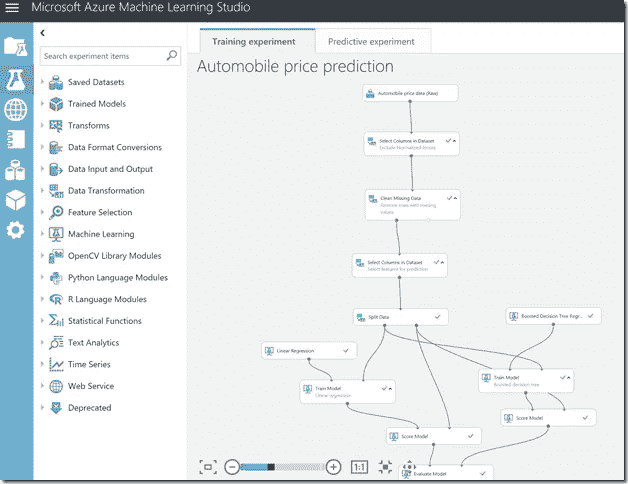
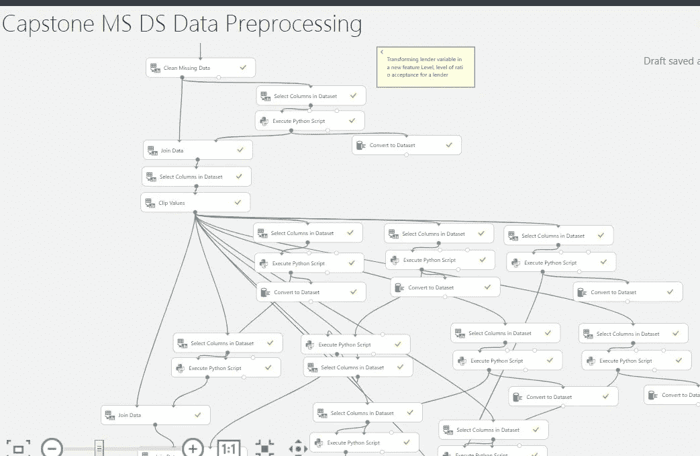
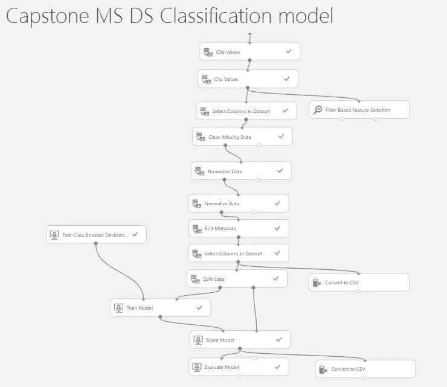
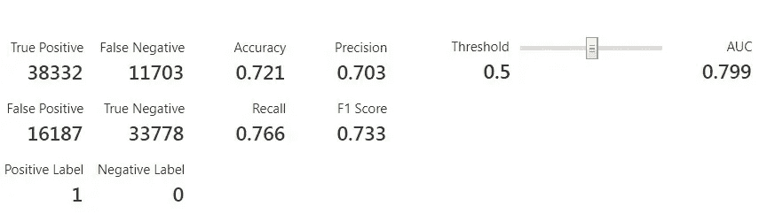
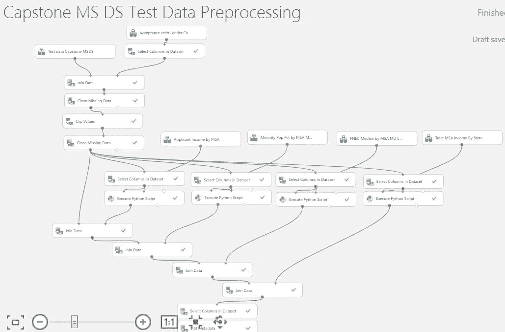
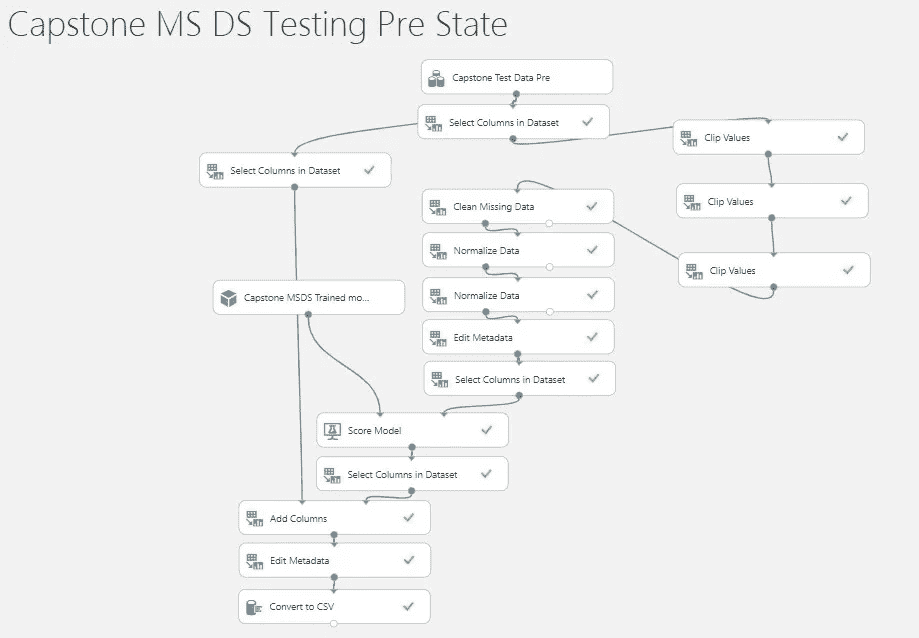

# 预测抵押贷款批准:使用 Azure ML Studio 进行数据分析和预测(第 2 部分)

> 原文：<https://medium.com/analytics-vidhya/predicting-mortgage-approvals-data-analysis-and-prediction-with-azure-ml-studio-part-2-2c190e83c9f4?source=collection_archive---------13----------------------->

*这是“预测抵押贷款批准”的第 2 部分。在这里可以链接到* [*part 1*](/@edumunozsala/predicting-mortgage-approvals-data-analysis-and-prediction-with-azure-ml-studio-part-1-8629d2f938a8) *。*

# Azure Machine Learning Studio 中机器学习模型的描述

下一点是开发一个预测模型，使我们能够以可接受的信心程度决定何时接受或不接受贷款请求或申请。这是一个两类分类问题，接受还是不接受。我们将尝试从一个简单的方法开始定义一个模型。然后，该模型将被改进，但尽可能避免增加复杂性。

分析完成后，我们可以做出一些决定:

*   众所周知，Row_id 变量应该被丢弃，因为它不提供任何值或信息
*   应该删除贷款类型和准确性这两个分类变量
*   变量 loan_property 和 approval 似乎没有提供太多的价值，尽管它们不是完全可支配的
*   可变贷方有许多值或类别过高，因此将被其接受比率级别所取代。
*   关于与申请人的种族、民族和性别相关的变量，其中一些不具有预测性，应被丢弃，如民族或性别。
*   前几节提到的一些数字变量似乎是不错的选择:贷款金额、申请人收入、少数民族人口百分比、申请人收入或 ffiec 中值家庭收入
*   关于与申请人所在地相关的 3 个变量，我们将只包括州，但将分析其他组合。

照片由[鲁迪和](https://pixabay.com/es/users/skitterphoto-324082/?utm_source=link-attribution&utm_medium=referral&utm_campaign=image&utm_content=384596)彼得·斯皮特林在 [Pixabay](https://pixabay.com/es/?utm_source=link-attribution&utm_medium=referral&utm_campaign=image&utm_content=384596) 上拍摄

## 可变贷方的处理

正如人们所期望的，变量 lender 在模型中有一个重要的值，但它呈现了大量的值，这些值变成了非常高的类别，这可能是过度拟合的来源。为了解决这个问题，我们建议将这个变量转换成一个新的变量，定义贷款人接受率的范围。因此，对于每个贷方，我们将计算其接受率，即接受的申请数除以该贷方处理的申请总数

一旦计算出这些值，我们将把贷款人分组，范围为接受率的 0-20%，21-40%，...通过这种方式，我们将变量的类别数量减少到只有 5 或 6 个值，并且还提供了一些关于贷方批准贷款的便利性的有用信息。

## 处理位置变量

我们指的是变量 state、county 和 msa md(大都市统计区或大都市分区)，它们都定义了申请人的位置。对于所有这些特征，值的数量非常大。我们还有很多记录，其中一个或多个变量取值为-1，表示其实际值未知或尚未注册，也就是说，它们是缺失值。

我们也可以说:

*   对于 state 字段，我们有从 0 到 52 的值，但是缺少值 51。这可能导致我们认为该变量中的值-1 实际上是值 51。
*   对于 msa_md 字段，同样的事情发生了，我们有从 0 到 408 的值，但是没有值为 338 的记录，同样，它可能是取值为-1 的记录的真实值。
*   在 county 的情况下，我们有几个从未出现过的值 85，...所以你不能像前面提到的那样简化

最后，最初的方法是仅考虑变量状态作为预测模型的一部分，根据我们模型的结果，我们将考虑包括 msa md 字段。

## 处理异常值、数据错误和缺失值

同样，我们在数据中的多个数值变量中有空值，这可能会降低我们将要开发的模型的性能。大约有 70，000-80，000 条记录有缺失值，而且它们同时出现在几个变量中。为了解决这个问题，我们将尝试填充这些变量的空值，根据同一个注册表的其他变量寻找与之对应的值:

*   申请人收入:我们将把属于同一个州、县、msa_md、种族、民族和性别的记录的中值作为空值的记录。如果不存在，我们将根据州、县、msa md、种族和民族等搜索该中值。最后，如果不存在中间值，我们将采用该变量的平均值作为记录的状态。
*   少数民族人口百分比:在这种情况下，当发现具有空值的记录时，我们将搜索相同州、县或 msa_md 的记录的中值。如果它不存在，将搜索相同州和县的中值，或最终搜索相同州的记录。
*   对于其余变量，将使用变量少数民族人口百分比中使用的方法

关于异常值或可能的数据错误，我们有一些受到严重影响的变量，如贷款额、申请人收入、ffiec 家庭收入中位数等。对于最终包含在预测模型中的变量，我们将采用两种方法:

*   那些值高于感知器 98 的记录将从训练过程中去除
*   那些值高于 IQR * 1.5 的记录将被 IQR * 1.5 定义的限制值所取代

[https://docs . Microsoft . com/en-us/archive/blogs/azure edu/how-can-I-get-started-with-azure-machine-learning](https://docs.microsoft.com/en-us/archive/blogs/azureedu/how-can-i-get-started-with-azure-machine-learning)

# 建立我们的预测模型

为了构建我们的模型，我们将使用 Azure Machine Learning Studio 云工具和一些 Python 脚本来应用数据转换和操作。而且我们会分一组阶段来做:训练数据准备、训练的预测模型设计、测试数据准备以及在测试数据上给模型打分。

## 数据准备

在这一阶段，我们设计了 Azure ML 实验，其中每个数据列都根据之前定义的转换进行转换:

*   在接受比率级别转换贷方变量
*   填充数值变量的缺失值

用于数据准备的多个 python 脚本(图片由作者提供)

因此，这个实验产生了一个数据集，它将用于训练我们的模型和其他一些数据集，以便对测试数据应用相同的转换。

## 构建我们的模型

我们的下一个实验将接收转换后的数据集进行训练，并应用两类分类算法来获得对测试数据进行评分的模型。最后，我们尝试了主要的分类算法:逻辑回归、决策树(和变体)和神经网络。我们用相同的数据和多个参数评估了每个算法，我们的最佳选择是增强决策树算法。

我们模型的 Azure ML Studio 组件(作者提供照片)

我们执行了以下步骤:

*   剪切高于某个阈值或百分点的值，以处理异常值
*   删除一些缺少值的记录
*   某些变量(贷款金额、申请人收入、ffiecmedian 家庭收入和人口)的 Zscore 标准化
*   少数民族 _ 人口 _ 百分比和地域 _ 至 _ msa _ md _ 收入 _ 百分比的最小最大标准化
*   为贷款目的、水平、申请人种族等制定分类变量…
*   选择要在培训过程中使用的列
*   在训练集和测试集中拆分数据集:75%-25%
*   训练增强的决策树
*   对结果进行评分和评估

经过多次实验，选择的列为:贷款 _ 金额、贷款 _ 用途、申请人 _ 收入、申请人 _ 种族、州、少数民族人口 pct、tracto _ to _ msa _ md _ 收入 _pct、ffiecmedian _ 家庭 _ 收入、种族和贷款人接受比率水平。

培训结果是:

## 准备测试数据

现在，我们需要对我们的测试数据集应用与我们之前看到的应用于训练数据的相同(或相似)的转换:转换贷方变量，填充一些数字变量(applicant_income，minority_population_pct，ffiecmedian，trac_to_msa_md)的缺失值。

作者照片

这一过程的结果是一个准备用于我们预测模型的新数据集。

## 在测试数据集上对模型进行评分

最后，我们可以将我们的模型应用于测试数据，并对每条记录进行评分，以确定是否接受。这个实验是:

作者照片

# 结论

经过长时间的分析和建立模型，我们可以得出结论，数据准备是获得可接受的性能的最有力的工具。关于数据分析，我们还提到了许多想法:申请人的种族或民族是相关的，高收入的申请人以及居住在少数民族人口比例低的地区的申请人更有可能被贷款接受，大多数申请都与同一类型的财产和贷款有关