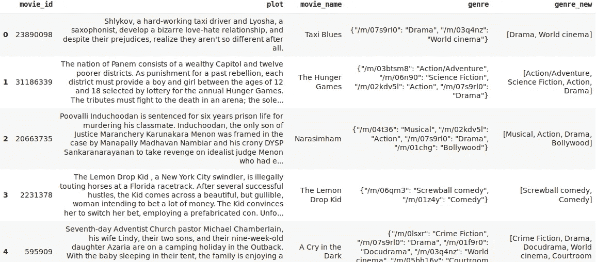
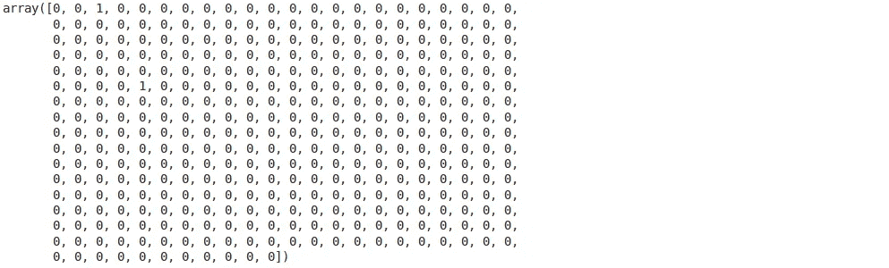

# 使用 NLP 预测电影类型——多标签分类的精彩介绍

> 原文：<https://medium.com/analytics-vidhya/predicting-movie-genres-using-nlp-46d70b97c67d?source=collection_archive---------3----------------------->

# 介绍

上周，我饶有兴趣地阅读了[这篇关于构建多标签图像分类模型](https://www.analyticsvidhya.com/blog/2019/04/build-first-multi-label-image-classification-model-python/https://www.analyticsvidhya.com/blog/2019/04/build-first-multi-label-image-classification-model-python/?utm_source=medium&utm_medium=predicting-movie-genres-nlp-multi-label-classification)的精彩文章。我心中的数据科学家开始探索将这个想法转化为一个[自然语言处理(NLP)](https://courses.analyticsvidhya.com/courses/natural-language-processing-nlp?utm_source=medium&utm_medium=predicting-movie-genres-nlp-multi-label-classification) 问题的可能性。

那篇文章展示了预测电影类型的计算机视觉技术。所以我必须找到一种方法将问题陈述转换成基于文本的数据。现在，大多数 NLP 教程着眼于解决单标签分类挑战(当每个观察只有一个标签时)。

但是电影不是一维的。一部电影可以跨越几个流派。作为一名数据科学家，这是我乐于接受的挑战。我摘抄了一堆电影剧情概要，用这个多标签分类的概念开始着手工作。即使使用简单的模型，结果也确实令人印象深刻。


在本文中，我们将采取一种非常实用的方法来理解 NLP 中的多标签分类。我在使用 NLP 构建电影类型预测模型的过程中获得了很多乐趣，我相信你也一样。让我们开始吧！

# 目录

1.  多标签分类简介
2.  设置我们的多标签分类问题陈述
3.  关于数据集
4.  我们建立电影类型预测模型的策略
5.  实现:使用多标签分类建立电影类型预测模型(Python 语言)

# 多标签分类简介

我和你一样兴奋地跳入代码，开始建立我们的流派分类模型。不过，在此之前，让我先向您介绍一下 NLP 中多标签分类的概念。*在开始实现之前，首先理解技术是很重要的。*

从名称中可以明显看出潜在的概念——多标签分类。这里，一个实例/记录可以有多个标签，并且每个实例的标签数量是不固定的。

让我用一个简单的例子来解释一下。请看下表，其中“X”代表输入变量，“y”代表目标变量(我们正在预测):


*   “y”是表 1 中的二进制目标变量。因此，只有两个标签——t1 和 t2
*   表 2 中的“y”包含两个以上的标签。但是，请注意**在这两个表**中，每个输入只有一个标签
*   *你一定猜到了为什么表 3 会脱颖而出。我们在这里有多个标签，不仅仅是整个表，还可以用于单独的输入*

*我们不能在这种数据集上直接应用传统的分类算法。为什么？因为这些算法期望每个输入只有一个标签，而实际上我们有多个标签。这是一个有趣的挑战，也是我们将在本文中解决的问题。*

*您可以在下面的文章中更深入地了解多标签分类问题:*

*   *[解决多标签分类问题(使用案例研究)](https://www.analyticsvidhya.com/blog/2017/08/introduction-to-multi-label-classification/https://www.analyticsvidhya.com/blog/2019/04/build-first-multi-label-image-classification-model-python/?utm_source=medium&utm_medium=predicting-movie-genres-nlp-multi-label-classification)*

# *设置我们的多标签分类问题陈述*

*有几种方法可以建立一个推荐引擎。当谈到电影类型时，你可以根据多个变量对数据进行分割。但这里有一个简单的方法——建立一个可以自动预测流派标签的模型！我已经可以想象给推荐者增加这样一个选项的可能性。对所有人都是双赢。*

> **我们的任务是建立一个模型，仅使用情节细节(以文本形式提供)就可以预测电影的类型。**

*看看下面来自 IMDb 的快照，挑选出展出的不同物品:*

**

*在这么小的空间里有很多信息:*

*   *电影标题*
*   *右上角的电影分级*
*   *电影总时长*
*   *发布日期*
*   *当然，我在洋红色边框中突出显示的电影类型*

*类型告诉我们可以从电影中期待什么。由于这些类型是可点击的(至少在 IMDb 上)，它们允许我们发现其他同类的类似电影。看似简单的产品功能突然有了这么多有前途的选择。🙂*

# *关于数据集*

*我们将为我们的项目使用 [CMU 电影摘要语料库](http://www.cs.cmu.edu/~ark/personas/)开放数据集。**你可以直接从这个** [**链接**](http://www.cs.cmu.edu/~ark/personas/data/MovieSummaries.tar.gz) **下载数据集。***

*这个数据集包含多个文件，但是我们现在只关注其中的两个:*

*   ***movie . Metadata . tsv:**81，741 部电影的元数据，从 2012 年 11 月 4 日的 Freebase 转储中提取。该文件中提供了电影类型标签*
*   ***plot_summaries.txt:** 从 2012 年 11 月 2 日的英文维基百科转储中提取的 42，306 部电影的情节摘要。每一行都包含维基百科电影 ID(索引到 *movie.metadata.tsv* )和情节摘要*

# *我们建立电影类型预测模型的策略*

*我们知道不能在多标签数据集上直接使用监督分类算法。因此，我们首先必须转换我们的目标变量。让我们看看如何使用虚拟数据集来实现这一点:*

**

*这里，X 和 y 分别是要素和标注，这是一个多标注数据集。现在，我们将使用**二元相关性**方法来转换我们的目标变量 y。我们将首先取出数据集中的唯一标签:*

*唯一标签= [ t1，t2，t3，t4，t5 ]*

*数据中有 5 个唯一的标记。接下来，我们需要用多个目标变量替换当前的目标变量，每个目标变量都属于数据集的唯一标签。由于有 5 个唯一标签，因此将有 5 个新的目标变量，值为 0 和 1，如下所示:*

**

*我们现在已经讨论了最终开始解决这个问题的必要基础。在下一节中，我们将最终使用 Python 制作一个**自动电影类型预测系统**！*

# *实现:使用多标签分类建立电影类型预测模型(Python 语言)*

*我们已经理解了问题陈述，并建立了逻辑策略来设计我们的模型。让我们一起开始编码吧！*

# *导入所需的库*

*我们将从导入项目所需的库开始:*

# *加载数据*

*让我们先加载电影元数据文件。使用' \t '作为分隔符，因为它是一个制表符分隔的文件(。tsv):*

```
*meta = pd.read_csv("movie.metadata.tsv", sep = '\t', header = None) meta.head()*
```

**

*哦，等等，这个数据集中没有标题。第一列是**唯一电影 id** ，第三列是电影的**名称，最后一列包含**电影类型**。在此分析中，我们将不使用其余的列。***

*让我们为上述三个变量添加列名:*

```
*# rename columns 
meta.columns = ["movie_id",1,"movie_name",3,4,5,6,7,"genre"]*
```

*现在，我们将把**电影情节数据集**载入内存。这些数据来自一个文本文件，每行包含一个电影 id 和一个电影情节。我们将逐行阅读:*

*接下来，将电影 id 和情节分成两个单独的列表。我们将使用这些列表来形成一个数据框架:*

*让我们看看“电影”数据框架中有什么:*

```
*movies.head()*
```

**

*完美！我们既有电影 id，也有对应的电影剧情。*

# *数据探索和预处理*

*让我们根据 *movie_id* 列，通过将后者合并到前者来添加电影元数据文件中的电影名称及其类型:*

**

*太好了！我们已经添加了电影名称和类型。然而，这些类型是用字典符号表示的。如果我们能把它们转换成一个 Python 列表，使用起来会更容易。我们将使用第一行:*

```
*movies['genre'][0]*
```

***输出:***

```
*'{"/m/07s9rl0": "Drama", "/m/03q4nz": "World cinema"}'*
```

*我们不能只使用*来访问这一行中的流派。values( )* 。你能猜到原因吗？这是因为该文本是字符串，而不是字典。我们将不得不把这个字符串转换成字典。我们将在这里利用 **json 库**的帮助:*

```
*type(json.loads(movies['genre'][0]))*
```

***输出:***

```
*dict*
```

*我们现在可以轻松访问该行的流派:*

```
*json.loads(movies['genre'][0]).values()*
```

***输出:***

```
*dict_values(['Drama', 'World cinema'])*
```

*这段代码帮助我们从电影数据中提取所有的类型。完成后，将提取的类型作为列表添加回电影数据帧:*

*有些样本可能不包含任何流派标签。我们应该删除这些样本，因为它们不会在我们的模型构建过程中发挥作用:*

```
*# remove samples with 0 genre tags 
movies_new = movies[~(movies['genre_new'].str.len() == 0)]movies_new.shape, movies.shape*
```

***输出:***

```
*((41793, 5), (42204, 5))*
```

*只有 411 个样本没有流派标签。让我们再看一下数据框:*

```
*movies.head()*
```

**

*请注意，流派现在是列表格式。你是否很好奇这个数据集中涵盖了多少电影类型？下面的代码回答了这个问题:*

```
*# get all genre tags in a list 
all_genres = sum(genres,[]) 
len(set(all_genres))*
```

***输出:***

```
*363*
```

*我们的数据集中有超过 363 个独特的流派标签。这是一个相当大的数字。我能努力回忆起 5-6 个流派！让我们看看这些标签是什么。我们将使用来自 *nltk* 库的 **FreqDist( )** 来创建一个流派字典以及它们在数据集中的出现次数:*

*我个人觉得可视化数据比简单地输出数字要好得多。那么，让我们画出电影类型的分布图:*

**

*接下来，我们将清理一些数据。我将使用一些非常基本的文本清理步骤(因为这不是本文的重点):*

*让我们通过使用 apply-lambda duo 将该函数应用于电影情节:*

```
*movies_new['clean_plot'] = movies_new['plot'].apply(lambda x:  
                                                    clean_text(x))*
```

*请随意查看新旧电影情节。我在下面提供了一些随机样本:*

**

*在 *clean_plot* 栏中，所有文本都是小写的，也没有标点符号。我们的文本清理工作非常有效。*

*下面的函数将可视化一组文档中的单词及其频率。让我们用它来找出电影情节栏中最常用的词:*

**

*以上情节中的大部分术语都是停用词。这些停用词远没有文本中的其他关键字有意义(它们只是给数据增加了噪音)。我将继续把它们从情节文本中删除。您可以从 *nltk* 库中下载停用词列表:*

```
*nltk.download('stopwords')*
```

*让我们去掉停用词:*

*检查不带停用词的最常用术语:*

```
*freq_words(movies_new['clean_plot'], 100)*
```

**

*看起来好多了，不是吗？现在出现了更有趣、更有意义的词，如“警察”、“家庭”、“金钱”、“城市”等。*

*我前面提到过，我们将把这个多标签分类问题作为一个二元相关性问题来处理。因此，我们现在将使用 sklearn 的 **MultiLabelBinarizer( )** 对目标变量进行热编码，即 *genre_new* 。由于有 363 个独特的风格标签，将有 363 个新的目标变量。*

*现在，是时候将我们的注意力转向从电影情节数据的干净版本中提取特征了。对于本文，我将使用 TF-IDF 特性。您可以随意使用任何您熟悉的其他特征提取方法，比如词袋、word2vec、GloVe 或 ELMo。*

*我建议查看以下文章，了解更多关于从文本创建要素的不同方法:*

*   *[对单词嵌入的直观理解:从计数向量到 Word2Vec](https://www.analyticsvidhya.com/blog/2017/06/word-embeddings-count-word2veec/?utm_source=medium&utm_medium=predicting-movie-genres-nlp-multi-label-classification)*
*   *[学习 ELMo 从文本中提取特征的分步 NLP 指南](https://www.analyticsvidhya.com/blog/2019/03/learn-to-use-elmo-to-extract-features-from-text/?utm_source=medium&utm_medium=predicting-movie-genres-nlp-multi-label-classification)*

```
*tfidf_vectorizer = TfidfVectorizer(max_df=0.8, max_features=10000)*
```

*我使用了数据中最常用的 10，000 个单词作为我的特征。您也可以为 *max_features* 参数尝试任何其他数字。*

*现在，在创建 TF-IDF 特征之前，我们将把数据分成训练集和验证集，用于训练和评估模型的性能。我将采用 80–20 的比例，80%的数据样本在训练集中，其余的在验证集中:*

*现在，我们可以为训练和验证集创建特征:*

```
*# create TF-IDF features 
xtrain_tfidf = tfidf_vectorizer.fit_transform(xtrain) 
xval_tfidf = tfidf_vectorizer.transform(xval)*
```

# *建立你的电影类型预测模型*

*我们已经为模型构建部分做好了准备！这是我们一直在等待的。*

*记住，我们将不得不为每一个热编码的目标变量建立一个模型。由于我们有 363 个目标变量，我们将不得不用同一组预测因子(TF-IDF 特征)来拟合 363 个不同的模型。*

*可以想象，在一个中等规模的系统上训练 363 个模型需要相当长的时间。因此，我将构建一个逻辑回归模型，因为它可以在有限的计算能力上快速训练:*

```
*from sklearn.linear_model import LogisticRegression # Binary Relevance 
from sklearn.multiclass import OneVsRestClassifier # Performance metric 
from sklearn.metrics import f1_score*
```

*我们将使用 sk-learn 的 *OneVsRestClassifier* 类来解决这个二进制相关性或一对一问题:*

```
*lr = LogisticRegression() 
clf = OneVsRestClassifier(lr)*
```

*最后，在列车组上安装模型:*

```
*# fit model on train data 
clf.fit(xtrain_tfidf, ytrain)*
```

*预测验证集上的电影类型:*

```
*# make predictions for validation set 
y_pred = clf.predict(xval_tfidf)*
```

*让我们看看这些预测中的一个例子:*

```
*y_pred[3]*
```

**

*它是一个长度为 363 的二进制一维数组。基本上，它是独一无二的流派标签的一次性编码形式。我们必须想办法把它转换成电影类型标签。*

*幸运的是，sk-learn 再次拯救了我们。我们将使用 **inverse_transform( )** 函数和*multilabel binary izer()*对象将预测的数组转换成电影类型标签:*

```
*multilabel_binarizer.inverse_transform(y_pred)[3]*
```

***输出:***

```
*('Action', 'Drama')*
```

*哇！很顺利。*

*但是，为了评估我们模型的整体性能，我们需要考虑所有预测和验证集的整个目标变量:*

```
*# evaluate performance 
f1_score(yval, y_pred, average="micro")*
```

***输出:***

```
*0.31539641943734015*
```

*我们得到了 0.315 的不错的 F1 分数。这些预测是基于阈值 0.5 做出的，这意味着大于或等于 0.5 的概率被转换为 1，其余的被转换为 0。*

*让我们试着改变这个阈值，看看是否能提高我们模型的分数:*

```
*# predict probabilities 
y_pred_prob = clf.predict_proba(xval_tfidf)*
```

*现在设置一个阈值:*

```
*t = 0.3 # threshold value 
y_pred_new = (y_pred_prob >= t).astype(int)*
```

*我试过 0.3 作为阈值。您也应该尝试其他值。让我们根据这些新的预测再次检查 F1 的分数。*

```
*# evaluate performance 
f1_score(yval, y_pred_new, average="micro")*
```

***输出:***

```
*0.4378456703198025*
```

*这对我们模型的性能是一个相当大的提升。找到正确阈值的更好方法是使用 k 倍交叉验证设置并尝试不同的值。*

# *创建推理函数*

*等待——我们还没有解决这个问题。我们还必须考虑未来将出现的新数据或新电影情节，对吗？我们的电影类型预测系统应该能够以原始形式的电影情节作为输入，并生成其类型标签。*

*为了实现这一点，让我们构建一个推理函数。它将采用电影情节文本，并遵循以下步骤:*

*   *清理文本*
*   *从清除的文本中删除停用字词*
*   *从文本中提取特征*
*   *做预测*
*   *返回预测的电影类型标签*

*让我们在验证集中的几个样本上测试这个推理函数:*

**

*耶！我们已经建造了一个非常实用的模型。该模型还不能预测罕见的流派标签，但这是另一个时间的挑战(或者你可以采取它，让我们知道你遵循的方法)。*

# *从这里去哪里？*

*如果你正在寻找类似的挑战，你会发现下面的链接很有用。我已经在我们的自然语言处理课程中使用机器学习和深度学习模型解决了一个 **Stackoverflow 问题标签预测**问题。*

*本课程的链接如下，供您参考:*

*   *[认证课程:使用 Python 的自然语言处理(NLP)](https://courses.analyticsvidhya.com/courses/natural-language-processing-nlp/?utm_source=medium&utm_medium=predicting-movie-genres-nlp-multi-label-classification)*
*   *[认证项目:初学者 NLP](https://courses.analyticsvidhya.com/bundles/nlp-combo?utm_source=medium&utm_medium=predicting-movie-genres-nlp-multi-label-classification)*
*   *[终极 AI & ML 黑带程序](https://courses.analyticsvidhya.com/bundles/ai-blackbelt-beginner-to-master?utm_source=medium&utm_medium=predicting-movie-genres-nlp-multi-label-classification)*

# *结束注释*

*我希望看到来自我们社区的不同方法和技术来实现更好的结果。尝试使用不同的特征提取方法，建立不同的模型，微调那些模型等。你可以尝试的事情太多了。不要止步于此，继续尝试吧！*

*欢迎在下面的评论区自由讨论和评论。完整的代码可在[这里](https://github.com/prateekjoshi565/movie_genre_prediction/blob/master/Movie_Genre_Prediction.ipynb)获得。*

*你也可以在分析 Vidhya 的 Android 应用上阅读这篇文章*

**

*相关文章*

**原载于 2019 年 4 月 22 日*[*https://www.analyticsvidhya.com*](https://www.analyticsvidhya.com/blog/2019/04/predicting-movie-genres-nlp-multi-label-classification/)*。**