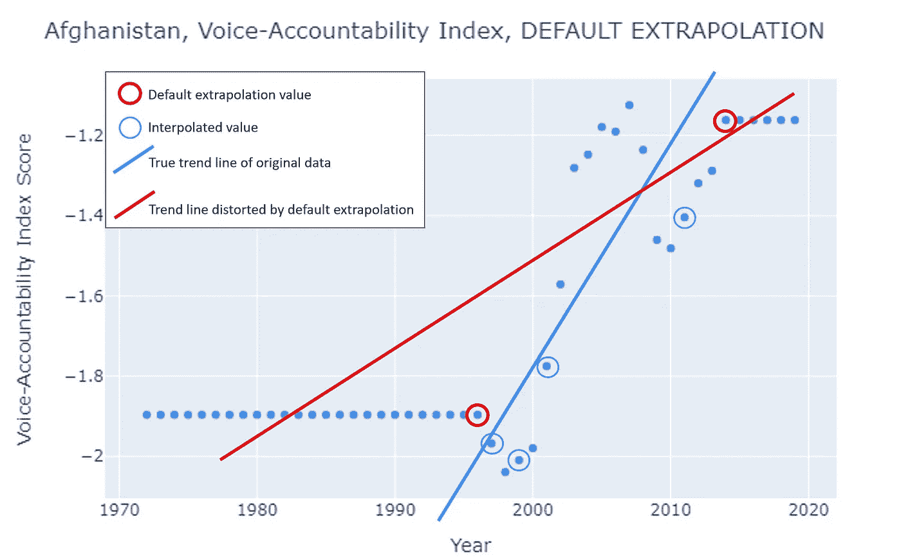
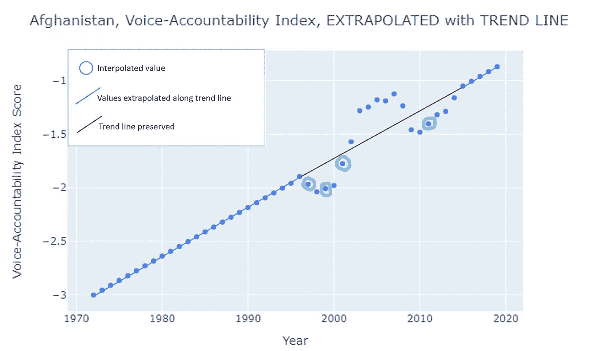
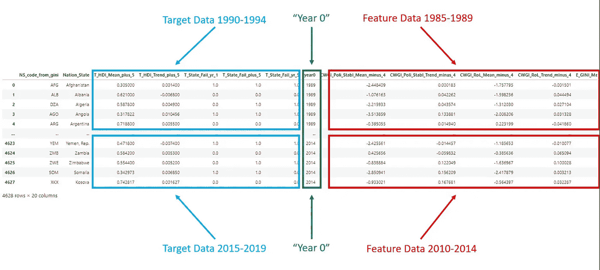
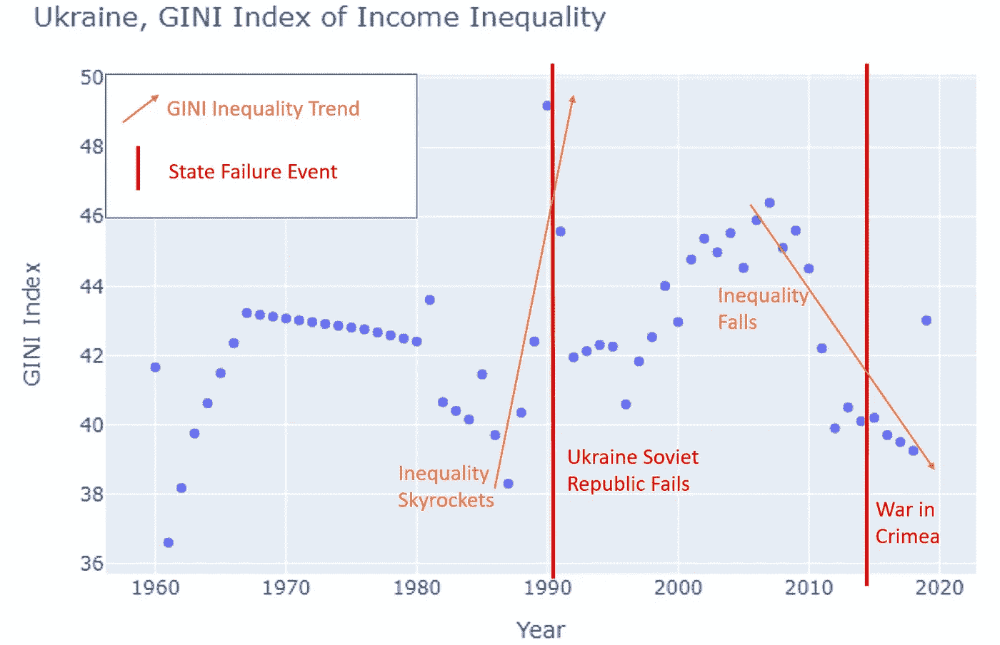
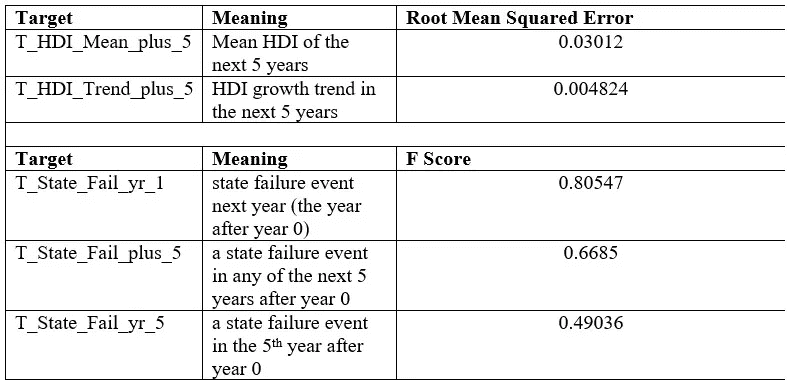
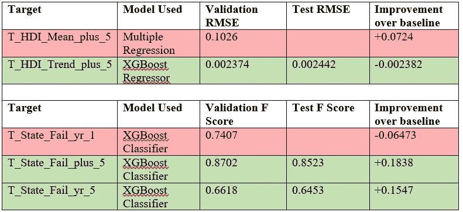
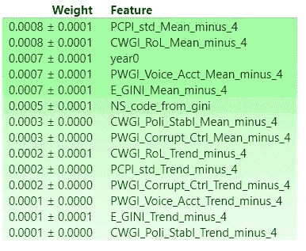
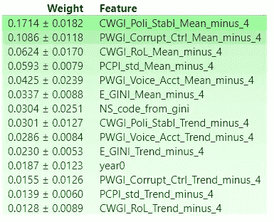
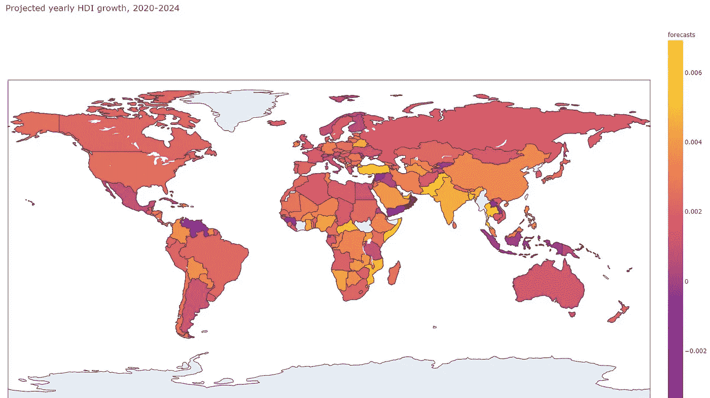
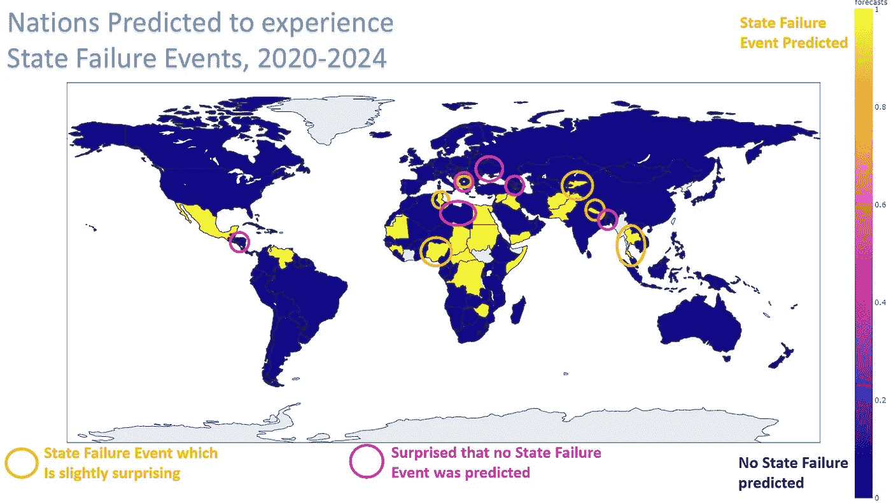

# 预测民族国家的失败

> 原文：<https://medium.com/analytics-vidhya/predicting-nation-state-failure-abf3793c7d6b?source=collection_archive---------13----------------------->

基于畅销书《为什么国家会失败》中概述的地缘政治框架，我使用开放数据集和 python 创建了预测模型，来预测 2020 年代初民族国家的繁荣或失败。

叙利亚北部的一名库尔德士兵

2011 年，突尼斯成为阿拉伯之春中第一个用新的民主政权和平取代独裁者的国家。它是唯一被国际非政府组织视为“自由”的北非国家，其妇女享有整个中东世界最好的生育权。

2014 年，本应稳定的叙利亚阿萨德政权在难民、内战和神权支持的恐怖主义的旋风中分崩离析。这场冲突不时在邻国土耳其、伊拉克、伊朗、约旦和黎巴嫩引发大范围的混乱。

2009 年，哥斯达黎加被公认为“地球上最环保的国家”。预计到 2021 年实现碳中和，这个前西班牙殖民地享有中美洲最高的教育和生活方式发展水平，并在政治上协调了大规模生物多样性保护区和繁荣的公平贸易农业部门。

2012 年，看似蒸蒸日上的缅甸民主政府陷入了一场针对其罗辛亚穆斯林少数民族的种族灭绝演说；目前的局势也有可能将不稳定蔓延到孟加拉国，而孟加拉国是大多数缅甸难民的接收国；以及印度和中国，这两个国家都在广泛迫害他们的穆斯林少数民族。

2018 年，卢旺达被发现与冰岛一样，是世界上性别薪酬平等最高的国家，男性每赚 1 美元，女性就赚 94 美分。自从从 1994 年的种族屠杀中恢复过来后，卢旺达现在在议会中经常有女性占多数。从 2006 年到 2011 年，贫困率下降了 12 个百分点，预期寿命增加了 13 年。

全世界的人道主义组织、非政府组织、投资者、经济学家、政治家、流行病学家和反恐专家都迫切想知道:为什么所有这些前殖民地人民经历了如此截然不同的命运？所有这些都位于“热带诅咒”，所谓的全球南部。他们都居住着大多数有色人种，在不被视为“西方”的文化背景下，并在第二次世界大战后的几十年里经历了几十年的混乱和肮脏的领导，当时他们摆脱了欧洲殖民主义的枷锁。过去的理论框架认为，所有这些国家都应该陷入不发达的循环。然而，这些国家中有三个逃脱了这个循环。前面提到的两个国家，叙利亚和缅甸，就在它们似乎要逃脱的时候，又陷入了国家动荡。

这一令人烦恼的问题挫败了国际社会的发展努力，这些努力旨在减少人类痛苦、稳定基本市场、谈判和平协议、释放人力资本、创造未被认可的财富、遏制未预见的病原体以及防止在恐怖主义温床中酝酿无谓的政治暴力行为。

在他们的《纽约时报》和《华尔街日报》畅销书“*为什么国家会失败*”中，德隆·阿西莫格鲁和经济学家兼政治学家詹姆斯·a·罗宾逊(James A. Robinson)对国家陷入长期灾难或长期繁荣的偶然原因做出了令人信服的、有历史依据的、节俭的和人性化的解释:该国的制度是促进对人民的包容，还是促进对人民的剥削。我强烈推荐这本书，因为它为读者提供了关于我们周围世界的过去、现状和未来的大量清晰信息。但与此同时，我将给出这本书的简要介绍，并链接到我之前参与这本书的项目，该项目对这本书的论点给出了稍微更详细的解释。

“*为什么国家会失败*”驳斥了关于民族国家成功的因果因素的几种流行理论。除了偶然的历史随机性之外，国家和文明的失败不是由其人民的文化、领导人的无知、其所在地的地理、气候或生态，也不是其人口的种族构成造成的，其中每一个都代表了在过去两个世纪对这一主题的学术思考中常见的理论，但在解释不一致的历史和现代情景的能力方面存在巨大的缺陷。相反，它认为长期繁荣只由三个因素造成:

1.包容性经济机构，相对于掠夺性经济机构。

2.包容性的政治机构，而不是掠夺性的政治机构。

3.国家权力足够集中以避免无政府状态和不安全，但又不至于集中到产生极权主义和掠夺性机构。

# 现象和度量

我对“*为什么国家会失败*”的最后一个分析是寻找能够充分衡量国家繁荣、经济包容性、政治包容性和国家中心性的数据。现在，我将使用它的框架来创建统计机器学习模型，以预测民族国家的失败，以及每个国家繁荣的未来运动。从上次开始，我对原始数据进行了三次重大的工程修改。

首先，我用人类发展指数取代了幸福星球指数，作为衡量国家繁荣程度的指标。尽管 HPI 有望成为衡量主观幸福感的更全面的指标，但它比人类发展指数要年轻得多。自 2006 年以来，HPI 只对每个国家进行了 4 次调查，2011 年进行了一次重大的方法修订，改为指数的时间可比性。然而，自 1990 年以来，由联合国管理的人类发展指数(HDI)一直是标准指数，每年对几乎所有国家进行衡量。人类发展指数根据健康、寿命、受教育机会和生活水平等指标对得分进行汇总。尽管它不包括幸福星球指数所捕捉的可持续性、主观幸福感和结果不平等性等重要属性，但人类发展指数的衡量标准一直是三十年来国家繁荣的一贯写照。

其次，我缩小了特征指标的范围，那些关于经济包容性、政治包容性和国家中心性的指标，只缩小到最相关的指标，这些指标既适用于民主国家，也适用于独裁国家。比如，在我的最后一项分析中，女性在议会中所占席位的比例与国家 HPI 增长的相关性最强，但这一指标在选举存在欺诈或根本不存在议会机构的国家就失效了。所以最终的特征如下:

衡量经济包容性的 GINI 收入不平等指数

世界银行的政治稳定指数和法治指数，每一项都用来衡量国家的集权程度

清廉指数(透明国际)、腐败控制指数(世界银行)和声音与问责指数(世界银行)，每一项都用来衡量政治包容性。

第三，为了提高推断的准确性，我使用 sci-kit 学习曲线推断法来推断国家的数据点，这些国家的数据收集如此困难，却又如此重要，因为国家失败事件的*。我之前使用的时间序列内插法默认外推至最外层数据点的值，如图 1 所示:*

图 1:在我之前对国家繁荣相关指标的分析中，默认的推断扭曲了趋势。

这种默认的外推导致了趋势和超出原始数据点(1996 年至 2014 年)的预期值的严重扭曲。相比之下，对于该数据集，值是基于原始测量数据的趋势进行外推的，如下所示:

图 2:在这个分析中，Sci-Kit 曲线外推法保留了相同数据的趋势，如果可以收集的话，可能更接近实际的历史数据。

由于这种预测分析发生在 1986 年至 2019 年期间，仅在这个国家就有 14 个数据点可能比默认外推估计得更准确。

通过这些插值和外推，对于每个国家，沿着 6 个特征中的每一个，对于自 1990 年以来的每一年，五年趋势和五年平均特征被设计并逐年对齐。对于数据集的每个观察值，特征数据是从过去 5 年到现在的趋势和均值，目标数据是从 0 年之后的未来 5 年的趋势和均值。

图 3:在训练-验证-测试分割之前，最终数据的结构。

最后，手工编码到数据集中，这是 1990 年至 2019 年期间数据集中任何国家发生的国家失败事件的二进制记录。“1”表示该民族国家当年发生的国家故障事件，而“0”表示没有国家故障事件。这被设计成 3 个独立的目标列:T_State_Fail_yr_1，指示第 0 年后的状态失败事件；T_State_Fail_plus_5，0 年后未来 5 年任意一年的状态失败事件；以及 T_State_Fail_yr_5，0 年后第 5 年的状态失败事件。

# 究竟什么是“国家失败事件”？

国家失败事件是指构成一年或几年的重要时间框架，并导致国家无力防止数千人无法无天或普遍不安全的任何事件。

诚然，时间范围和受影响的人的规模可能看起来是任意的，可以调整，但需要理解的关于国家失败事件的一个重要方面是，“国家失败事件”不一定是国家在其管辖范围内对所有公民的全面失败。通常，尽管发生了国家失败事件，但发生该事件的政权可能会继续存在。此外，一般来说，无论是多数还是少数公民，都有一些人可能与发生在同一个国家的悲惨混乱事件绝缘或相对不受影响。

这种隔离可能源于个人是特权精英阶层的一部分。例如，墨西哥的毒品战争可能对那些能够负担得起安全保障的富人影响不大，他们的财富与毒品经济也没有什么关系。墨西哥联邦政府在某些领域仍然强大，而在其他地区，它几乎无法遏制混乱。

这种隔离也可能是因为太差而无法瞄准。例如，在 2005 年毛里塔尼亚政变期间，大多数政治领导人和军人发现自己成为了目标。

这种隔离可能是由于生活在更富裕或稳定的城市地区，而混乱在更偏远的地方出现。莫斯科人民会注意到在第一次和第二次车臣期间法律和秩序的延续没有什么不同，不包括车臣恐怖分子的袭击。

隔离也可能是由于居住在偏远地区。同样，在车臣战争期间，同样生活在俄罗斯联邦的西伯利亚人也不会注意到俄罗斯政府对他们日常生活的影响有什么变化。

国家失败事件的常见例子包括但不限于:内战、革命、叛乱、持续的恐怖主义、政变、导致长期无政府状态的自然或生态灾难(如干旱、饥荒、地震、荒漠化、热带风暴或传染病)、入侵、种族灭绝、持续的不对称战争、导致长期无政府状态的经济灾难、广泛持续和致命的平民抗议、暴力的长期领土争端等。

过去 30 年中，一些引人注目的国家失败的典型例子包括伊拉克、阿富汗和索马里，它们经历了无休止或几乎无休止的武装冲突、无法无天、暴力甚至占领。

然而，过去 30 年也充满了鲜为人知的国家失败事件的例子。苏联解体，引发了 1993 年俄罗斯的一场小政变。在接下来的 20 年里，俄罗斯也无法遏制车臣的两次武装叛乱。墨西哥，从 2006 年到现在，面临着一场持续的毒品战争。暴力通常是不频繁和零星的，但持续不断，甚至在墨西哥的一些地区无处不在。土耳其在其西部省份面临着长期的叛乱，因为它无法和平地将其库尔德少数民族纳入政治话语。近几十年来，菲律宾经历了旷日持久的跨岛叛乱。格鲁吉亚、亚美尼亚和阿塞拜疆的暴力种族冲突，有时会从车臣蔓延开来。

值得注意的是，在过去的 30 年中，朝鲜只经历了大约 5 年的国家失败事件，当时发生了饥荒，因为朝鲜国家虽然压制，但并不经常以技术上构成国家失败的方式失去权威或文化凝聚力。同样，这些是*而不是*事件，其中*整个状态*已经失败。在车臣战争期间，像莫斯科、圣彼得堡、喀山等地方都发展得很好。法律、秩序、商业、基础设施等等。然而，车臣发生的事情并不代表整个俄罗斯联邦的失败，而是俄罗斯国家在车臣地区相当长一段时间的失败。

为了进一步说明构成州失败事件的先兆，过去 40 年中在美国发生的几个事件可能接近于州失败事件:

韦科大院或 Rajneeshpuram。如果这些新的宗教运动中的任何一个所实施的类似程度的暴力或生物攻击被任何数量的因素延长了几个月，它们就可能构成国家失败事件。

类似的持续时间/空间尺度的替代方案可能已经升级为状态故障事件，来自:

1992 年洛杉矶骚乱。

2001 年的恐怖袭击。

卡特里娜飓风的后果和应对不力。

大衰退带来的更广泛的市政或宏观经济动荡。

可以说，在最近的飓风和地震之后，波多黎各目前的危机可能构成美国民族国家的国家失败事件。

一种观点认为，这些事件代表了国家的无能；只要国家能够保留或迅速重申对某些事件的权力，所述事件就不会构成国家失败。然而，一个同样重要的观点是，许多这些国家失败事件是国家未能在妥协、权力的和平过渡、审议等政治进程中和平地纳入不同的意识形态的直接结果，这与国家的中心地位关系不大，而与政治包容性关系更大，这也是*"为什么国家会失败】*的核心主张。

# **数据概述**

在我考虑这个项目的一个核心问题之前，我想举一个例子来说明预测民族国家失败的困难，即使给出了 Acemoglu 和 Robinson 在*“为什么国家失败”*中提出的数据和框架。图 4 提供了自 1960 年以来乌克兰经济包容性的快照。

图 4:1960 年以来乌克兰收入不平等的 GINI 指数，叠加了两个主要的国家失败事件。

20 世纪 80 年代末，在切尔诺贝利核灾难之后，乌克兰的收入不平等性急剧膨胀，正如我们可以从制度包容理论中预期的那样，随着乌克兰苏维埃共和国的崩溃，他们在 1990—91 年经历了国家失败。然而，2014 年，在乌克兰现代史上经济不平等最大幅度下降的背景下，俄罗斯联邦决定入侵克里米亚，引发了持续的领土冲突。这是一个国家失败的事件，很大程度上超出了乌克兰的控制，但仍然是一个国家失败的事件。

我的分析的一个关键问题是，当将这些特征、政治包容性指数、国家稳定性和经济包容性指数串联输入统计模型时，它们是否能比基于数据的猜测更好地预测国家失败事件。这些指标的改善会带来人类发展的未来增长吗？这些指标的恶化是否能共同表明即将发生的状态故障事件？

这些“有根据的猜测”构成了预测模型的基线。

对于未来 5 年的人类发展指数趋势，将使用最近 5 年的人类发展指数趋势作为基线预测。

图 5:未来 HDI 回归的基线和未来状态故障事件的分类。

对于未来 5 年的人类发展指数平均值，当年(0 年)的人类发展指数将用作基线预测。

对于三个状态故障事件目标；下一年的状态失败事件、未来 5 年中的任何一年的状态失败事件以及从现在起 5 年后的状态失败事件；第 0 年状态故障事件的存在或不存在(1 或 0)将被用作基线预测。

# **使用的模型和结果**

图 6:三个模型击败基线。

# **调查结果**

图 7:预测未来人类发展指数趋势的特征重要性

回到我之前的[项目，“衡量国家失败的原因”](/@davidadodds/measuring-why-nations-fail-f991fac7e50f?source=your_stories_page---------------------------)，我忍不住要检查每个特征在预测国家繁荣或失败中的重要性。

图 8:预测未来 5 年内任何一年的状态故障事件的特征重要性

从这些特征重要性中最容易辨别的模式是，作为过去 5 年手段设计的特征比作为过去 5 年趋势设计的特征更有预测价值。我相信这是因为一个特征的过去 5 年的平均值，比如说 GINI 系数，能够稳定掉 GINI 样本的任何过去 5 年的噪声，使平均值更接近整个人口在那 5 年期间的真实 GINI 值，如果我们有利维坦的测量能力。另一方面，尽管趋势线可能反映了 GINI 指数的实际变动，但也可能受到过去 5 年调查中的怪癖和不准确性的影响。对于除 GINI 之外的特征以此类推。

也许过去 5 年的趋势系数太窄，无法准确捕捉国家政治和经济现实中的运动力量。也许 10 年或 15 年的趋势线对预测更有用。我拥有的数据允许对大多数特征进行 18 年的趋势分析，尤其是 GINI 的数据，可以追溯到 1960 年，长达 30 年。但是，对于捕捉今年某个国家的相关趋势来说，多少年前的数据太多了呢？值得在将来重新设计这些特征，希望找到更好的趋势系数。均值特征也是如此。

此外，值得注意的是，最容易通过基线教育猜测准确预测的州故障目标，即明年的州故障，是最难通过预测建模击败的。即使对于最容易击败基线的状态失败目标，即未来 5 年内的状态失败，也值得研究修改基线以包括过去 5 年内的状态失败事件是否会使基线本身更准确，从而可能使复杂的 XGBoost 分类器无用。

但不多说了，这些地图预测了 2020 年代初地球上各个民族国家的表现:

图 9:哪个国家的公民将体验到更多的繁荣。黄色区域的人类发展指数增长最快，深蓝色区域的人类发展指数下降最快，接近洋红色的国家的人类发展指数基本保持不变。

图 9 中有四个国家令人惊讶:

挪威和芬兰的人类发展指数预计不会增长或收缩。这可能是因为理论上只有如此发达的生活水平，但 Acemoglu 和 Robinson 提出的框架认为，他们的政治和经济包容性(超出图表范围)将推动他们在生活水平和福祉方面取得进一步突破，而不是没有活力。只有 2025 年才能知道答案。

泰国和索马里也令人惊讶，特别是考虑到下一张地图预测他们都将在未来 5 年经历国家失败事件。然而，Acemoglu 和 Robinson 确实指出，在采掘制度下，增长，有时甚至是快速增长是可能的，通常是在两个条件都存在的情况下。首先，其他地方的先进国家有相当大的差距，他们拥有更先进的技术和系统，但还没有在不发达国家部署。泰国和索马里都是如此。但第二，从历史上看，掠夺性制度下的增长几乎总是依赖于强大的中央集权政府的存在。泰国可能接近实现这一目标，但索马里还没有。只有 2025 年才会知道！

图 10:XG boost 预测哪些国家将在 2020 年代早期经历国家失败事件。

对于这张地图，我已经圈出了哪些国家是惊喜。首先，让我们讨论一下我(稍微)感到惊讶的国家被预测会经历国家失败事件:

按人口计算，尼日利亚是非洲最大的民主国家，其债务与 GDP 之比低得令人印象深刻，仅为 11%，比美国的国债负担高 10 倍左右。他们也是少数几个在蓬勃发展的非洲科技行业受到欢迎的国家之一，在很大程度上不依赖于国际货币基金组织或中国的发展援助。然而，有两个因素可能导致尼日利亚的稳定局势迅速恶化。首先是自然资源财富的诅咒，其中尼日利亚有一吨来自石油储备。自然资源财富可能导致寡头垄断控制所述资源的经济精英暴政，这减少了对人力资本的政治依赖，并导致采掘机构和不稳定；尤其是如果全球对石油的依赖由于可再生能源而继续减少的话。其次，尼日利亚讲英语的人口和讲法语的人口之间长期存在种族紧张关系，同样，沿海的基督徒和内陆的穆斯林之间也存在宗教紧张关系。几十年来，将这些通常敌对的团体纳入持续的和平政治对话一直是一场动荡的斗争。

众所周知，突尼斯是北非最尊重政治和公民权利的国家，这是制度包容性强的标志。他们是阿拉伯之春中第一个用民主政权取代独裁者的国家，或许也是最不混乱的国家。因此，令人惊讶的是，该模型预测了突尼斯的国家失败事件。然而，走向繁荣的民主化的良性循环并不总是一帆风顺的，经常会出现“两步走，一步退”的磕磕绊绊。也许他们最近死去的独裁统治的阴影，以及中东的其他不稳定因素，会导致突尼斯的国家失败。

科索沃是一个小小的惊喜，因为它是 2008 年通过和平协议从塞尔维亚集团分离出来的少数几个前南斯拉夫国家之一。但是也许邻国黑山的紧张局势会蔓延到科索沃，该国仍在为从塞尔维亚独立而骚动。

自内战结束十多年后，吉尔吉斯斯坦似乎已经稳定下来，或许更令人惊讶的是，其更具压制性的邻国乌兹别克斯坦预计也不会经历国家失败事件。然而，塔利班和阿富汗其他恐怖活动的溢出效应、巴基斯坦和印度在克什米尔的水资源冲突，以及中国对西藏维吾尔穆斯林的持续迫害，都可能引发吉尔吉斯斯坦的诸多不稳定因素。但是，难道他们不会在邻近的塔吉克斯坦制造混乱吗？这个国家离这三个冲突更近。然而，该模型并未预测塔吉克斯坦会经历国家失败事件。

尼泊尔之所以令人惊讶，仅仅是因为它是一个和平的、信奉印度教/佛教的内陆喜马拉雅山国家；一个中立的“喜马拉雅山的瑞士”。然而，它不像喜马拉雅山的邻居不丹那样认真，不丹以优先考虑 GNH 或国民幸福总值而闻名。进入新千年以来，尼泊尔经历了两次短暂的内战，是跨亚洲人口贩运的温床，这两个问题在最近似乎稳定的情况下仍在酝酿之中。

如前所述，根据我的模型预测，泰国不仅是人类发展指数增长最快的国家，也是过去几十年中少数几个经常出现两位数经济增长(GDP 增长率)的国家之一。然而，邻国缅甸正在进行的种族灭绝和难民危机，以及特别灾难性的热带风暴季节，可能会在泰国引发严重的问题。

**现在，让我们讨论一下我(稍微)惊讶的国家被预测为*而不是*失败:**

洪都拉斯目前是中美洲难民危机的中心，其原因是帮派在其城市中心的政治主导地位，从南美向北贩运毒品，以及逃离这个失败国家的委内瑞拉人的过境。洪都拉斯没有像其邻国那样处理好这些压力。

刚刚结束内战的利比亚，有两个比它自己更稳定的邻国将会经历国家失败事件:突尼斯和埃及。利比亚不仅易受其最近独裁历史遗留下来的体制问题的影响，也易受石油财富的自然资源诅咒的影响，正如尼日利亚所提到的那样。

科索沃预计会失败，但它的邻国都不会失败。科索沃位于历史上被称为“巴尔干火药桶”的欧洲地区。中世纪奥斯曼人和拜占庭人在这里发生冲突。第一次世界大战始于这个地区。穆斯林少数民族和东正教斯拉夫人之间的种族宗教冲突加速了 20 世纪 90 年代巴尔干半岛的种族灭绝。如果科索沃被预测会经历一场国家失败，为什么黑山也不会呢？黑山仍然对其短暂的、最近被国际社会取消的国家地位感到愤怒。

乌克兰仍在与俄罗斯在克里米亚问题上打一场低强度、一触即发、有时是代理人的战争。俄罗斯似乎也随时准备突发奇想夺回乌克兰的更多地区，但这一模型并没有预测乌克兰会在 21 世纪 20 年代初经历国家失败。

自苏联解体以来，高加索国家似乎每十年至少被一次车臣冲突的泛滥所困扰。然而，该模型预测该地区没有国家失败事件。这不仅出乎格鲁吉亚、阿塞拜疆和亚美尼亚的意料，也出乎俄罗斯的意料。尽管近十年来没有发生战争，但俄罗斯并没有令人满意地解决车臣的政治紧张局势，并且正日益蔓延到乌克兰和叙利亚的军事冲突中。

在过去 30 年里，孟加拉国经历了短暂的暴力政变和饥荒，并在缅甸种族灭绝造成的罗辛亚难民大逃亡中首当其冲。尽管叙利亚的战争广为人知，但孟加拉国的难民营是目前世界上最大的。该模型预测缅甸的另一个邻国泰国将经历一次国家失败事件。但与缅甸穆斯林地区直接相邻的孟加拉国却不是这样。

# **向前移动**

改进这些模型的下一个最明显的步骤是精心设计一种算法，可以击败明年国家失败事件的基线教育猜测，以及未来 5 年每个国家的平均预期人类发展指数。在用数据证明 Acemoglu 和 Robinson 的论断方面，下一步将是找到充分衡量国家繁荣和国家失败的旧理论的数据:主流文化起源、领导人的无知、地理、气候和生态以及人口的种族构成。如果基于这些国家属性的模型不能比衡量制度包容性的属性更好地预测繁荣和国家失败事件，正如*“为什么国家失败”*所声称的那样，那么它至少为 Acemoglu 和 Robinson 的理论提供了一些数据依据。

另一个痛苦的下一步是试图预测另外两个重要的地缘政治事件:民主转型和独裁转型。这些事件直接缓解或加重了公民的日常生活，通常发生在没有国家失败事件的情况下，如果阿西莫格鲁和罗宾逊的制度理论是正确的，它们可以成为未来繁荣或民族国家失败的强有力的长期预测因素。这将涉及仔细分析现代历史上每个国家的近期历史，以每年将每个国家硬编码为民主或独裁，和/或部署任何预先存在的政治学度量装置，用于沿着独裁-民主光谱将国家分级，这可能允许倒退。但是政治学家也经常质疑民主是否天生就能带来繁荣，尤其是在一个腐败和选举舞弊盛行的世界里。Acemoglu 和 Robinson 会说确实如此，但是我还没有用数据或以前的研究综述对此进行调查。

最后，梳理出因果关系将是这一实证数据分析的缩影结果。制度包容性真的会带来未来的繁荣吗？如果是这样，我们就离开发出一种成功的“秘方”更近了一步，这种“秘方”是永远难以捉摸的全球发展的圣杯。然而，在一个没有真正可控的社会实验或进入不同维度的窗口的世界里，梳理因果关系需要部署复杂的计量经济学工具，并且通常需要收集数据来观察碰巧将两个非常相似的人群分成不同轨迹的偶然事件。希望努力工作和科学警惕能让它少走狗屎运。

# 愿和平降临地球。

在以下网址找到此预测建模项目的代码

https://github.com/ddodds42/DS_Unit_2_Build_DAVID_DODDS