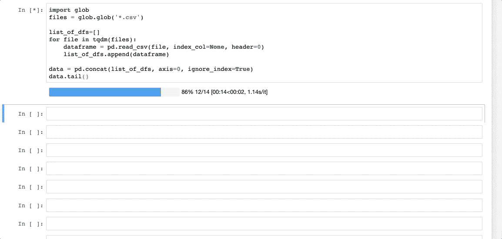

# 用决策树预测新泽西州的交通延误

> 原文：<https://medium.com/analytics-vidhya/predicting-nj-transit-delays-using-decision-trees-58197bd1ca5f?source=collection_archive---------12----------------------->

照片由 [Unsplash](https://unsplash.com?utm_source=medium&utm_medium=referral) 上的 sanga Rima Roman Selia 拍摄

我每天早上的通勤时间至少需要一个半小时，最长两个小时不等，这取决于我在某一天的运气如何*。或者至少，在我质疑我是否能找到任何关于我通勤的数据之前，我是这么想的。于是我开始寻找一个 [Github repo](https://github.com/pranavbadami/njtransit/) ,里面有每趟 NJ transit/美国国家铁路客运公司列车每一站的抓取数据，在抓取期间，每分钟更新一次，以便能够记录列车延误的时间。我想让我的研究变得相当具体，所以我很高兴看到在结合了*之后。csv* 文件，我有 **3，429，002** 行数据。我使用 *glob* 模块合并了这些文件:*

**

*现在我真的只关心我的特定轨道，我每天都乘坐 NJTransit，所以我摆脱了*型*美国国家铁路客运公司和所有不在*线*东北走廊的东西，这条线从纽约宾州车站延伸到特伦顿。这将我的数据帧缩小到了 528，034 行。我顺着这条线索把范围缩小到实际上在纽约(我上下班的地方)或普林斯顿枢纽(我回家的地方)结束的列车。**64316**数据点剩余。*

*现在，为了让我的算法更好地工作，我决定只查看每天多次经过这些站点的特定列车，以使 *train_id* 成为没有太多选项的分类变量，从而挑选出 13 条特定线路。怀着类似的目标，我抓取了日期列并将其分为两类，夏天和冬天。*

**

*咻，在所有的清理之后，我们还有 7595 行剩余。现在试着建立一个模型，用我们现有的变量来预测火车晚点。*

*使用库 *sklearn* ，在将数据分成训练组和测试组之后，对数据运行决策树回归产生了不太理想的结果。配合 graphviz，我们甚至可以窥视我们的树！*

**

*我尝试了一点超参数调整，看看我是否可以提高 r 平方，减少均方误差。唯一有用的参数是最大深度。*

**

*最佳 max_depth 似乎是 6*

*使用随机森林回归器，我们只能分别获得 **2.6%** 和 **1.9%** 的训练和测试分数，以及 **6.21** 的*均方根误差*。没什么印象。*

*见鬼，既然我们在这里，为什么不做一个模型来尝试预测相同的目标变量，但这次是每条线上的每辆火车。在执行了和上面一样的超参数调整后，我得到了一个 30 的最佳最大树深。这次我的随机森林设法分别得到了 **16.7%** 和 **15.6%** 的训练和测试分数，以及一个*5.71 的均方根误差*。好一点了，但显然还有很大的改进空间！*

*我不断遇到的最大障碍是，在我最初为自己设定的时间内，很难找到足够的数据来回答我最初打算回答的特定问题。模型中只使用了两个特性，这在模型评估指标中得到了体现，但我能做的有限。我从每个项目中学到了更多，这不是关于能够找到与你的确切问题相匹配的确切数据，而是关于你可以用你能找到的数据回答什么问题。为了改进这个模型，我想通过更多的搜索，包括日期*天气*将极大地提高模型的有用性，并且添加另一个或两个变量将允许决策树的更多变化，具有更多的超参数调整选项，例如特征重要性。*