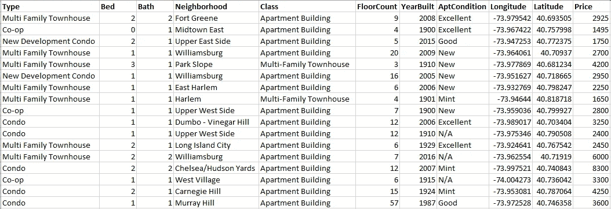
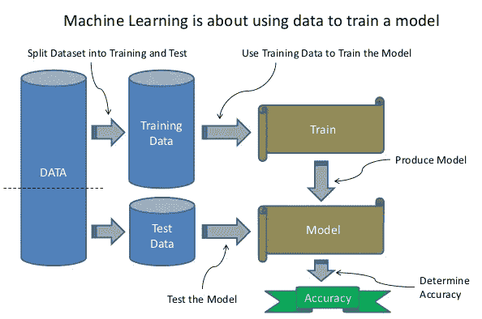
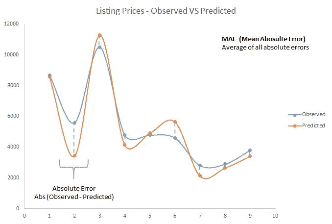
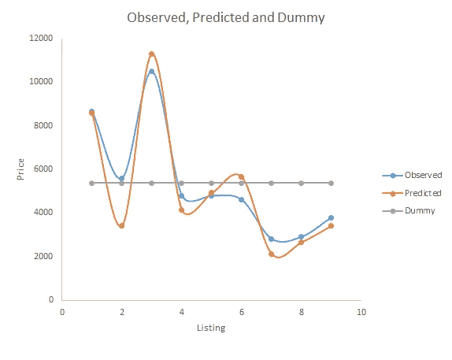
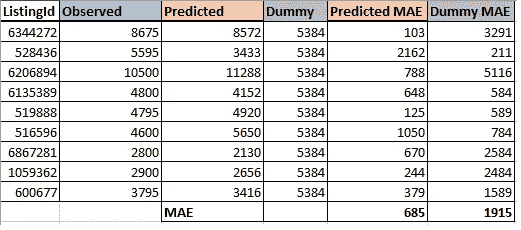
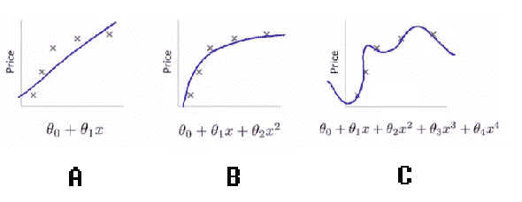
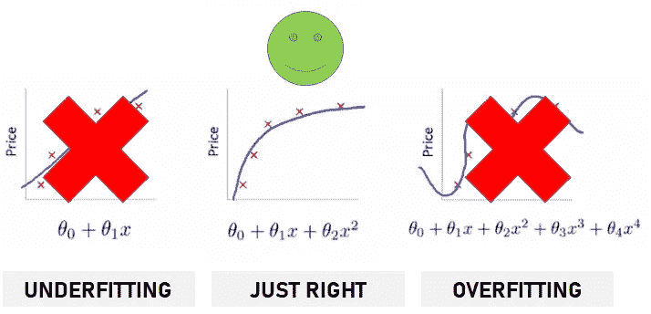
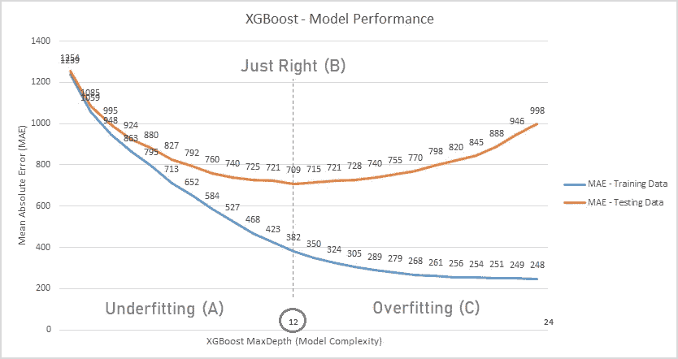
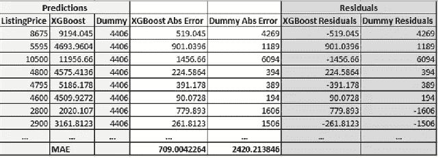
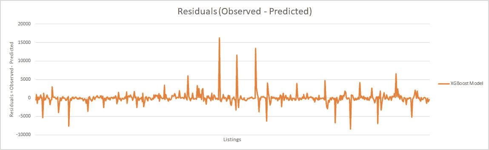

# 使用 XGBoost 预测纽约房源价格

> 原文：<https://medium.com/analytics-vidhya/predicting-nyc-listings-price-using-xgboost-46c7701286f5?source=collection_archive---------18----------------------->

## 介绍一些机器学习概念

# 什么

我们将创建一个机器学习模型，以预测纽约市的租赁房源价格。

> **算法+数据=模型**

# 怎么

我们将使用纽约租赁清单的历史数据来训练**我们的模型。**

该模型将**从数据中学习**，并(希望)准备好预测任何给定的未来上市的价格。

租赁房源历史数据示例

# 裂开

我们将数据分成两组:训练数据和测试数据。

我们使用训练数据来学习和创建模型。

我们使用测试数据，通过比较模型预测值和实际值来计算模型准确性。

> 所以都是**训练……**和**测试！**

# 准确(性)

我们将使用平均绝对误差(MAE)来衡量我们模型的准确性。

我们通过计算模型预测值和观察值(真实值)之间所有绝对差值的平均值来计算 MAE。

计算平均绝对误差

# 有什么好的吗？

我们计算 MAE，得到这个数字:685。**所以呢？**

我们需要将我们的准确性度量与某些东西进行比较，以了解我们在模型中所处的位置。

**在没有任何模型的情况下，我们预测纽约房源价格的最佳方法是什么？**

纽约房源的平均价格怎么样？

让我们使用列表价格平均值来创建一些东西来比较我们的模型。

> 让我们称之为我们的**虚拟模型**。

对比我们的模型和虚拟模型

结果表明，虚拟模型( **1915)** 的 MAE 比我们的模型( **685)** 的 MAE 大得多。

> MAE 越小，模型的准确性越好。

# 模型

现在让我们考虑一下模型的复杂性。

我们要找什么样的模式: **A、B 还是 C** ？

模型复杂性

**A →** 不太符合训练数据——复杂度低

**C** →确实太符合训练数据—高复杂性

**B** →在训练数据适合度和复杂度之间保持平衡

适合度和复杂性之间的权衡

我们运行不同的 XGBoost 模型版本，修改 MaxDepth (complexity)参数值，并为训练和测试数据计算 MAE。

运行 XGBoost 的不同配置

如果我们将 XGBoost MaxDepth 值设置为小于 12，我们的模型将无法正确拟合训练数据(欠拟合)。

如果我们将 XGBoost MaxDepth 值设置为大于 12，则我们的模型将过于适合训练数据(过拟合)。

# 结果

最后，我们运行虚拟模型&我们的 **XGBoost MaxDepth 12 模型**，根据测试数据预测列表价格。

将我们的模型应用于测试数据后的结果

> 我们得到了一个能够预测纽约房屋租赁价格的模型，平均绝对误差为 709 美元。

绘制残差图不仅有助于可视化模型性能，还有助于识别模型预测不佳的情况。

残差

# Jupyter 笔记本

[https://github . com/arieladriannovelli/ml/blob/master/Predicting % 20 NYC % 20 listing % 20 price % 20 using % 20x gboost . ipynb](https://github.com/arieladriannovelli/ml/blob/master/Predicting%20NYC%20Listing%20Price%20using%20XGBoost.ipynb)