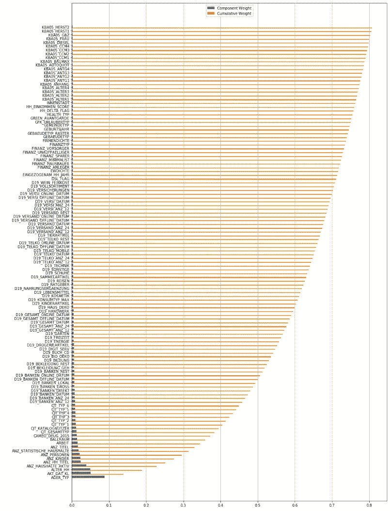
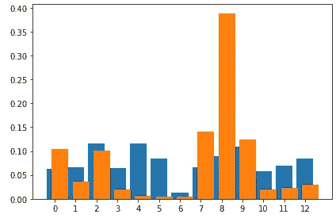

# 用邮寄程序预测潜在客户

> 原文：<https://medium.com/analytics-vidhya/predicting-potential-customers-with-a-mail-out-program-77f73a00c8bc?source=collection_archive---------22----------------------->

在 [Unsplash](https://unsplash.com?utm_source=medium&utm_medium=referral) 上由 [Austin Distel](https://unsplash.com/@austindistel?utm_source=medium&utm_medium=referral) 拍摄的照片

这个问题在试图开拓新市场或联系潜在客户的公司中很常见。我们在哪里花钱/发送材料/部署现场代表，以用最少的风险获得最多的成果。这个特别的项目围绕着向潜在客户发送宣传材料。自然，通过邮件发送材料要花钱，该公司希望确保他们接触到最有可能参与的人。

该项目的目标是正确识别邮件活动的合适候选人。尽管我们希望定义一个二元分类(是/否)，但最终目标是有一个“是”的概率。我们得到了一个关于近 100 万人的社会人口统计信息的数据集，这些人分为顾客和非顾客。我们也有 2 个相似的数据集用于我们的训练和测试。

我最初采取的策略是遵循课程早期类似项目的指南。这包括使用 k-means 算法来识别人群，并确定客户与非客户的比率。不幸的是，这最终对我这个特殊的项目产生了反作用，因为我不能在最终模型中有效地使用这一百万个数据点。我本来希望包括以下内容:

[群中个体的概率]*[群中客户的概率]之和

即使作为一个最初的起点，这也将比简单的 5 万人的[响应]二元分类给我更多的工作。

对于模型的性能指标，指南是使用 AUC 分数。这是我第一次使用这个特定的指标，所以我不完全理解它的细微差别。然而，我知道它被用作召回率和精确度的单一替代，得分的阈值是 0.5-1.0，0.5 是非常差的，1.0 是完美的模型。

我们使用 AUC 而不是 accuracy 或 f-beta 的原因有两个:

1)回复邮件的人和不回复邮件的人之间存在很大的不平衡，这使得很容易扭曲召回/精确结果。

2)我们使用概率而不是二元分类，这是 AUC 分数可以适应的。

**分析**

在我开始查看数据之前，出现了一个警告，提示有两列是混合类型的。课文中有一个警告，幸运的是，这个问题在之前的课程中出现过。由于我们没有第一个项目的 feature_info.csv，我们没有办法翻译，我最终转换了混合类型并丢弃了空值。

查找具有显著空值的列会产生很好的结果；使用 20%的空值阈值，我能够保留 98%的列。在 15%时没有发现显著的差异，但是在 10%的空值阈值时，我将列数减少到了 35%。考虑到这一点，我保留了 20%的阈值，并删除了其他 6 列。作为参考，这个数据集的 20%(89.1 万人)引用了大约 17.8 万个缺失行。

图一。按列列出的缺失数据

接下来，我需要清理所有“未知”值超过 1 的维度。这已经用特征信息完成了。此工作区中包含的 csv 文件。一般来说，维度使用-1 作为未知指标，但下面这两组也使用 9 或 0 作为未知指标。

只有一个二进制分类维度需要重新编码，所以这很简单。有 3 个多级分类维度(有趣的是，其中 2 个是以前的混合型列)，每个维度都有自己的策略。[PRAEGENDE_JUGENDJARHE]被两本词典分成[... _ MOV]和[... _ 十二月]。[CAMEO_INTL_2015]是一列 2 位数的标识符；这些被分成两个独立的列。最后一个多级分类是另一个列的扩展，所以我简单地删除了它。

我在笔记本上添加了一个清理功能，包括所有这些步骤，使它在未来的运行中变得更加容易，更不用说为其他 3 个数据集再次运行了。

**方法论**

起初，我认为 customers 数据集是 Arvato 列表的一个子集，所以我在寻找人口 ID 并创建一个二进制匹配。事实并非如此，但是我忘了删除多余的列。这最终导致后来在培训期间出现问题，需要重新运行笔记本电脑。

为了第一次观察一般人群，我使用了 PCA 分析来更好地理解存在的人群。使用 scikitlearn 的 StandardScaler 进行初始缩放，得到了我需要的方差权重。使用前 120 列得到的方差权重为 80.73%，这将列大小减少到原始数据集的三分之一左右。

图 PCA 的方差加权结果

一旦我完成了 PCA 分析，我就开始进行聚类工作。我选择了 k-means 算法，它最终是错误的，原因我将在后面讨论。然而，像往常一样，我使用肘方法来确定这个特定数据集需要多少个集群。不幸的是，我的笔记本一直出故障，我无法创建所需的视觉效果。考虑到这一点，我决定使用 13 个组，因为这是程序中类似问题的集群数。

通过将聚类应用于一般人群和客户列表，了解每个聚类中数据集的比例并叠加结果，我得到了下图。

通过比较每个聚类的客户比率和人口比率的大小，我可以定义一个人成为客户或不成为客户的概率，这取决于他们属于哪个聚类。很高兴看到大范围的比率——第 8 类中的个人成为客户的可能性是其他人的四倍。另一方面，集群 4 和集群 5 中的个体只有 5%的机会成为顾客。

图 3 —按集群划分的人口(蓝色)与客户(橙色)

这是项目发生重大转折的部分。由于我的互联网连接的限制，以及我不能像 Dill 一样下载数据集或存储工作空间实例的事实，每次我想在项目的后半部分工作时，我都必须从头重新运行。我发现这种方法的主要问题是 k_means 函数没有 predict_proba 方法。因为与集群没有重叠，所以数据点只有一个选项。这打破了我最初的计划，即对于每个数据点的每个集群，聚合集群 N 和集群 N 中的客户问题的概率。

对我来说，这是一个重要的学习点，特别是理解项目需要什么，并批判性地思考如何实现这个目标。这款笔记本运行速度非常慢，我也没有时间在后来重新设计它。下次我一定会三思而后行。

由于我不能使用第一部分的知识，我不得不在 5 万客户的小数据集上进行训练。幸运的是，我有第一部分的缩放器，所以仍然有用。我决定运行三个模型，看看哪个模型的 AUC 最高。决策树以 0.5068 而不是 0.5“稍微”好于其他树。

我使用 GridSearch 尝试了决策树模型的几种变体，使用了以下参数:

1.  max_depth': [5，10，20]
2.  min_samples_leaf': [1，5，10]
3.  最小样本分割':[2，4，6]

最终，最佳参数为[无最大深度，每叶最少 1 个样本，每裂最少 2 个样本]。我没有为 GridSearch 尝试太多的参数，所以也许我可以在未来提高搜索结果。然而，如果没有 100 万人的完整数据集，将很难获得实质性的结果。

随着 GridSearch 的完成，我能够将 AUC 分数从 0.5068 提高到 0.5070，所以这并不是一个很大的进步。0.5070 的分数对业务没有多大帮助，因为它比随机猜测的分数略高。要认为这是成功的，我希望看到 AUC 得分大于 70

我使用决策树的 predict_proba 方法来获得该数据的是/否概率，但是如果没有额外的训练数据，对于大多数人群来说，不会有很好的概率范围。大多数结果很可能显示概率为 0，而不是 null。

回顾这个项目，我很沮丧，因为我没能展示出自己最好的一面。我受到工作簿之外的数据集不可用的限制，并且我一直有与笔记本的连接问题，这将导致丢失或关闭。为了继续项目，不得不重新运行笔记本电脑(最终可能需要 3 个小时)，这变得非常令人沮丧。我肯定会努力改进模型和结果。

当然，重建最初的数据探索，以便能够将结果延续到模型中，这将是最大的不同。通过使用 DBSCAN 或高斯混合模型，我将能够得到一个数据点在特定聚类中的概率。由此，我可以使用上面的结果来创建一个数据点的总概率分数。之后，将对训练模型数据集进行最终调整，以验证概率，然后应用于测试数据将是一件简单的事情。