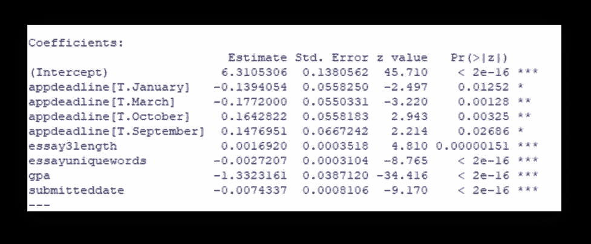

# 预测概率— Logit 模型分析

> 原文：<https://medium.com/analytics-vidhya/predicting-probabilities-logit-model-analysis-c79a429cec8d?source=collection_archive---------19----------------------->

商业案例:当资源和时间有限时，预测入院结果。

目的:预测哪些申请人将完成他们的入学申请。结果将有助于更有效和高效地集中招聘工作；在时间紧迫时尤其有用。在数据中寻找模式。

方法:Logit 和敏感性分析

乔纳森·彼得森在 [Unsplash](https://unsplash.com/?utm_source=medium&utm_medium=referral) 上拍摄的照片

**第一部分——已完成入学和变量的 Logit 分析:**

图 1: Logit 分析，y =完成入院和 x 变量

哪些变量是重要的？显著变量如何影响完全录取的可能性？

appdeadline[T . Jan]:-0.139，完成录取的可能性下降。
appdeadline[T.Mar]: -0.177，完全录取的可能性下降。
app deadline【T . Oct】:0.164，完成录取的可能性上升。
appdeadline[T.Sep]: 0.147，完成录取的可能性上升。
essay3length: 0.001，完成录取的可能性上升。
essayuniquewords: -0.002，完成录取的可能性下降。
gpa: -1.332，取出完整录取的可能性下降。
提交日期:-0.007，完成录取的可能性下降。

**第 2 部分——添加调节效应(变量的相互作用)**

缓和效应:

哪些交互在概念上有意义？
1。gpa * essayuniquewords —统计显著***
GPA 有可能增加完整申请中出现更多独特单词的可能性。
2。GPA * essay 3 length——统计显著性***
GPA 有可能增加提交一份完整申请的较长期末论文的可能性。

图 3:调节效应，logit 分析

你如何解释这些变量的系数？
essayuniquewords: -0.005，申请完成的可能性下降。gpa: -1.706，完成申请的可能性下降。essayuniquewords*gpa: 0.001，申请完成的可能性上升。

**GPA 和 Essay 特有词的敏感度分析:**

图 4:GPA、短文唯一单词和 gpa *短文唯一单词的敏感度分析

图 5:按 GPA(1.0-4.0)和独特文章字数分组的敏感度分析

趋势是，申请人的平均绩点越高，论文中的独特词汇越多，完成申请的可能性就越小。这可能是因为他们有更多的选择，包括其他工作和机会。

**带变量的最终回归模型(主效应和交互项):**

图 6:具有主要影响和交互项的最终回归模型

**第 3 部分—模型的电子表格预测**

Logit 主效应+调节:

图 7:最终 logit 模型的电子表格预测，包括主要影响和交互项

哪些变量对客户的贷款行为影响最大(主效应和交互效应相结合)？

对客户贷款行为影响最大的是变量:
Essayuniquewords (-2.01)和 GPA(-6.15)——由于对系数*值的变量输出，这两个变量对完成申请概率的影响最大。

**包括调节效应的最终敏感性分析:**

图 gpa 和 essay 独特词的敏感性分析

如果申请人的平均绩点很重要，而时间又很紧张，那么最好的办法就是把招聘重点放在平均绩点在 3.0 到 3.5 之间、论文中有 200 到 300 个单词的学生身上。这些申请人有 68%-91%的可能性完成他们的申请，因此，更有可能参加该计划。

(如果平均绩点不那么重要，招聘工作可以把重点放在平均绩点在 2.5 到 3.5 之间、论文中有 200 到 400 个单词的申请者身上。这些申请人有 68%-96%的概率完成申请。)

**数据中的变量:**

图 9:数据字典

**结论:** 两种敏感度分析都预测，GPA 越高、论文字数越独特的申请者完成申请的可能性越小。这可能是因为竞争激烈的工作机会。为了更好地集中招聘工作，将重点放在完成申请的可能性较高的申请人身上可能是明智的。

这一分析提出了改善资源分配的机会，并给出了概率。这些信息可用于补充招聘流程。在时间紧迫、资源有限的情况下，重视招聘人员的时间和努力是很重要的。招聘人员可以通过从历史数据中更多地了解趋势/模式来提高效率和效果。