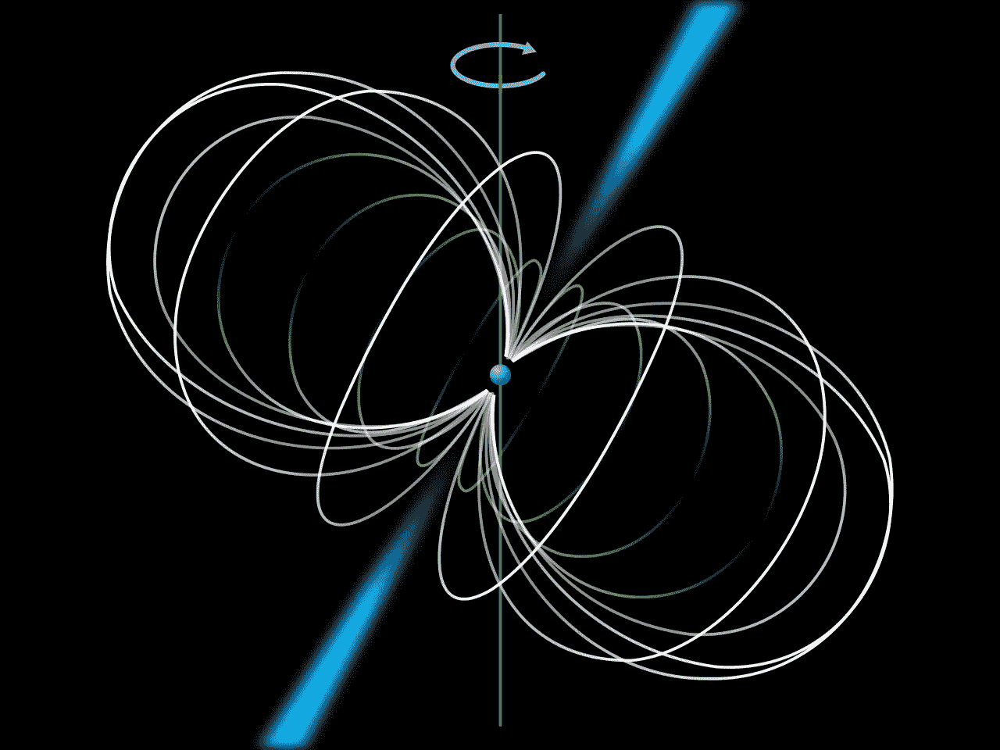
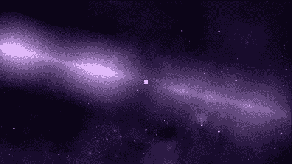
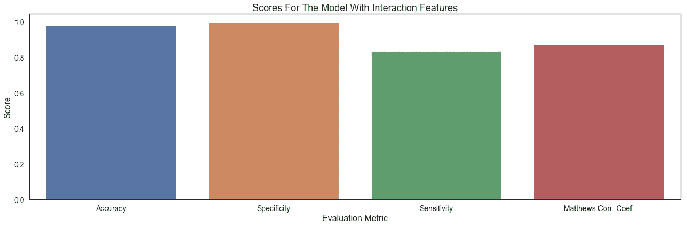
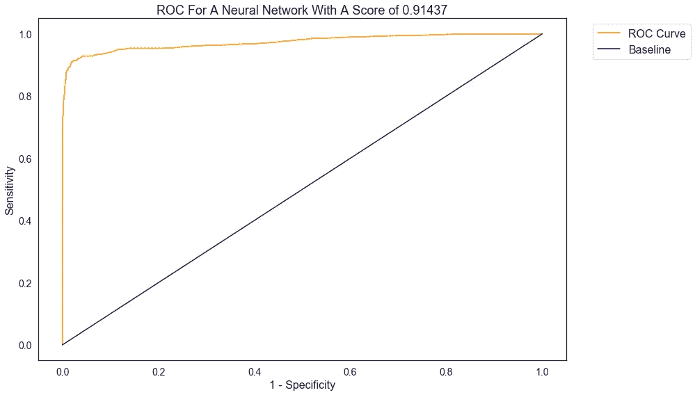

# 预测脉冲星

> 原文：<https://medium.com/analytics-vidhya/predicting-pulsar-stars-996e22440cf7?source=collection_archive---------7----------------------->

天文学和天体物理学一直是我最感兴趣的，所以我抓住了这个机会来研究高时间分辨率宇宙巡天的数据。我使用的数据集可以在 Kaggle 上的[这里](https://www.kaggle.com/pavanraj159/predicting-a-pulsar-star)找到。



蓝色喷流的脉冲星示意图

## 什么是脉冲星？

脉冲星是一种恒星残余，通常是中子星，由巨星(一种质量为太阳 10 到 29 倍的恒星)的坍缩核心形成。它们有非常强的磁场，并像灯塔一样发出电磁辐射脉冲，但只有当它与地球成一定角度时，我们才能探测到它们。

**为什么？**

脉冲星并不常见，自动识别它们的过程将有助于天文学家和物理学家研究它们:它们也被用于研究核物理、广义相对论，甚至有助于证明引力波的存在。



脉冲星旋转

## 清洁和预处理

数据出奇的干净:没有丢失的值！我采取的唯一真正的清理步骤是缩短列名，因为它们太长了。

当可视化数据时，我注意到数据中有一些非常强的相关性，既有负面的也有正面的，这影响了我如何处理我所做的预处理工作。

我的预处理包括两个部分:数据操作和交互列的创建。第一个很简单:一些数据接近正态分布，所以我只是对这些值进行平方，使它们更正态。第二个是创建交互作用列:每种数据类型(综合剖面图和 DM-SNR 曲线)的均值和标准差之间以及偏斜度和过度峰度之间有非常强的相关性。

## 建模

```
**import** **pandas**                **as** **pd**
**import** **numpy**                 **as** **np**
**import** **matplotlib.pyplot**     **as** **plt**
**import** **seaborn**               **as** **sns**
**from** **keras**                   **import** regularizers
**from** **keras.models**            **import** Sequential
**from** **keras.layers**            **import** Dense
**from** **sklearn.model_selection** **import** train_test_split
**from** **sklearn.model_selection** **import** cross_val_score
**from** **sklearn.metrics**         **import** roc_auc_score
**from** **sklearn.metrics**         **import** balanced_accuracy_score
**from** **sklearn.metrics**         **import** f1_score, confusion_matrix
**from** **sklearn.metrics**         **import** recall_score
**from** **sklearn.preprocessing**   **import** StandardScaler
```

我的导入相当直接，主要是为了建模过程。

神经网络由三个基本层组成:

*   输入图层:数据中的要素(列)
*   隐藏层:模型中进行预测的部分；线性模型通过权重和偏差进行修改，然后是一个重新激活函数，迫使我们的预测为正或为零。
*   输出:模型的结果。sigmoid 函数(类似于逻辑回归中的 logit)将预测“弯曲”为 0 或 1。

由于我创建交互列的方式，我创建了三个数据子集，并对每个子集建模；只有一个模型，因此哪个子集具有最好的分数将是最好的模型。

## 评估和最佳模型

我最好的模型是我用交互功能运行的神经网络。也就是说，模型之间的差异很小。



总共对五个模型中的每个模型进行评估:

*   准确性:有多少预测是正确的
*   特异性:在所有非脉冲星的预测中，有多少是正确的
*   灵敏度:在所有的脉冲星预测中，有多少是正确的
*   马修斯·科尔·柯夫。:预测值和真实值有多相似

我对假阳性进行了优化，因为脉冲星对天文学家来说非常重要，因此假阴性比假阳性更糟糕。事实证明，这些模型作为一个整体很少有假阴性。准确度分数比基线好得多，这是由于基线是 9.1%的事实，并且因为负类比正类预测得更好。马修斯相关系数表明预测值和真实值非常相似。



ROC 曲线绘制了神经网络区分脉冲星和非脉冲星的能力。曲线本身显示了灵敏度和假阳性之间的关系。然而，更重要的是 AUC(曲线下面积),因为它显示了两类之间的区别。可能的最低分数是 0.5，我的最佳型号的分数是 0.91437，这表明性能水平很高。

## 结论

我能够令人满意地预测脉冲星，但仍有改进的空间:这些恒星对科学很重要，因此具有更高的灵敏度很重要。

我想继续讨论交互特性、正则化，并尝试不同的采样技术:要么向下采样大多数，要么向上采样少数。

这个项目非常有趣，因为天文学和天体物理学一直是我的兴趣爱好，也因为这些星星对科学非常重要。

这个项目的仓库可以在这里找到。

在 [LinkedIn](https://www.linkedin.com/in/andrew-bergman/) 上也可以找到我。