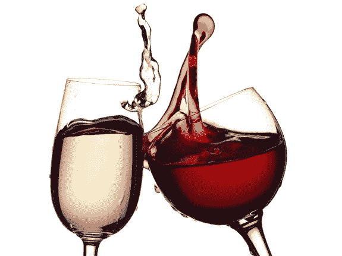
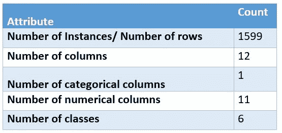
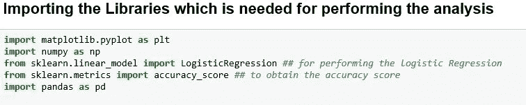
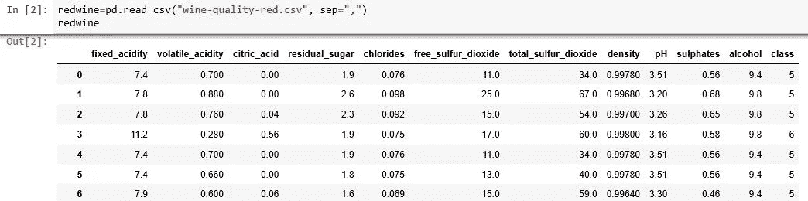
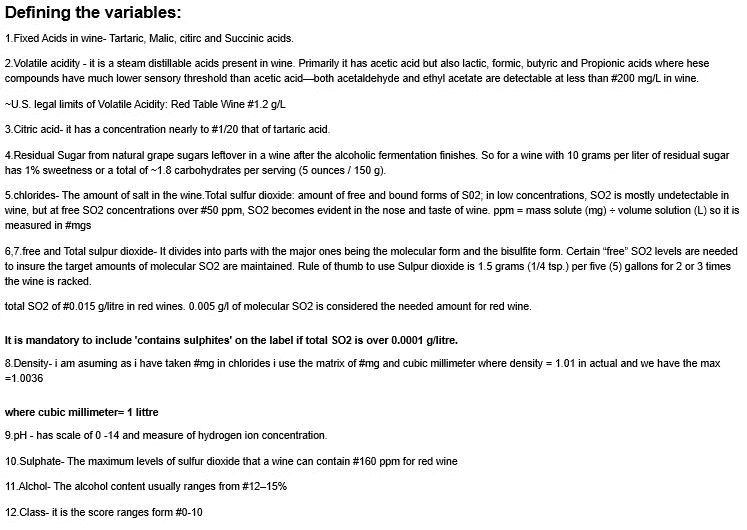

# 利用机器学习模型预测红酒质量

> 原文：<https://medium.com/analytics-vidhya/predicting-red-wine-quality-using-machine-learning-model-34e2b1b8d498?source=collection_archive---------3----------------------->

## 你尝过葡萄酒吗？

我觉得值得一尝。

你知道有两种酒吗——白酒和红酒

你知道红酒有助于减少“抑郁”

> 好处:

红酒富含白藜芦醇，因为它是由葡萄和浆果制成的，对健康有多种益处。

白藜芦醇可以促进心脏健康，预防某些癌症，如肺癌、结肠癌、乳腺癌、前列腺癌，并防止某些类型的视力下降。

> *“女性每天饮酒不应超过一杯，男性两杯”*

那么，为什么我突然开始谈论“红酒”？因为我曾经做过一个测量红酒质量的数据集(链接:【https://www.openml.org/d/40691】[)收集自](https://www.openml.org/d/40691)

> *数据集的详细信息:*

T *he 数据集与葡萄牙“Vinho Verde”葡萄酒的红色变种相关。有关更多详细信息，请查阅[网络链接]或参考资料[Cortez 等人，2009 年]。由于隐私和逻辑问题，只有物理化学(输入)和感官(输出)变量可用(例如，没有关于葡萄类型、葡萄酒品牌、葡萄酒销售价格等的数据。).这些数据集可以被视为分类或回归任务。等级是有序的，而不是平衡的(例如，普通葡萄酒比优质或劣质葡萄酒多得多)。我们不确定是否所有的输入变量都相关。*

> 让我们来看看属性:

**好了，现在我们知道了数据，让我们从如何使用数据开始:**

> 首次导入库

*让我们加载数据并观察它。

> 让我们看看变量是什么？他们想对我们说什么！

> 执行探索性数据分析:

所以现在我们看到了数据。我只是想实现机器学习算法，以了解基于给定数据集准备红酒质量的数据和准确性。

> 让我们从标准化开始:

现在数据归一化了，我们来做分类，做 *logistic 回归*找到红酒的准确度。

> 实施分类模型:

在红酒数据集中，当我试图预测模型并试图理解类变量的规范化时，我们发现准确率为 0.62

准确度模型不是很令人满意，因为该模型对红酒数据集给出了 62 %的准确度。

> 让我们看看神经网络能否帮助我们提高模型的准确性:

—当我用 hidden _ layer _ size =(200，100)，max_iter=1000 执行神经网络时。我们发现精度是 0.6425，并且对于所有尺寸保持迭代不变。它发现这比标准化数据更好。

—当我开始增加 hidden _ layer _ size =(30，50)的大小时，我发现精确度是 0.5725

—当我更改 hidden_layer_sizes= (40，50)时，我发现有意思的是精度是 0.5725

—当我更改 hidden _ layer _ size =(100，200)时，我发现精确度为 0.6125

—当我尝试增加 hidden_layer_sizes= (200，200)/ (400，400)/ (800，1000)时，我发现精确度在 0.57–0.56 的恒定范围内

> 我对这个准确度不满意。除了“归一化”和“*神经网络*”还能做什么？

我想让我们用“ *MinMaxScalar* ”和“ *scikit-learn* ”试试吧

最小最大标量将神经网络分类器对红酒质量的准确率从 0.6425 提高到 0.7225，隐层大小= (200，100)，最大迭代次数=1000

现在我可以说我的预测模型是好的。由于红酒的质量在 70%以上，所以让我们尝一口。我肯定它味道很好。