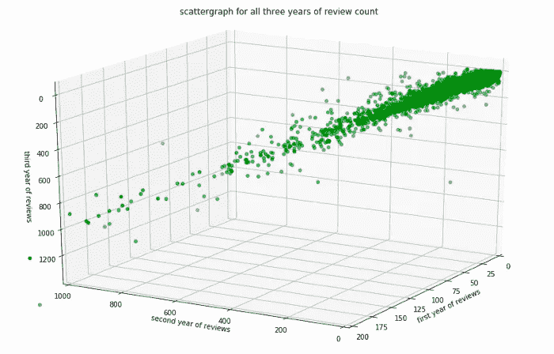
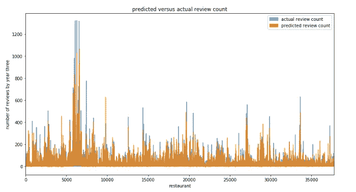
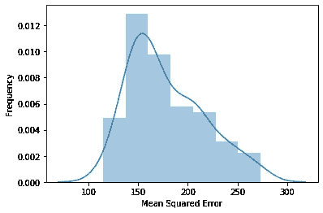
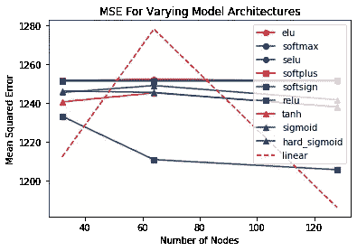
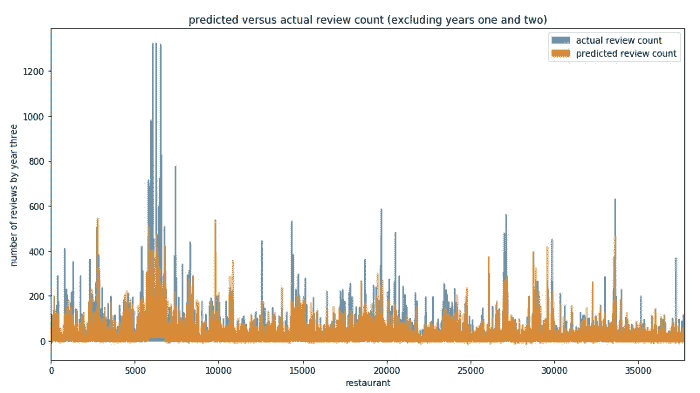

# 基于评论技术和邮政编码级别的人口统计数据预测餐馆的成功

> 原文：<https://medium.com/analytics-vidhya/predicting-restaurant-success-based-on-review-technology-and-zip-code-level-demographic-data-ba48ca53619f?source=collection_archive---------21----------------------->

作者:亚历山大·纳尔逊-格罗科克、西塔拉·乌帕拉帕蒂和杨致远

**总结**

美国人比以往任何时候都要花费更多的收入在餐馆就餐上。全国餐馆协会估计，2019 年的销售额约为 8630 亿美元，几乎是 2010 年 5900 亿美元的两倍。因此，许多技术审查服务应运而生，以帮助这些热切的消费者找到他们最好的就餐体验；无论这是由成本、菜单选项还是其他因素决定的。因此，本文试图回答餐厅评论技术数据是否可以作为未来餐厅成功的有力指标。我们的论文讨论了一种通过创建综合数据集和使用各种机器学习模型来预测餐馆成功的新颖解决方案。讨论衡量餐馆成功的现有文献集中于餐馆特定的数据，以形成它们的独立变量。本文证明了表达餐厅独特性的社区特定数据和密度数据为预测餐厅成功提供了重要信息。本文还表明，第 1 年和第 2 年的评审计数是第 3 年评审计数的有力指标，暗示了上升期的重要性。

**数据收集和清理**

为了涵盖任何给定餐馆的各个方面，我们从各种来源收集数据。我们查看了特定于餐馆的数据和周围的人口统计数据，以便为餐馆提供重要的上下文信息。第一个障碍是弄清楚如何以一种结构良好的方式收集特定于餐馆的数据。起初，我们试图通过广泛的网络爬行来手动收集这些数据。然而，这一过程的计算量非常大，需要收集数月的数据。因此，我们决定通过 Yelp 引用结构化的餐馆信息。我们考察了餐厅的特点，如氛围、噪音水平、室外座位的可用性，以及更明显的属性，如菜肴和价格范围。尽管现有的许多关于衡量餐馆成功的文献集中于餐馆特定的数据来形成它们的独立变量，但我们认为这忽略了餐馆的一个不可或缺的方面:它周围的社区。周围的社区最容易接触到餐馆的大门。通过纳入美国国税局(IRS)和美国人口普查局(USCB)的数据，我们可以开始考虑一个社区的不同方面，这些方面构成了餐馆的假定主要客户群。

我们最初努力回答的一个重要问题是如何量化成功。显而易见的答案是难以捉摸的，因为我们主要是与不公布财务数据的私营公司打交道。我们将餐饮业的成功概念化为本质上的梯度。这种框架与这样一种观点是一致的，即尽管一些餐馆仍在营业，但它们并不成功。一些餐馆盈利丰厚，而另一些则勉强度日。解决方案是使用评论的数量作为衡量成功的标准。Yelp 上的评论数量捕捉到了一个梯度，在我们看来，这是量化客户需求的一个代理。虽然这样的衡量标准是可以理解的不完美，但我们相信错误大多是随机的，或者不足以混淆结论。

我们选择使用邮政编码作为城市或县名中的位置指示器。这是因为城市中心在人口统计和偏好方面存在多样性。这些口味上的变化在城市层面上可能无法识别。邮政编码的使用让我们在某种程度上提高了研究的特异性。我们为每个邮政编码创建了一个密度因子，代表 Yelp 注册企业的数量，随后过滤掉少于 100 家企业的邮政编码。下面的代码说明了这一点:

> *low density index =[]
> for row in data frame . index:
> if int(data frame . loc[row，' density '])<100:
> low density index . append(row)
> highDensData = data frame . drop(low density index，axis = 0)*

我们从 Yelp 数据中收集的信息包括超过 190，000 家企业(不全是餐馆)。然后，我们使用这段代码从 Yelp 数据中过滤掉非餐馆:

```
for x in biz.index:
if str(biz.loc[x,’categories’]).find(‘Food’) != -1 or str(biz.loc[x, ‘categories’]).find(‘Restaurants’) != -1:
restaurants = restaurants.append(biz.loc[x])
```

这一过程将数据集中的企业数量减少了 61.28%，至 74，587 家。我们对每个属性做了一个“密度评分”,这样一家餐厅的属性就可以和周围环境进行比较，而不是孤立地进行观察。这是基于一个假设，即餐馆的成功部分基于周围餐馆的质量。例如，如果一个邮政编码中有五家餐馆提供酒类服务，而只有一家，那么后者可能会获得更多的业务，因为他们不会争夺客户。通过跟踪一个邮政编码中具有相同属性的餐馆的数量，该模型能够创建一个密度分数，以显示每个餐馆对其各自邮政编码的独特程度。

我们项目的下一步是从 USCB 和国税局提取与选定邮政编码相关的数据。这包括平均总收入等数据；种族、年龄和性别的分布；同时查看该地区的总人口。数据收集是一个添加和删除属性、清理和过滤数据等的连续过程。我们的最终数据集包括 37，775 家餐馆，有 258 个属性。

**初步分析**

粗略地看了一下数据集(包括自变量和因变量)，我们注意到了一些趋势。我们设想了三年回顾计数之间的关系。这让我们可以看到自变量和因变量之间是否有很强的联系，至少在最初是这样。



该图中的强线性关系(尤其是第二年和第三年之间)表明，餐馆需要时间来正式化，然后才能在社区中“确立”自己的好坏。我们认为，餐馆为自己建立声誉需要时间，因此，第二年的评论数量比第一年的评论数量更能预测第三年的评论数量，这是合乎逻辑的。

**预测建模和结果**

有了最终的数据，我们使用回归和神经网络模型。我们的第一种方法是最简单的。即线性回归模型。

> *X = df[df . columns[3:-1]]
> y = df[' Year 3 ']
> from sk learn . linear _ model 导入 linear regression
> model = linear regression()
> model . fit(X，y)
> dfN = df
> dfN[' predicted ']= model . predict(X)
> 导入 matplotlib.pyplot 作为 plt
> dfN[['Year 3 '，' predicted']]。plot(alpha = 0.7)
> from sk learn . metrics 导入 R2 _ score
> R2 = R2 _ score(dfN[' Year 3 ']，dfN[' predicted '])
> print(R2)*

这种样本内回归得出的 r 平方值为 83.68%，如下图所示:



然而，我们认为分析样本外的数据也很重要，这样在评估一家以前没有分析过的新餐馆时就可以看到准确性。为此，我们随机进行了 80–20%的训练测试分割，并评估了均方误差。经过 100 次迭代，平均均方误差为 178.5。结果可以在下面的直方图中看到:



为了更进一步，我们希望通过使用神经网络来查看输入和输出之间是否存在任何非线性关系。我们建立了 30 个不同的顺序神经网络模型，它们都有三个密集层。不同的模型用于测试激活函数和节点数量(32，64，128)的不同组合。我们使用样本外测试，并比较不同网络的均方误差，以此来尝试找到最佳模型。最终，我们发现具有 128 个节点的线性激活函数的模型表现最好。该模型实现了最低的均方误差值 1186.18。在找到最佳激活函数和节点数后，我们优化了历元数；60 个时代表现最好，为 920.2376。线性激活函数通过将输入乘以权重来创建与输入成比例的输出。我们还进行了线性回归，并获得了类似的结果，表明虽然变量之间的关系最初似乎很复杂，但它们似乎比以前假设的更线性。



**讨论**

我们认为该模式的成功意义重大。现有的文献能够解释多达 69%的星计数差异，我们的分析通过查看综述计数对此进行了扩展。该模型表明，餐馆的价值不仅仅是餐馆本身，还包括餐馆周围的社区。

为了证明第一年和第二年审查计数对模型的重要性，我们对同一数据集执行了相同的线性回归，但排除了第一年和第二年审查计数。r 平方值下降到 0.28(下降了 68%)。这是图表:



出于我们研究的目的，这突出了餐饮业的一个重要部分，一定程度上基本缺乏可预测性。然而，对图表的视觉分析表明仍然有信息需要收集。当不考虑评论的数量时，实际评论计数的局部最大值似乎与预测评论计数的局部最大值相匹配。具体地，当查看具有异常高数量的预测评论的餐馆时，这些餐馆通常与异常高数量的实际评论相关。例如，这可以在餐馆商业指数 5000 和 10000 之间的图表中看到。我们假设在预测的和实际的评论数中表现最好的人将会互相匹配。

为了从统计上验证这一假设，我们决定在训练后的测试集中找到预测的和实际的评论数量之间的百分位数匹配。我们根据预测和实际的评论数量(从高到低)对餐馆进行排序。如果我们的假设是正确的，那么前四分之一人口之间将会有显著的相似性。前 10%的预测值和实际值之间的相似度为 51%。鉴于随机性导致的相似性的基本比率为 10%，我们认为即使不包括第一年和第二年的审查，该模型仍然是有信息的。包括第 1 年和第 2 年的审查计数，相似性得分增加到 78%。

这种分析使我们的结果与投资者特别相关，因为即使我们不能准确预测第一年和第二年的大幅上涨，至少在最初，我们能够预测成功的餐厅。这意味着，至少从理论上来说，餐馆投资者最初会投资于我们认为最有可能位于其邮政编码前四分之一的餐馆。然后，随着时间的推移(评论数随后变得可用)，对模型预测其评论数将大幅增加的餐厅进行更多投资。

这让我们证实了我们之前的结论，即餐馆在社区内立足需要时间。这是因为，如果查看计数峰值，您可以看到第一年和第二年的峰值，因为第一年和第二年与第三年之间存在高度线性关系(之前观察到)。

**接下来的步骤**

我们相信这项研究在理解当今世界是什么让一家餐馆成功方面向前迈进了一步。我们的研究表明，包括人口统计和社区因素有助于理解餐厅的成功。仍然可以做一些工作来理解品味和偏好如何在一个社区内变化。一个特别感兴趣的领域是送餐服务对餐馆成功的影响。食品配送服务现在占据了餐馆销售额的大部分，因此其价值不可低估。一个感兴趣的领域是试图通过曲线平滑来预测评论计数的峰值。