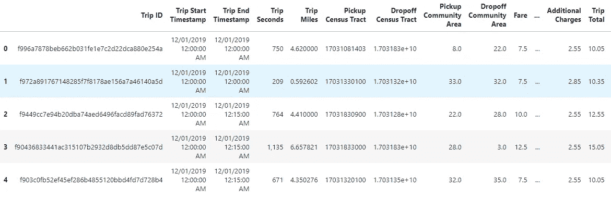
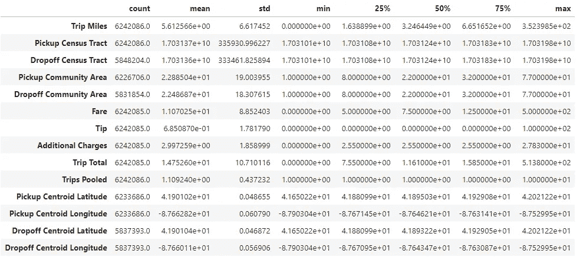
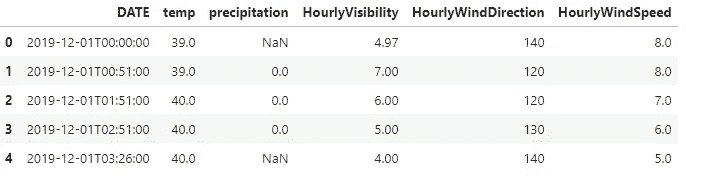
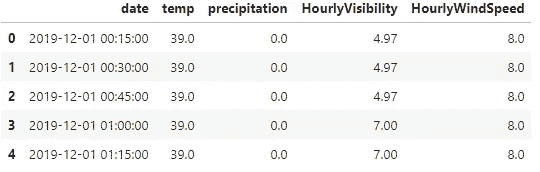
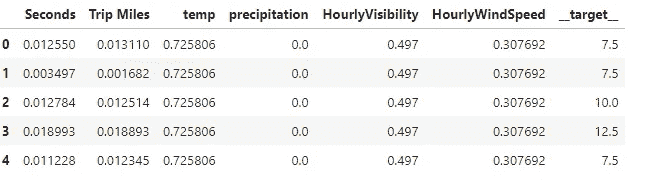
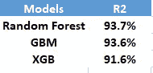
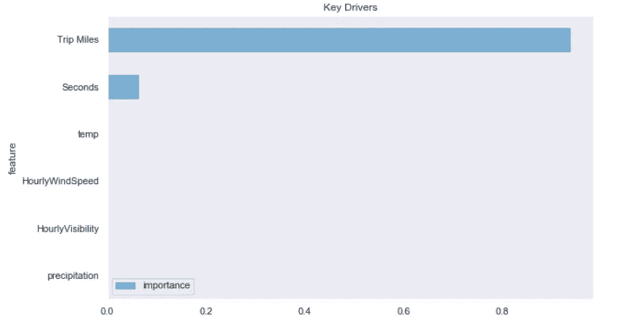
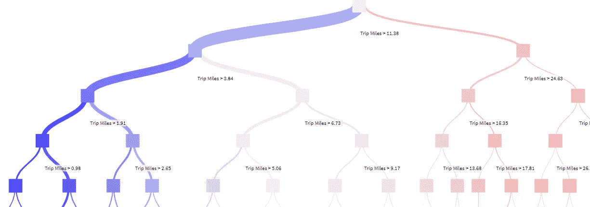

# 使用机器学习算法预测拼车费用

> 原文：<https://medium.com/analytics-vidhya/predicting-rideshare-fares-using-machine-learning-algorithms-ae9e8813a1d7?source=collection_archive---------25----------------------->

使用芝加哥的“交通网络提供商”数据和天气数据预测优步/Lyft/Via 票价


芝加哥成为美国第一个发布优步、Lyft 和 Via 等公司详细拼车数据的主要城市。该数据于 2019 年 4 月首次发布，涵盖了自 2018 年 11 月以来的旅行。涵盖出行、司机和车辆的数据集可以揭示乘客行为以及拼车公司的定价策略。

有几个关于乘客行为( [Storybench-Chiago Rideshare 数据](https://www.storybench.org/exploring-chicago-rideshare-data/))以及定价([路透社-优步司机涨价](https://www.reuters.com/article/us-uber-pricing-chicago/uber-drives-up-prices-for-shared-rides-chicago-data-reveals-idUSKBN1Y017V))的故事。Storybench 的研究发现，出行往往集中在清晨通勤时间和“夜生活”时间，路透社的研究发现，共享乘车价格的上涨主要影响芝加哥的低收入社区。在这些背景下，我试图建立机器学习模型来预测拼车票价。

# 行程数据

行程数据包括每次行程的详细信息:开始时间、结束时间、持续时间、英里数、开始位置、结束位置等。更详细的数据描述以及数据来源可在此处找到:

[](https://data.cityofchicago.org/Transportation/Transportation-Network-Providers-Trips/m6dm-c72p) [## 交通网络提供商— Trips |芝加哥市|数据门户

### 编辑描述

data.cityofchicago.org](https://data.cityofchicago.org/Transportation/Transportation-Network-Providers-Trips/m6dm-c72p) 

芝加哥做的一些数据处理包括:在某些情况下人口普查区域被隐藏，时间被四舍五入到最接近的 15 分钟。车费四舍五入到最接近的 2.50 美元，小费四舍五入到最接近的 1.00 美元。建模数据是 2019 年 12 月拍摄的旅行，包含超过 600 万行。



# 气象资料

芝加哥 2019 年 12 月的天气数据，包括温度，降水，每小时能见度，每小时风向和每小时风速，都来自 NOAA(国家环境信息中心)。为简单起见，所有芝加哥的数据都是从奥黑尔国际机场的一个站点收集的。



# 数据争论

由于天气数据间隔不规则，必须将数据重新采样为 15 分钟等间隔时间序列数据，以与行程数据相结合。下面是一个代码片段，它让数据等距分布。

```
#Resample Weather data to 15-min equally spaced dataweather['date'] = pd.to_datetime(weather['DATE'])
weather =weather.set_index(pd.DatetimeIndex(weather['date']))
weather =weather.resample('15min', loffset=pd.Timedelta('15min')).mean()
```

填入缺失值后，天气数据如下所示:



# 特征

当乘客提出乘车请求时，他/她知道目的地，拼车公司用它来计算车费。此外，在提出请求时，天气状况是已知的，通常在开始旅行前 10~15 分钟。为了模拟已知条件，选择了以下特征-行程开始时间前 15 分钟的行程英里数和温度/降雨量/能见度/风速。我还包括了旅行的持续时间，这在提出请求时是一个未知的变量。然而，票价是预先确定的，不考虑旅行持续时间，因此包括该功能是为了测试预测能力。数字要素基于最小值-最大值进行了重新缩放，下面显示了要素的快照。建模数据被分成训练/测试(80/20)。



# 模型

选择了三种流行的基于树的模型进行测试——随机森林、梯度增强和 XG 增强。下面提供了每个模型的简短描述及其设置的代码片段。

随机森林

随机森林是决策树的集合。每个决策树都使用数据集的随机样本进行训练。然后，通过对树的预测进行平均，综合方法，对整个森林进行预测。

```
#Random Forest: initial set-up
from sklearn.ensemble import RandomForestRegressor
reg_rf= RandomForestRegressor(n_estimators=100,
    random_state=1234,
    max_depth=10,
    min_samples_leaf=1,
    verbose=2)
```

梯度推进机器

GBM 是另一种基于决策树的集成方法。树被顺序地添加到模型中，并且每棵树都试图提高整体的性能。

```
#GBM: initial set-up
from sklearn.ensemble import GradientBoostingRegressor
reg_gbm = GradientBoostingRegressor(
                    random_state = 1234,
                    verbose = 0,
                    n_estimators = 100,
                    learning_rate = 0.1,
                    loss = 'ls',
                    max_depth = 3)
```

XGBoost

XGB 是另一种基于决策树的集成方法，它使用梯度推进框架。XGBoost 有大量的高级参数；因此，在使用 XGB 时，调整超参数以选择正确的配置非常重要。

```
#xgb: initial set-up
import xgboost as xgb
reg_xgb = xgb.XGBRegressor(
                    max_depth=3,
                    learning_rate=0.2,
                    gamma=0.0,
                    min_child_weight=0.0,
                    max_delta_step=0.0,
                    subsample=1.0,
                    colsample_bytree=1.0,
                    colsample_bylevel=1.0,
                    reg_alpha=0.0,
                    reg_lambda=1.0,
                    n_estimators=300,
                    silent=0,
                    nthread=4,
                    scale_pos_weight=1.0,
                    base_score=0.5,
                    seed=1234,
                    missing=None)
```

# 结果

所有这些基于树的模型都显示出高预测能力，从测试数据集获得的高于 90%的 R 平方证明了这一点。毫不奇怪，最重要的变量是行程英里数，其次是行程秒数。从与天气相关的数据中找不到太多的意义。也许，这里使用的温度或降水数据没有经过转换，如降水量随时间的变化，导致这些特征的预测能力较低。



当可视化来自随机森林模型的树时，可以看到行程英里是最重要的特征。



# 结论

在这里，基于树的机器学习模型被尝试和比较，以查看它们对森林拼车费用的预测能力。虽然所有这些模型都显示了很高的预测能力，但通过转换与天气相关的变量和可能更精确的位置信息，可以获得进一步的改进。