# 预测销售:用 Python 进行时间序列分析和预测

> 原文：<https://medium.com/analytics-vidhya/predicting-sales-time-series-analysis-forecasting-with-python-b81d3e8ff03f?source=collection_archive---------0----------------------->

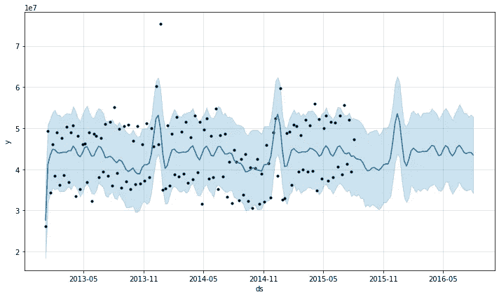

任何零售商店公司最重要的任务之一是分析其商店的业绩。任何零售商店面临的主要挑战是提前预测每个商店所需的销售额和库存，以避免库存过多和不足。这有助于企业提供最佳的顾客体验，避免亏损，从而确保商店的可持续经营。

在这篇文章中，我将使用 Kaggle 上的 Rossmann store [数据](https://www.kaggle.com/c/rossmann-store-sales)。


Rossmann 在 7 个欧洲国家经营着 3000 多家药店。挑战在于提前预测他们长达六周的日销售额。商店销售受许多因素影响，包括促销、竞争、学校和国家假期、季节性和地点。

这篇文章分为两部分:EDA 和预测

# **部分 A)探索性数据分析(EDA)**

让我们首先导入所需的库，然后进行数据探索。

```
# Importing required libraries
import numpy as np
import pandas as pd, datetime
import seaborn as sns
from statsmodels.tsa.stattools import adfuller
import matplotlib.pyplot as plt
get_ipython().run_line_magic('matplotlib', 'inline')
from time import time
import os
from math import sqrt
from statsmodels.tsa.seasonal import seasonal_decompose
from statsmodels.graphics.tsaplots import plot_acf, plot_pacf
import itertools
import statsmodels.api as sm
from statsmodels.tsa.stattools import acf,pacf
from statsmodels.tsa.arima_model import  ARIMA
from sklearn import model_selection
from sklearn.metrics import mean_squared_error, r2_score
from pandas import DataFrame
import xgboost as xgb
from fbprophet import Prophet
import warnings
warnings.filterwarnings('ignore')# Importing store data
store = pd.read_csv('./data/store.csv')
store.head()
```

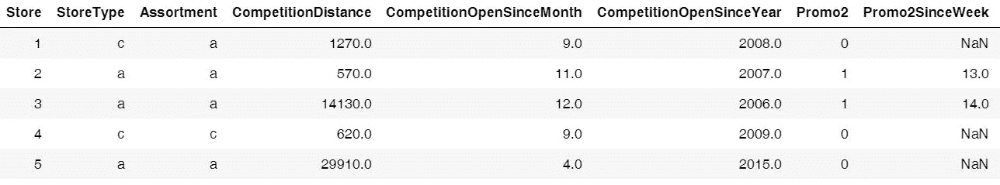

上表给出了罗斯曼拥有的 1115 家商店的信息。

```
# Importing train data
train = pd.read_csv('./data/train.csv', index_col='Date', parse_dates = True)
train.head()
```

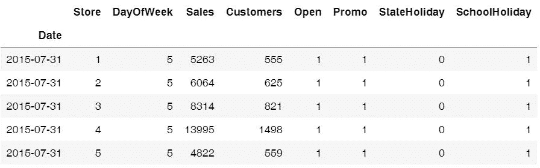

从上表中我们可以看到，日期是其中的一列。这一分析的独特之处在于,“日期”是影响销售的重要因素之一，它是一个独立变量。简而言之，这是一个时间序列数据，即按时间顺序排列的一系列数据点。

1.  **趋势&季节性**

让我们看看销售额如何随月份、促销、促销 2(第二次促销优惠)和年份而变化。

```
# Sales trend over the months and year
sns.factorplot(data = train_store_joined, x ="Month", y = "Sales", 
               col = 'Promo', # per store type in cols
               hue = 'Promo2',
               row = "Year")
```

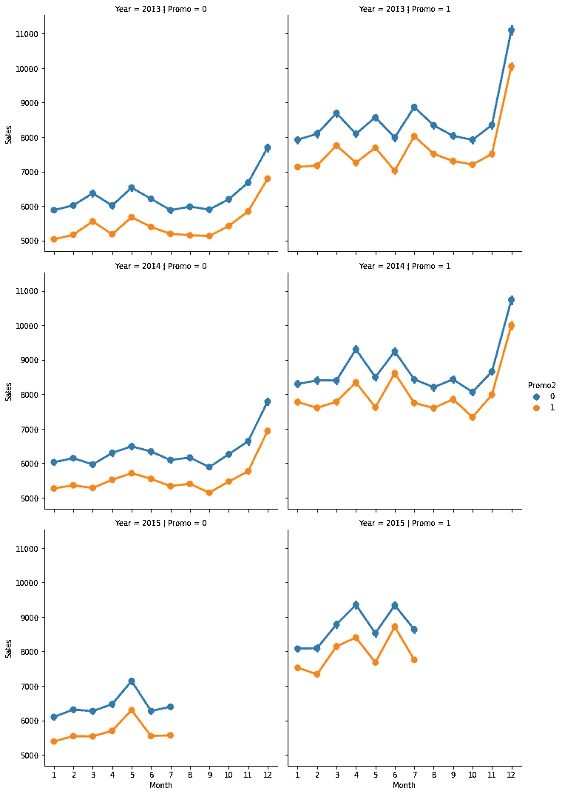

上图告诉我们，销售往往会在 12 月达到峰值，这是有道理的，因为圣诞节和假期是旺季。因此，这证实了销售随着“日期”(时间)而变化，并且在我们的数据中存在季节性因素。

```
# Sales trend over days
sns.factorplot(data = train_store_joined, x = "DayOfWeek", y = "Sales", hue = "Promo")
```

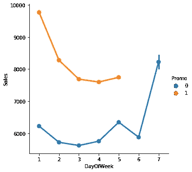

从上述趋势中我们可以看出，周末，即周六和周日没有促销活动，这是有道理的，因为商店希望在人们做家务的时候赚取最大利润。

销售额往往在周日增加，因为人们在周末购物。我们还可以看到，最大的销售发生在有促销活动的周一。

**2。时间序列的平稳性**

为了使用时间序列预测模型，我们需要确保我们的时间序列数据是平稳的，即恒定均值、恒定方差和恒定协方差。

有两种方法可以检验时间序列的平稳性:

**a)滚动平均值**:时间序列模型的滚动分析通常用于评估模型在一段时间内的稳定性。窗口以周为单位滚动(滑过数据)，其中以周为单位取平均值。滚动统计是一种可视化测试，我们可以将原始数据与滚动数据进行比较，并检查数据是否稳定。

**b) Dicky -Fuller 检验**:该检验为我们提供 p 值等统计数据，以了解我们是否可以拒绝零假设。零假设是数据不是静态的，另一个假设是数据是静态的。如果 p 值小于临界值(比如 0.5)，我们将拒绝零假设，并说数据是平稳的。

让我们检查' a '型商店的平稳性。

```
# Data Preparation: input should be float type
train['Sales'] = train['Sales'] * 1.0# Assigning one store from each category
sales_a = train[train.Store == 2]['Sales']# Trend
sales_a.resample('W').sum().plot(ax = ax1)
```

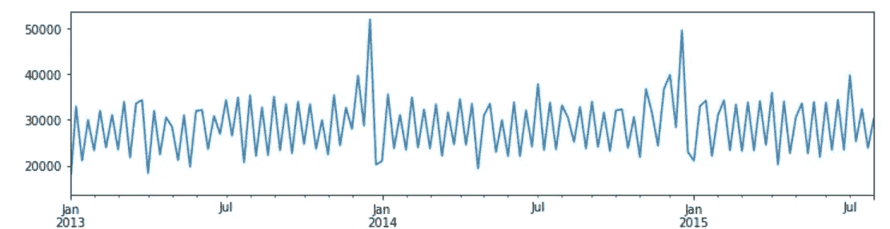

上图告诉我们，销售往往在年底达到高峰。

```
# Function to test the stationarity
def test_stationarity(timeseries):

    # Determing rolling statistics
    roll_mean = timeseries.rolling(window=7).mean()
    roll_std = timeseries.rolling(window=7).std()# Plotting rolling statistics:
    orig = plt.plot(timeseries.resample('W').mean(), color='blue',label='Original')
    mean = plt.plot(roll_mean.resample('W').mean(), color='red', label='Rolling Mean')
    std = plt.plot(roll_std.resample('W').mean(), color='green', label = 'Rolling Std')
    plt.legend(loc='best')
    plt.show(block=False)

  # Performing Dickey-Fuller test:
    print('Results of Dickey-Fuller Test:')
    result = adfuller(timeseries, autolag='AIC')
    print('ADF Statistic: %f' % result[0])
    print('p-value: %f' % result[1])
    print('Critical Values:')
    for key, value in result[4].items():
           print(key, value)# Testing stationarity of store type a
test_stationarity(sales_a)
```

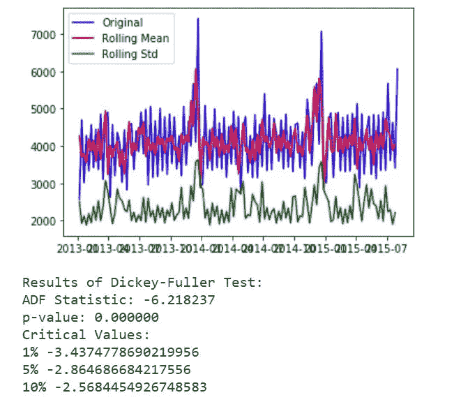

从上面的图和统计检验中我们可以看出，均值和方差并不随时间变化很大，即它们是常数。因此，我们不需要执行任何转换(当时间序列不稳定时需要)。

现在，让我们用分解图来看看季节性和趋势。

```
# Plotting seasonality and trend
def plot_timeseries(sales,StoreType):fig, axes = plt.subplots(2, 1, sharex=True, sharey=False)
    fig.set_figheight(10)
    fig.set_figwidth(15)decomposition= seasonal_decompose(sales, model = 'additive',freq=365)estimated_trend = decomposition.trend
    estimated_seasonal = decomposition.seasonal
    estimated_residual = decomposition.resid

    axes[1].plot(estimated_seasonal, 'g', label='Seasonality')
    axes[1].legend(loc='upper left');

    axes[0].plot(estimated_trend, label='Trend')
    axes[0].legend(loc='upper left');plt.title('Decomposition Plots')
```

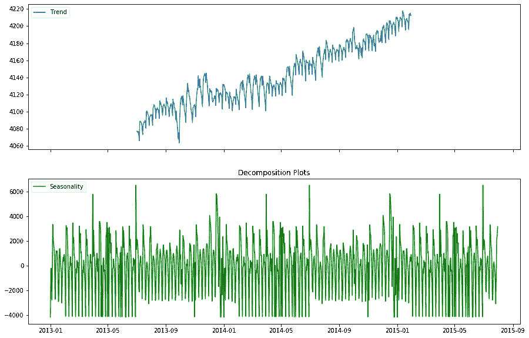

从上面的图中，我们可以看到我们的数据中存在季节性和趋势性。因此，我们将使用考虑到这两个因素的预测模型。

# **B)部分预测:预测模型**

1.  **评估指标**

有两个流行的指标用于衡量回归(连续变量)模型的性能，即梅伊和 RMSE。

**平均绝对误差(MAE)** :预测值与观测值绝对差的平均值。

**均方根误差(RMSE)** :是预测值与观测值的平方差的平均值的平方根。

MAE 更容易理解和解释，但是 RMSE 在不希望出现大错误的情况下工作得很好。这是因为误差在被平均之前被平方，因此惩罚了大的误差。在我们的例子中，RMSE 非常适合，因为我们希望以最小的误差预测销售(即惩罚高误差)，以便可以正确地管理库存。

因此，我们将选择 RMSE 作为衡量模型性能的指标。

**2。预测建模**

**模型 1:自回归综合移动平均线(ARIMA)**

我们将使用最常用的时间序列预测方法之一，即 ARIMA。

ARIMA 模型用 ARIMA(p，d，q)来表示。

p、d 和 q 分别代表数据中的季节性、趋势和噪声。我们将首先创建 p、d 和 q 的所有可能组合，如下所示:

```
# Define the p, d and q parameters to take any value between 0 and 3
p = d = q = range(0, 2)# Generate all different combinations of p, q and q triplets
pdq = list(itertools.product(p, d, q))# Generate all different combinations of seasonal p, q and q triplets
seasonal_pdq = [(x[0], x[1], x[2], 12) for x in list(itertools.product(p, d, q))]print('Examples of parameter combinations for Seasonal ARIMA: ')
print('SARIMAX: {} x {}'.format(pdq[1], seasonal_pdq[1]))
print('SARIMAX: {} x {}'.format(pdq[1], seasonal_pdq[2]))
print('SARIMAX: {} x {}'.format(pdq[2], seasonal_pdq[3]))
print('SARIMAX: {} x {}'.format(pdq[2], seasonal_pdq[4]))
```

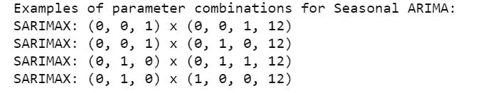

**ARIMA 超参数调谐**

为了选择上述参数的最佳组合，我们将使用**网格搜索**。参数的最佳组合将给出最低的赤池信息标准(AIC)分数。AIC 告诉我们一组给定数据的统计模型的质量。

```
# Determing p,d,q combinations with AIC scores.
for param in pdq:
    for param_seasonal in seasonal_pdq:
        try:
            mod = sm.tsa.statespace.SARIMAX(train_arima,
                                            order=param,
                                            seasonal_order=param_seasonal,
                                            enforce_stationarity=False,
                                            enforce_invertibility=False)results = mod.fit()print('ARIMA{}x{}12 - AIC:{}'.format(param, param_seasonal, results.aic))
        except:
            continue
```

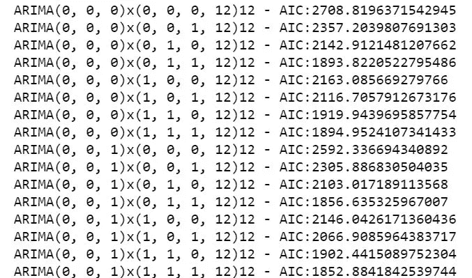

我只包括了网格搜索的快照。以上迭代建议 **SARIMAX(1，1，1)x(0，1，1，12)12** 为最低 **AIC: 1806.29 的最佳参数组合。**

**拟合 ARIMA 模型**

```
# Fitting the data to ARIMA model 
model_sarima = sm.tsa.statespace.SARIMAX(train_arima,
                                order=(1, 1, 1),
                                seasonal_order=(0, 1, 1, 12),
                                enforce_stationarity=False,
                                enforce_invertibility=False)results_sarima = model_sarima.fit()print(results_sarima.summary().tables[1])
```

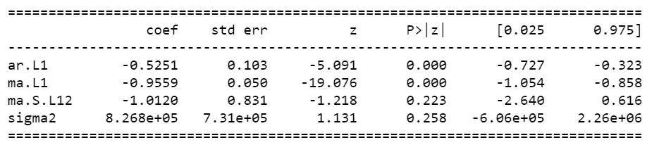

让我们检查诊断图来可视化我们模型的性能。

```
# Checking diagnostic plots
results_sarima.plot_diagnostics(figsize=(10, 10))
plt.show()
```


正态 Q-Q 图显示残差的有序分布遵循类似正态分布的分布。因此，我们的模型似乎相当不错。

**模型预测**

```
# Model Prediction
# Predictions are performed for the 11th Jan' 2015 onwards of the train data.pred = results_sarima.get_prediction(start=pd.to_datetime('2015-01-11'), dynamic = False)# Get confidence intervals of forecasts
pred_ci = pred.conf_int()ax = train_arima["2014":].plot(label = "observed", figsize=(15, 7))
pred.predicted_mean.plot(ax = ax, label = "One-step ahead Forecast", alpha = 1)
ax.fill_between(pred_ci.index, 
                pred_ci.iloc[:, 0], 
                pred_ci.iloc[:, 1], 
                color = "k", alpha = 0.05)ax.set_xlabel("Date")
ax.set_ylabel("Sales")plt.legend
plt.show()train_arima_forecasted = pred.predicted_mean
train_arima_truth = train_arima["2015-01-11":]# Calculating the error
rms_arima = sqrt(mean_squared_error(train_arima_truth, train_arima_forecasted))
print("Root Mean Squared Error: ", rms_arima)
```

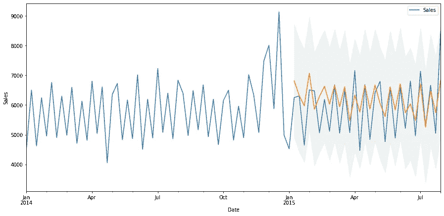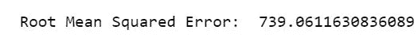

上图显示，我们的预测值赶上了数据集中的观察值。我们的预测似乎与实际情况非常吻合，并如预期的那样在 12 月份出现峰值。在我们的例子中，RMSE 也相当低。

因此，最终的 ARIMA 模型可以表示为 **SARIMAX(1，1，1)x(0，1，1，12)12。这是我们能对 ARIMA 做的最好的，所以让我们尝试另一个模型，看看我们是否能减少 RMSE。**

**模式二:先知**

Prophet 是脸书的开源工具。此过程用于预测基于加法模型的时间序列数据，在加法模型中，非线性趋势与每年、每周和每天的季节性以及假日影响相适应。

**基线模型**

我们的基线(初始)模型将使用默认参数。让我们看看它的表现如何。

```
# Creating a train dataset
train_prophet = train.copy()
train_prophet.reset_index(level=0, inplace=True)# Converting col names to specific names as required by Prophet library
train_prophet = train_prophet.rename(columns = {'Date': 'ds',
                                'Sales': 'y'})# Downsampling to week because modelling on daily basis takes a lot of time
ts_week_prophet = train_prophet.set_index("ds").resample("W").sum()
```

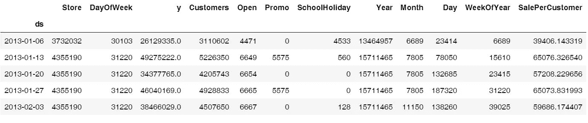

**拟合先知模型**

```
# Fitting data to Prophet model
prophet_1 = Prophet() 
prophet_1.fit(ts_week_prophet_train)
```

**模型预测**

```
future_1 = prophet_1.make_future_dataframe(periods = 52, freq = "W") 
forecast_1 = prophet_1.predict(future)
forecast_1[["ds", "yhat", "yhat_lower", "yhat_upper"]].tail()
```

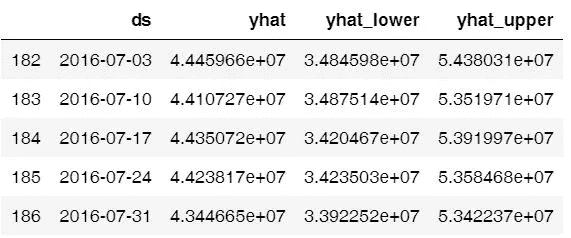

```
# Visualizing predicions of forecast
prophet.plot(forecast_1);
```

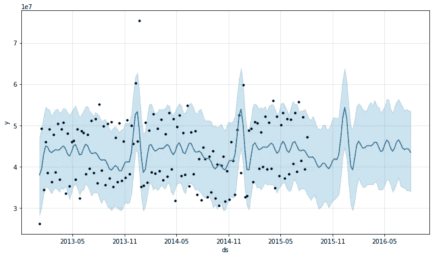

从上面的图中我们可以看出，预测是相当不错的，但让我们看看 RMSE，以获得更好的想法。

```
# Checking the RMSE of Prophet model
metric_prophet_1 = forecast_1.set_index('ds')[['yhat']].join(ts_week_prophet_train.set_index('ds').y).reset_index()
metric_prophet_1.dropna(inplace=True)
rms_prophet_1 = mean_squared_error(metric_prophet_1.y, metric_prophet_1.yhat)
rms_prophet_1
```

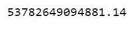

哇！在这种情况下，RMSE 太大了，我们需要做点什么。让我们看看是否可以通过操纵一些参数来降低它。

## **先知的超参数调整**

在 Prophet 模型中有许多可用的参数。其中最重要的是**【假日】**。这让我们可以在训练模型时显式解析假日。我们将通过在学校或州放假时进行观察来创建一个新的“假期”数据框。

我们还将使用另外三个参数，即。

*   **interval_width** :定义进行预测的不确定程度。默认值为 0.8，但我们将采用 0.95，因为我们希望在预测中更加确定。
*   **增长**:我们知道‘销售’可以取任何值，不存在饱和点。因此，我们将采用“线性”增长，而不是“对数”增长。
*   **yearly _ seasonity**:我们将明确地把它作为‘True’传递，因为我们知道在我们的数据中存在一个年度季节性(如上所述)。

```
# Encoding state holiday categorical variable
train_prophet["StateHoliday_cat"] = train_prophet["StateHoliday"].map({0:0, "0": 0, "a": 1, "b": 1, "c": 1})# Choosing only required cols
train_prophet = train_prophet[['ds', 'y', 'SchoolHoliday', 'StateHoliday_cat']]
train_prophet.head()
```

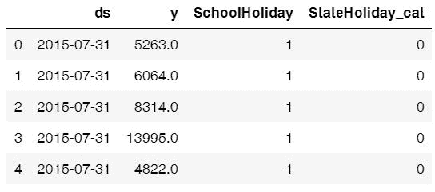

```
# Modelling holidays - creating holidays dataframe
state_dates = train_prophet[(train_prophet.StateHoliday_cat == 1)].loc[:, "ds"].values
school_dates = train_prophet[(train_prophet.SchoolHoliday == 1)].loc[:, "ds"].valuesstate = pd.DataFrame({"holiday": "state_holiday",  "ds": pd.to_datetime(state_dates)})
school = pd.DataFrame({"holiday": "school_holiday", "ds": pd.to_datetime(school_dates)})holidays = pd.concat((state, school))
holidays.head()# Dropping holiday columns because not needed any more
train_prophet_clean = train_prophet.drop(["SchoolHoliday", "StateHoliday_cat"], axis = 1)# Downsampling to week because modelling on daily basis takes a lot of time
ts_week_prophet = train_prophet_clean.set_index("ds").resample("W").sum()# Resetting the index
ts_week_prophet_train = ts_week_prophet.reset_index() 
```

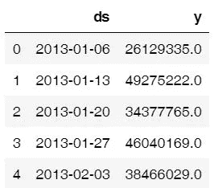

**拟合超调先知模型**

```
# Fitting data to Prophet model
prophet_2 = Prophet(holidays = holidays, interval_width = 0.95, growth='linear', yearly_seasonality = True) 
prophet_2.fit(ts_week_prophet_train)
print("done")
```

**模型预测**

```
future_2 = prophet_2.make_future_dataframe(periods = 52, freq = "W") 
forecast_2 = prophet_2.predict(future)
forecast_2[["ds", "yhat", "yhat_lower", "yhat_upper"]].tail() # We have a new dataframe, which includes, the forecast and the uncertainity invervals.
```

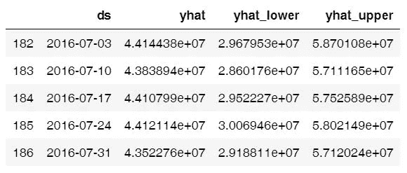

```
# Visualizing predicions of forecast
prophet.plot(forecast_2);
```

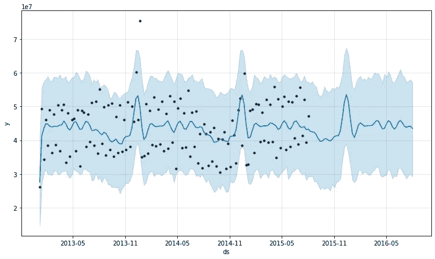

```
# Visualizing trend and seasonality components
prophet.plot_components(forecast_2);
```

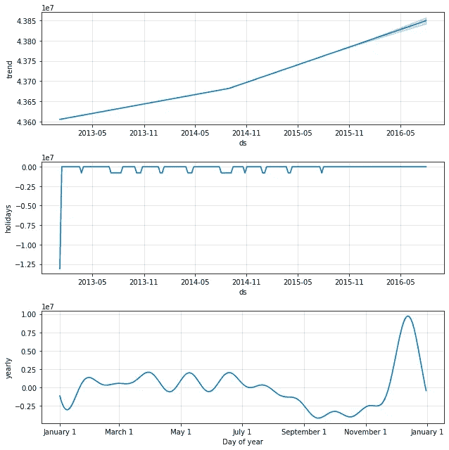

第一幅图显示每周的总销售额在增加。第二个图显示了数据集中的假期差距，第三个图显示了商店在 12 月最后一周的销售额非常高(因为圣诞节假期)。

```
# Checking the RMSE of Prophet model
metric_prophet_2 = forecast_2.set_index('ds')[['yhat']].join(ts_week_prophet_train.set_index('ds').y).reset_index()
metric_prophet_2.dropna(inplace=True)
rms_prophet_2 = mean_squared_error(metric_prophet_2.y, metric_prophet_2.yhat)
rms_prophet_2
```

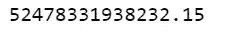

我们的基线 Prophet 模型使用默认参数，我们得到的 RMSE 为 53782649094881.14，经过超调后，我们得到的 RMSE 为 52478331938232.15。虽然最终的模型表现更好，但与 ARIMA 相比，它仍然表现不佳。那么，让我们试试另一种模式。

**模型 3: XGBoost**

XGBoost 是一个优化的分布式梯度增强库，设计为高度**高效**、**灵活**和**便携**。虽然它不是专门为时间序列数据设计的，但众所周知，它在各种回归问题上都表现得非常好。

```
# Dropping Customers and Sale per customer
ts_xgboost = train_store_joined.copy()
ts_xgboost = ts_xgboost.drop(['Customers', 'SalePerCustomer', 'PromoInterval'], axis=1)# Combining similar columns into one column and dropping old columns
ts_xgboost['CompetitionOpen'] = 12 * (ts_xgboost.Year - ts_xgboost.CompetitionOpenSinceYear) + (ts_xgboost.Month - ts_xgboost.CompetitionOpenSinceMonth)
ts_xgboost['PromoOpen'] = 12 * (ts_xgboost.Year - ts_xgboost.Promo2SinceYear) + (ts_xgboost.WeekOfYear - ts_xgboost.Promo2SinceWeek) / 4.0
ts_xgboost = ts_xgboost.drop(["CompetitionOpenSinceMonth", "CompetitionOpenSinceYear"], axis = 1)
ts_xgboost = ts_xgboost.drop(["Promo2SinceWeek", "Promo2SinceYear"], axis = 1)# Converting categorical cols to numerical cols and removing old cols
mappings = {0:0, "0": 0, "a": 1, "b": 1, "c": 1}
ts_xgboost["StateHoliday_cat"] = ts_xgboost["StateHoliday"].map(mappings)
ts_xgboost["StoreType_cat"] = ts_xgboost["StoreType"].map(mappings)
ts_xgboost["Assortment_cat"] = ts_xgboost["Assortment"].map(mappings)
ts_xgboost = ts_xgboost.drop(["StateHoliday", "StoreType", "Assortment"], axis = 1)# Splitting the data
features = ts_xgboost.drop(["Sales"], axis = 1)
target = ts_xgboost["Sales"]X_train, X_test, y_train, y_test = model_selection.train_test_split(features, target, test_size = 0.20)
```

**基线模型**

我们的基线(初始)模型将使用默认参数。让我们看看它的表现如何。

```
# Tuning parameters - using default metrics
params = {'max_depth':6, "booster": "gbtree", 'eta':0.3, 'objective':'reg:linear'}dtrain = xgb.DMatrix(X_train, y_train)
dtest = xgb.DMatrix(X_test, y_test)
watchlist = [(dtrain, 'train'), (dtest, 'eval')]# Training the model
xgboost = xgb.train(params, dtrain, 100, evals=watchlist,early_stopping_rounds= 100, verbose_eval=True)

# Making predictions
preds = xgboost.predict(dtest)
```

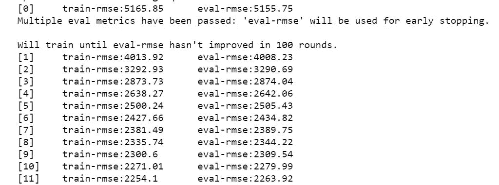

```
# RMSE of model
rms_xgboost = sqrt(mean_squared_error(y_test, preds))
print("Root Mean Squared Error for XGBoost:", rms_xgboost)
```

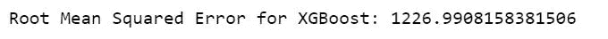

至少与 Prophet 相比，它的表现相当不错。让我们看看能否进一步降低 RMSE。

## XGBoost 的超调

现在，让我们尝试通过为 XGBoost 模型中的超参数传递不同的值来降低 XGBoost 的 RMSE。

*   **eta** :定义学习率，即梯度下降建模中学习数据的步长(XGBoost 的基础)。默认值为 0.3，但我们希望保持较低的学习速率，以避免过度拟合。所以，我们选择 0.2 作为 eta。
*   **max_depth** :一棵树的最大深度。默认值是 6，但我们希望我们的模型更复杂，并找到更好的预测。所以，让我们选择 10 作为最大深度。
*   **gamma** :在树的叶子节点上做进一步划分所需的最小损失减少。伽玛越大，算法就越保守。默认值是 0，让我们选择一个稍微高一点的值，以便得到好的预测。

```
# Tuning parameters
params_2 = {'max_depth':10, 'eta':0.1,  'gamma': 2}dtrain = xgb.DMatrix(X_train, y_train)
dtest = xgb.DMatrix(X_test, y_test)
watchlist = [(dtrain, 'train'), (dtest, 'eval')]# Training the model
xgboost_2 = xgb.train(params_2, dtrain, 100, evals=watchlist,early_stopping_rounds= 100, verbose_eval=True)

# Making predictions
preds_2 = xgboost_2.predict(dtest)
```

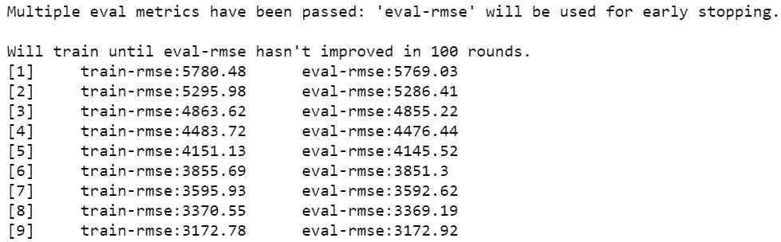

```
# RMSE of model
rms_xgboost_2 = sqrt(mean_squared_error(y_test, preds_2))
print("Root Mean Squared Error for XGBoost:", rms_xgboost_2)
```

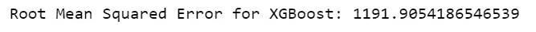

超调后，我们看到我们的模型的 RMSE 下降。让我们来看看什么特征会影响商店的销售。

```
# Let's see the feature importance
fig, ax = plt.subplots(figsize=(10,10))
xgb.plot_importance(xgboost_2, max_num_features=50, height=0.8, ax=ax)
plt.show()
```

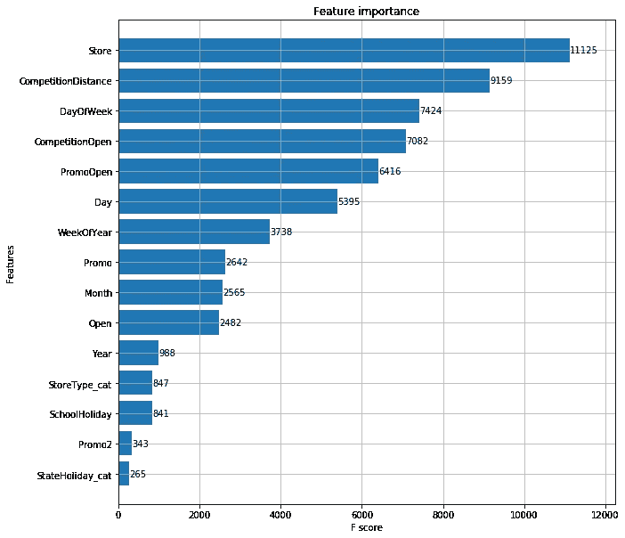

不出所料，影响商店销售的主要原因有五个，即。**商店数量、比赛距离、星期几、比赛开始和促销**。

我们最终的 XGBoost 模型在超调后是一个具有**“max _ depth”:10，“eta”:0.1，“gamma”:2 和 1191.90 的 RMSE 分数**的模型，非常棒！现在，让我们比较一下所有型号的性能

**3。结果**

我们使用均方根误差(RMSE)来评估和验证各种模型的性能。让我们看看哪个模型表现更好，为什么/为什么不。

```
# Comparing performance of above three models - through RMSE
rms_arima = format(float(rms_arima))
rms_prophet_2 = format(float(rms_prophet_2))
rms_xgboost_2 = format(float(rms_xgboost_2))model_errors = pd.DataFrame({
    "Model": ["SARIMA", "Prophet", "XGBoost"],
    "RMSE": [rms_arima, rms_prophet_2, rms_xgboost_2]
})model_errors.sort_values(by = "RMSE")
```

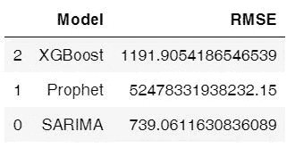

**4。型号对比&选择**

a)从上表我们可以看出，SARIMA 表现最好，其次是 XGBoost 和 Prophet。

b)这是有意义的，因为 SARIMA 是专门为季节性时间序列数据设计的，而 XGBoost 是一种通用的(尽管功能强大)机器学习方法，具有各种应用。

c) Prophet 是制作快速预测的好选择，因为它不需要很强的技术技能。这很容易大规模实施。它在这里表现不佳的原因可能是因为缺乏数据。它最适用于具有强烈季节效应的时间序列和几个季节的历史数据。Prophet 对缺失数据和趋势变化非常稳健，通常能够很好地处理异常值。

基于上述分析，我们将选择 ARIMA 作为我们预测销售的最终模型，因为它给我们的 RMSE 最小，并且非常适合我们预测时间序列季节性数据的需要。我们选择 **ARIMA(1，1，1)x(0，1，1，12)12** 与**AIC 1806.29 和 RMSE 739.06 作为最终参数组合。**

**5。结论**

**倒影**

*   数据中最有趣的是，销售额最高的商店类别并没有最高的每位顾客销售额。这可能是因为这些商店出售日常所需的小商品。
*   另一件有趣的事情是，第二次进行促销对增加销售额没有帮助。这可能是因为顾客在第一次促销活动中已经购买了他们想要的东西。

**致谢**

[https://machine learning mastery . com/ARIMA-for-time-series-forecasting-with-python/](https://machinelearningmastery.com/arima-for-time-series-forecasting-with-python/)

[https://www . digital ocean . com/community/tutorials/a-guide-to-time-series-forecasting-with-ARIMA-in-python-3](https://www.digitalocean.com/community/tutorials/a-guide-to-time-series-forecasting-with-arima-in-python-3)

[https://xgboost . readthedocs . io/en/latest/python/python _ intro . html](https://xgboost.readthedocs.io/en/latest/python/python_intro.html)

[https://facebook.github.io/prophet/docs/quick_start.html](https://facebook.github.io/prophet/docs/quick_start.html)

更多详情，请查看 Github 上的 [**源代码。**](https://github.com/bisman16/Kaggle_Rossmann_Store_Sales_Forecasting)

如果你喜欢阅读这个故事，请点击👏按钮并分享出来，帮助其他人学习机器学习。我很想听听你的想法，欢迎在下面留下你的评论。