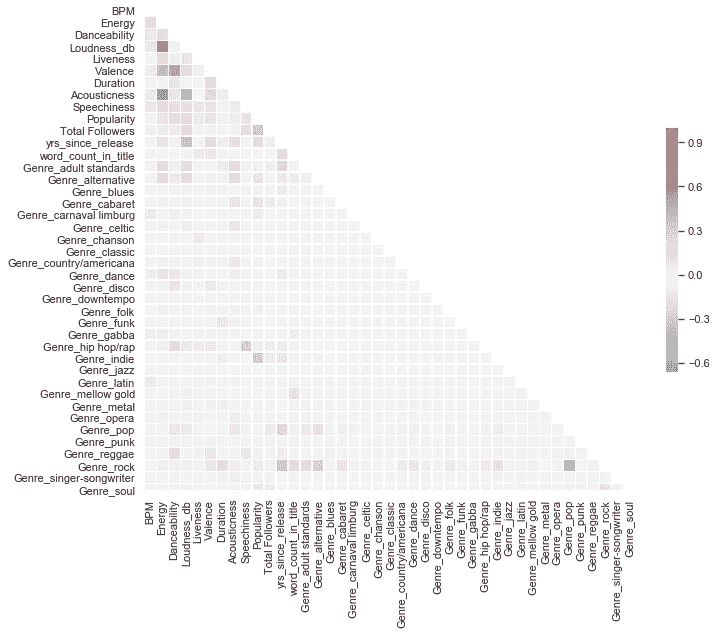
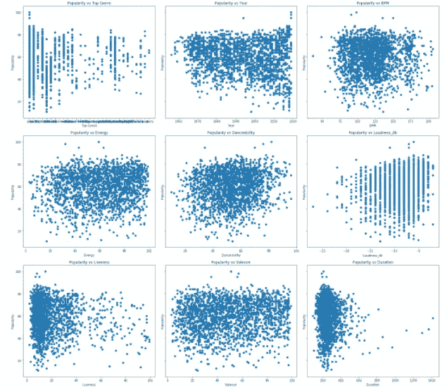
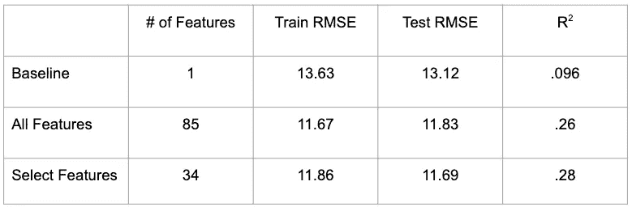

# 预测歌曲流行度

> 原文：<https://medium.com/analytics-vidhya/predicting-song-popularity-71bc3b067237?source=collection_archive---------9----------------------->

使用 Spotify 歌曲数据的线性回归项目

这个项目的想法是我最近在参加了一个 Zoom quarantine fun 之后想到的——一个 Zoom 便利音乐支架。一周前，每个参与者都被要求提名四首他们认为小组不知道但会喜欢的歌曲。所有的参与者花了一周的时间来听这些选择，并为每一组歌曲的投票做准备。剧透:我的歌没有走多远——那些我非常确定的歌，我自己一遍又一遍地听。我失败的选择让我试图理解歌曲的受欢迎程度是否可以预测，以及预测结果是什么样的。于是我开始寻求建立一个歌曲流行度的预测模型…

# 数据集

我开始从 Kaggle 获取包含 2000 首歌曲数据的 Spotify [数据集](https://www.kaggle.com/iamsumat/spotify-top-2000s-mega-dataset)。它包括我的目标变量，每首歌的流行度分数。它还包括我的大部分解释变量——音频特征，如 BPM、效价、响度和可跳舞性，以及更一般的特征，如流派、标题、艺术家和发行年份。我对我所有可能的功能都很满意，但作为一个狂热的 Spotify 用户，我知道 Spotify 会记录每个艺术家的粉丝数。我觉得这可以大大增加我对歌曲流行度的预测，所以我使用 python 向公共 Spotify API 发出 API 请求，以收集我所有歌曲的计数。

我合并了艺术家姓名的两个数据集，并开始使用熊猫清理建模数据。我的清洁要点是:

*   为追随者计数分配所有 nan(我的 API 请求大多成功，但我不得不手动查找并在少数情况下硬编码)
*   将 190 种“独特”类型整合到 30 种左右
*   为每个流派创建虚拟变量并删除原始流派列
*   删除标题和艺术家列
*   为每个标题中的总字数创建一个新功能(我认为这可能会有影响)
*   创建一个新功能来代替年份，“发布后的年份”

# EDA 和统计测试

我的过程的下一步是利用探索性数据分析和统计测试来进一步了解我的数据集。我用 matplotlib，seaborn 和 pandas 做 EDA。对于统计测试，我使用了 scipy 和 statsmodels。

在开始建模之前，我的目标是更深入地理解我的目标和特征变量之间的关系，以及更好地理解我的特征是如何相互关联的。

我所有变量的相关热图，用 Seaborn 绘制。

正如你从上面的热图中看到的，我的相关性在各个方面都很低。

展示不同特征和我的目标变量之间关系的散点图。

如上所示，我的每个特征和目标变量之间的关系在很大程度上是非线性的。我开始怀疑我需要转换我的变量，创造互动来处理非线性关系和低相关性。

# 特征工程—多项式变换

在我的 EDA 和运行基线线性回归模型后，我对我所有的歌曲音频特征应用了二次多项式变换。这创造了不同歌曲元素之间的互动，事后看来，这真的很有意义，因为它是组成歌曲的元素的组合。一首歌绝不仅仅是一个音频特征。

# 建模

我使用 statsmodels 和 scikit-learn 训练和测试了线性回归模型。

我的建模过程和缩小结果的快照。

对于我的第一个模型，我使用了一个看起来与流行度最相关的特征，艺术家追随者数量。我认为这个特性对受欢迎程度的影响最大。但是正如你在上面看到的，R 平方值为 0.09，这不是很有见地。

我运行的第二个模型使用了我所有的原始特征以及通过多项式变换创建的所有交互特征。它的表现明显更好。但是，由于 85 个要素与我的 2，000 个数据集的比例，我知道我需要减少我的要素，只包括那些真正有影响的要素，以避免多重共线性和过度拟合。

在测试了一些不同的选择方法，如 RFECV，VIF 和拉索。我的利用套索要素选择的模型表现最好，R 平方值为 0.28，我的解释变量缩小到 34。

# 结论

我的最终模型并不像我希望的那样具有预测性，只能解释歌曲流行度变化量的 28%。然而，在分析了我的系数之后，有几点需要注意。以下特征对受欢迎程度有最积极和最消极的影响。

最积极的:

*   自发布以来的年数
*   艺术家追随者计数
*   可跳舞性

最负面:

*   独立流派
*   声音和语音

# 最后的想法

总的来说，这是一个有趣且颇具洞察力的项目。为了提高我的模型的预测能力，我想进一步尝试多项式变换的次数，以找到更好的交互作用。我还想考虑可以添加到我的数据集中的其他解释变量。此外，探索更适合该数据集的其他类型的模型也是值得的。