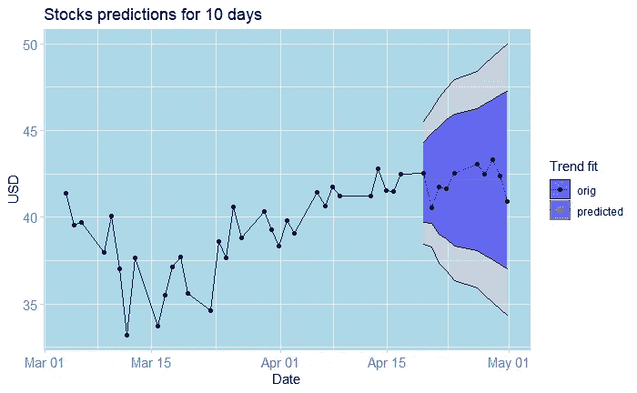

# 预测股票:不是小事！

> 原文：<https://medium.com/analytics-vidhya/predicting-stocks-not-a-trivial-matter-71cca28668f0?source=collection_archive---------4----------------------->

当然，你可能已经看过很多使用时间序列分析预测股市的教程。事实上，即使是领域专家也常常难以做出准确的预测。你应该想到的自然问题是“为什么预测股票这么难？”。作为一个小练习，我决定测试我的时间序列分析知识，并试图建立一个股票预测模型…