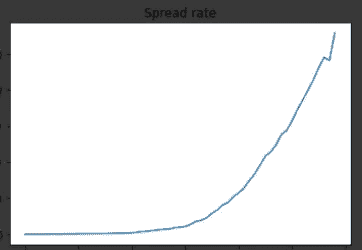
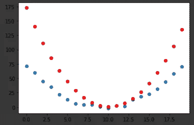
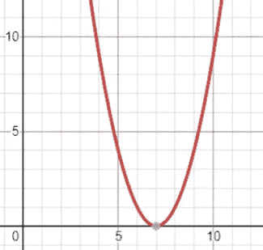
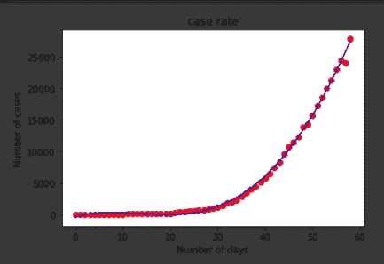

# 用数学预测 COVID 曲线的下降！

> 原文：<https://medium.com/analytics-vidhya/predicting-the-fall-of-covid-19-curve-with-math-aabd4b21615?source=collection_archive---------26----------------------->


[https://medium . com/@ ajaykumaar . AK/DIY-data-analysis-of-新冠肺炎-da6cd0c99cd8](/@ajaykumaar.ak/diy-data-analysis-of-covid-19-da6cd0c99cd8)



前一篇文章中的病毒传播图

如果你看了我以前的一篇关于绘制新冠肺炎相关图表的文章(上面的链接)，特别是日期和病例之间的图表，那么一个问题很自然地跃入脑海——如果我们可以绘制病毒传播的图表，如果它遵循一个趋势，我们可以推断出曲线何时可能变平或下降吗？

是的，使用数学，主要是微分，可以数学地预测曲线在什么时间点会变平或下降！(不要畏缩！继续阅读…)好消息是，即使你不是像我一样的数学爱好者，你仍然可以做到。你只需要知道导数是什么意思，它能做什么，PyTorch 会帮我们计算。

在处理 COVID 曲线之前，让我们先解决一个样本问题。我假设您的 Google Colab 实例已经安装了库并正在运行。

```
!pip install fastai2 -q
from fastai2.basics import *
from fastai2.tabular.all import *
```

让我们将“x”(时间)分配给一个从 1 到 20 的数字数组，将“y”(比如速度)分配给“x”的二次函数。“torch.randn()”函数随机生成 20 个数字。

```
x=torch.arange(0,20).*float*();x
y = torch.randn(20)*3 + 0.75*(x-9.5)**2 + 1
plt.scatter(x,y)
```

现在我们的样本数据已经准备好了，为了预测在任何给定时间点的“y ”,我们将随机考虑一条曲线，并试图修改或拟合该曲线，使其尽可能接近我们的实际曲线。毫不奇怪，这种技术被称为“曲线拟合”。我们将创建一个以“x”和几个常量(参数)作为输入的函数，并返回预测的 y 值。

```
*def* f(*t*,*params*):
  a,b,c=params 
  return a*((t-10)**2) + (b*(t-10)) + c
```

该方程可以是任何随机曲线方程，唯一的限制是它应该具有与我们的问题曲线相似的性质，即二次方程不能用于拟合三次曲线。你可以使用像[德斯莫斯](https://www.desmos.com/calculator)这样的图形计算器，想出不同的曲线，然后试着摆弄它们。

下一步是随机初始化参数(常量)并设置 requires_grad()，这告诉 PyTorch 我们将利用这些参数的导数。现在我们可以通过将 x(时间)和参数传递给我们假设的函数(f)来进行预测。

```
params=torch.randn(3).requires_grad_();params
preds=f(x,params);preds
```

现在，为了绘制我们的预测，我们将创建一个小函数，它利用 Matplotlib 并在同一个图中绘制我们的预测值和实际值。

```
*def* show_preds(*x*,*preds*,*targ*, *ax*=None):
  if ax is None: ax=plt.subplots()[1]
  ax.scatter(x,targ)
  ax.scatter(x,to_np(preds), color='red')show_preds(x,preds,y)
```



那是相当接近的！您的输出可能与此完全不同，因为参数是在每次执行代码时随机初始化的。

现在，我们需要一种方法来测量我们的曲线相对于实际曲线有多差(即测量误差)，从技术上来说，我们称之为“损失”。我们将创建一个函数，通过计算两条曲线之间的均方误差(MSE)来计算这两条曲线之间的损耗，这样做的函数被称为“损耗函数”，这并不奇怪。

```
*def* mse(*preds*,*target*):
  return ((preds-target)**2).mean()loss=mse(preds,y);loss
```

我损失了大约 1813，这取决于随机初始化的值。关键的部分来了！

既然我们知道我们的损失，我们必须找到一种方法来更新或改变我们的参数，使我们的损失最小化，这就是差异化发挥作用的地方。假设我们用一些神秘变量(ep)来描绘我们的损失，而这个图只是一个可爱的抛物线。



我们要做的就是找到我们损失最小的参数。有几种方法可以做到这一点，但最流行和最有效的方法是“牛顿-拉夫逊”法。有印象吗？

我们将通过对损失函数和 w.k.t .求导来做到这一点，函数的导数给出了某一点的斜率。因此，我们的任务简化为寻找斜率接近零的点，即损耗曲线的底部。我们将通过增加或减去参数的一小部分(微分)来实现这一点，我们所说的小部分取决于调用者的“学习率(lr)”值。这个过程被称为梯度下降(这是 NR 方法的一种改进)。

让我们付诸行动吧！

```
loss.backward()
params.grad
```

backward()属性计算损失函数的梯度(导数),可以通过对参数使用 grad()属性来访问这些值。现在让我们做第一步梯度下降(GD)。

```
lr=1e-05
params.data=params.data - (lr*params.grad.data)
params.grad=None
```

学习率(lr)是一个值，通常小于 0.1，它决定了我们在沿着损失曲线下降时的步长，即参数的数量将被减去或增加。在计算新的梯度之前，我们应该将梯度设置回零。

让我们根据修改后的参数再次进行预测，并计算损失。

```
preds=f(x,params)
loss=mse(preds,y)
loss
```

损失减少到了 1672 英镑，相当可观。现在让我们将所有这些代码行包装成一个函数，这样我们就可以循环遍历它们。

```
*def* fit(*x*,*y*,*params*,*print_loss*=True):
  preds=f(x,params)
  loss=mse(preds,y)
  if print_loss == True: print(loss)
  loss.backward()
  params.data=params.data - (lr*params.grad.data)
  params.grad=None
  return preds
```

让我们循环这个函数 50 次，这个数叫做 epoch，也就是我们的神秘变量(ep)！

```
for i in range(10):
  fit(x,y,params)
```

随着我们反复运行拟合函数，我们的损耗逐渐减少，并在某一点达到饱和。现在让我们看看我们通过在中间阶段绘图所做的改进。

```
_,axs = plt.subplots(1,4,figsize=(12,3))
for ax in axs:
  preds=fit(x,y,params,False)
  show_preds(x,preds,y,ax)
plt.tight_layout()
```

就是这样！我们已经创建了一个非常基本的模型，随着它的发展，从它的错误中学习。根据定义，这就是机器学习！-通过经验自动改进的算法。

现在让我们深入研究 COVID 曲线。我们刚刚做的梯度下降非常简单，因为我们的数据简单，在现实世界中，从头实现这一点将是一个痛苦的大脑。所以我们将使用这样的库。

让我们按照之前制作 COVID 图时的步骤准备好数据，直到我们创建了包含日期、病例、治愈和死亡的数据框。现在让我们将日期转换成表示天数的数字，这有助于我们的计算和包含病例数的数组。

```
date=array(ddf['Date'])
n_days=torch.arange(0,len(date)).*float*();
cases=array(ddf['Total Confirmed cases'])
cases=torch.tensor(cases)
cases=cases.*float*()plt.scatter(x=n_days,y=cases)
```

线性回归和多项式回归的唯一区别是我们假设的曲线函数。因此，我们将使用来自 sklearn 的多项式特征，转换我们的 x 值(n_days ),并使用线性回归进行拟合。

```
from sklearn.preprocessing import PolynomialFeatures
from sklearn.linear_model import LinearRegression
poly_feat=PolynomialFeatures(degree=4)
x=n_days.reshape(-1,1)
x_poly=poly_feat.fit_transform(x)
lin_reg=LinearRegression()
lin_reg.fit(x_poly,cases)
```

我们所做的只是假设一个 4 次曲线方程，重新调整 x 值以匹配预期的输入形状，将这些变换应用到我们的 x 值，最后用实际曲线拟合它。我们使用的 LinearRegression()算法增加了复杂的调整，如归一化、正则化和权重衰减，因此看起来比我们使用的基本方法复杂得多。它们不过是基本 GD 方程的即兴发挥。

现在让我们在实际曲线上画出我们的预测曲线。

```
*def* plot_pred():
  plt.scatter(x,cases,color='red')
  plt.plot(x, lin_reg.predict(poly_feat.fit_transform(x)),  color='blue')
  plt.ylabel('Number of cases')
  plt.xlabel('Number of days')
  plt.title('case rate')
  plt.show()
plot_pred()
```



完美契合！现在让我们创建一个进行预测的函数，从 60 天到 170 天循环一次，找到案例达到最大值和下降的点。

```
up_case=[]
for i in range(60,170):
  new=pred_case(i)
  up_case.append(new)
up_date=torch.arange(60,170)
plt.plot(up_date,up_case)max_case=array(up_case).max();max_case
up_case.index(max_case)
```

输出是 85，即从现在起 85 天后，病例数将开始下降。

顾名思义，这是一个纯粹基于数学的预测，并且严重依赖于条件保持不变直到第 170 天的假设。随着封锁等遏制措施的实施，局势的紧张程度可能会减轻。

你可以从下面的 GitHub 链接获得完整的代码，并查看杰瑞米·霍华德关于深度学习的课程，以了解更多关于 Fastai 的信息。

[](https://github.com/ajaykumaar/Deep-learning/blob/master/covid_curve_fit.ipynb) [## ajaykumaar/深度学习

### permalink dissolve GitHub 是 4000 多万开发人员的家园，他们一起工作来托管和审查代码，管理…

github.com](https://github.com/ajaykumaar/Deep-learning/blob/master/covid_curve_fit.ipynb) 

谢谢，继续学习；)