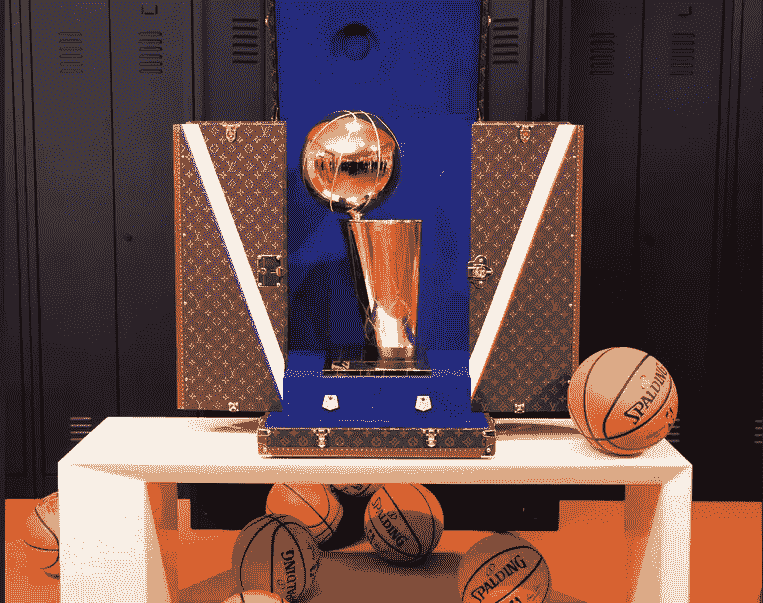
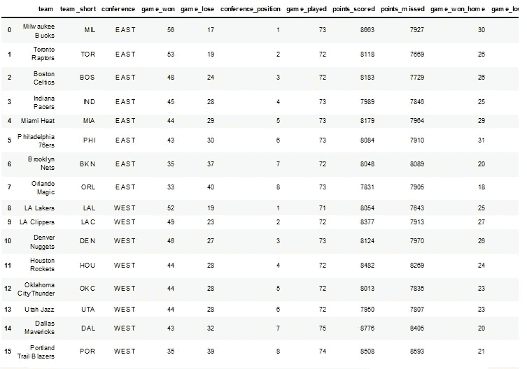
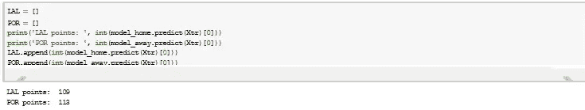
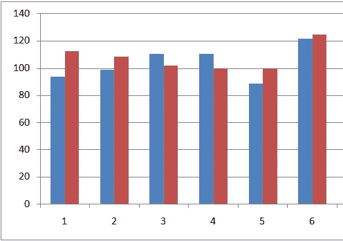
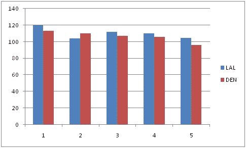
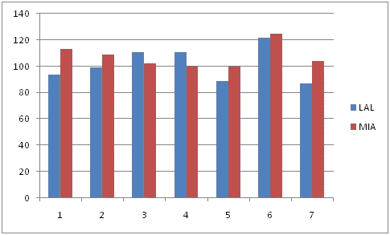
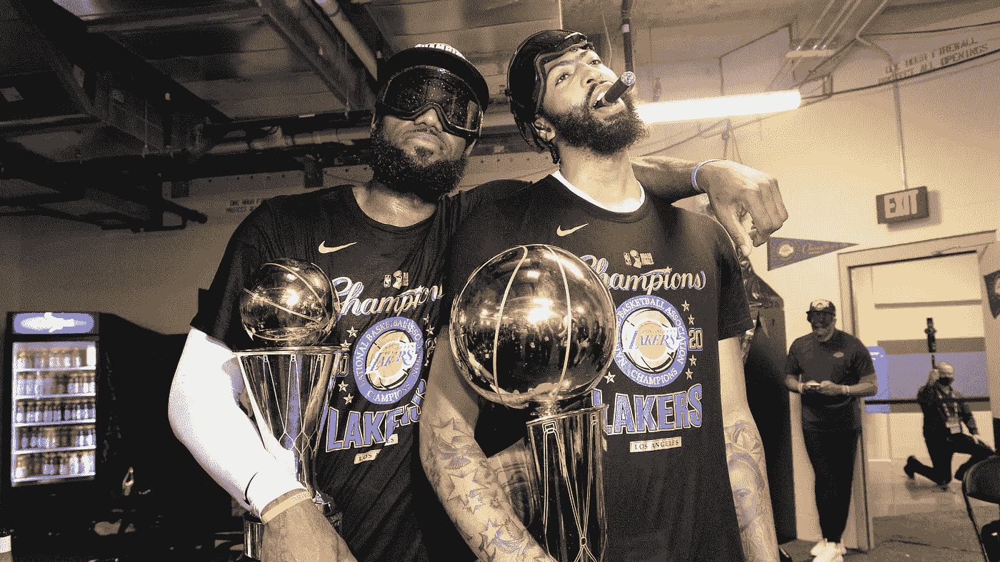

# 预测湖人 2020 年 NBA 总冠军之路？决策树回归方法

> 原文：<https://medium.com/analytics-vidhya/predicting-the-lakers-path-to-the-2020-nba-championship-a-decision-tree-regressor-approach-cfae66c7aebc?source=collection_archive---------22----------------------->

2020 年拉里·奥布赖恩奖杯

考虑到联盟经历的权力转移，2020 年 NBA 赛季是一个备受期待的赛季。科怀·伦纳德和保罗·乔治搬到了洛杉矶，戴维斯和勒布朗联手，迎来了充满活力的一年。凯文·杜兰特离开勇士队，加上飞溅兄弟的受伤意味着西部是可以接受的，拉里奥布赖恩唯一的另一个障碍是雄鹿队。作为一名数据科学家，我喜欢学习将这些奇妙的概念运用到我喜欢的游戏中。我使用的模型是一个决策树回归器，用来获取季后赛每场比赛的分数。所用数据来自篮球参考。

我模拟了整个季后赛，我考虑的因素是球队的排名，主客场胜率，每场比赛的分数和其他一些重要的考虑因素。我得到的预测主队和客场比分的均方根误差分别是 18.33 和 7.8。

进入季后赛的球队

我从模拟西部联盟的第一轮开始，让我惊讶的是波特兰赢了第一场比赛。

多拉夫人一定是疯了

发布这个 POR 设法推动洛杉矶到 6 场比赛！

红色，蓝色

当我进一步预测西部决赛时，我惊讶地看到，模型预测这将是一个 5 场比赛的系列赛，洛杉矶将 3-1 领先，贾马尔和乔基奇的英雄主义不会从洛杉矶的庞然大物中拯救掘金队。

我最终得到的 NBA 总决赛预测如下图所示:

我们都知道今年的决赛结果如何，我们的国王获得了他的第四个冠军，吉米和船员们有着惊人的表现。预测吉米·巴特勒和热火队将在 7 场 NBA 总决赛中获胜的模型证明了迈阿密队的辉煌以及他们如何在 2020 年取得如此大的成就。我等不及 2021 赛季了，我希望热火队能赢回来！(然而，我的钱是在来自东部的网上)。我从这个小项目中获得了很多乐趣！也许下次我会试着预测 2021 赛季的排名！

