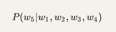

# 预测下一个印地语单词..

> 原文：<https://medium.com/analytics-vidhya/predicting-the-next-hindi-words-de58541fbbcf?source=collection_archive---------15----------------------->

## 从头构建一个印地语语言模型来预测接下来的几个单词。


照片由 [Aaron Burden](https://unsplash.com/@aaronburden?utm_source=unsplash&utm_medium=referral&utm_content=creditCopyText) 在 [Unsplash](https://unsplash.com/s/photos/write-words?utm_source=unsplash&utm_medium=referral&utm_content=creditCopyText)

在进入预测之前，让我们了解什么是迁移学习以及它如何改变深度学习生态系统。

# 那么什么是迁移学习呢？

> 迁移学习是一种机器学习方法，其中为一项任务开发的模型被重新用作第二项任务模型的起点。

简单地说，它将来自一个领域和任务的先验知识运用到不同的领域和任务中。幸运的是，我们有各种这样的模型，它们具有关于语言及其语义的先验知识，所以我们将只使用那些(有知识的)模型，并看看它们如何执行我们手头的任务(这里检查语法)。

# 我们印度语言的迁移学习呢？

印度在文化和语言方面有巨大的多样性，印度讲大约 **780 种语言**。因此，当谈到 NLP 时，尤其是在迁移学习中，是时候超越英语了。

英语有各种预先训练的模型，它们表现得像奇迹一样，但当涉及到其他印度语言时，就不太一样了。

因此，这里我们将为印地语从头构建一个 ***语言模型*** ，并且可以进一步用于任何其他语言，使用该语言的[维基百科数据集](https://meta.wikimedia.org/wiki/List_of_Wikipedias)。这种语言模型可以进一步用于任何其他 NLP 任务，如分类、摘要等。

# 等等，我们知道什么是语言模型吗？

语言模型(LMs)估计不同短语的相对可能性。

简单地说，概率语言建模的目标是计算单词序列的句子的概率:


并且可以用于找到序列中下一个单词的概率:



计算其中任何一个的模型被称为**语言模型**。在这里，我们的语言模型将读取北印度语的维基百科语料库，IMDB 查看数据集以理解该语言及其语义，然后根据其理解最终预测接下来的几个单词。

目前语言建模的领军人物有: **BERT，XLNET，Open AI 的 GPT，FastAi 的 ULMFiT。**

# 我们选择谁？

在这里，我们将使用 FastAi 的 ULMFiT，因为从头开始训练需要的资源较少，它提供了很好的结果，并且它有一个很好的[文档](https://www.fast.ai/2019/07/08/fastai-nlp/)，它清楚地解释了如何解决我们手头的问题。

ULMFiT 代表文本分类的通用语言模型微调，这是由[杰瑞米·霍华德](https://en.wikipedia.org/wiki/Jeremy_Howard_(entrepreneur))和[塞巴斯蒂安·鲁德](http://ruder.io/)引入的一项技术。它与众不同的几个特点是:

*   区别微调
*   倾斜三角形学习率
*   逐步解冻

在这里，我们不会深入研究每一个功能，并继续构建和使用我们的模型，但要获得关于 ULMFiT 的详细解释，您可以浏览[这篇](https://arxiv.org/abs/1801.06146)文章。

# 让我们现在进入正题..


不，不是这件事..(图片由 [Igor Ovsyannykov](https://pixabay.com/users/igorovsyannykov-6222956/?utm_source=link-attribution&utm_medium=referral&utm_campaign=image&utm_content=3170020) 来自 [Pixabay](https://pixabay.com/?utm_source=link-attribution&utm_medium=referral&utm_campaign=image&utm_content=3170020) )


是的，我就是这个意思..😉(照片由[丹尼尔·里卡洛斯](https://unsplash.com/@ricaros?utm_source=unsplash&utm_medium=referral&utm_content=creditCopyText)在 [Unsplash](https://unsplash.com/s/photos/coding?utm_source=unsplash&utm_medium=referral&utm_content=creditCopyText) 上拍摄)

首先，让我们安装 fastai。

```
from fastai import *
from fastai.text import *
```

下面的代码将创建一个`hiwiki`文件夹，其中包含一个包含维基百科内容的`hiwiki`文本文件。(对于其他语言，用维基百科的[列表中的适当代码替换`hi`。)](https://meta.wikimedia.org/wiki/List_of_Wikipedias)

```
lang = 'hi'name = f'**{lang}**wiki' path = data_path/name path.mkdir(exist_ok=**True**, parents=**True**) lm_fns = [f'**{lang}**_wt', f'**{lang}**_wt_vocab']
```

然后我们将创建助手函数`get_wiki`和`split_wiki`来下载印地语维基百科数据集并对其进行预处理。

```
get_wiki(path,lang)
```

现在，让我们使用下载的维基数据创建一个预训练模型:

```
data = (TextList.from_folder(dest)
            .split_by_rand_pct(0.1, seed=42)
            .label_for_lm()           
            .databunch(bs=bs, num_workers=1))

data.save(f'**{lang}**_databunch')len(data.vocab.itos),len(data.train_ds)data = load_data(path, f'**{lang}**_databunch', bs=bs)
```

接下来，我们将创建我们的语言模型:

```
learn = language_model_learner(data, AWD_LSTM, drop_mult=0.5, pretrained=**False**).to_fp16()
```

在设定了我们的学习速度、批量和解冻我们的语言模型之后，让我们开始我们的(长期)训练。

```
lr = 1e-2lr *= bs/48  *# Scale learning rate by batch size*learn.unfreeze()learn.fit_one_cycle(10, lr, moms=(0.8,0.7))
```

训练可能需要一些时间，因为我们正在使用一个巨大的语料库(维基百科)从头开始训练一个语言模型。

现在，让我们保存预训练的模型和 vocab(最好保存在我们的磁盘或 Google drive 中，以避免每次长时间的训练)。

```
mdl_path = path/'models'mdl_path.mkdir(exist_ok=**True**)learn.to_fp32().save(mdl_path/lm_fns[0], with_opt=**False**)learn.data.vocab.save(mdl_path/(lm_fns[1] + '.pkl'))
```

现在我们的语言模型`learn`在学习了印地语之后，已经可以根据印地语-维基百科的数据进行预测了。

```
learn.predict("मैं तुम्हें", n_words=5)'मैं तुम्हें पसंद नहीं है लेकिन मैं'
```

但是让我们通过输入更多的印地语数据集来提高它对印地语的理解，因此我们将使用 [imdb 印地语评论数据集](https://www.kaggle.com/disisbig/hindi-movie-reviews-dataset)来进一步训练它。

```
train_df = pd.read_csv('path/to/file/train.csv')test_df = pd.read_csv('path/to/file/valid.csv')df = pd.concat([train_df,test_df], sort=False)
```

让我们准备数据并构建另一个语言模型，该模型根据新的 imdb 数据进行了微调。

```
data_lm = (TextList.from_df(df, path,      cols='text').split_by_rand_pct(0.1, seed=42).label_for_lm().databunch(bs=bs, num_workers=1))learn_lm = language_model_learner(data_lm, arch=AWD_LSTM,  drop_mult=0.3,pretrained_fnames=lm_fns, pretrained=False)
```

因此，我们的新语言模型`learn_lm`已经准备好对 imdb 数据进行微调，现在我们需要训练它。首先，只有最后一层，然后在整个网络上解冻它。(我们也可以玩玩纪元的数量，也可以在这里使用逐步解冻)。

```
learn_lm.fit_one_cycle(2, lr*10, moms=(0.8,0.7))learn_lm.unfreeze()learn_lm.fit_one_cycle(8, lr, moms=(0.8,0.7))
```

现在，在对我们的模型进行微调之后，它对印地语的语义有了更好的理解。我们来玩一下，这里`n_words`是我们要预测的数字:

```
learn_lm.predict("मैं तुम्हें", n_words=5)'मैं तुम्हें लंका में आने के लिए'
```

另一种尝试:

```
learn_lm.predict("मुझे फिल्म ", n_words=10)'मुझे फिल्म  में राहत नहीं मिली है । कुछ होना बेकार है'
```

所以最终我们有了一个预测器，可以很好地预测下一个印地语单词。我们也可以使用其他印地语语料库来训练它，提高它对语言的理解。

# 好了，让我们结束吧..

在这里，我们从维基百科的印地语数据集构建了一个语言模型，并在 imdb 数据集上对其进行了微调。类似地，我们可以为任何其他语言建立语言模型，只需使用该语言的 wiki 语言代码，并遵循相同的过程。

我们也可以尝试使用 BERT 和 XLNET 构建类似的模型，但是构建模型的时间可能会显著增加(如果我们从头开始构建的话)。

我们还可以使用各种其他印地语数据集来微调我们的模型，这将使我们的模型更好地理解语言，并更好地预测。

# 参考资料:

1.  Fast.ai 文档[https://docs.fast.ai/](https://docs.fast.ai/)
2.  Fast.ai 教程[https://www.fast.ai/2019/07/08/fastai-nlp/](https://www.fast.ai/2019/07/08/fastai-nlp/)