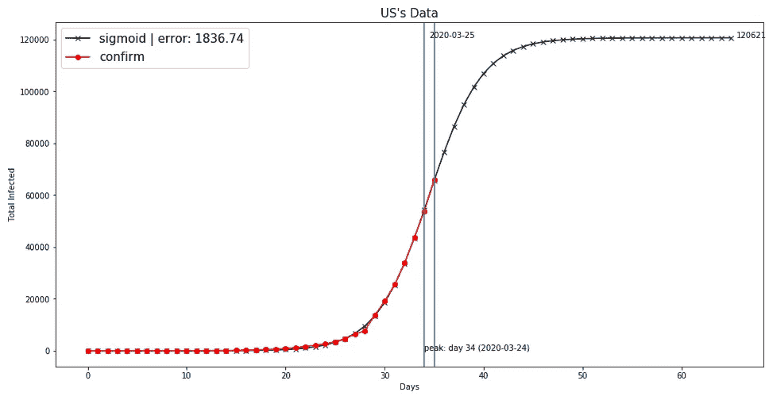
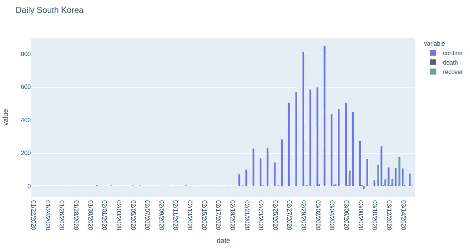
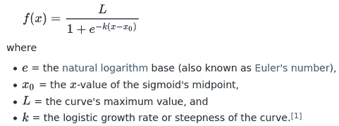
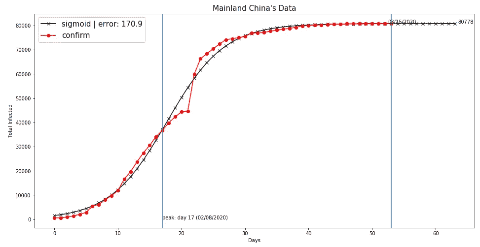
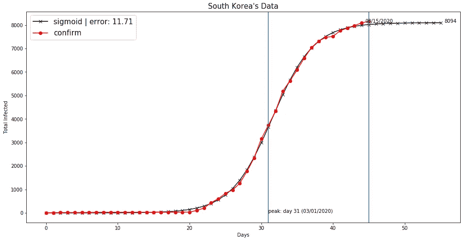
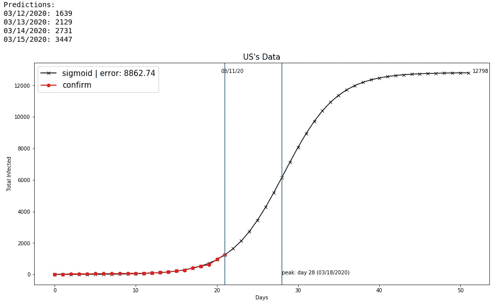

# 预测新冠肺炎冠状病毒在美国的传播(实时更新)

> 原文：<https://medium.com/analytics-vidhya/predicting-the-spread-of-covid-19-coronavirus-in-us-daily-updates-4de238ad8c26?source=collection_archive---------0----------------------->

**2020 年 3 月 27 日更新**

经过 3 天相当准确的预测，昨天一切都出错了，完全偏离了主要由纽约州报告病例激增引起的模型。有趣的是，3 月 22 日的 4 天预测要准确得多。此外，有一段时间我说过我们将在 3 月 26 日通过 8 万个案例。

在这一点上，我再次对当前的公式信心不足，需要等待几天才能看到它的走向，但以防万一，这里是我们即将到来的预测:

03/27:97470
03/28:111968
03/29:125293
高峰日 3/26，最高病例数 178622

**2020 年 3 月 26 日更新**

从统计学的角度来看，现在情况看起来太好了。3 月 25 日，美国确诊病例总数为 65，778 例，比我前一天的预测多 1.8%，比 2 天的预测少 2.8%。该模型指出高峰日有时在 24 日和 25 日之间，所以我仍在等待，看看新病例的数量是否开始下降。



与昨天相比，估计值只是稍微高了一点，但逻辑函数方程没有太大变化。以下是今天的预测:

03/26:76503
03/27:86392
03/28:94812
高峰日 3/24，最多 120621 例

**2020 年 3 月 25 日更新**

昨天又是一个很小的错误，53，740 例与预测的 55，285 例相比(-2.8%)。确信逻辑函数参数是正确的(特别是当误差降低时)，并且扩展测试不会再有任何意外，因为看起来[美国已经测试得相当好了](https://www.foxnews.com/politics/us-was-most-prepared-country-in-the-world-for-pandemics-johns-hopkins-study-found-in-2019?fbclid=IwAR0NY3-slqLZ8UA7S5xtVWgZ6xbcjuQEkLVfsFx8l_ccBjPX53Q_29e9NWU)。稍微低于预测值的数据意味着高峰日可能会更早，最早在今天或明天，然后曲线开始变平(只要我们继续对抗病毒——这就是 Verhulst 理论的内容)。

今天的模型显示，我们正处于新报告病例的高峰日(尽管准确的高峰很难定义，可能是正负 2 天)，未来 4 天的预测是:

03/25:64602(实际:65778，**误差:+1.8%**)
03/26:74668
03/27:83536
高峰日 3/24，最大病例数 111967

观察接下来几天会发生什么，以及预测模型是否仍然成立，这非常重要。如果是的话，那么这是一个非常好的消息。

**2020 年 3 月 24 日更新**

嗯，有一天我说我对模型预测没有信心，这是对的！美国 43667 例确诊病例，微小误差仅为 0.4%！回顾我昨天提到的 3 种可能的情况，这指向了第二种:增长曲线接近峰值，并将很快开始变平。现在我们进入了一个非常好的模式，函数的误差正在显著下降。

因此，目前的预测是:

03/24:55285(实:55285；**误差:-2.8%**)
**03/25:67760(实际:65778，误差:-2.9%) —预测高峰日**
03/26:80334(实际:83836，误差:+4.3%)
高峰日 3/25，最大 138493

如果这种情况再持续一两天，就意味着我们正在走出困境。没错，美国病例总数将增加一倍以上，但增长率将在 3 月 25 日之后开始放缓。第 35 天达到峰值也与其他国家的情况一致。这并不意味着这个周末我们应该跑出去拥抱每个人。我们必须继续做我们一直在做的事情，直到 sigmoid 函数艰难地转向平坦，在这种情况下，这意味着直到 4 月 10 日左右。

**2020 年 3 月 23 日更新**

病例数可疑地低于预测，少了 6.7%，所以有 3 种可能的解释。测试在周末有所松懈，这就是为什么报告的案例少了。
2。增长曲线开始变平，不久新病例将开始下降。
3。增长仍处于早期阶段，并将很快加速。
今天不做任何自信的预测，等待明天的更新。如果我选择模型显示的数字，那就是 43870。

**2020 年 3 月 22 日更新**

首先，感谢 [Analytics Vidhya](https://medium.com/analytics-vidhya) 接我的故事！现在…昨天我不得不对 SciPy 曲线拟合函数的边界参数做了一些修改，得到了一个更加精确的预测！对 3 月 21 日的估计完全在我期望的范围内(误差为+/- 5%)。美国有 25493 例确诊病例，比我预测的 26505 例少了 3.8%。自从我们昨天进行估算以来，这个模型现在预测的数值稍微低了一些。病例总数保持不变，但高峰日被推迟到 3 月 29 日。

03/22: 35，676
03/23: 49，013
03/24: 66，561
高峰日 3/29，最多 463，772 例

**2020 年 3 月 21 日更新**

我无法在几天内做出任何有信心的预测，因为数据不是很一致(主要是由于测试增加，但也有一些数据报告不规则)。到目前为止，我认为它的状态要好得多。我还使用了一个[不同的数据源](https://www.kaggle.com/gpreda/coronavirus-2019ncov)来获取约翰霍普金斯大学的数据，这些数据更新得更频繁。因此，根据截至 3 月 20 日的数据，我们对确诊病例的预测是:

03/21:26505(实际:25493，误差-3.8%)
03/22:37068
03/23:51348
高峰日 3/28，最大案例数 464773

根据增加的测试，如果实际数字比模型预测的高 2-5 %,我不会感到惊讶。

**2020 年 3 月 18 日更新**

在第一次预测相当准确(在地面事实的 2%以内)后，在**美国**增加的测试改变了确认的病例数，并影响了先前的预测。我需要几天的时间，让扭曲的数据形成一个新的模式，但使用截至 2020 年 3 月 17 日的数据，该模型预测如下:

3 月 18 日星期三:8271 例确诊病例
3 月 19 日星期四:10612 例

**数据概述**

我会尽量简短，并随着数据的不断到来，为每日更新留出空间。这一切都是从我看由世界计量仪整理的新冠肺炎图表开始的。数据仍然非常有限，因为疫情大约 2 个月前才开始。前两个似乎经历了整个进化周期的国家是中国和韩国，它们是仅有的两个可以被认为是训练数据的数据集。这对于一个机器学习算法来说还不够，只是简单的老式视觉推理。以下是他们每日新增病例的原始数据:



看到图案了吗？请记住，中国在 2 月 13 日出现了异常情况，一个地区以前未报告的数据在同一天全部被转储，因此峰值必须分布在前几天。

**在逻辑函数上拟合曲线**

但在我看来，这一切都是因为总数可以用逻辑函数[来近似，逻辑函数](https://en.wikipedia.org/wiki/Logistic_function)是一种用于在逻辑回归中分配概率的 sigmoid 函数。该函数由以下公式定义:



所以我试着用中国和韩国的冠状病毒病例总数来拟合。我使用了可在 [Kaggle](https://www.kaggle.com/sudalairajkumar/novel-corona-virus-2019-dataset) 上获得的数据集，该数据集来源于[约翰霍普金斯大学](https://coronavirus.jhu.edu/map.html)发布的官方数据。你猜怎么着？几乎是完美契合！



如你所见，它甚至消除了中国的异常。为什么这么贴合？这是因为逻辑函数是一种常见的人口增长模型，最初由 Pierre-Fran ois Verhulst 于 1838 年提出，用于描述生物种群的自限性增长。这种病毒是一种生物种群，它受到人体对它的反应以及社区抗击疫情的限制。换句话说，这种疾病是自然发展的。

**2020 年 3 月 11 日的初步预测**

我在 3 月 11 日第一次尝试这样做，以下是我对美国案例的预测。查看它与 Covid19 数据的吻合程度:



第一次运行这个程序时，我认为这个预测是零。这是对的吗？错了？以下是美国首次冠状病毒预测的结果。第一个数字是程序的预测，第二个数字是实数，误差为:

3/12:1639 | 1663(+1.4%)
3/13:2129 | 2179(+2.3%)
3/14:2731 | 2726(-1.8%)
3/15:3447 | 3499(+1.5%)
峰值日:3/18，最大 12809

这个模拟有很大的问题。美国的数据集仍然很小。很多人没有接受检测，所以一旦检测变得更加普遍，确诊病例的数量可能会激增。这将导致类似于 2 月 13 日在中国发生的异常现象。但是逻辑函数将仍然适用于它，只是它将在时间上被推得更高和更长。

这就是为什么我会继续每天运行这个，并在这里发布结果，这样我们就可以跟踪精确度和曲线的估计形状。如果你想在家里运行它，这里是我用 Python 写的代码片段，用 Matplotlib 做图形，用 SciPy 做曲线拟合。我建议像我一样把这个放进木星笔记本，这样更快更容易可视化。

```
import numpy as np
import pandas as pd
import matplotlib.pyplot as plt
import plotly.express as px
from scipy.optimize import curve_fit
from datetime import datetime, timedeltadata=pd.read_csv("covid_19_data.csv")
data=data.drop('Last Update', axis=1)
data=data.drop("SNo",axis=1)
data=data.rename(columns={"ObservationDate": "date", "Country/Region": "country", "Province/State": "state","Confirmed":"confirm","Deaths": "death","Recovered":"recover"})def plot_predict(country, stat, future_days):
    def avg_err(pcov):
        return np.round(np.sqrt(np.diag(pcov)).mean(), 2) # function to be minimized
    def f_sigmoid(x, a, b, c):
        # a = sigmoid midpoint
        # b = curve steepness (logistic growth)
        # c = max value
        return (c / (1 + np.exp(-b*(x-a))))

    inception = 0
    # hardcoding day 0 for several countries based on observations
    if country=="South Korea": inception = 8
    if country=="US": inception = 28
    if country=="Italy": inception = 20
    country_data = data[data["country"]==country].iloc[: , [0, 2, 3 ,4, 5]].copy()
    country_graph = country_data.groupby("date")[['confirm', 'death', 'recover']].sum().reset_index()[inception:]
    y = country_graph[stat]
    x = np.arange(len(y))

    # fitting the data on the logistic function
    popt_sig, pcov_sig = curve_fit(f_sigmoid, x, y, method='dogbox', bounds=([12., 0.001, y.mean()],[60., 2.5, 10*y.max()]))
    print(popt_sig)
    peakday = datetime.strftime(datetime.strptime(country_graph["date"][inception], "%m/%d/%Y")+timedelta(days=int(popt_sig[0])), "%m/%d/%Y")
    plt.figure(figsize=(16,8))

    x_m = np.arange(len(y)+future_days)
    y_m = f_sigmoid(x_m, *popt_sig) print("Predictions:")
    for i in range(1,5):
        pday = datetime.strftime(datetime.strptime(country_graph["date"][inception], "%m/%d/%Y")+timedelta(days=len(y)+i-1), "%m/%d/%Y")
        print("%s: %d" % (pday, y_m[len(y)+i-1]))
    #print(country_graph)

    # creating the matplotlib visualization
    plt.plot(x_m, y_m, c='k', marker="x", label="sigmoid | error: "+str(avg_err(pcov_sig))) 
    plt.text(x_m[-1]+.5, y_m[-1], str(int(y_m[-1])), size = 10)

    plt.plot(x, y, c='r', marker="o", label = stat) plt.xlabel("Days")
    plt.ylabel("Total Infected")
    plt.legend(prop={'size': 15})
    plt.title(country+"'s Data", size=15)
    plt.axvline(x[-1])
    plt.text(x[-1]-.5, y_m[-1], str(country_graph["date"][len(y)+inception-1]), size = 10)
    plt.axvline(int(popt_sig[0]))
    plt.text(int(popt_sig[0]), 1, "peak: day " + str(int(popt_sig[0])) + " (" + peakday + ")", size = 10)
    plt.show()# See the results for different countries
#plot_predict("Mainland China", "confirm", 10)
#plot_predict("South Korea", "confirm", 10)
plot_predict("US", "confirm", 30)
```

其工作方式是通过最小化标准 sigmoid 函数的误差，同时使用从中国和韩国数据(在`curve_fit`的`bounds`参数中定义)中学到的一些约束。我还设置了每个国家流行病的初始数据，以便曲线拟合得更好(通过检查每天的病例，看它从哪里开始增长)。

**结论**

虽然我不是医学专家，只是一名数据科学家和软件开发人员，但如果数学成立，那么该病毒的长期威胁并不像媒体描述的那样糟糕。中国在 17 天后达到峰值(这可能是由于报告异常而造成的)，韩国在 31 天后达到峰值。冠状病毒的生长遵循逻辑斯蒂模型，在高峰日之前呈对称指数增长，之后呈对数平缓增长。如果美国也是如此，我们应该会在 4 月中旬有所好转。我不确定实施隔离措施会在多大程度上影响曲线变平的时间(正如 Verhulst 理论所暗示的)。

美国的大考验将在 3 月 18 日至 20 日左右，看看是否真的出现了最大的逻辑增长，曲线是否会变平。这可能会受到测试范围扩大的影响，但我相信这种模式会持续下去。

保持每天回顾这个故事，因为我会尽可能地更新我的预测，就像约翰霍普金斯大学公布他们昨晚的数据一样。