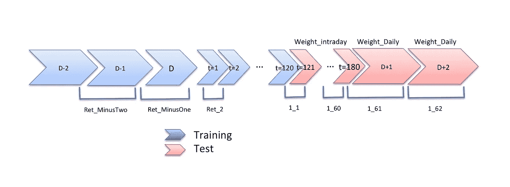

# 使用机器学习和深度学习预测股票

> 原文：<https://medium.com/analytics-vidhya/predicting-the-stocks-using-machine-learning-and-deep-learning-dba27a96fcdf?source=collection_archive---------11----------------------->

股票或股份是合作社所有权分成的部分。一只股票代表合作的部分所有权，将有数字所有权，而不是物理所有权。

在这里我想分享一下我是如何使用机器学习和深度学习算法用于[温顿股市挑战](https://www.kaggle.com/c/the-winton-stock-market-challenge/overview)的。

鉴于过去几天的历史，挑战在于预测一只股票的回报。老实说，我们只是预测未来的股票，所以根据给定的数据，我们试图预测股票是上涨还是下跌。可能有几个外部因素在实时中发挥作用，但我们试图使它尽可能接近实时。

# 数据解释:

给定数据的可视化表示

如何计算这些回报是由 Winton 定义的，不会在本次比赛中向我们透露。我们将拥有前 2 天(D-2，D-1)的股票价值和当天的 120 个收益，在当天的一分钟内，我们需要预测接下来的 60 个收益和 D+1，D+2 个收益。

股票市场回报是投资者从股票市场获得的回报。这种回报可以是通过交易获得的利润，也可以是公司不时给予股东的股息。在这场比赛中，有两种类型的回报是日内和每日回报。

# 什么是日内回报和日内回报？

日内回报是股票日总回报的两个组成部分之一。日内回报衡量股票在正常交易时间内产生的回报，基于其从交易日开盘到收盘的价格变化。日内回报率和[隔夜回报率](https://www.investopedia.com/terms/o/overnight-position.asp)共同构成了一只股票的日总回报率，该回报率基于股票从一个交易日收盘到下一个交易日收盘的价格变化。它也被称为白天返回。

## 度量:

本次竞赛的参赛作品将根据预测股票价值和实际股票价值之间的加权平均绝对误差进行评判。

## **提交文件格式:**

提交文件应该包含两列:Id 和预测。对于每个 5 天的窗口，我们需要预测 62 个回报。例如，如果第一个时间窗口，我们预测为 1_1、1_2 至 1_62，其中 1_1 至 1_60 预测 Ret_121 至 Ret_180，1_61 预测 Ret_PlusOne，1_62 预测 Ret_PlusTwo。

该文件应包含一个标题，并具有以下格式:

提交文件格式

## **理解数据**给定**和待预测:**

正如我们所看到的，给定的数据是一个时间序列数据，给定的数据有许多空值，所以用特定列的平均值填充它们。

历史输入和目标变量的可视化表示

在特定行的训练数据中，我们在训练数据中有 211 个特征。

*   25 个与预测相关的不同特征，其细节在竞赛中没有提及，其中大部分是空值。
*   Ret_MinusTwo，Ret_MinusOne 分别是从 D-2 日收盘到 D-1 日收盘的收益和从 D-1 日收盘到 D 日(约 1/2 日)日内收益开始点的收益。
*   Ret_2 至 Ret_120 是第 d 天大约一分钟内的回报率。Ret_2 是 t=1 至 t=2 之间的回报率。
*   权重 _ 日内是用于评估日内回报预测 Ret 121 至 180 的权重
*   Weight_Daily 是用于评估每日回报预测的权重(Ret_PlusOne 和 Ret_PlusTwo)。

目标变量:

*   Ret_121 至 Ret_180 是 d 日大约一分钟内的日内回报。这些是提交时需要预测为{ id } _ { 1–60 }的目标变量。
*   Ret_PlusOne 是从 D 日测量 Ret_180 时到 D+1 日交易结束时的回报率。(大约 1 天)。这是一个需要预测为{id}_61 的目标变量。
*   Ret_PlusTwo 是 D+1 日收盘到 D+2 日(即 1 日)收盘的收益这是一个你需要预测为{id}_62 的目标变量。

## **探索性数据分析:**

1.  我检查了给定数据中的 Nan 值，特征 1 具有大部分的 NaN 值，在 40，000 个 NaN 值中有 33，313 个。

NaN 值计数与 211 特性

2.大部分返回值在 0.01 到-0.01 之间。我们可以在下面的图片中看到，这些图片是给定数据的前 16 个返回值的曲线图。

前 16 个返回值为 Ret_2 至 Ret_17 的图

3.我们在下图中绘制了傅立叶变换，我们可以看到只有在一些返回中有很少的峰值。

前 9 个返回值的傅立叶变换图

4.绘制日内回报和日回报的直方图。一个**直方图**在垂直轴上显示频率，水平轴是另一维度。

日收益率和日内收益率直方图

## 解决问题的机器学习算法:

在这里我尝试了下面的 ML 算法:

1.  **XGBoost** :用 XGBoost MSE 很小但是训练时间很大。所以对这个模型进行超调需要更多的计算。从下图中，我们可以直观地解释我们的预测值和实际值之间的差异。

每日回报的预测值和实际值之间的关系图

2.**线性回归**:这是最简单的算法，训练时间很短，MSE 也很小，但没有 XGboost 大。从下图我们可以看出预测值和实际值的差异。

线性回归未能预测极端的变化。

日内回报的预测值和实际值之间的关系图

3. **RBF 核 SVR :** 下面是图的 RBF 超调，其中 C 为 10e2 时 MSE 值较小，与上述模型相比，RBF 核在超参数调优后表现不佳。

c 值和 MSE 误差之间的图

4.**自变量:**在下面用肘法超调 n _ 估计量和小区内的 MSE 中，我们选择了最佳的 n _ 估计量为 50。

由于给定的数据是时间序列数据，我尝试了对上述模型进行傅立叶变换的特征工程，但性能指标没有改善，所以我转向了深度学习算法。

## 深度学习算法解决问题:

由于这是一个序列数据，RNN 工作得更好，但最近在许多比赛中，LSTM 的表现超过了许多 RNN 算法。

1.  带有遮罩层的 LSTM:

2.LSTM 有两个隐藏层:

3.LSTM 有 4 个隐藏层:

4.具有 4 个隐藏层和批量正常层的 LSTM:

# 结论:

比较上述模型的均方误差

在使用这一数据的 852 个团队中，只有 370 个(43%)的表现好于预测每只股票价格为 0。

对于日收益率，XGboost 的 MSE 较小，而 LSTM 的对于序列数据效果很好。但经过多次提交，LSTM 与掩蔽层作为一个更好的分数比其余的模型。

代码的完整链接可以在[这里](https://github.com/3797kaushik/Winton-Stock-market-challenge)找到，你可以在这里[访问 Kaggle 上的数据集。](https://www.kaggle.com/c/the-winton-stock-market-challenge/overview)

# **未来工作:**

1.  对于 XGBoost 这样的机器学习模型，我们可以超调并减少 MSE 误差。
2.  我们可以在 RBF 内核中用更宽的范围超调 gamma 和 C 值。
3.  我们可以尝试添加几个 LSTM 层和实验。
4.  我们可以尝试预测会影响我们股票的各种股票，因此我们需要考虑其他股票并收集这些数据。

# 来源:

1.  [https://en.wikipedia.org/wiki/Stock_market](https://en.wikipedia.org/wiki/Stock_market)
2.  [https://www.investopedia.com/terms/i/intraday-return.asp](https://www.investopedia.com/terms/i/intraday-return.asp)
3.  [https://www . economy watch . com/stock-markets-in-world/returns . html](https://www.economywatch.com/stock-markets-in-world/returns.html)