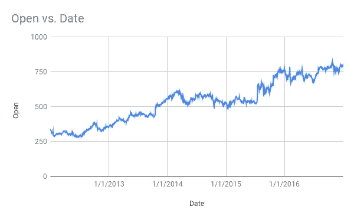
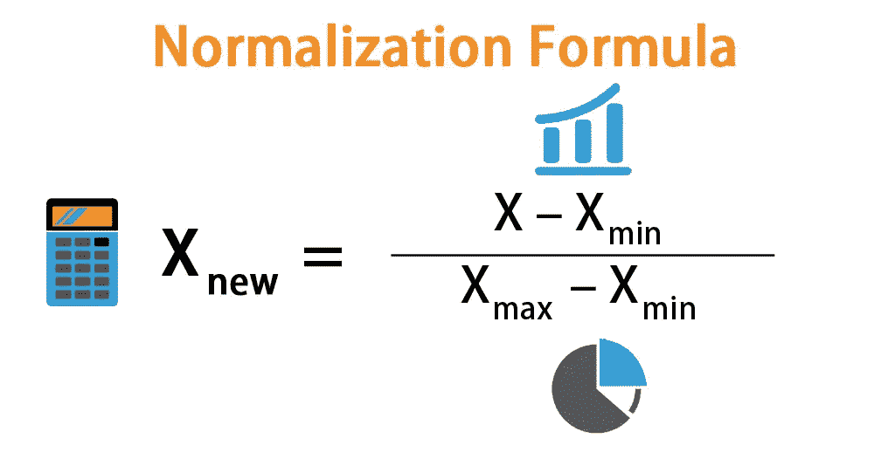
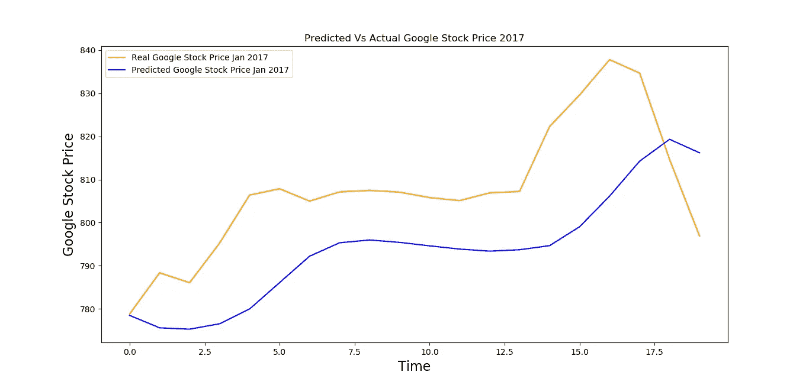

# 用 LSTM 预测谷歌开盘价的趋势

> 原文：<https://medium.com/analytics-vidhya/predicting-the-trends-in-opening-stock-price-of-google-using-lstm-c9094d2bd69b?source=collection_archive---------25----------------------->

这篇文章正是关于实现一个 LSTM，根据从 Yahoo Finance 获得的数据来预测 Google 的开盘价趋势。训练数据集包含从 2012 年 1 月 3 日到 2016 年 12 月 30 日的 Google 股票价格信息。测试集包含关于 2017 年 1 月的谷歌股票价格的信息，记录在该月的 20 个金融日。



谷歌 2012 年 1 月 3 日至 2016 年 12 月 30 日的开盘价。图片作者。

现在我将直接转到 Python 中的这个实现，在此之前，我将简短地提到什么是开盘价。

*   股票的开盘价是某一证券在交易日开市时首次交易的价格。任何上市股票的第一笔交易价格就是其每日开盘价。

我将从导入基本库开始。

接下来，我将导入数据集。点击给出的链接可以获得[训练](https://drive.google.com/file/d/1sMtdtOa5HN3wRbNwJrj70GvIDNs3lehJ/view?usp=sharing)和[测试](https://drive.google.com/file/d/1Tk3_4prJujEd-WwYYboDZnjVYhytNT-4/view?usp=sharing)套。

现在我将标准化我们的数据。归一化是一种特征缩放类型，其中如果 x_new 是缩放变量，那么，



图片来源: [eduCBA](https://www.google.com/url?sa=i&url=https%3A%2F%2Fwww.educba.com%2Fnormalization-formula%2F&psig=AOvVaw1S7j-t7neAMVI1F_ryLxKr&ust=1596650091220000&source=images&cd=vfe&ved=0CAMQjB1qFwoTCLDa3KaPgusCFQAAAAAdAAAAABAD)

现在是有趣的部分。在这里，对于我们的 LSTM 训练，基于我建立这个 RNN 的几次尝试，我将选择 60 **时间步长**。我所说的 60 个**时间步长**是指在每个 **T** 时刻，RNN 会回顾在 **T** 时刻和 **T** 时刻之前的 60 个开盘价，并根据其捕捉的趋势，预测 **T+1** 时刻的开盘价。

这将创建一个 x_train 形状数组(1198，60)和一个 y_train 形状数组(1198，)。

现在，我们必须将这个二维输入数组(x_train)改造成一个三维张量。在这里，因为我只使用一个输入来预测，所以我的第三维度将是 1。如果您认为任何其他特征在预测开盘价中起着重要的作用，那么可以随意将它包含到 x_train 中，然后适当地将第三维度更改为相应的输入数量。

根据 [keras](http://keras.io) 文档，你会发现一个张量的维度，它将被我们的模型接受。

这是我开始实现 RNN 的时候，首先导入重要的模块。如果没有预先安装 keras 和 TensorFlow，请使用 pip 命令安装它们。

序列函数用于铺设模型，密集函数用于创建密集连接的层，LSTM 层用于实现我们的 RNN 中的长短期记忆，而丢弃层用于防止过拟合。辍学率是神经网络在每次迭代训练中忽略的神经元的百分比。

现在让我们建立递归神经网络。

现在我们添加最终的输出层。因为我们预测的是连续值，所以输出层将只包含 1 个单元(即一个神经元)。这将是一个紧密相连的层。

我们已经完成了创建我们的 RNN！太好了！现在，我们将编译该模型，并根据我们的训练数据对其进行训练。

虽然默认的优化器是**‘rms prop’**，均方根传播，我总是发现使用**‘亚当’**，自适应矩估计作为优化器是一个安全的赌注。您可以将它改为 rmsprop，看看结果如何变化。代码都是一样的，除了用 rmsprop 代替 adam。

我将在这里上传训练过程，这样你就可以知道损失是如何收敛的。这部分没什么可看的，就观察损失如何收敛。

```
Epoch 1/100
38/38 [==============================] - 8s 205ms/step - loss: 0.0468
Epoch 2/100
38/38 [==============================] - 8s 205ms/step - loss: 0.0062
Epoch 3/100
38/38 [==============================] - 6s 154ms/step - loss: 0.0054
Epoch 4/100
38/38 [==============================] - 6s 152ms/step - loss: 0.0051
Epoch 5/100
38/38 [==============================] - 7s 182ms/step - loss: 0.0050
Epoch 6/100
38/38 [==============================] - 10s 255ms/step - loss: 0.0048
Epoch 7/100
38/38 [==============================] - 9s 228ms/step - loss: 0.0050
...
...
...
...
Epoch 92/100
38/38 [==============================] - 6s 159ms/step - loss: 0.0016
Epoch 93/100
38/38 [==============================] - 6s 157ms/step - loss: 0.0016 1s - l
Epoch 94/100
38/38 [==============================] - 6s 160ms/step - loss: 0.0016
Epoch 95/100
38/38 [==============================] - 6s 161ms/step - loss: 0.0015
Epoch 96/100
38/38 [==============================] - 8s 203ms/step - loss: 0.0014
Epoch 97/100
38/38 [==============================] - 8s 213ms/step - loss: 0.0014
Epoch 98/100
38/38 [==============================] - 8s 222ms/step - loss: 0.0016
Epoch 99/100
38/38 [==============================] - 7s 181ms/step - loss: 0.0013
Epoch 100/100
38/38 [==============================] - 9s 224ms/step - loss: 0.0014
```

有 100 个时期，所以我只显示前 7 步和后 9 步发生了什么。你可以很好地看到，损失已经收敛，并没有显示出任何实质性的变化，在最后几步。

现在我们将预测和可视化我们的结果。为了预测 2017 年 1 月的开盘价，我们必须导入测试数据集。正如你将看到的，测试集只有 20 个观察值，因为 2017 年 1 月只有 20 个金融或交易日。但是我们的模型是通过查看之前的 60 个观察值来训练执行的。没关系。我们将简单地连接测试集和训练集(原始的未缩放的训练集)。在这之后，我们将再次归一化它们，把它们转换成一个三维张量，然后把它提供给我们的 RNN 进行预测。

好吧！我们处于最后一步，现在我们将可视化预测，并将它们与实际值进行比较，以便亲自查看我们的模型是否已经捕捉到了开盘股票价格的潜在趋势。



实际与预测的谷歌股价。图片作者。

毫无疑问，我们的模型已经能够捕捉到 2017 年 1 月谷歌开盘价的趋势。然而，我们的模型对库存时间的不规则性反应不佳。这完全没问题，因为根据金融工程中的布朗运动数学概念，股票价格的未来变化与过去无关。

谢谢你坚持到最后！希望你喜欢阅读！