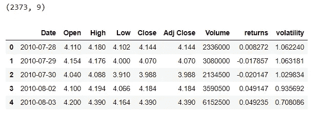

# 预测股票数据的波动性

> 原文：<https://medium.com/analytics-vidhya/predicting-the-volatility-of-stock-data-56f8938ab99d?source=collection_archive---------8----------------------->

对于世界各地的大多数男人和女人来说，将辛苦赚来的钱投资在正确的市场/平台上仍然是一个艰难的决定。每个人都有自己的储蓄方式，有些人喜欢投资银行，许多人喜欢投资股票市场。但是对许多人来说，预测买卖股票的正确时机并不容易。在买卖股票时，波动性是一个需要考虑的重要 KPI。


# **波动性是什么意思？**

波动性是指与投资者在股票上的投资金额相关的风险金额。比方说，波动性越高，风险就越大，股票价格可能会上涨或下跌。如果是高就好，如果不是呢？。这就是棘手的地方。因此，最好寻找更稳定的股票。要了解更多关于波动性的信息，请阅读这篇[文章](https://www.investopedia.com/terms/v/volatility.asp)。

# 为什么不用回归的方法来预测波动率呢？

在本文中，我们将使用来自特斯拉公司雅虎财经的开源数据，并试图理解波动性的模式。我们有 2373 天的数据，包括每日开盘、盘高、盘低、收盘、调整收盘、回报和波动值。

```
import pandas as pd
import numpy as np
import matplotlib.pyplot as plt
import seaborn as sns
window_size=20
#first download data from yahoo
import yfinance as yf
from yahoofinancials import YahooFinancials
df = yf.download(‘TSLA’, start=’2000–01–01', end=’2019–12–31', progress=False)
#compute daily returns and 20 day moving historical volatility
df[‘returns’]=df[‘Close’].pct_change()
df[‘volatility’]=df[‘returns’].rolling(window_size).std()*(252**0.5)
df =df.dropna()
df = df.reset_index()
print(df.shape)
df.head()
```



时间序列分析中有两个重要的概念，

*   **单变量预测:**仅使用日期预测目标变量(波动率)。这意味着我们只有 30 天的每日波动率值，并使用这些值来预测第 31 天的波动率。
*   **多变量预测:**这里，目标值将使用许多特征进行预测，如高、接近等。正如你在上表中看到的。

# **从数据中观察**

在本节中，我们将绘制每一列的实际数据，并尝试了解它们之间的关系

```
sns.pairplot(df)
sns.heatmap(df.corr())
```


相关热图

从第一张图来看，我们需要观察的最重要的图表是波动率与其他列(最后一行)。我们可以清楚地看到，开盘价、最高价、最低价、收盘价、调整收盘价的数据与波动性非常相似，下面的热图也证实了这一点。这意味着这些特征对预测波动性的贡献是相同的，因此并非所有的特征都是重要的。

# **让我们使用基本的回归方法来验证观察到的结果。**

我们如何验证所有的特征对于预测波动性并不重要？。我在这里使用的一种方法是，首先使用我们拥有的数据中的所有列来预测波动性，然后找到重要的特征并仅使用它来预测波动性，并使用平均绝对误差(MAE)来衡量性能。


评估指标

```
from sklearn.datasets import make_regression
from sklearn.linear_model import LinearRegression
from matplotlib import pyplot
# define dataset
X, y = make_regression(n_samples=2373, n_features=7)
# define the model
model = LinearRegression()
# fit the model
X = df.drop([‘volatility’,’Date’,’returns’],axis=1).values
y = df[‘volatility’].values
model.fit(X, y)#Mapping column names for feature importance graph
map_colums ={}
col =df.drop([‘volatility’,’Date’,’returns’],axis=1).columns
for i in range(len(col)):
 map_colums[i] = col[i]
map_colums
# get importancea
importance = model.coef_
# summarize feature importance
for i,v in enumerate(importance):
 print(‘Feature: ‘,map_colums[i],’Score: %.7f’ % v)
# plot feature importance
pyplot.bar([map_colums[x] for x in range(len(importance))], importance)
pyplot.show()
```


特征重要性

**使用所有功能的模型性能**

```
from sklearn.model_selection import train_test_split
from sklearn.metrics import mean_absolute_error 
 # create regressor object `
X,x_valid,y,y_valid = train_test_split(X,y,test_size=0.1)
print(X.shape,y.shape,x_valid.shape,y_valid.shape)
regressor = LinearRegression() 

# fit the regressor with x and y data 
regressor.fit(X, y)

pred = regressor.predict(x_valid)
mean_absolute_error(pred,y_valid)
```

> 分数:0.12109432688323198

**仅使用所选特征的模型性能(低)**

从上面的特征重要性图可以清楚地看出，低栏最适合回归模型来拟合和预测波动性。因为对于回归模型来说，关键的要素是所选择的特征要么应该是负相关特征，要么应该是正相关特征。

```
X = df[[‘Volume’,’Low’]].values
y = df[‘volatility’].values
X,x_valid,y,y_valid = train_test_split(X,y,test_size=0.1)
print(X.shape,y.shape,x_valid.shape,y_valid.shape)
regressor = LinearRegression()

# fit the regressor with x and y data 
regressor.fit(X, y) 
pred = regressor.predict(x_valid)
mean_absolute_error(pred,y_valid)
```

> 分数:0.1154891600804784

从两种不同方法的结果来看，我会说第二种方法更好，即使 MAE 的差异更小。我的结论背后的原因是，模型没有使用 5 个不同的特征，而是能够用一个特征来预测波动性，而且比后者更好。这也将节省训练的计算时间。我希望这篇文章简要介绍了如何开始为任何预测问题构建一个基本的回归模型。

明天将看到我们如何应用一些深度学习方法来预测波动性。继续读！！！