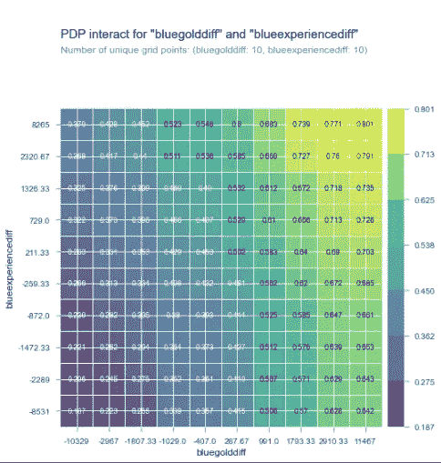

# 预测英雄联盟游戏的赢家

> 原文：<https://medium.com/analytics-vidhya/predicting-the-winner-of-league-of-legends-games-c6fb3513b3d4?source=collection_archive---------20----------------------->

英雄联盟(LoL)是由 Riot Games 开发的一款非常受欢迎的多人在线战斗竞技场(MOBA)视频游戏。在 LoL 中，玩家控制具有不同能力和特质的独特“冠军”，并与另一队冠军(5v5)、爪牙和怪物作战。LoL 的目标是摧毁敌人的“Nexus ”,这是一个位于敌人基地深处的建筑，由塔楼和爪牙守卫。冠军在第一级开始时很弱，通过杀死爪牙和敌人的冠军来获得经验和金币。这提高了他们的等级，并允许他们购买进一步增强他们力量的物品。

我自己就是一个很烂的英雄联盟玩家。因此，我开始尝试通过机器学习来预测哪支队伍会赢。有了这些信息，我就能更好地理解是什么促成了一个胜利的团队。此外，我可以确定什么时候一个游戏不再统计获胜，我最好投票放弃。

## **流程:**

我从 Kaggle 获得了一个数据集，其中包含了近 10，000 个高排名(从钻石 I 到大师)游戏的前 10 分钟统计数据。值得注意的是，在更高的级别，游戏的前 10 分钟很大程度上预示着谁会赢。在较低的 elo(elo 是排名系统)下，游戏往往有更长的平均长度。

数据集包含 38 个与红队和蓝队相关的特征。其中一些特征包括团队的杀戮，黄金和经验。

在建立我的模型之前，我首先建立了我的目标向量，无论蓝色是否获胜。这是一个分类问题，因为他们要么赢，要么输。然后我开始探索性的数据分析，并对我的数据框架进行了一些争论。在这个过程中，并且借助之前的一些 LoL 知识，我意识到很多特征是共线的，这会导致我们的模型出现问题。在删除了我们的问题列之后，我还删除了与我的目标向量几乎没有关联的特性。这里的图片是我的相关矩阵下降前。

特征相关矩阵

我的下一步是将我的数据框架分成训练集、测试集和验证集。这样做的原因是，我的模型有数据可以学习(训练)，有数据可以验证和调整(验证)，最后有测试数据来测试我们的最终模型。在分割时，我还对我的数据进行了分层，考虑了训练集中过多输赢的偏差。使用我的分割数据，我能够得到 0.501 的基线分数。这个分数很重要，因为如果我们只是简单地猜测，它确定了正确猜测一个队是赢还是输的概率。我们现在有了一个继续发展的起点。

然后我创建了多个模型，从不同类型的简单版本开始。我使用了决策树、RandomForests 和 XGBoost(一种梯度增强器)。在创建了模型的简单版本并对我的验证数据进行测试后，我使用了随机和网格搜索来改进它们。使用这些技术是为了找到模型的最佳超参数集。调优后，我能够分别为 RandomForest 和 XGBoost 获得 0.7258 和 0.726 的验证分数。我决定使用 XGBoost 作为我的最终模型，并在我的测试集上进行测试，得到了 0.7314 的分数。还不错！

然后我想更好地理解我的模型以及它们是如何运作的。我首先想直观地看到我的调优和未调优模型之间的差异。为了证明这一点，我绘制了两者的 ROC 曲线。该图通过绘制真阳性率对假阳性来说明辨别阈值。

未调整(蓝色)与调整(红色)XGBoost 模型的 ROC 曲线。

调整后的模型通常具有更好的真阳性率，而假阳性率与未调整的模型相同，但在某些点上表现非常相似。[关联的](https://raw.githubusercontent.com/timrocar/Unit-2-Build/master/Images/confusion%20matrix.PNG)是显示最终模型对验证数据的预测的混淆矩阵。

那么什么特征对我最终的模型预测影响最大呢？为了找到答案，我首先生成的是一个匀称的情节。在进行预测时，Shapely plots 非常适合解释每个特征的贡献。我选择了我的训练集中的第 7188 场比赛来证明这一点。在这场比赛中，蓝队最终获胜，在 10 分钟内，他们有 11 个死亡和 3 个死亡。蓝队在黄金、经验和 CS(小兵被杀)方面也领先。

在我的数据中，第 7188 场比赛的形状图

如此处所示，黄金和经验特征指向蓝色胜利。这些特征在做出这种特定的胜利预测时是最重要的。然而，红色有一个杀死龙的技能，而蓝色没有，杀死龙会给保护他们的队伍奖励。这就是“红龙”特征指向左侧的原因，因为它降低了模型获胜的信心。然而，它远没有红族那么重要。

蓝色体验和蓝色黄金差异的部分相关图

这些图表明，黄金和经验的差距越大，与目标的关系就越高。然而，它确实在 2500 左右达到稳定，主要是因为在游戏开始后的 10 分钟内几乎不可能有更大的差距。这些特征也可以一起显示在矩阵中。

这向我们表明，高黄金和经验的差异一起严重影响我们的预测结果。这是有道理的，因为获得金牌和经验都非常重要，而且在 LoL 中非常相关。

我做的最后一个可视化是为我的最终模型排列特征的重要性。这种技术会打乱特征值并测量得分损失，以确定在多大程度上依赖该特征来进行预测。

最终 XGBoost 模型的排列重要性

正如你所看到的，两队金牌的差距是最大的决定因素。这并不奇怪，因为拥有大量的黄金使玩家能够购买物品，使冠军更强大。

在浏览了模型和研究了特性的重要性之后，我可以自信地说获得金牌是在这个技能水平下赢得 LoL 游戏的最重要的方面，所以专注于你的 CS，并注意 ganks！

来源:

数据: [Kaggle](https://www.kaggle.com/bobbyscience/league-of-legends-diamond-ranked-games-10-min)

模型和可视化: [Github](https://github.com/timrocar/Unit-2-Build/blob/master/LOL_Kaggle_Notebook.ipynb)

我的网站:[这里](http://timothyrcarroll.com/)