# COVID 情形下的失业率预测

> 原文：<https://medium.com/analytics-vidhya/predicting-unemployment-rate-in-covid-situation-7209f1aa431d?source=collection_archive---------17----------------------->

新冠肺炎疫情让全球数百万人失业。

*这项研究是通过使用机器学习来预测未来一年的失业率。它利用了欧洲联盟开放数据门户网站上发布的开放源数据集。*

# 探索性数据分析

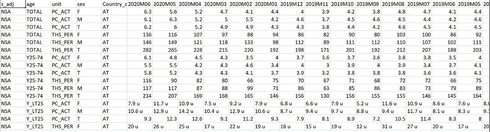

来自欧盟开放数据门户的原始数据

原始数据集包含来自不同国家的 2000 多条记录。然而，数据中有包含多个合并信息的列，所以首先我需要从复合特征中提取单独的特征。因此，需要一些数据格式化。

我从数据集中取出第一列，并根据逗号(，)将其拆分，然后将处理过的列合并到原始数据集中。

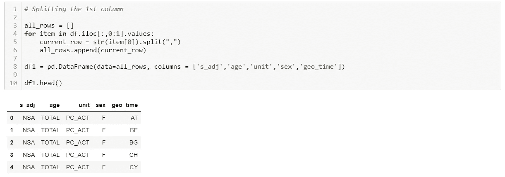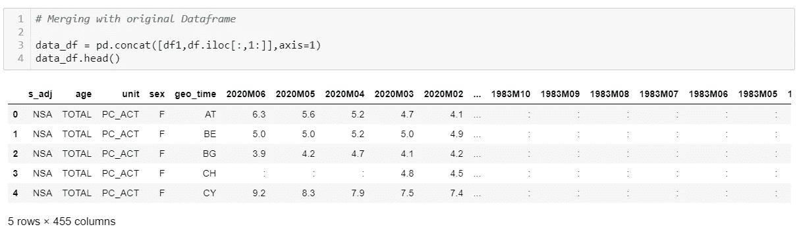

在这个实验中，我专注于每个国家过去 10 年的数据。因此，我手动选择了如下所示的列。

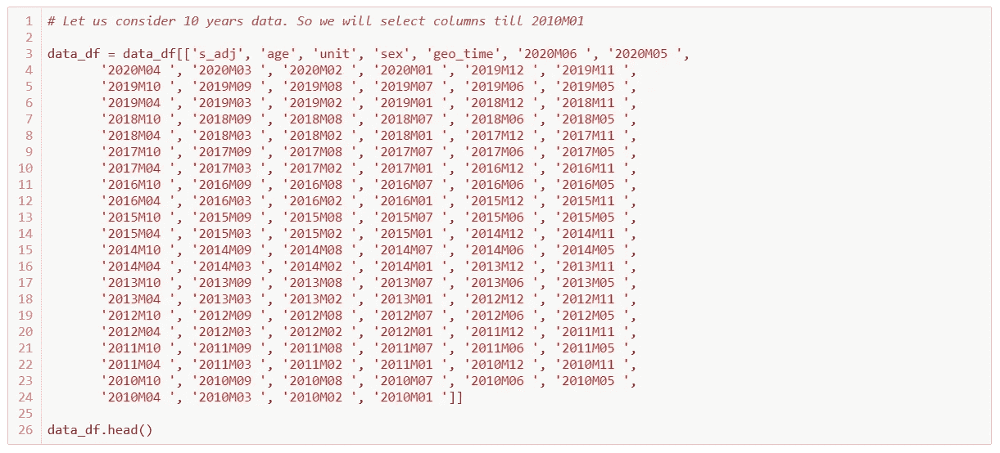

在 dataframe 中，可以看到我们有一个名为 *geo_time* (后来重命名为 *Country_code* )的列，有不同的国家代码。

因此，我花了一点额外的精力来收集所有国家代码的列表以及它们各自的国名。

然后这个列表以熊猫数据帧的形式被获取。

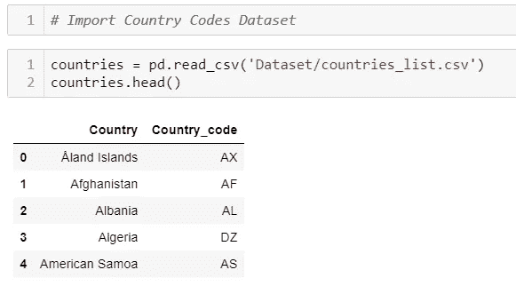

国家代码和国家名称

我后来将这个数据帧与原始数据帧合并。

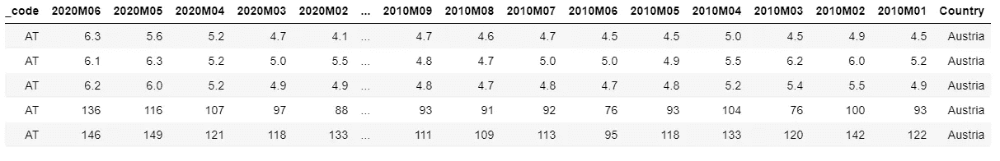

# 可视化数据

对于逐月可视化，有必要将数据框架转换为枢纽数据集(转置)，以便生成时间序列数据。

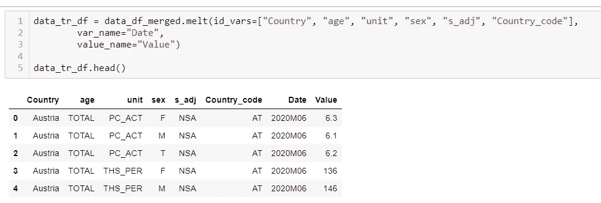

通过删除包含空格和非数值的值，对数据帧做了进一步的清理。

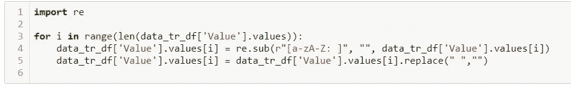

因此，我将日期列拆分为年和月，然后按年分组以获得总失业人数。

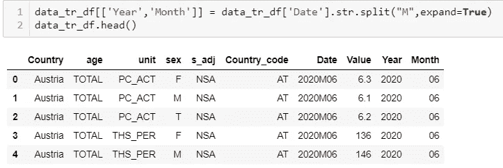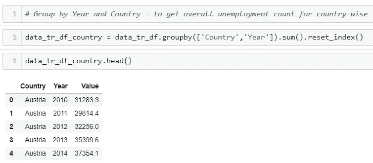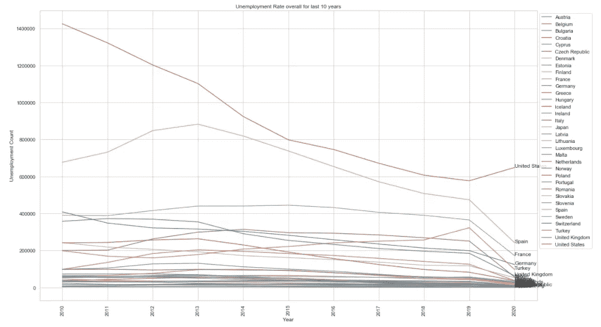

从上图可以明显看出，美国在去年进行了大量的裁员，其次是土耳其。

西班牙在 2013 年经历了最严重的衰退，此后，它在各公司大力发展劳动力。

因为我在这个实验中的主要目的是关注 COVID 的情况，所以我决定只获取 2019-2020 年期间的见解。

因此，我对 Year 列应用了值为 *2019* 和 *2020* 的过滤器，之后我得到了下图。

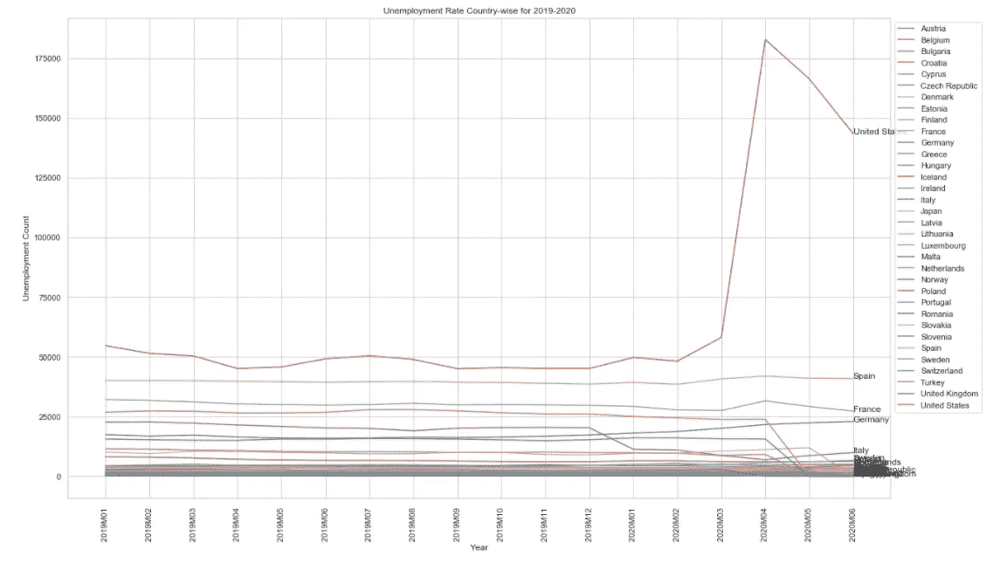

2019-2020 年的失业率

今年 4 月，美国公司进行了大规模裁员，之后这种趋势在该国开始减少。

## **按年龄组**

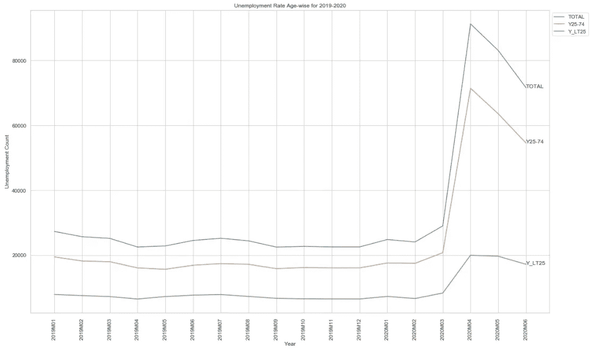

在被解雇的人中，受影响最大的年龄组是 25-74 岁。

## 可视化最近十年的数据

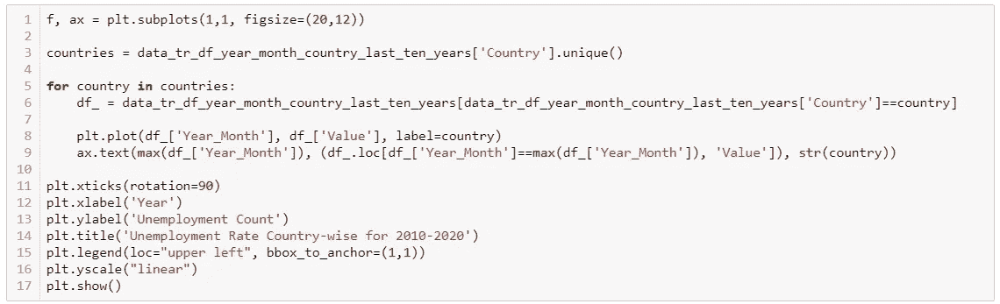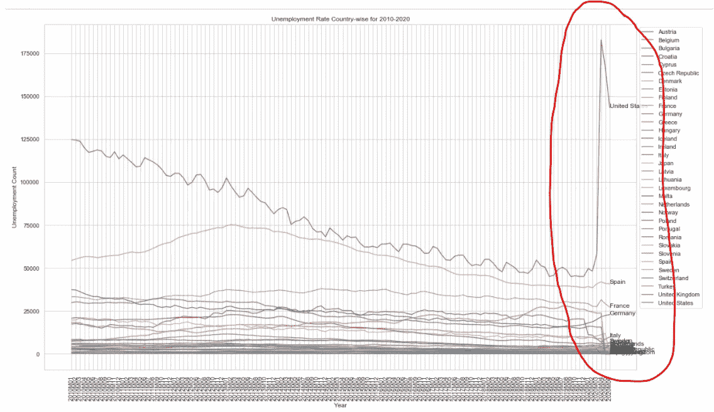

过去十年的失业率

上面突出显示的图表中的突然峰值是在 COVID 情况下出现的。

我需要上面的数据来建立一个有效的模型。

# 数据建模

我想对一个特定的国家进行预测。所以，我随便选了一个(就说西班牙吧)。

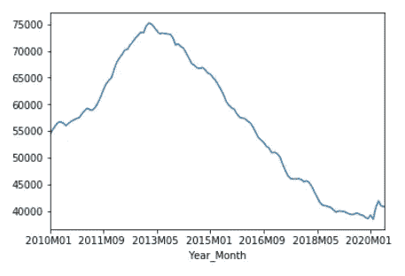

过去 10 年西班牙的失业趋势

上述数据显然是非平稳数据。因此，我进行了 ***增强迪基富勒测试*** 来通过 p 值检查平稳性。

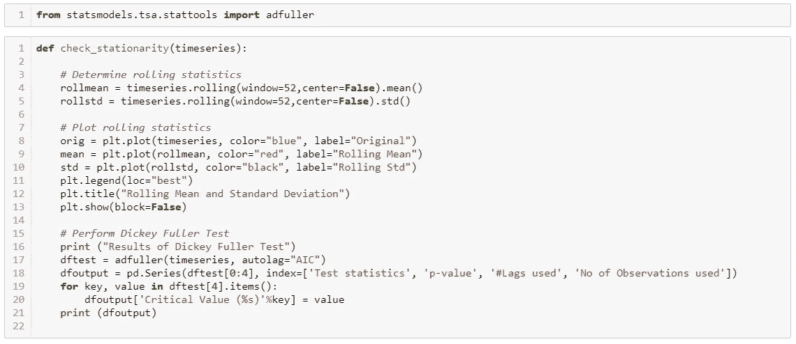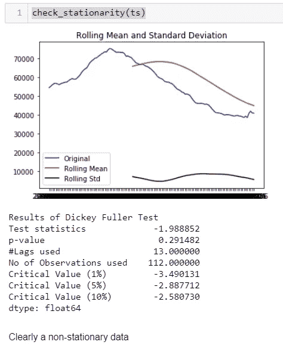

根据上图，当前 p 值大于 0.05。

因此，我必须通过对时间序列取对数，然后求差分，将数据转换成平稳数据。*供参考，可以访问我的* [*其他文章*](/analytics-vidhya/time-series-modelling-arima-82453bac7de) *关于利用 ARIMA 模型进行时间序列分析。*

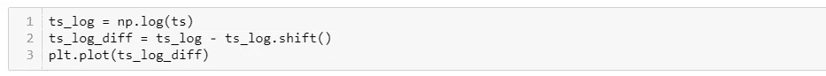

重复进行该过程，直到 p 值低于 0.05

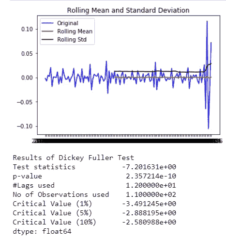

我想让建模部分尽可能简单。因此，我决定选择 ARIMA 模型来模拟我的时间序列数据。

现在，对于 ARIMA 模型，我们需要 p 和 q 值，这是通过使用 PACF(部分自相关)和 ACF(自相关)图确定的。

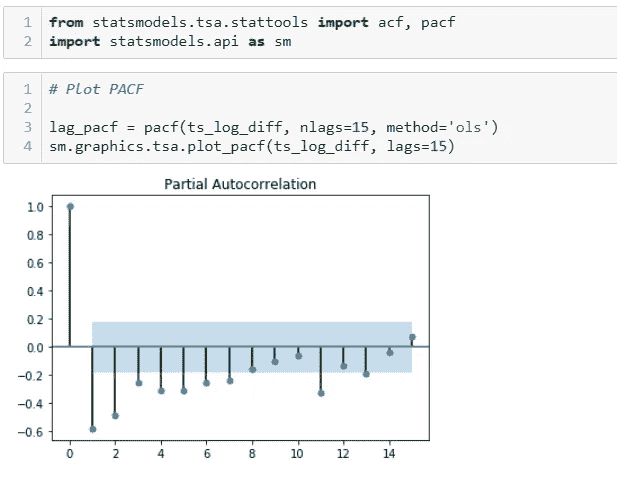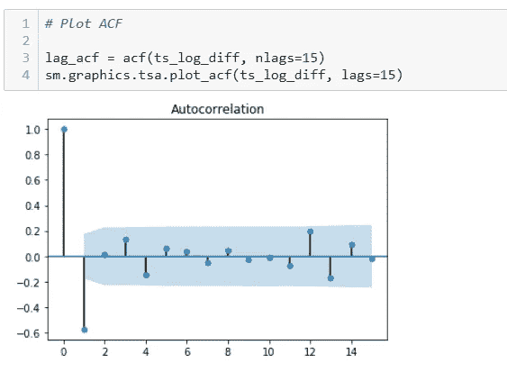

## 培训 ARIMA 模型

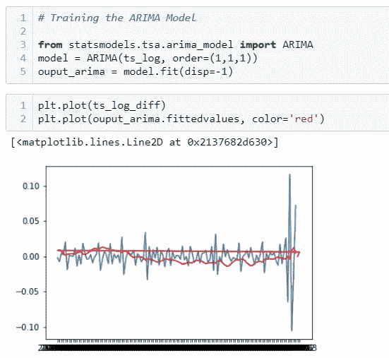

我做了残差的核密度估计(KDE)图，它几乎是正态分布，因此表明我的预测是可信的。

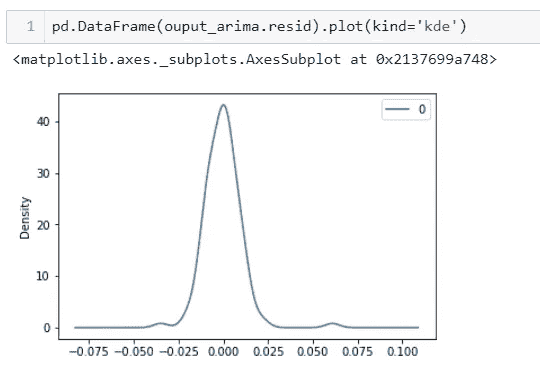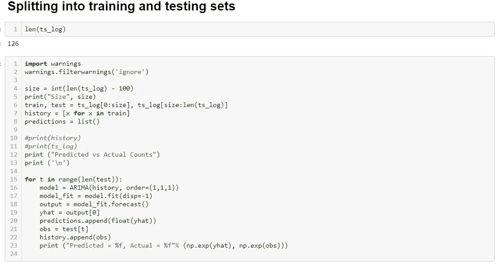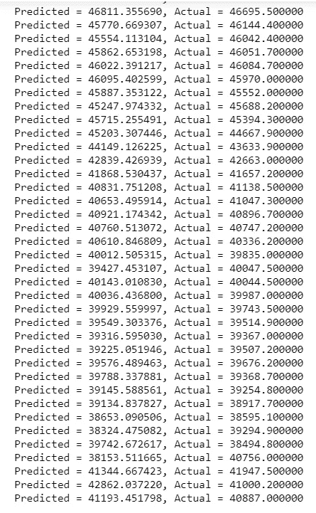

## 评估均方误差

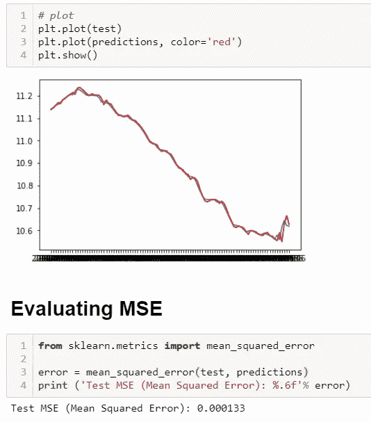

# 预测未来失业人数

我们现在希望看到或预测西班牙未来两年的失业人数，即从 2020 年 9 月到 2022 年 6 月。

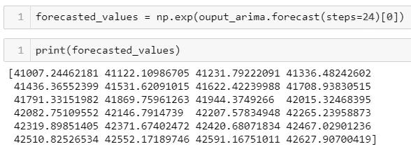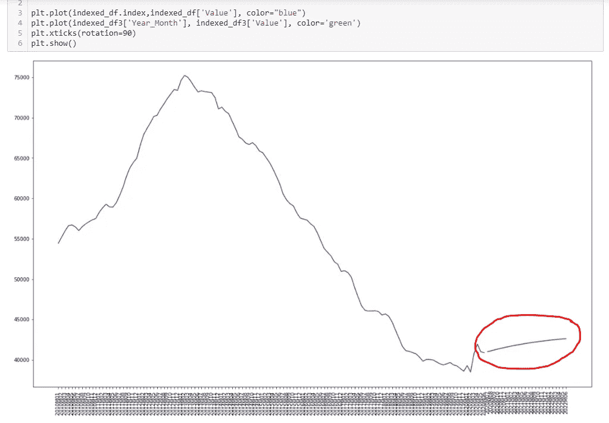

上面的图表告诉我们，西班牙未来两年的失业率几乎是稳定的，只是略有上升。

希望你喜欢这篇文章。如果你有什么意见和建议，请随时写下来。