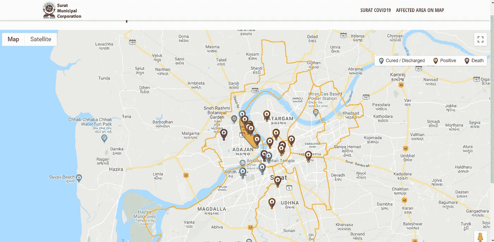
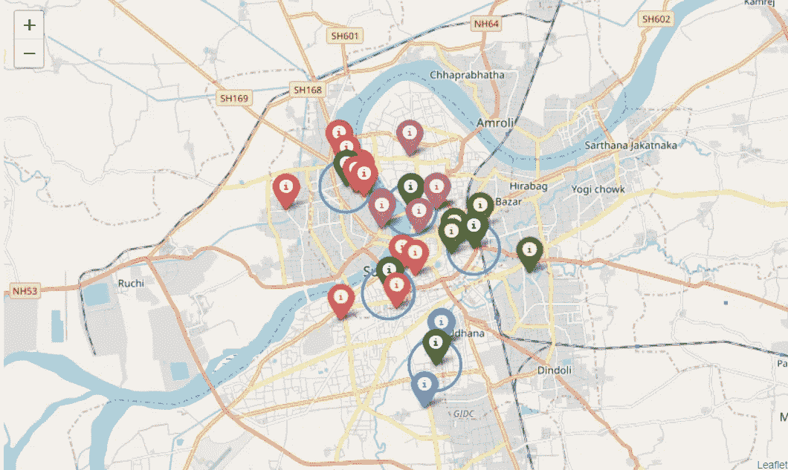
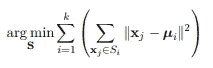
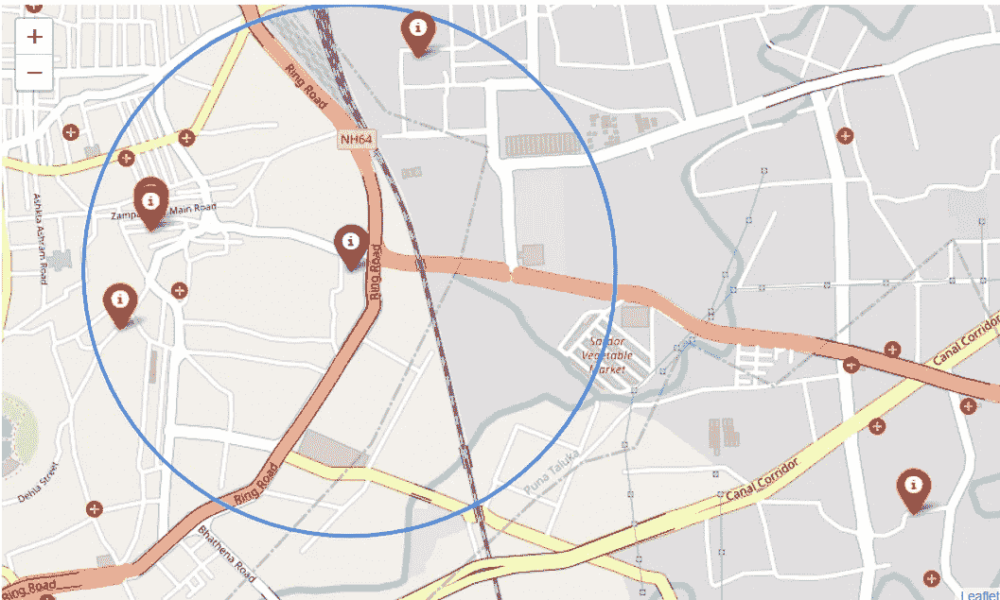
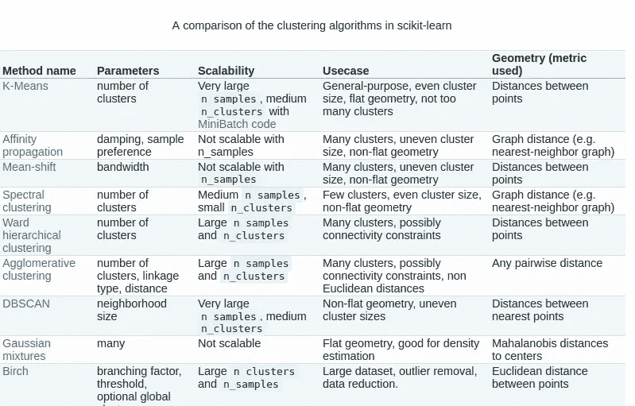
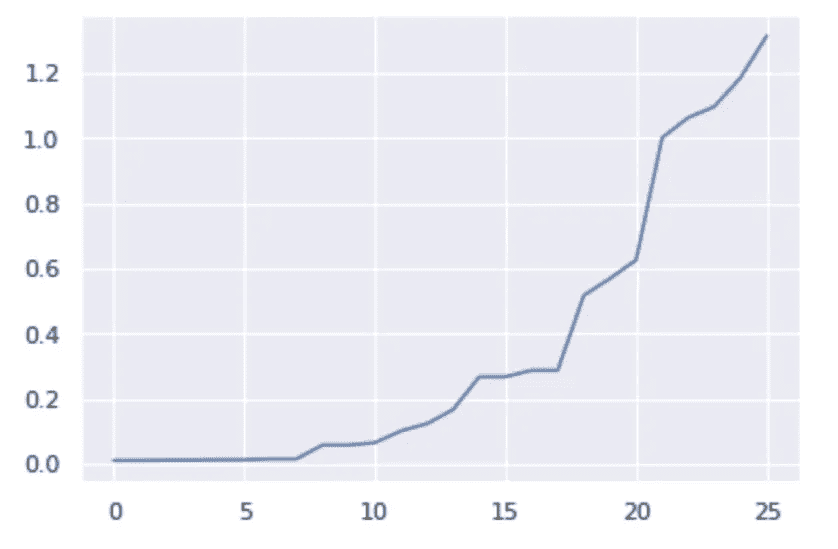
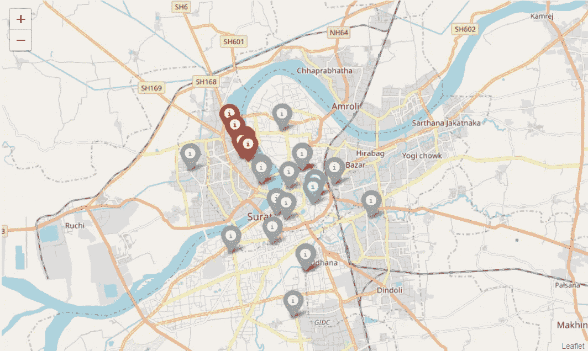

# 使用机器学习预测即将到来的冠状病毒热点

> 原文：<https://medium.com/analytics-vidhya/predicting-upcoming-corona-hotspots-dd6c405c9c77?source=collection_archive---------20----------------------->

截至目前，印度政府否认在该国发生任何社区传播，遏制战略是他们应对疫情的计划。群集遏制战略将把病毒控制在一个确定的地理区域，并有助于在早期阶段发现病例，打破传播链，防止其扩散到新的地区。

这种遏制方法要取得成功，一个重要的因素是在为时已晚之前识别出一个新兴的集群区域。随着受感染人数呈上升趋势，该国目前正处于非常不稳定的局面。

印度强制规定在德里、孟买和北方邦的主要城市外出时必须戴口罩。路透社/P .拉维库马尔

作为一个对机器学习感兴趣的人，我一直在寻找利用数据帮助对抗冠状病毒的方法，并意识到寻找即将到来的聚类是多么重要，我试图解决这个问题，并在本文中向您展示一个解决方案。

嗯……探测星团。集群遏制。新兴集群。这里什么算法会有效？聚类算法。下一个重要的东西，数据。假设处于封锁状态，且不考虑受感染者之前的任何旅行，唯一可能进一步受影响的地方是受感染者居住的社区。为了创建最基本的数据集，我只需要感染者的位置坐标，在四处寻找之后，我发现了这张由 Surat 市政公司(SMC)创建的惊人的[地图](http://office.suratmunicipal.org/SuratCOVID19/Home/CoronaAffectedAreaOnMap)。

[http://office . suratmunicipal . org/Surat covid 19/Home/CoronaAffectedAreaOnMap](http://office.suratmunicipal.org/SuratCOVID19/Home/CoronaAffectedAreaOnMap)

该地图包含冠状病毒患者的基本数据及其位置坐标(纬度和经度)。为了创建我的数据集，我刮了这张地图。

# k 均值

我尝试的第一个聚类算法是最基本的 K-Means 聚类。我面临的第一个问题是决定集群的数量，为了解决这个问题，我使用了简单的肘方法。**肘**方法给了我们一个好的 *k* 数量的聚类是基于数据点和它们被分配的聚类质心之间的平方距离(SSE)的和。查看此[链接](https://towardsdatascience.com/k-means-clustering-algorithm-applications-evaluation-methods-and-drawbacks-aa03e644b48a)了解 K 均值聚类和肘方法的详细描述。

基于 Surat 冠状病毒数据的 K 均值聚类，K = 5。

黑色标记是识别出的星团的质心，周围的蓝色圆圈半径为 1 公里。

# 使用 K-means 的缺点

好看吗？没有。kmeans 的第一个缺点是聚类所采用的形状总是球形的，因此任意形状的聚类都不能被检测到，并且很可能被分配为多个聚类。

第二个缺点是 k 均值的目标函数是质心和聚类点之间的欧几里德距离的平方。

均值的目标函数

由于这是距离的平方，异常值对质心的位置有很大的影响。例如，下图中的红色星团，我们可以看到质心由于单个极端异常值而略微向右移动。星团更好的位置应该是稍微偏左一点。

第三个缺点是，kmeans 算法将每个样本拟合到一个聚类中，因此扭曲了聚类的位置以适应异常值，类似于上面讨论的情况。

存在针对异常值的更健壮的聚类算法，如 kmedians、kmediods、DBSCAN( **基于密度的带噪声应用空间聚类**)、Hierarchiel 聚类等。

仅仅研究这个简单的信息图就可以让我们知道使用什么算法，因为我们知道它的缺点。看看 DBSCAN —可扩展用于大型集群。检查。不均匀的簇。检查，并使用点之间的距离作为度量，这有助于根据聚类的接近程度来识别聚类。此外，DBSCAN 对噪声和异常值是鲁棒的。

# 基于密度的噪声应用空间聚类

基于一组点，DBSCAN 根据距离度量(通常是欧几里德距离)和最小点数将彼此靠近的点分组在一起。它还将低密度区域中的点标记为异常值。这是一个简洁的 DBSCAN 可视化。欲了解更多关于 DBSCAN 的信息，请点击此[链接](https://www.geeksforgeeks.org/dbscan-clustering-in-ml-density-based-clustering/)

请参阅，识别主要群集，将其他群集标记为离群值。完美。让我们在数据集上使用它。对于 DBSCAN，参数为 epsilon 和 minPoints，它会自动识别集群的数量。简单地说，最小点是将一组邻近点定义为一个聚类所需的最小点数。上述接近度由ε给出。ε是被视为邻居的点之间的距离。

为了找到ε参数，我们绘制了每个点的 2 个最近邻点之间的欧几里德距离，并且类似于肘方法，我们选择了斜率突然增加的 eps 值，这表示位于 eps 另一侧的点之间的距离大得多。minpoints 可以由领域专家取出，在这里，由于数据集很小，我们将 minPoints 保持为 3。

我将ε的值从 0.3 变到 0.6，发现 eps = 0.5 时效果很好

我将ε的值从 0.3 变化到 0.6，发现 eps = 0.5 时结果良好

在 eps = 0.5 且 minPoints = 3 的数据集上运行 DBSCAN 算法，我们会发现以下结果。

我们使用 DBSCAN 方法在 Surat 中找到两个聚类，这看起来更直观，因为其他点太远而不能聚集在一起。

我们使用 DBSCAN 方法在 Surat 中找到两个聚类，这看起来更直观，因为其他点太远而不能聚集在一起。

# 结论

当新病例和现有病例的数量很少时，更容易手动识别聚类，但是，如果数量急剧增加(我希望不会发生这种情况)，根据较新的数据更新这些模型可以指示新出现的聚类。

另一个可能的用例是将它与一个应用程序捆绑在一起，在这个应用程序中，用户甚至可以自我报告轻微的症状。可以使用这种方法来形成集群，如果形成了大的集群，可以在该区域中对 covid 进行随机测试。如果测试结果为阳性，则该区域可被宣布为热点，并可采取进一步的措施。

附言:如果任何人知道任何有感染者坐标的资源/数据集，请联系我，因为我想在更大的数据集上测试相同的内容。

写这篇文章用的笔记本这里是[这里是](https://colab.research.google.com/drive/1LjBfRgZEs2aZl5PrSd40_pWhANgHrDWj)

# 参考

 [## k 均值聚类

### 在我之前的博客中，我们已经看到了集群的一些基础知识。现在让我们试着更全面地了解 k-means…

medium.com](/datadriveninvestor/k-means-clustering-b89d349e98e6)  [## k-均值聚类:算法、应用、评价方法和缺点

### 使聚集

:算法、应用、评估方法和缺点 Clusteringtowardsdatascience.com](https://towardsdatascience.com/k-means-clustering-algorithm-applications-evaluation-methods-and-drawbacks-aa03e644b48a)  [## 弯头法—黄砖 1.1 版文档

### KElbowVisualizer 实现了“肘”的方法，以帮助数据科学家选择最佳数量的集群…

www.scikit-yb.org](https://www.scikit-yb.org/en/latest/api/cluster/elbow.html) 

http://office.suratmunicipal.org/SuratCovid19/

 [## 用 Python 聚类 GPS 坐标和形成区域

### 我最近在处理一些包含 GPS 纬度和经度的数据时遇到了一个挑战。为了努力…

levelup.gitconnected.com](https://levelup.gitconnected.com/clustering-gps-co-ordinates-forming-regions-4f50caa7e4a1)  [## sk learn . cluster . DBS can—sci kit-learn 0 . 22 . 2 文档

### 从向量数组或距离矩阵执行 DBSCAN 聚类。DBSCAN —基于密度的空间聚类…

scikit-learn.org](https://scikit-learn.org/stable/modules/generated/sklearn.cluster.DBSCAN.html) 

[https://towards data science . com/how-DBS can-works-and-why-should-I-use-it-443 B4 a 191 c 80](https://towardsdatascience.com/how-dbscan-works-and-why-should-i-use-it-443b4a191c80)