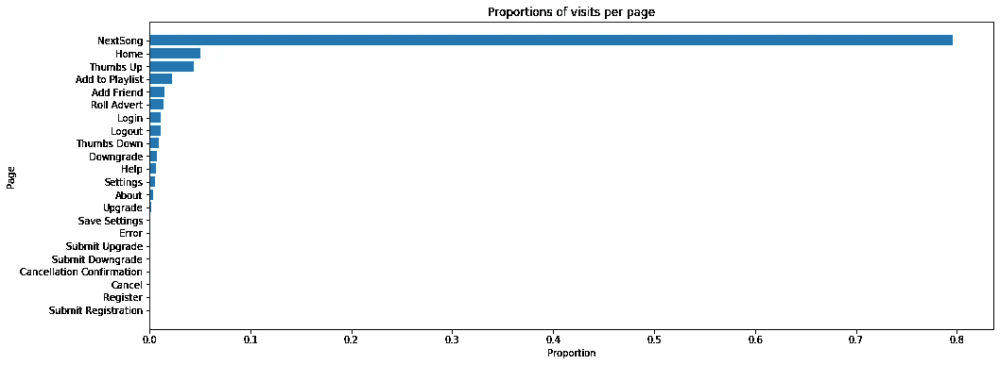
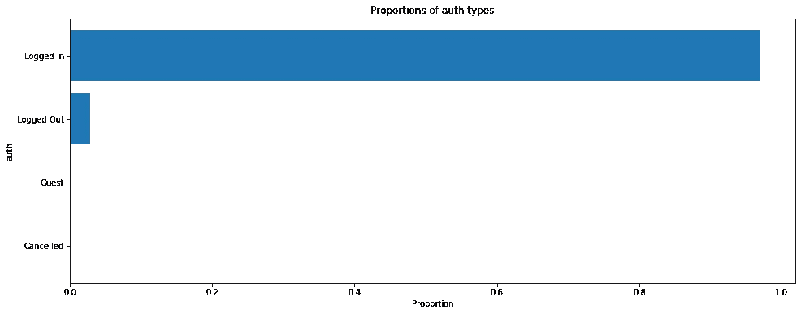
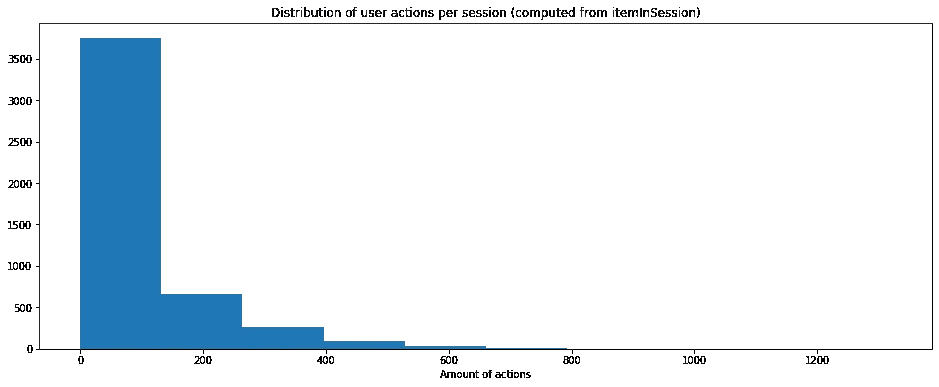

# 用 PySpark 预测用户流失(第 1 部分)

> 原文：<https://medium.com/analytics-vidhya/predicting-user-churn-with-pyspark-part-1-f13befbf04c3?source=collection_archive---------27----------------------->

## 这是一个三部分系列的第一部分，我们开始探索来自虚拟音乐流媒体平台 Sparkify 的用户数据，并定义它意味着什么


虚拟流媒体平台 Sparkify 的徽标

# 介绍

> *这一系列文章是我为完成* [*Udacity 的数据科学家 Nanodegree*](https://www.udacity.com/course/data-scientist-nanodegree--nd025) *所要求的最终项目工作的成果，本质上是有教育意义的。*

Sparkify 是一个类似于 [Spotify](https://en.wikipedia.org/wiki/Spotify) 的虚拟服务。在高层次上，用户可以作为客人或登录用户来播放大量艺术家的歌曲。他们也可以决定为服务付费以获得更多利益。他们也可以随时自由退订这项服务。

[Udacity 的](https://www.udacity.com/)慷慨地提供了一个中型(128MB)和大型(12GB)数据集，并提供人工用户活动。在这个数据集中，行代表特定用户在某个时间点的动作，例如播放艺术家“Metallica”的歌曲的动作。

在三篇文章中，我将向您展示我如何使用 [pyspark](https://pypi.org/project/pyspark/) 构建一个受监督的机器学习模型，用于预测用户是否会在不久的将来离开该平台(在这种情况下，取消订阅该服务)

预测客户流失是数据科学家和分析师在任何面向客户的业务中经常遇到的一个具有挑战性的常见问题。此外，使用 Spark 高效操作大型数据集的能力是数据领域需求最高的技能之一。

下面是你将在每篇文章中学到的东西的分类:

*   **第 1 部分(本文)**:我们将对 128MB 的数据集进行数据探索，然后从用户事件开始反向工作以定义流失。
*   **第二部分(** [***链接***](/@jcm.orlando/predicting-user-churn-with-pyspark-part-2-90874e6807bd) **):** 利用探索阶段的知识，我们将精心制作一些预测特征，并将数据输入到有监督的机器学习模型中。
*   **第 3 部分(** [**链接**](/@jcm.orlando/predicting-user-churn-with-pyspark-part-3-89536234fa79) **):** 最后，我们将介绍如何建立一个 [AWS EMR](https://aws.amazon.com/emr/) 集群的过程，以使用 12GB 数据集来训练和评估我们的模型。

我们开始吧！

> 如果您愿意，您可以跳过这些教程，只需访问 [github repo](https://github.com/ojcastillo/sparkify) ，其中有文章中给出的结果的所有代码和说明(以及更多)

# 先决条件

我假设您已经熟悉 PySpark SQL 的基础知识，如果不熟悉，我建议您先查看官方的[入门指南](https://spark.apache.org/docs/latest/sql-getting-started.html)，然后再回来。

如果您想跟随并在本地执行代码，您需要下载中等大小的数据集，您可以在这里找到。

我也强烈推荐在 Jupyter 笔记本会话中运行代码。如果你想得到介绍，请查阅本指南。

## Python 依赖性

我建议设置一个虚拟环境来安装依赖项。我个人喜欢[康达](https://en.wikipedia.org/wiki/Conda_(package_manager))，这个你可以在这里找到[的安装说明。](https://docs.conda.io/projects/conda/en/latest/user-guide/install/index.html)

有了环境后，打开终端运行以下命令，这将安装所有必需的 python 依赖项:

```
pip install jupyterlab==1.2.4 \
    pyspark==2.4.4 \
    numpy==1.18.1 \
    matplotlib==3.1.2 \
    pandas==0.25.3
```

# 加载数据

让我们从导入所有必需的包开始(其中一些将在以后的文章中用到):

```
import datetimeimport matplotlib.pyplot as plt
from pyspark.ml import Pipeline
from pyspark.ml.classification import LogisticRegression
from pyspark.ml.evaluation import MulticlassClassificationEvaluator
from pyspark.ml.feature import StandardScaler, VectorAssembler
from pyspark.ml.tuning import CrossValidator, ParamGridBuilder
from pyspark.mllib.evaluation import MulticlassMetrics
import pyspark.sql.functions as sqlF
from pyspark.sql import SparkSession
from pyspark.sql import Window
from pyspark.sql.types import IntegerType%matplotlib inline
```

接下来，让我们创建从现在开始将使用的 SparkSession，并加载用于分析的中型数据集(输出代码以**粗体**显示):

```
*# Create the spark session that will be used for the whole notebook*
spark = SparkSession \
    .builder \
    .appName("Sparkify") \
    .getOrCreate()*# Read the medium sized sparkify dataset for the initial exploration
# This assumes the json file was downloaded and is on the same 
# directory in which you're running the code* file_path = 'mini_sparkify_event_data.json'
df = spark.read.json(file_path)
df.head()***Row(artist='Martha Tilston', auth='Logged In', firstName='Colin', gender='M', itemInSession=50, lastName='Freeman', length=277.89016, level='paid', location='Bakersfield, CA', method='PUT', page='NextSong', registration=1538173362000, sessionId=29, song='Rockpools', status=200, ts=1538352117000, userAgent='Mozilla/5.0 (Windows NT 6.1; WOW64; rv:31.0) Gecko/20100101 Firefox/31.0', userId='30')***
```

# 探索数据

让我们从收集关于数据集的一些高级事实开始:

```
def nice_describe(df, jump_size=5):
    *"""Wrapper around describe that prints columns at a time"""*
    ncols = len(df.columns)
    for idx in range(0, ncols, jump_size):
        col_list = df.columns[idx:idx+jump_size]
        print(f'Summary statistics for {col_list}')
        df.describe(col_list).show()*# Print the schema per entry in the json*
df.printSchema()**root
 |-- artist: string (nullable = true)
 |-- auth: string (nullable = true)
 |-- firstName: string (nullable = true)
 |-- gender: string (nullable = true)
 |-- itemInSession: long (nullable = true)
 |-- lastName: string (nullable = true)
 |-- length: double (nullable = true)
 |-- level: string (nullable = true)
 |-- location: string (nullable = true)
 |-- method: string (nullable = true)
 |-- page: string (nullable = true)
 |-- registration: long (nullable = true)
 |-- sessionId: long (nullable = true)
 |-- song: string (nullable = true)
 |-- status: long (nullable = true)
 |-- ts: long (nullable = true)
 |-- userAgent: string (nullable = true)
 |-- userId: string (nullable = true)***# Print how many rows and columns are in the dataset*
df.count(), len(df.columns)**(286500, 18)***# Print descriptive statistics 2 columns at a time*
nice_describe(df, 2)**Summary statistics for ['artist', 'auth']
+-------+------------------+----------+
|summary|            artist|      auth|
+-------+------------------+----------+
|  count|            228108|    286500|
|   mean| 551.0852017937219|      null|
| stddev|1217.7693079161374|      null|
|    min|               !!!| Cancelled|
|    max| Ólafur Arnalds|Logged Out|
+-------+------------------+----------+

Summary statistics for ['firstName', 'gender']
+-------+---------+------+
|summary|firstName|gender|
+-------+---------+------+
|  count|   278154|278154|
|   mean|     null|  null|
| stddev|     null|  null|
|    min| Adelaida|     F|
|    max|   Zyonna|     M|
+-------+---------+------+

Summary statistics for ['itemInSession', 'lastName']
+-------+------------------+--------+
|summary|     itemInSession|lastName|
+-------+------------------+--------+
|  count|            286500|  278154|
|   mean|114.41421291448516|    null|
| stddev|129.76726201141085|    null|
|    min|                 0|   Adams|
|    max|              1321|  Wright|
+-------+------------------+--------+

Summary statistics for ['length', 'level']
+-------+------------------+------+
|summary|            length| level|
+-------+------------------+------+
|  count|            228108|286500|
|   mean|249.11718197783722|  null|
| stddev| 99.23517921058324|  null|
|    min|           0.78322|  free|
|    max|        3024.66567|  paid|
+-------+------------------+------+

Summary statistics for ['location', 'method']
+-------+-----------------+------+
|summary|         location|method|
+-------+-----------------+------+
|  count|           278154|286500|
|   mean|             null|  null|
| stddev|             null|  null|
|    min|       Albany, OR|   GET|
|    max|Winston-Salem, NC|   PUT|
+-------+-----------------+------+

Summary statistics for ['page', 'registration']
+-------+-------+--------------------+
|summary|   page|        registration|
+-------+-------+--------------------+
|  count| 286500|              278154|
|   mean|   null|1.535358834085557E12|
| stddev|   null| 3.291321616328068E9|
|    min|  About|       1521380675000|
|    max|Upgrade|       1543247354000|
+-------+-------+--------------------+

Summary statistics for ['sessionId', 'song']
+-------+-----------------+--------------------+
|summary|        sessionId|                song|
+-------+-----------------+--------------------+
|  count|           286500|              228108|
|   mean|1041.526554973822|            Infinity|
| stddev|726.7762634630834|                 NaN|
|    min|                1|Ég Átti Gr...|
|    max|             2474|Þau hafa slopp...|
+-------+-----------------+--------------------+

Summary statistics for ['status', 'ts']
+-------+------------------+--------------------+
|summary|            status|                  ts|
+-------+------------------+--------------------+
|  count|            286500|              286500|
|   mean|210.05459685863875|1.540956889810471...|
| stddev| 31.50507848842202|1.5075439608187113E9|
|    min|               200|       1538352117000|
|    max|               404|       1543799476000|
+-------+------------------+--------------------+

Summary statistics for ['userAgent', 'userId']
+-------+--------------------+------------------+
|summary|           userAgent|            userId|
+-------+--------------------+------------------+
|  count|              278154|            286500|
|   mean|                null| 59682.02278593872|
| stddev|                null|109091.94999910519|
|    min|"Mozilla/5.0 (Mac...|                  |
|    max|Mozilla/5.0 (comp...|                99|
+-------+--------------------+------------------+**
```

让我们也绘制一些可视化图形:

```
# Show a bar chart with proportions of visits per page
page_counts_pd = df.groupby('page').count().sort('count').toPandas()
page_counts_pd['count'] = page_counts_pd['count'].astype(float)
total_visits = page_counts_pd['count'].sum() 
page_counts_pd['prop'] = page_counts_pd['count'] / total_visitsplt.figure(figsize=(16, 6))
plt.barh(page_counts_pd['page'], page_counts_pd["prop"])
plt.title("Proportions of visits per page")
plt.xlabel("Proportion")
plt.ylabel("Page");
```



```
*# Show a bar chart with proportions of auth types*
auth_counts_pd = df.groupby('auth').count().sort('count').toPandas()
auth_counts_pd['count'] = auth_counts_pd['count'].astype(float)
total_auths = auth_counts_pd['count'].sum() 
auth_counts_pd['prop'] = auth_counts_pd['count'] / total_authsplt.figure(figsize=(16, 6))
plt.barh(auth_counts_pd['auth'], auth_counts_pd["prop"])
plt.title("Proportions of auth types")
plt.xlabel("Proportion")
plt.ylabel("auth");
```



```
*# Distribution of user actions per session*
action_counts_pd = df.groupby('userId', 'sessionId') \
    .max() \
    .withColumnRenamed('max(itemInSession)', 'session_actions') \
    .toPandas()plt.figure(figsize=(16, 6))
plt.hist(action_counts_pd['session_actions'])
plt.title("Distribution of user actions per session (computed from itemInSession)")
plt.xlabel("Amount of actions");
```



# 清理数据集

我们没有遗漏任何`userId`，但是看起来我们有空值的行。既然我们对用户流失感兴趣，那么理想情况下，我们希望能够将每一行追溯到某个用户的行为。让我们研究这些行，然后决定如何处理它们:

```
def show_unique_stats(df, columns, sample_size=5):
    *"""Function to print unique value stats of specific columns"""*
    for col in columns:
        print(f'\nColumn "{col}":')
        uniques = df.select(col).dropDuplicates()
        nuniques = uniques.count()
        print(f'\tNumber of unique values: {nuniques}')
        print(f'\tSample: {uniques.head(sample_size)}')*# Explore rows with an empty user_id*
no_user_df = df.filter('userId == ""')
print(f'Number of rows with empty userId: {no_user_df.count()}')
print('Sample of rows:')
no_user_df.head(1)**Number of rows with empty userId: 8346
Sample row:
[Row(artist=None, auth='Logged Out', firstName=None, gender=None, itemInSession=100, lastName=None, length=None, level='free', location=None, method='GET', page='Home', registration=None, sessionId=8, song=None, status=200, ts=1538355745000, userAgent=None, userId='')]***# Print unique value statistics of all categorical columns
# for rows with no user_id defined*
categorical_cols = [
    'artist', 'auth', 'firstName', 'gender', 'lastName', 'level', 
    'location', 'method', 'page', 'song', 'userAgent'
]
show_unique_stats(no_user_df, categorical_cols, 10)**Column "artist":
	Number of unique values: 1
	Sample: [Row(artist=None)]****Column "auth":
	Number of unique values: 2
	Sample: [Row(auth='Logged Out'), Row(auth='Guest')]****Column "firstName":
	Number of unique values: 1
	Sample: [Row(firstName=None)]****Column "gender":
	Number of unique values: 1
	Sample: [Row(gender=None)]****Column "lastName":
	Number of unique values: 1
	Sample: [Row(lastName=None)]****Column "level":
	Number of unique values: 2
	Sample: [Row(level='free'), Row(level='paid')]****Column "location":
	Number of unique values: 1
	Sample: [Row(location=None)]****Column "method":
	Number of unique values: 2
	Sample: [Row(method='PUT'), Row(method='GET')]****Column "page":
	Number of unique values: 7
	Sample: [Row(page='Home'), Row(page='About'), Row(page='Submit Registration'), Row(page='Login'), Row(page='Register'), Row(page='Help'), Row(page='Error')]****Column "song":
	Number of unique values: 1
	Sample: [Row(song=None)]****Column "userAgent":
	Number of unique values: 1
	Sample: [Row(userAgent=None)]**
```

因此，无论是来宾还是已注销的个人都没有定义`userId`，这是有意义的。考虑到这一点，我认为继续使用定义了用户 id 的行是安全的:

```
*# Remove rows with an empty user_id*
df = df.filter('userId != ""')
```

# 定义流失

我们可以将客户流失定义为用户取消订阅 Sparkify 服务的行为。在最初的探索中，`auth`字段显示它可以接受值`Cancelled`,我预计这些行将允许我们识别用户。让我们来看一行这样的状态:

```
df.where('auth == "Cancelled"').head(1)**[Row(artist=None, auth='Cancelled', firstName='Adriel', gender='M', itemInSession=104, lastName='Mendoza', length=None, level='paid', location='Kansas City, MO-KS', method='GET', page='Cancellation Confirmation', registration=1535623466000, sessionId=514, song=None, status=200, ts=1538943990000, userAgent='"Mozilla/5.0 (Macintosh; Intel Mac OS X 10_9_4) AppleWebKit/537.77.4 (KHTML, like Gecko) Version/7.0.5 Safari/537.77.4"', userId='18')]**
```

用户访问了`Cancellation Confirmation`页面，所以听起来它确实在那一点上发生了变化。让我们探究一下该用户在该特定会话中的时间线，以帮助我们更好地理解发生了什么:

```
def user_timeline(df, user_id, session_id, cols, n=5):
    *"""Print rows the last n actions of an user in a session"""*
    user_df = df.where(f'userId={user_id} AND sessionId={session_id}')
    print(f'Number of rows for user with id {user_id} and session id {session_id}: {user_df.count()}')
    user_df.select(cols).sort(sqlF.desc('ts')).show(n)*# Timeline for the user with id 18 and session with id 514*
user_timeline(df, 18, 514, ['ts', 'sessionId', 'auth', 'page'])**Number of rows for user with id 18 and session id 514: 102
+-------------+---------+---------+--------------------+
|           ts|sessionId|     auth|                page|
+-------------+---------+---------+--------------------+
|1538943990000|      514|Cancelled|Cancellation Conf...|
|1538943740000|      514|Logged In|              Cancel|
|1538943739000|      514|Logged In|           Downgrade|
|1538943726000|      514|Logged In|            NextSong|
|1538943440000|      514|Logged In|            NextSong|
+-------------+---------+---------+--------------------+
only showing top 5 rows**
```

这幅图现在开始变得有意义了:当用户在某个时候访问了`Cancellation Confirmation`页面，那么随之而来的就是用户不再是`Logged In`。我们可以证明:

```
*# Validate that when an user visits the `Cancellation Confirmation` page, then is no longer `Logged In`*
cancel_subset_df = df.where('page="Cancellation Confirmation"')
show_unique_stats(cancel_subset_df, ['auth'])**Column "auth":
	Number of unique values: 1
	Sample: [Row(auth='Cancelled')]***# Does a user with a `Cancelled` auth means it can only have visited the `Cancellation Confirmation` page?*
auth_subset_df = df.where('auth="Cancelled"')
show_unique_stats(auth_subset_df, ['page'])**Column "page":
	Number of unique values: 1
	Sample: [Row(page='Cancellation Confirmation')]**
```

因此，鉴于以上所有情况，我认为可以肯定地说，任何具有 auth 值`Cancelled`的用户都可以被认为在这一点上受到了干扰。

让我们在 dataframe 中添加一个`churned`列，如果用户在某个时候离开了平台，则该列标记为 1，否则标记为 0:

```
def add_label_churned(df):
    *"""Add the `churned` to indicate if the user churned"""*

    *# Identify the rows with a cancelled auth state and mark those 
    # with 1, then use a window function that groups*
    *# by users and puts the cancel event at the top (if any) so 
    # every row gets a one after that when we sum*
    cancelled_udf = sqlF.udf(
        lambda x: 1 if x == 'Cancelled' else 0, IntegerType())
    current_window = Window.partitionBy('userId') \
        .orderBy(sqlF.desc('cancelled')) \
        .rangeBetween(Window.unboundedPreceding, 0)
    churned_df = df.withColumn('cancelled', cancelled_udf('auth')) \
        .withColumn("churned",
            sqlF.sum('cancelled').over(current_window))
    return churned_df.drop('cancelled')*# Add the `churned` label*
df = add_label_churned(df)*# Show once again the timeline of actions for the user with id 18 
# and session id 514* user_timeline(add_label_churned(df), 18, 514, 
              ['ts', 'sessionId', 'page', 'churned'])**Number of rows for user with id 18 and session id 514: 102
+-------------+---------+--------------------+-------+
|           ts|sessionId|                page|churned|
+-------------+---------+--------------------+-------+
|1538943990000|      514|Cancellation Conf...|      1|
|1538943740000|      514|              Cancel|      1|
|1538943739000|      514|           Downgrade|      1|
|1538943726000|      514|            NextSong|      1|
|1538943440000|      514|            NextSong|      1|
+-------------+---------+--------------------+-------+
only showing top 5 rows**
```

我们现在已经正确标记了所有行！

# 未完待续…

在本系列的[下一篇文章](/@jcm.orlando/predicting-user-churn-with-pyspark-part-2-90874e6807bd)中，我将分享我制作一些预测功能的过程，将数据成形为一种形式，其中每个用户由一行表示，然后我如何将数据输入到一个受监督的机器学习模型中。

正如文章开头提到的，如果您对可用于重现所有工作结果的实际代码感兴趣，您也可以访问我的 [github repo](https://github.com/ojcastillo/sparkify) 。