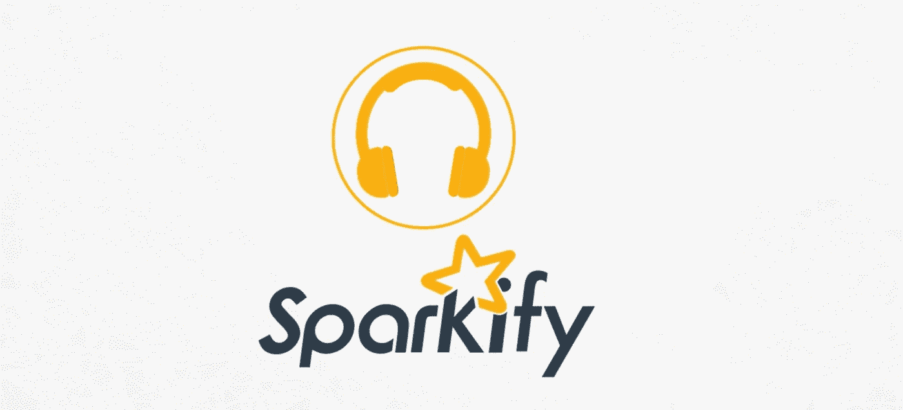

# 用 PySpark 预测用户流失(下)

> 原文：<https://medium.com/analytics-vidhya/predicting-user-churn-with-pyspark-part-2-90874e6807bd?source=collection_archive---------31----------------------->

## 这是三部分系列的第二部分，我们制作预测特征，并将数据输入到受监督的机器学习模型中



虚拟流媒体平台 Sparkify 的徽标

# 介绍

这是由三部分组成的系列文章的第二部分，其中我描述了一种使用 [pyspark](https://pypi.org/project/pyspark/) 预测用户流失的方法。点击这里找到这个系列的第一部分[。](/@jcm.orlando/predicting-user-churn-with-pyspark-part-1-f13befbf04c3)

在本文中，我们使用在探索阶段获得的知识来制作一些预测特征，并将数据输入到受监督的机器学习模型中。

# 工程特征

在我们制作一些特性之前，最好先了解一下用户的属性，以及哪些用户没有。下面我拆分了数据集，并显示了每个数据集的一般统计数据:

```
def print_relevant_stats(df, total_rows, total_users):
    *""""Print high level statistics for the dataframe"""*
    nrows = df.count()
    nusers = df.select('userId').dropDuplicates().count()
    npaid = df.groupby('userId', 'level').count().where(
        'level == "paid"').count()
    print(f'Proportion of the total rows in this group: '
          f'{nrows / total_rows:.2f}')
    print(f'Proportion of the total users in this group: '
          f'{nusers / total_users:.2f}')
    print(f'Proportion of users that paid for the service '
          f'at some point: {npaid / nusers:.2f}')
    print(f'Proportion of users that have never paid for the '
          f'service: {(nusers - npaid) / nusers:.2f}')

    *# The average amount of songs played can be found by grabbing 
    # the rows with a song defined and then just grouping by userId   
    # to get counts for the calculation*
    avg_agg = df.where('song is not null') \
        .groupby('userId') \
        .count() \
        .select(
            sqlF.mean(sqlF.col('count')).alias('avg_songs_played')
        ).head(1)[0]
    print(f'Avg amount of songs played per user:'       
          f'{avg_agg.avg_songs_played:.2f}')

    *# The average amount of sessions can be calculated from getting 
    # unique duplicate pairs of user and session ids and then 
    # grouping by user to get the counts for the average calculation*
    avg_agg = df.select('userId', 'sessionId') \
        .dropDuplicates() \
        .groupby('userId') \
        .count() \
        .select(
            sqlF.mean(sqlF.col('count')).alias('avg_sessions')
        ).head(1)[0]
    print(f'Avg number of sessions per user:' 
          f'{avg_agg.avg_sessions:.2f}')

    *# Getting the average actions and lengths per session requires 
    # us to find the particular value for each one, which we can get  
    # from the max in each group. Then we can proceed to get avg per 
    # user, and then a final average across all users*
    current_window = Window.partitionBy(
        'userId', 'sessionId').orderBy('ts')
    avg_agg = df.withColumn(
            'sessionLen', 
            (sqlF.col('ts') - sqlF.first(sqlF.col('ts')) \
                                  .over(current_window)) / 1000.0
        ).groupby('userId', 'sessionId') \
        .max() \
        .groupby('userId') \
        .avg() \
        .select(
            sqlF.mean(
                sqlF.col('avg(max(itemInSession))'
            )).alias('avg_user_actions'),                
            sqlF.mean(
                sqlF.col('avg(max(sessionLen))'
            )).alias('avg_session_len'),
        ).head(1)[0]
    print(f'Avg number of actions per session:' 
          f'{avg_agg.avg_user_actions:.2f}')
    print(f'Avg duration of sessions (in hours):'
          f'{avg_agg.avg_session_len / (60 * 60):.2f}')

    *# Getting the average amount of seconds since the first show of 
    # users is similar to the above, but this time we don't group by   
    # sessionId*
    current_window = Window.partitionBy('userId').orderBy('ts')
    avg_agg = df.withColumn('secondsSinceFirstShow', 
        (sqlF.col('ts') -   sqlF.first(sqlF.col('ts')) \
                                .over(current_window)) / 1000.0
        ).groupby('userId') \
        .max() \
        .select(
            sqlF.mean(sqlF.col('max(secondsSinceFirstShow)')) \
                          .alias('avg_first_show'),
        ).head(1)[0]
    print(f'Avg number of hours since first show:'
          f'{avg_agg.avg_first_show / (60 * 60):.2f}')

    # Calculate not only page visit counts but also percentage of 
    # the total for each
    pages_agg = df.groupby('page').count()
    npages = pages_agg.select(
        sqlF.sum(sqlF.col('count')).alias('npages'),
    ).head(1)[0].npages
    per_page_agg = pages_agg.sort(sqlF.desc('count')) \
        .withColumn('proportion', sqlF.col('count') / npages)          
    print('Stats per page:')
    per_page_agg.show()*# Get some counts for next steps*
total_rows = df.count()
total_users = df.select('userID').dropDuplicates().count()
print(f'Number of rows and users in dataset: '
      f'{total_rows}, {total_users}')***Number of rows and users in dataset: 286500, 226***print('Stats for set of non-churned users:')
print_relevant_stats(df.where('churned=0'), total_rows, total_users)***Stats for set of non-churned users:
Proportion of the total rows in this group: 0.84
Proportion of the total users in this group: 0.77
Proportion of users that paid for the service at some point: 0.75
Proportion of users that have never paid for the service: 0.25
Avg amount of songs played per user: 1108.17
Avg number of sessions per user: 24.53
Avg number of actions per session: 88.50
Avg duration of sessions (in hours): 5.48
Avg number of hours since first show: 1129.71
Stats per page:
+-------------------+------+--------------------+
|               page| count|          proportion|
+-------------------+------+--------------------+
|           NextSong|191714|  0.7933999900677051|
|               Home| 12785|0.052910162393020904|
|          Thumbs Up| 10692| 0.04424837358671721|
|    Add to Playlist|  5488|0.022711847572381597|
|         Add Friend|  3641|0.015068118988892383|
|              Login|  3241|0.013412736512771277|
|        Roll Advert|  2966|0.012274661060438015|
|             Logout|  2673|0.011062093396679303|
|        Thumbs Down|  2050|0.008483835190120678|
|          Downgrade|  1718|0.007109867734940158|
|               Help|  1487|0.006153884354980218|
|           Settings|  1244|0.005148239500736...|
|              About|   868|0.003592179973182804|
|            Upgrade|   387|0.001601582545647...|
|      Save Settings|   252|0.001042890959956298|
|              Error|   226|9.352910990084259E-4|
|     Submit Upgrade|   127|5.255839361684517E-4|
|   Submit Downgrade|    54|2.234766342763495...|
|           Register|    18|7.449221142544985E-5|
|Submit Registration|     5|2.069228095151385E-5|
+-------------------+------+--------------------+***print('Stats for set of churned users:')
print_relevant_stats(df.where('churned=1'), total_rows, total_users)***Stats for set of churned users:
Proportion of the total rows in this group: 0.16
Proportion of the total users in this group: 0.23
Proportion of users that paid for the service at some point: 0.69
Proportion of users that have never paid for the service: 0.31
Avg amount of songs played per user: 699.88
Avg number of sessions per user: 10.33
Avg number of actions per session: 78.94
Avg duration of sessions (in hours): 4.33
Avg number of hours since first show: 564.35
Stats per page:
+--------------------+-----+--------------------+
|                page|count|          proportion|
+--------------------+-----+--------------------+
|            NextSong|36394|  0.8112072039942939|
|           Thumbs Up| 1859| 0.04143634094151213|
|                Home| 1672|0.037268188302425106|
|     Add to Playlist| 1038|0.023136590584878745|
|         Roll Advert|  967|0.021554029957203995|
|          Add Friend|  636|0.014176176890156919|
|              Logout|  553| 0.01232614122681883|
|         Thumbs Down|  496|0.011055634807417974|
|           Downgrade|  337|0.007511590584878745|
|            Settings|  270|0.006018188302425107|
|                Help|  239|0.005327211126961484|
|             Upgrade|  112|0.002496433666191...|
|       Save Settings|   58|0.001292796005706134|
|               About|   56|0.001248216833095...|
|              Cancel|   52|0.001159058487874...|
|Cancellation Conf...|   52|0.001159058487874...|
|               Error|   32|7.132667617689016E-4|
|      Submit Upgrade|   32|7.132667617689016E-4|
|    Submit Downgrade|    9|2.006062767475035...|
+--------------------+-----+--------------------+***
```

从上面得到的结果信息非常丰富！从高层次来看，用户在平台上花费的时间越多，用户在不久的将来流失的可能性就越小。

基于上面的学习，我认为下面是一组很好的用户特性:

*   `number_sessions`:会话总数
*   `seconds_since_genesis`:第一次出现后的总秒数
*   `avg_actions_per_session`:每次会话的平均操作量
*   `avg_seconds_per_session`:每次会话花费的平均秒数

目前，每个用户可以有多行，因为它们代表了特定时间点的单一操作。但是我们真正想要的是，除了我们想要预测的`churned`标签(我们已经在[上一篇文章](/@jcm.orlando/predicting-user-churn-with-pyspark-part-1-f13befbf04c3#c5e7)中添加了这个专栏)之外，每个用户还有一行提到的特性。

在接下来的小节中，我将集中精力创建正确的函数来为每个用户生成每个特性，然后我将所有的部分放在一起。

## 会话总数

这很容易，我们只需要获得不同的用户和会话 id 对，然后按用户 id 分组，这样我们就可以提取我们需要的计数:

```
def add_feature_number_sessions(df):
    *"""Add `number_sessions`: amount of sessions per user"""*
    counts_df = df.select('userId', 'sessionId') \
        .dropDuplicates() \
        .groupby('userId') \
        .count() \
        .withColumnRenamed('count', 'number_sessions')
    return df.join(counts_df, ['userId'])
```

## 自第一次出现以来的总秒数

我们可以获得从第一个用户使用窗口函数开始到第一次按用户分组时观察到的时间戳之间的总秒数。从那里，我们只获取每个分区获得的最大值作为最终值:

```
def add_feature_seconds_since_genesis(df):
    *"""Add `seconds_since_genesis`: seconds since first appearance"""*
    current_window = Window.partitionBy('userId').orderBy('ts')
    genesis_df = df.withColumn(
        'seconds_since_genesis', 
        (sqlF.col('ts') - sqlF.first(sqlF.col('ts'))
                              .over(current_window)) / 1000.0)
    genesis_df = genesis_df.groupby('userId') \
        .max() \
        .withColumnRenamed(
            'max(seconds_since_genesis)', 'seconds_since_genesis'
        ).select('userId', 'seconds_since_genesis')
    return df.join(genesis_df, ['userId'])
```

## 每个会话的平均操作量

为了计算每个用户的平均会话操作，我们需要首先按照用户和会话 id 进行分组。从那里，max `itemInSession`列将报告每个会话的动作总量。最后，我们可以取这些值的平均值，我们将得到我们想要的值:

```
def add_feature_avg_actions_per_session(df):
    *"""Add `avg_actions_per_session`: average actions per session"""*
    current_window = Window.partitionBy('userId').orderBy('ts')
    avg_df = df.groupby('userId', 'sessionId') \
        .max() \
        .groupby('userId') \
        .avg() \
        .withColumnRenamed(
            'avg(max(itemInSession))', 'avg_actions_per_session'
        ).select('userId', 'avg_actions_per_session')
    return df.join(avg_df, ['userId'])
```

## 每个会话花费的平均秒数

为了计算每个用户的平均会话持续时间，我们做了一些与前一个案例类似的事情，我们只需要在流程中构造一个中间列，这样我们就可以计算正在运行的会话持续时间:

```
def add_feature_avg_seconds_per_session(df):
    """Add `avg_seconds_per_session`: average session duration"""
    current_window = Window.partitionBy(
        'userId', 'sessionId').orderBy('ts')
    avg_df = df.withColumn(
            'sessionLen', 
            (sqlF.col('ts') - sqlF.first(sqlF.col('ts')) \
                                  .over(current_window)) / 1000.0
        ).groupby('userId', 'sessionId') \
        .max() \
        .groupby('userId') \
        .avg() \
        .withColumnRenamed(
            'avg(max(sessionLen))', 'avg_seconds_per_session'
        ).select('userId', 'avg_seconds_per_session')
    return df.join(avg_df, ['userId'])
```

## 把所有的放在一起

现在，我们已经具备了创建函数的所有要素，该函数将加载数据集、清理数据集、添加要素和标注，并将其简化为一种形式，在这种形式中，每个用户保留一行，仅包含要素和预测标注:

```
def load_df_for_ml(json_filepath):
    *"""Load json, then cleans/transform it for modeling"""*
    df = spark.read.json(json_filepath)
    df_clean_v1 = df.filter('userId != ""')
    df_with_features = add_feature_number_sessions(df_clean_v1)
    df_with_features = add_feature_seconds_since_genesis(
        df_with_features)                   
    df_with_features = add_feature_avg_actions_per_session(
        df_with_features)                   
    df_with_features = add_feature_avg_seconds_per_session(
        df_with_features)                   
    df_with_features = add_label_churned(
        df_with_features)

    features = [
        'number_sessions', 'seconds_since_genesis', 
        'avg_actions_per_session', 'avg_seconds_per_session',
    ]
    return df_with_features.select(
        ['userId', 'churned'] + features).dropDuplicates()file_path = './mini_sparkify_event_data.json'
final_df = load_df_for_ml(file_path)
final_df.select(
    'userId', 'churned', 'number_sessions').sort('userId').show()***------+-------+---------------+
|userId|churned|number_sessions|
+------+-------+---------------+
|    10|      0|              6|
|   100|      0|             35|
|100001|      1|              4|
|100002|      0|              4|
|100003|      1|              2|
|100004|      0|             21|
|100005|      1|              5|
|100006|      1|              1|
|100007|      1|              9|
|100008|      0|              6|
|100009|      1|             10|
|100010|      0|              7|
|100011|      1|              1|
|100012|      1|              7|
|100013|      1|             14|
|100014|      1|              6|
|100015|      1|             12|
|100016|      0|              8|
|100017|      1|              1|
|100018|      0|             21|
+------+-------+---------------+
only showing top 20 rows***
```

# 建筑模型

我们终于准备好在数据集上运行监督机器学习模型了。我认为我们应该以尽可能多召回的模型为目标，考虑到搅动的集合是如此之小(只有 16%的行来自搅动的用户)，还因为我认为假阴性(预测某人不会搅动，但实际上他们会)比假阳性(预测某人会搅动，但实际上他们不打算搅动)更具破坏性。

让我们建立一个物流回收渠道:

```
def get_ml_pipeline(clf):
    *"""Constructs a pipeline to transform data before running clf"""*
    features = [
        'number_sessions', 'seconds_since_genesis',
        'avg_actions_per_session', 'avg_seconds_per_session',
    ]
    assembler = VectorAssembler(
        inputCols=features, outputCol="features")
    return Pipeline(stages=[assembler, clf])def eval_model(model, validation_df):
    *"""Runs a model against test set and prints performance stats"""*
    results = model.transform(validation_df)    
    predictionAndLabels = results.rdd.map(
        lambda row: (float(row.prediction), float(row.label)))
    metrics = MulticlassMetrics(predictionAndLabels)
    print('Performance Stats')
    print(f'Accuracy: {metrics.accuracy:.4f}')
    print(f'Precision = {metrics.precision(1.0):.4f}')
    print(f'Recall = {metrics.recall(1.0):.4f}')
    print(f'F1 Score = {metrics.fMeasure(1.0):.4f}')*# Grab a random 80% of the dataset for the train set and the rest 
# for validation*
train_df, validation_df = final_df.withColumnRenamed(
    'churned', 'label').randomSplit([0.8, 0.2], seed=42)*# Fit pipeline to the training dataset*
pipeline = get_ml_pipeline(LogisticRegression(standardization=**True**))
model = pipeline.fit(train_df)*# Run model against the validation dataset and print performance 
# statistics*
eval_model(model, validation_df)***Performance Stats
Accuracy: 0.7941
Precision = 0.6667
Recall = 0.2500
F1 Score = 0.3636***
```

我们在准确性和精确性方面做得很好，但在回忆方面做得不太好(这意味着 F1 分数较低)。让我们尝试改进我们的模型。

# 精炼模型

为了改进我们的模型，我们应该考虑尝试逻辑回归分类器的超参数值的组合。PySpark 提供了 CrossValidator，它使用 k-fold 交叉验证来评估每个参数组合。

我将重点尝试以下逻辑回归参数的组合:

*   **regParam** :模型正则化参数(> = 0)。(默认值:0.0)
*   **aggregation depth**:tree aggregate 的建议深度(大于等于 2)。如果特征的尺寸或分区的数量很大，该参数可以调整到更大的尺寸。(默认值:2.0)
*   **elastic net 参数** : [ElasticNet](https://scikit-learn.org/stable/modules/generated/sklearn.linear_model.ElasticNet.html) 混合参数。对于 0，它引入了 L2 惩罚。对于 1，这是一个 L1 的惩罚。(默认值:0.0)
*   **maxIter** :最大拟合迭代次数。(默认值:100.0)

```
def build_cross_validator(numFolds=3):
    """Build CrossValidator for tuning a LogisticRegression model"""
    lr = LogisticRegression(standardization=True)
    pipeline = get_ml_pipeline(lr)
    paramGrid = ParamGridBuilder() \
        .addGrid(lr.regParam, [0.0, 0.5]) \
        .addGrid(lr.aggregationDepth, [2, 4]) \
        .addGrid(lr.elasticNetParam, [0.0, 1.0]) \
        .addGrid(lr.maxIter, [10, 100]) \
        .build()
    evaluator = MulticlassClassificationEvaluator()    
    return CrossValidator(estimator=pipeline,
                          estimatorParamMaps=paramGrid,
                          evaluator=evaluator,
                          numFolds=numFolds)*# Tune the mode using a k-fold cross-validation based approach to 
# try to find better hyperparameters* 
cv = build_cross_validator()
cv_model = cv.fit(train_df)*# Evaluate the performance of the cross-validated model*
eval_model(cv_model, validation_df)***Performance Stats
Accuracy: 0.7941
Precision = 0.6667
Recall = 0.2500
F1 Score = 0.3636***
```

它并没有真正改善事情，所以默认值已经在当前的训练测试分割中工作得很好。中型数据集只有 225 个不同的用户，所以我相信问题的一部分是样本大小。我们可以尝试其他采样方法(因为搅拌集很小)，或者其他机器学习模型或设计更多功能，但我认为 25%的召回率足以转移到更大的数据集。

# 在下一篇文章中…

现在我们已经有了一个工作的预测管道，在本系列的下一篇(也是最后一篇)文章中，我将带您完成建立一个 AWS EMR 集群的步骤，以便用 12GB 数据集训练和评估我们的模型。然后，我会分享我对结果的想法，并提供可能的后续步骤。

> 如果你对可用于复制所有工作结果的实际代码感兴趣，请访问我的 [github repo](https://github.com/ojcastillo/sparkify) 。