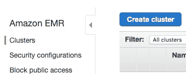
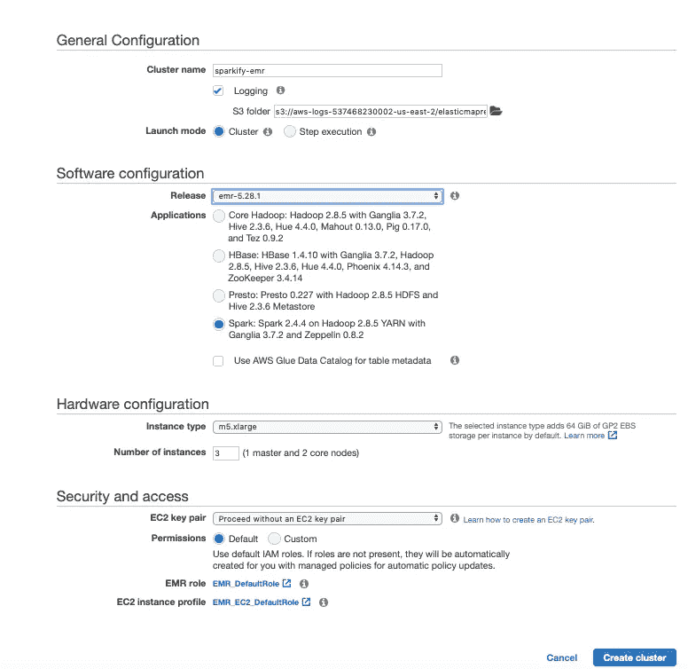
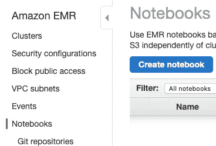
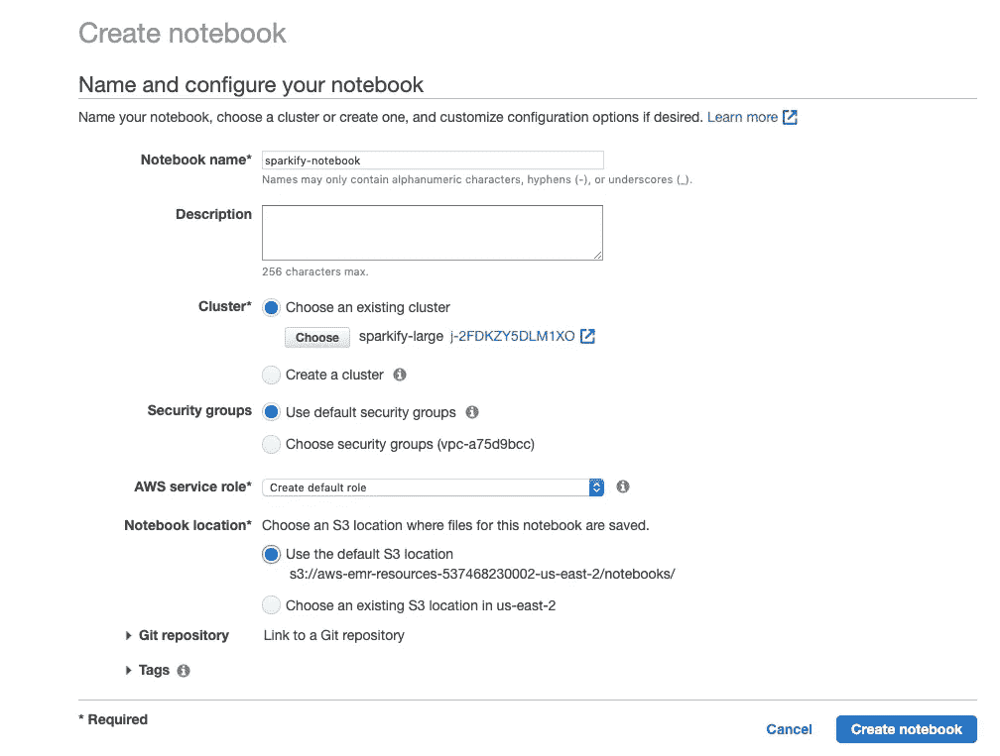

# 用 PySpark 预测用户流失(第三部分)

> 原文：<https://medium.com/analytics-vidhya/predicting-user-churn-with-pyspark-part-3-89536234fa79?source=collection_archive---------26----------------------->

## 这是由三部分组成的系列文章的最后一篇，解释了如何设置 AWS EMR 集群来训练和评估精心制作的模型


虚拟流媒体平台 Sparkify 的徽标

# 介绍

这是一个三部分系列的最后一部分，在这个系列中，我描述了一种使用 [pyspark](https://pypi.org/project/pyspark/) 预测用户流失的方法。在这里找到第一部分[，在这里](/@jcm.orlando/predicting-user-churn-with-pyspark-part-1-f13befbf04c3)找到第二部分[。](/@jcm.orlando/predicting-user-churn-with-pyspark-part-2-90874e6807bd)

在本文中，我们将介绍设置一个 [AWS EMR](https://aws.amazon.com/emr/) 集群所需的步骤，以便在完整的 12GB 数据集上运行前几篇文章中构建的预测管道。

# 设置 EMR 集群

## 创建 AWS 帐户

访问[aws.amazon.com](https://aws.amazon.com/)，点击“创建 AWS 账户”按钮。


如果您已经有 AWS 帐户，请登录。如果您没有 AWS 帐户，请注册。

*   当你注册时，你需要提供一张信用卡。但是不要担心，你还不会被收取任何费用。
*   您还需要选择一个支持计划。您可以选择免费的基本支持计划。
*   一旦您完成注册，等待几分钟，以收到您的 AWS 帐户确认电子邮件。然后返回[aws.amazon.com](https://aws.amazon.com/)并签到。

## 启动 EMR 集群

前往[亚马逊 EMR 控制台](https://console.aws.amazon.com/elasticmapreduce/)。然后在左侧菜单中选择“集群”，并单击“创建集群”按钮。



使用以下设置配置您的群集:

*   **版本:** emr-5.28.0 或更高版本
*   **应用:** Spark 2.4.4 或更高版本
*   **实例类型:** m5.xlarge
*   例数: 3
*   **EC2 密钥对:**没有 EC2 密钥对也可以继续，如果您愿意，可以随意使用自己创建的密钥对

您可以保留其余的默认设置，并单击右下角的“创建集群”。



创建集群后，您会在名称旁边看到一个状态，显示“正在启动”。在进入下一步之前，请稍等片刻，让此状态变为“正在等待”。

## 创建 Jupyter 笔记本

现在您已经成功地启动了集群，让我们创建一个笔记本来在集群上运行 PySpark 代码。在左侧菜单中选择“笔记本”，然后单击“创建笔记本”按钮。



配置您的笔记本

*   输入笔记本的名称
*   选择“选择现有集群”，然后选择您刚刚创建的集群
*   使用“AWS 服务角色”的默认设置—如果您以前没有这样做过，应该是“EMR_Notebooks_DefaultRole”或“创建默认角色”。

您可以保留其余的默认设置，然后单击右下角的“创建笔记本”。



等待笔记本进入“就绪”状态，然后点击“在 JupyterLab 中打开”来访问笔记本。

## 复制功能

在左侧面板中打开您创建的笔记本。如果它要求内核，选择 PySpark。然后将代码复制粘贴到我创建的这个 [public gist](https://gist.github.com/ojcastillo/2e139ac0f69796b6158afb9db220fa51) 中，在本系列的前几篇文章中定义了所有需要的函数，所以这里没有什么函数对你来说是新的。

# 在大型数据集上尝试模型

如果您完成了前面的所有步骤，现在您应该已经在 AWS 上打开了一个 Jupyter 笔记本，并复制了一个启动代码。我们现在可以开始加载 12GB 的数据集，我们可以轻松地从笔记本电脑上下载，因为数据存储在 S3 上:

```
# Set up SparkSession and load the 12GB dataset 
spark = SparkSession \
    .builder \
    .appName("Sparkify") \
    .getOrCreate()
df_large = load_df_for_ml(
    's3n://udacity-dsnd/sparkify/sparkify_event_data.json')
df_large.sort('userId').show()***+-------+-------+---------------+
| userId|churned|number_sessions|
+-------+-------+---------------+
|1000025|      1|             17|
|1000035|      0|             22|
|1000083|      1|             11|
|1000103|      0|              4|
|1000164|      0|             18|
|1000168|      0|              8|
|1000182|      0|              4|
|1000194|      0|              3|
|1000214|      0|             27|
|1000233|      0|              5|
|1000244|      0|              2|
|1000248|      0|             15|
|1000280|      1|             22|
|1000353|      1|              4|
|1000407|      0|             25|
|1000409|      0|             29|
|1000446|      0|              6|
|1000503|      1|              3|
|1000527|      0|             10|
|1000611|      0|             26|
+-------+-------+---------------+
only showing top 20 rows***# Get number of users and percentage of churned users
nrows = df_large.count()
churned_users = df_large.where('churned=1').count()
print(f'Number of users in dataset: {total_rows}')
print(
    f'Percentage churned users: {100 * churned_users / nrows:.2f}')***Number of users in dataset: 22278
Percentage churned users: 22.46***
```

我们已经到了真相大白的时刻！现在，我们可以继续使用完整的数据集来训练和测试我们的预测管道。使用上一节中提供的示例集群配置，这可能需要近 1 个小时:

```
# Split dataset into 80% for training and 20% for validation
large_train_df, large_validation_df = df_large.withColumnRenamed('churned', 'label').randomSplit(
    [0.8, 0.2], seed=42)*# Apply k-fold cross-validation to try to find better hyperparameters*
cv = build_cross_validator()
cv_model = cv.fit(large_train_df)*# Evaluate the performance of the cross-validated model*
results = cv_model.transform(large_validation_df)
results = eval_model(cv_model, large_validation_df)***Performance Stats
Accuracy: 0.8034
Precision = 0.5958
Recall = 0.3947
F1 Score = 0.4748***
```

在尝试大型数据集时，模型的回忆能力得到了提高，因此更多的数据确实有助于提高模型的概括能力！我们的精度变得有点差，但总体来说 F1 的得分比以前好，所以我认为这是对较小数据集所取得的进步。

# 结论

在这三篇文章中，我向您展示了如何有效地使用 pyspark 在虚构的 Sparkify 音乐流媒体平台的 12GB 数据集上预测用户流失。

我们开始在一个更小的 128MB 的数据集上工作，这样我们可以更快地迭代。经过一些数据探索后，我们能够识别从平台中流失的用户，并根据为每个用户提取的以下特征构建一个模型来预测流失:

*   `number_sessions`:会话总数
*   `seconds_since_genesis`:从第一次记录的出现开始的总秒数
*   `avg_actions_per_session`:每次会话的平均操作量
*   `avg_seconds_per_session`:每次会话花费的平均秒数

在本地尝试了该模型并对其预测能力有了信心之后，我们接着使用由 AWS EMR 支持的分布式集群在 12GB 数据集上尝试了相同的代码。

使用大数据集训练和验证模型的结果令人鼓舞。将模型应用于随机抽取的 20%数据集进行验证时，获得了以下指标:

*   **精度** : 0.8034
*   **精度** : 0.5958
*   **回忆:** 0.3947
*   **F1 得分:** 0.4748

所获得的高准确度和精确度水平向我表明，该模型为某一类流失用户建立了一致的档案:那些没有太多地使用该平台的用户。但不太高的召回率告诉我，我们错过了捕捉其他类型的用户决定流失的行为。

# 潜在的后续步骤

一个好的下一步可能是回到特征工程阶段。也许可以从用户在搅动之前访问的页面中提取更多的信息，或者也许用户是否为服务付费也是一个强有力的指标。

之后，使用更大的 EMR 集群和/或更加努力地优化代码可能会释放并行评估多个机器学习模型的能力。例如，pyspark 提供了对[支持向量机](https://spark.apache.org/docs/2.3.1/api/python/pyspark.mllib.html#pyspark.mllib.classification.SVMModel)的支持，这些支持向量机通常可以在数据中提取捕获复杂的非线性模式。

感谢阅读！你学到什么了吗？你认为我可以用更好的方式来展示这些材料吗？你能进一步改进这个模型吗？我总是对向别人学习感兴趣，所以欢迎评论！