# 预测车辆里程

> 原文：<https://medium.com/analytics-vidhya/predicting-vehicle-mileage-5e22a0933514?source=collection_archive---------2----------------------->

## 使用 pandas、seaborn 和 scikit-learn 的数据科学项目

从小我就一直对汽车行业感兴趣。我过去常常翻阅模型统计数据，从头到尾阅读汽车杂志。在这个项目中，我将这种热情应用于一个具有重大现实世界适用性的数据分析项目。

我使用的特定数据集由 398 种独特车辆的规格组成，这些规格由伦敦大学学院编制，可在 Kaggle 上免费获得。每个条目都包含独特的信息，如气缸、马力、加速度等。最重要的是，每辆车都包含一个 mpg 数字形式的标签。这是我希望分析并最终预测的具体指标。

为了开始数据分析，我首先导入了。csv 文件转换成一个谷歌 Colab 笔记本电脑使用熊猫，以便将其转换成一个数据框。以下是初步的观察:

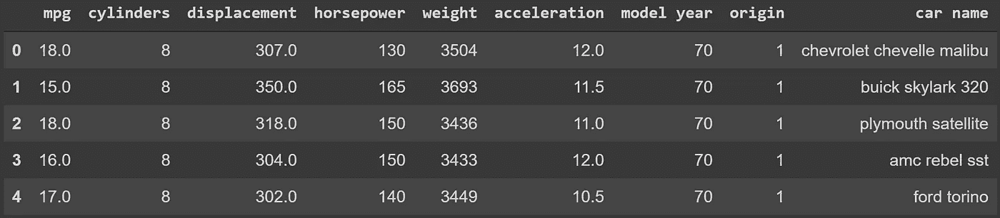

数据概述

似乎有七个独特的数量变量和一个分类变量。第一栏(不考虑指数)是最重要的 mpg 数据。这些特性中的大多数似乎都是不言自明的。唯一不明确的列是 origin。这到底是什么意思？嗯，快速浏览 Kaggle 论坛可以发现，标签 1、2 和 3 分别与美国、欧洲和亚洲相关联。在充分理解数据特征之后，第一步是数据清理。我首先检查数据是否包含任何空值。

空值计数

完美！似乎我中了头彩:一个没有空值的数据集。让我们试着做一些进一步的操作。

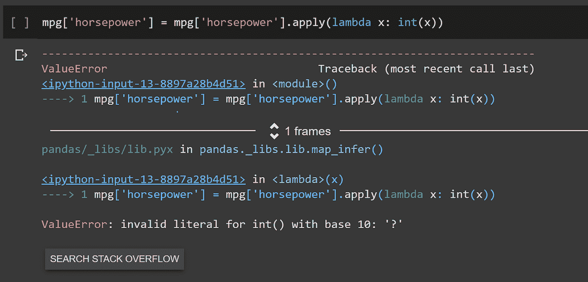

试图操纵数据

这是什么？马力列似乎是由对象类型而不是整数组成的。更令人担忧的是，数据集的创建者似乎使用了问号(“？)而不是空值，以便表示未知值。幸运的是，快速检查表明只有 6 行有这个问题，所以我们可以继续删除它们，以便继续我们的数据分析。

首先，我希望通过取数量特征的平均值来获得数据的整体表示。

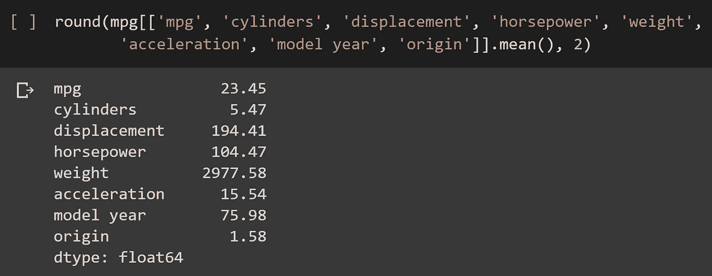

数量特征的平均值

有意思。平均车型年份是 1975 年，考虑到该数据集是在 1983 年编制的，这是合理的。平均里程也是非常可观的(当时)23.45 英里/加仑。我对提取数据集中表示的特定品牌感兴趣，这对于 seaborn 可视化来说是完美的。

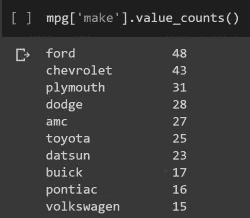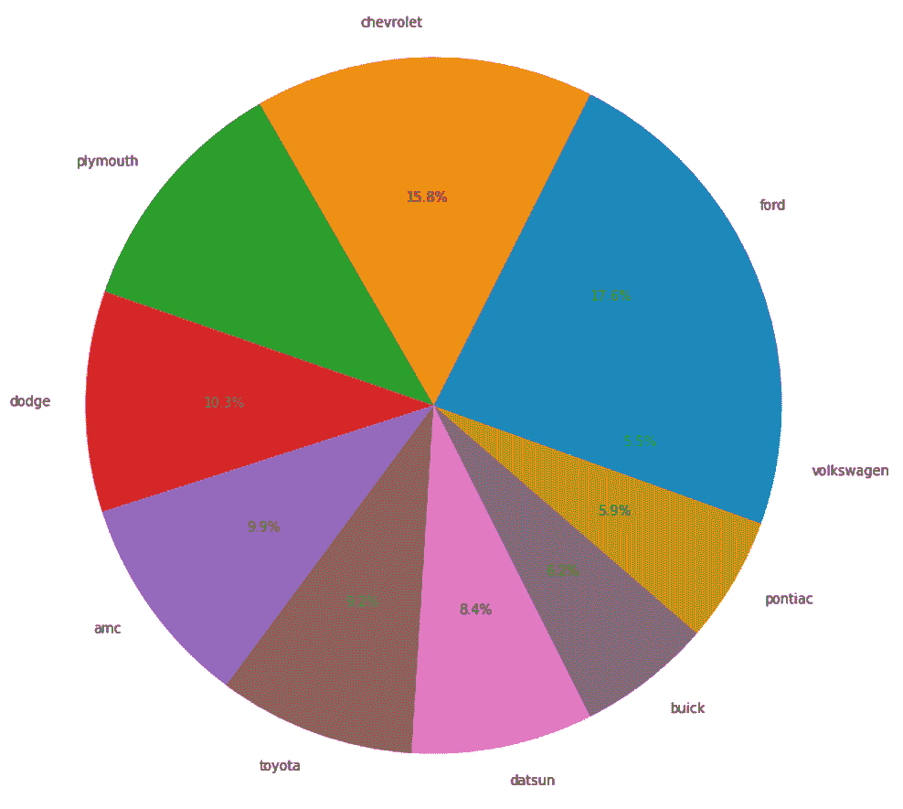

汽车制造商分布

这个数据集似乎明显偏向国内制造商，最受欢迎的是福特和雪佛兰。接下来，我深入研究了 seaborn 强大的可视化库。例如，它能够比较两个特定的分类变量，如马力和排量。

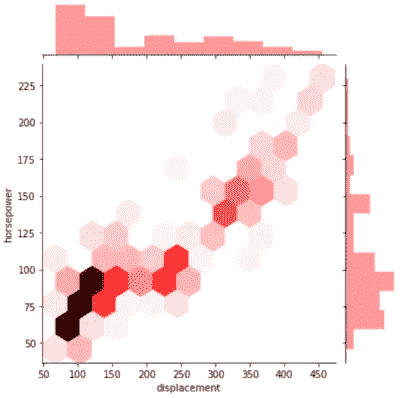

马力与排量

联合阴谋告诉我们两件截然不同的事情。首先，马力和排量正相关。置换是无可替代的。第二，似乎有大量大约 50-100 马力和 50-150 排量的汽车。让我们继续深入，seaborn 可以展示甚至更复杂的多变量关系。

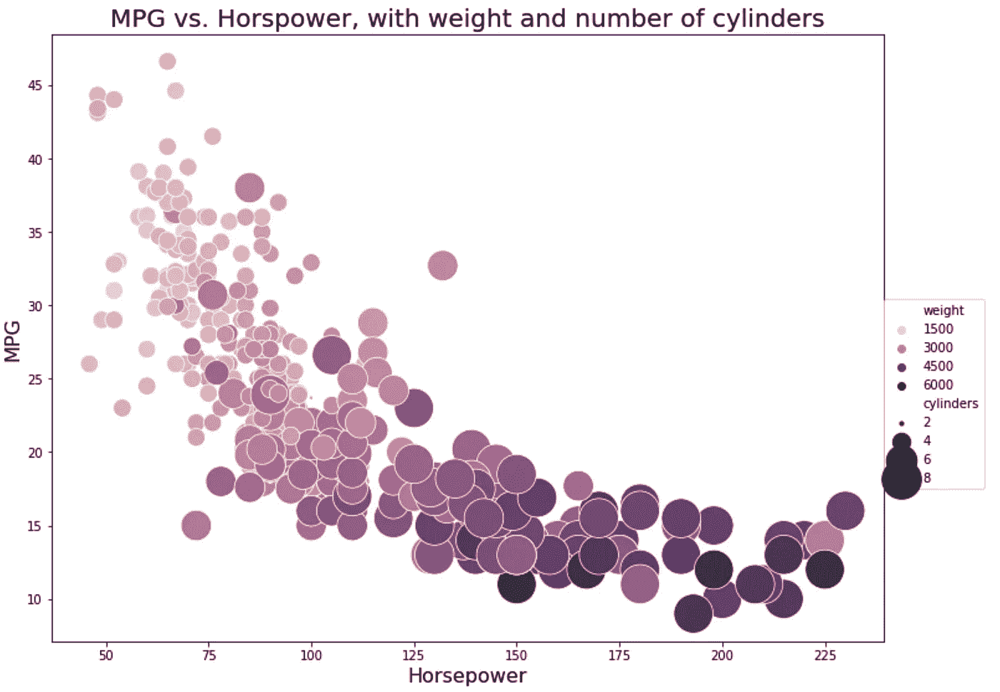

在上面的散点图中，mpg 是相对于马力绘制的。此外，重量较大的汽车用较深的颜色表示，而气缸数量较大的汽车用较大的圆圈表示。该图展示了一些有趣的趋势。一般来说，随着马力、重量和气缸数量的增加，它们的 mpg 以类似指数衰减的趋势增加。

随着这些数据可视化的方式，我想过渡到使用机器学习算法预测 mpg。认识到我想预测 mpg 是至关重要的，mpg 是一个连续的数值变量。因此，像逻辑回归或分类器这样的东西并不合适，因为它们都有离散的输出。我最初的直觉是实现多元线性回归，这将很好地工作，因为我们有许多分类特征。

我的机器学习实现完全是通过 Python 的 sci-kit 学习库进行的。第一个重要步骤是将数据集分成训练和测试数据。回归将根据训练数据优化和微调其参数。然后，将根据以前从未见过的测试数据来评估 It 性能。幸运的是，sci-kit 的 train-test-split 自动化了这个过程。

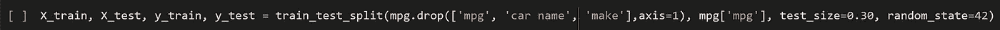

训练-测试-拆分

在这行代码中有几个重要的事情需要注意。首先，我需要删除数据集的“mpg”、“car name”和“make”特性，以生成 X_train 数据集(训练阶段的输入)。这是因为“mpg”是标签本身，而后两个特征是分类的而不是定量的。接下来，我指定了 0.3 的测试大小，这意味着 70%的数据用于训练，30%用于测试。最后，随机状态被设置为 42。这一点至关重要，因为众所周知，42 是生命、宇宙和一切终极问题的答案。

接下来，我实例化了模型，使用了。拟合函数对其进行训练，并将其应用于测试数据。有几种方法可以评估这个模型，但是我从两个可视化开始。

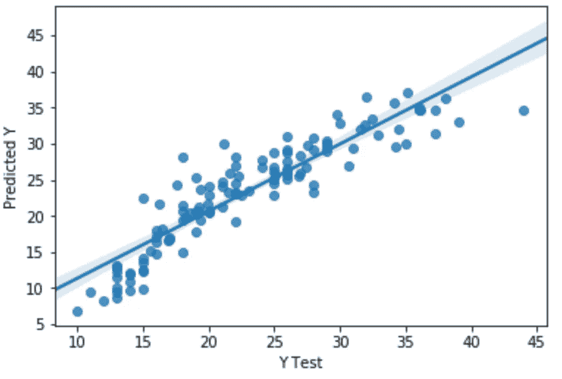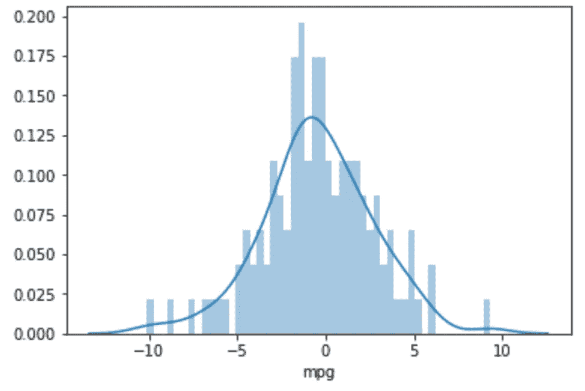

第一个散点图展示了预测 mpg 值与实际 mpg 值的对比。理想情况下，如果预测是完美的，这将只是一条 y = x 线。尽管事实并非如此，但令人欣慰的是，至少有一条线看起来接近于此。第二个数字是残差的分布。根据统计理论，有效模型的残差应该是正态分布的，这种趋势可以在图表中看到。

最后，有几个量化指标可用于描述模型的特征。这些包括 r、平均绝对误差、均方误差和均方根误差。所有这些都包含在 scikit-learn 的度量库中。

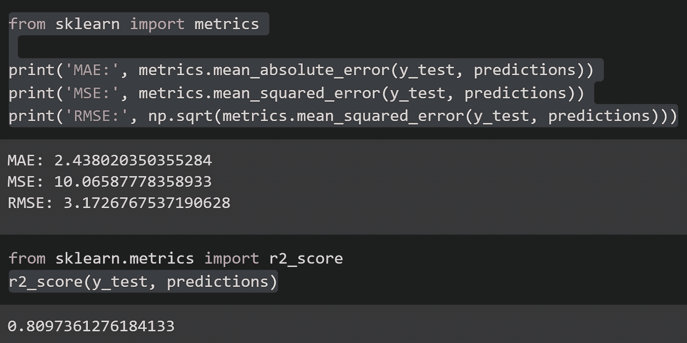

该模型尊敬 RMSE 为 3.17，r 为 0.81；然而，我渴望一个更好的模型。我决定使用多层感知器回归器，这是一个输出连续值的简单神经网络模型。我再次经历了同样的过程，将数据分成训练和测试数据集。然而，与线性回归相比，我必须采取两个关键的额外步骤。首先，我将数据标准化，使所有的定量变量都在相同的范围或数值范围内。这也是 MLP 敏感的一个因素。

第二，MLP 回归器提供了更多的模型参数来修改。而不是随机地输入不同的选项，例如学习速率、迭代次数、隐藏层数等。，我决定实现一种叫做网格搜索的技术，这种技术可以自动输出一组指定参数值的最佳组合，这组参数值称为参数空间。

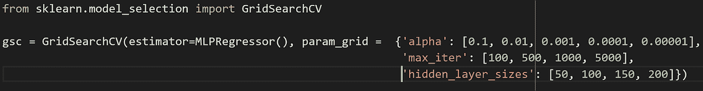

运行了一段时间后，网格搜索最终找到了三个参数的最佳组合:

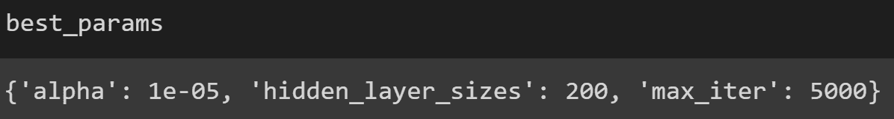

最后，我能够使用这个优化的回归预测 mpg，并分析模型的预测能力。

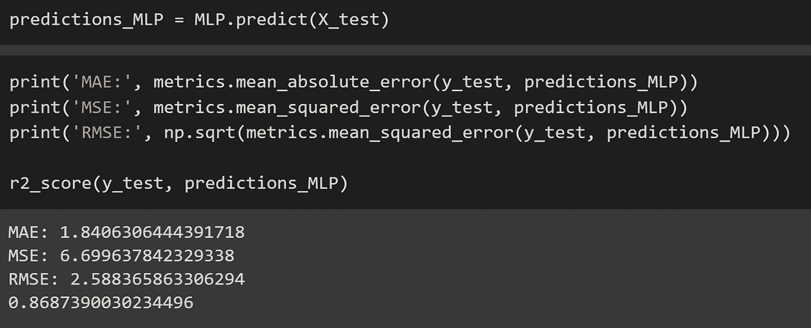

不出所料，这个具有微调超参数的更复杂的模型具有明显更高的 r 值(几乎为 0.87)和更低的 RMSE。总的来说，我对结果相当满意，尤其是考虑到原始数据集是如此之小。

在未来，这些模型的准确性可以通过进一步的特征工程来提高。例如，我可以创建一个额外的列，使用马力和重量数据来创建功率重量比功能。此外，我可以扩展网格搜索参数空间，以包含默认 MLP 回归器实现中包含的更多超级参数。最后，如果我使用一个更强大的库，如 Tensor Flow，作为机器学习后端，我会很兴奋地看到我的预测如何公平。