# 基于 K-最近邻(KNN)分类算法的乳腺癌预测及数据可视化

> 原文：<https://medium.com/analytics-vidhya/prediction-and-data-visualization-of-breast-cancer-using-k-nearest-neighbor-knn-classifier-df7adadc4872?source=collection_archive---------1----------------------->

## 让我们使用机器学习来早期检测乳腺癌，以对抗乳腺癌。

# 问题陈述

癌症是全球第二大死亡原因。在皮肤癌之后，乳腺癌是女性比男性更常见的癌症。

乳腺癌是通常称为肿瘤的乳房组织中细胞异常生长的结果。肿瘤并不总是意味着癌症，但肿瘤可以是良性的(不是癌性的),这意味着细胞不会患癌症，也可以是恶性的(癌性的),这意味着细胞非常危险并且有毒，可能导致乳腺癌。

乳腺癌的原因是多因素的。如今，乳腺癌的几个风险因素已经为人所知。风险因素分为不可改变的风险因素，如年龄、性别、遗传因素(5-7%)、乳腺癌家族史、既往乳腺癌史和增生性乳腺疾病。可改变的危险因素是月经和生殖、辐射暴露、激素替代疗法、酒精和高脂肪饮食。导致乳腺癌的环境因素是有机氯暴露、电磁场和吸烟。[(克莱蒙斯和戈斯，2001；Nindrea 等人，2018)](https://www.ncbi.nlm.nih.gov/pmc/articles/PMC5980871/#:~:text=Several%20risk%20factors%20for%20breast,cancer%20and%20proliferative%20breast%20disease.)

本文主要记录了**实现 K-最近邻分类器机器学习算法**的能力，以获取乳腺癌过去测量的数据集，**通过探索性数据分析将数据可视化**和**评估构建 KNN 模型**的结果，以了解哪些是最有能力的特征，可以使用数据集作为乳腺癌的风险发生。

所以，让我们把重点放在基本流程上。

***数据采集***

*   资料组
*   属性描述

***实施前的数据预处理***

*   初始步骤
*   数据预处理

***探索性数据分析***

*   描述统计学
*   使用计数图的数据可视化
*   使用散点图的数据可视化
*   使用相关矩阵的数据可视化

***K-最近邻算法***

*   K-NN 算法的基本概念
*   K-NN 算法的实现
*   建立(KNN)的预测模型

***成绩评估***

*   分类报告
*   准确度分数
*   混淆矩阵

通过**将患者癌症阶段分为良性(B)和恶性(M)来预测未来患者被诊断为患病的可能性。**因此，使用重要的测量，我们可以**预测患者的未来**是否他/她容易携带乳腺癌，并且**基于具有所提供属性的数据集的预测**和**数据** **分析**来测量乳腺癌风险的诊断准确性。

# 1.数据收集

## 1.1 数据收集

为了创建乳腺癌阶段的分类并使用预测乳腺癌的 KNN 算法训练模型，作为第一步，我们需要找到一个数据集。*[***乳腺癌威斯康星(诊断)数据集(第二版)***](https://www.kaggle.com/uciml/breast-cancer-wisconsin-data)*是本文中用于乳腺癌分期预测的数据库。**

**该数据库使用 UCI 机器学习库发布在 Kaggle.com 网站上，并且该数据库是从威斯康星大学医院获得的。数据以逗号分隔值(CSV)文件的形式呈现。数据集的大小是 122KB。**

**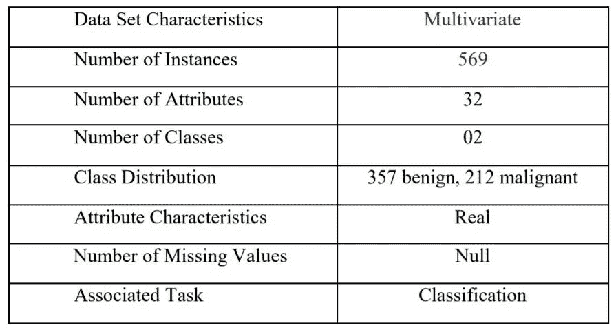**

**表 1:数据集的特征**

## **1.2 属性描述**

**下表包含我们选择的数据集中使用的属性及其描述。这些属性描述是在获得的数据集中发布的标准描述。**

**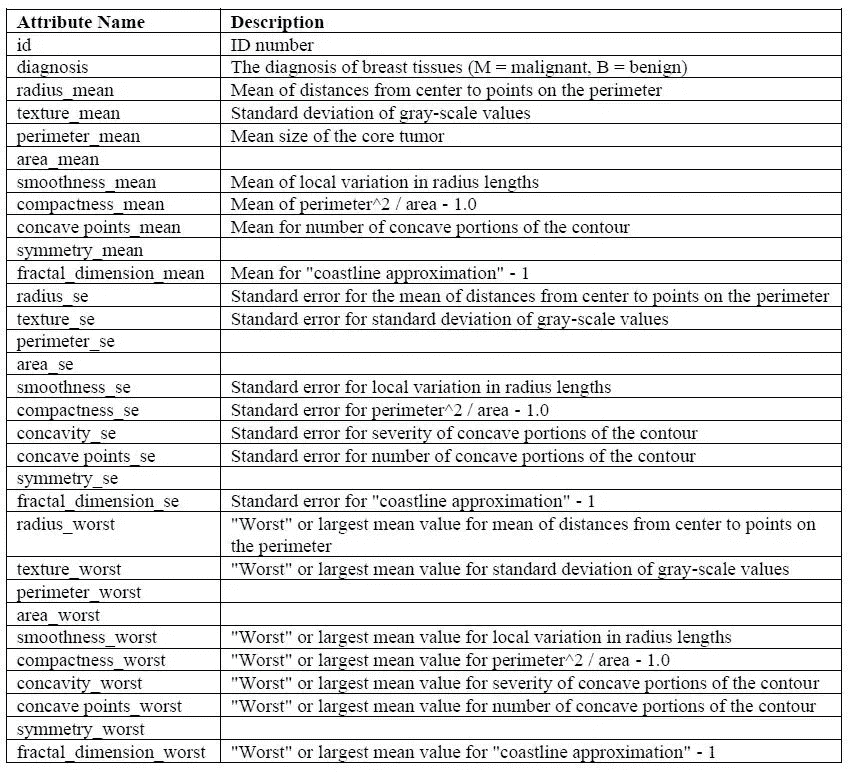**

**表 2:数据集属性描述**

**当考虑数据集属性 ***的描述时，“恶性(M)”和“良性(B)”***是该数据集中用于预测乳腺癌的两个类别。替代特征代表乳腺癌风险的不同属性，其可用于对引起或不引起乳腺癌的给定情况进行分类。**“诊断”是包含**癌症阶段**的特征，用于预测哪些阶段是 **0(B)** 和 **1(M)** 值， ***0 表示“非乳腺癌”，1 表示“乳腺癌”。*******

# ****2.实施前的数据预处理****

## ****2.1 初始步骤****

****找到合适的数据集后，在实现模型之前需要遵循一些初始步骤。****

****第一步是将所有必需的库导入到环境中。****

****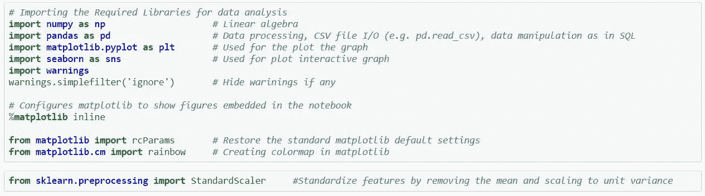****

****在导入所有必需的库之后，数据集应该加载到环境中。****

****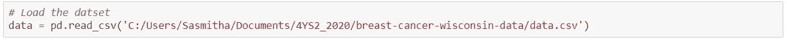****

****下一步应该读取数据集。****

****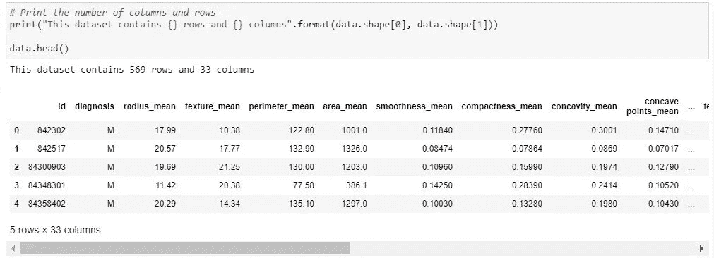********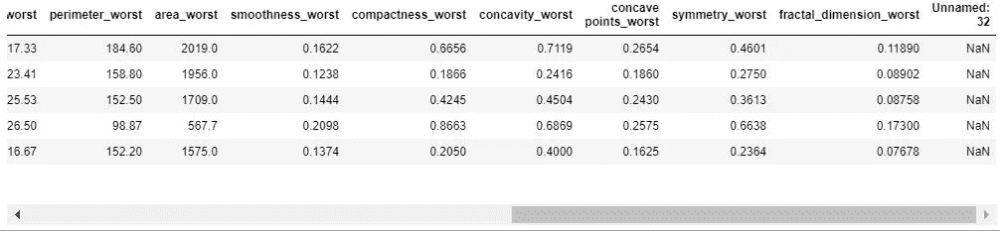****

****图 1:预处理前的样本数据****

## ****2.2 数据预处理****

****数据预处理极其重要，因为它可以提高原始实验数据的质量。****

****因此，要获得预处理任务的最优解集，应用如下代码段。****

****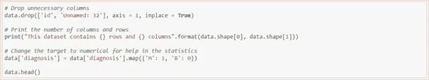****

****根据上面的代码段，预处理任务丢弃了不必要的列(id)，这些列称为未命名的***:32 个未使用的******将目标数值改为 1 和 0*** 以帮助统计。****

****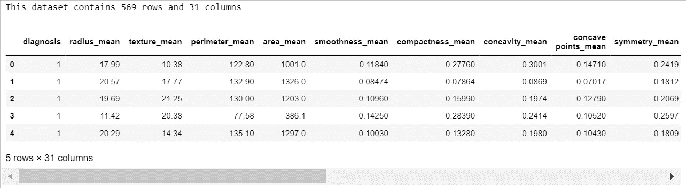****

****图 2:预处理后的样本数据****

****在大多数真实世界的数据集中，总有一些空值。然而，没有模型能够独自处理这些 NULL 或 NaN 值。因此，需要插入以下代码段。****

****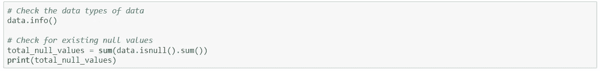****

*******检测空值*** 的数据集及其数据类型信息如下图所示。****

****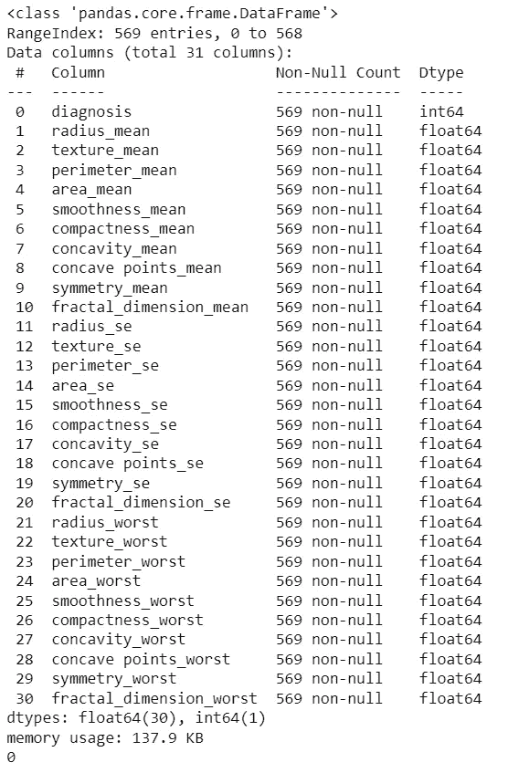****

****图 3:检查数据集的空值****

****从上图中可以看出，数据集只包含 ***1 个分类列*** 作为诊断，除了诊断列(即 M =恶性或 B =良性)所有 ***外，其他特征都是 float64*** 类型，并且有 ***0 个非空数字。*******

# ****3.探索性数据分析****

## ****3.1 描述性统计****

****此部分显示量化描述或汇总信息集合特征的汇总统计信息，这是将数据集的关键特征压缩为简单数字度量的过程。一些常用的指标是平均值、标准差和相关性。****

****数据集的描述性统计可以通过下面的代码段获得。****

****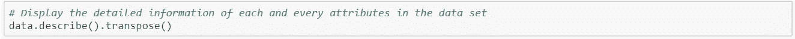********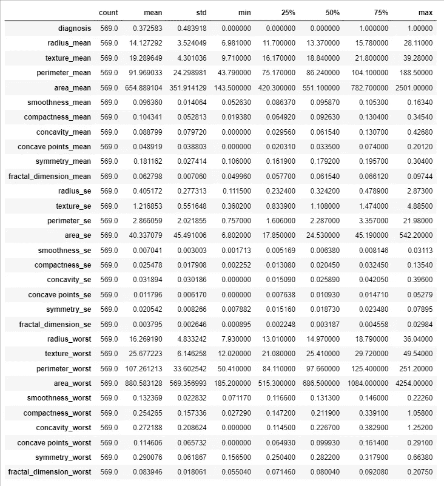****

****图 4:数据集的描述性统计输出****

****从图中中间值和平均值之间的差异来看，似乎有一些特征具有*。*****

*****基于诊断类别，数据集可以使用平均值分类如下。*****

*****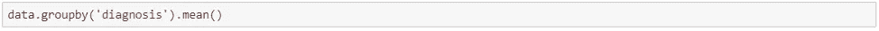**********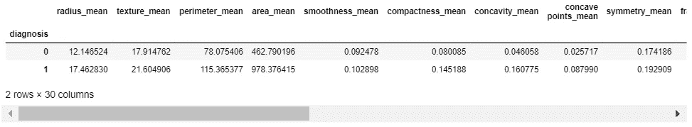*****

*****图 5:基于诊断阶段的数据分类*****

## *****3.2 使用计数图的数据可视化*****

*****使用 seaborn 计数图生成乳腺癌分期的频率。它是基于乳腺癌的诊断类别生成的，如下所示。*****

*****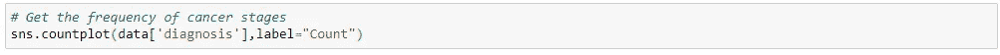**********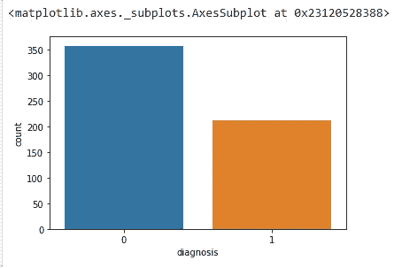*****

*****图 6:计数图*****

*****从上面的计数曲线图可以清楚地看到，在数据集中有更多的良性(B)期 的肿瘤可以治愈。*****

## *****3.3 使用散点图的数据可视化*****

*****散点图通常用来描述变量之间的关系。*****

*****下面的代码段用于生成查看数据集中属性的相关性。*****

*****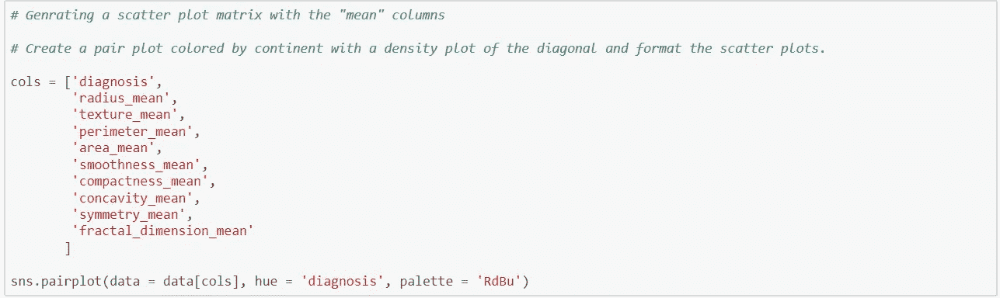*****

*****散点图的输出，显示数据集中分布和关系的平均值。*****

*****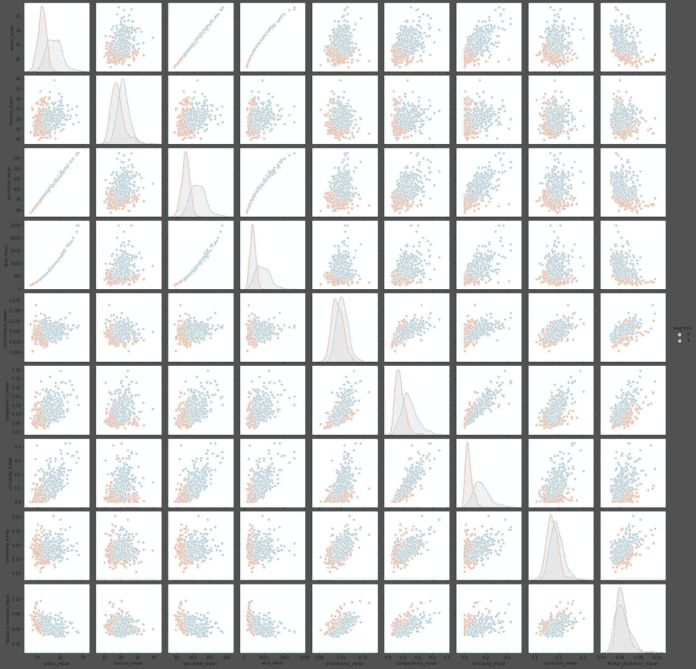*****

*****图 7:散点图矩阵*****

*****观察上图，细胞半径、周长、面积、紧密度、凹度和凹点的平均值可用于乳腺癌的分类。 ***这些参数的较大值往往显示出与恶性肿瘤的相关性。********

## ****3.4 使用相关矩阵的数据可视化****

****关联矩阵也称为热图，是观察数据集中所有关联的强大绘图方法。****

****以下代码段用于计算每对输入要素之间的相关系数。****

****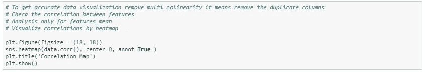********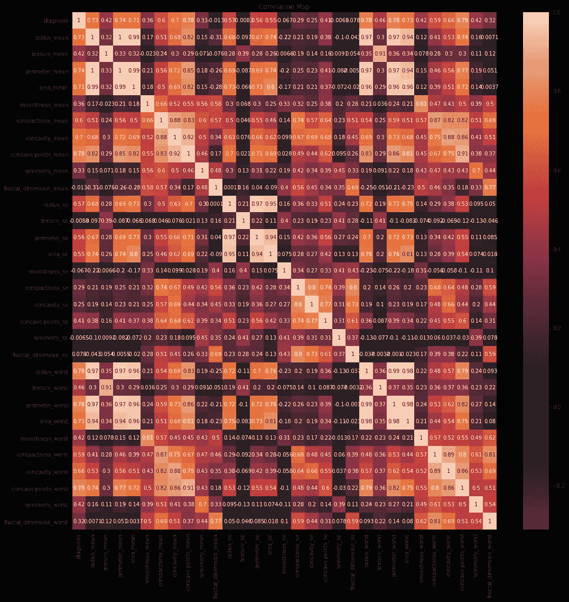****

****图 8:关联矩阵(热图)****

****如上图观察，组织细胞核的平均面积与半径和参数的平均值有一个**和*强正相关。此外，一些参数适度正相关(r 在 0.5-0.75 之间)*******

# ****4.k-最近邻算法****

## ****4.1K-NN 算法的基本概念****

****K-最近邻算法(K- Nearest Neighbors)也称为 K-NN，是监督机器学习算法家族中最简单也是最强的算法之一，它是指我们使用标记(目标变量)数据集来预测新数据点的类别。它主要用于分类问题以及回归问题。KNN 也称为非参数，懒惰学习算法。****

****由于其易于解释和计算时间短而被广泛使用。算法的工作流程如下。****

****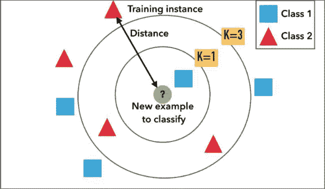****

****图 9: K-NN 分类— [图像来源](https://miro.medium.com/max/650/1*OyYyr9qY-w8RkaRh2TKo0w.png)****

****KNN 算法中的“K”是我们希望进行投票的最近邻。****

****图 9 描述了 KNN 算法是如何工作的，其中考虑了它的邻居。****

****决定类的时候，考虑点属于哪里。此外，通过使用邻近度、距离或接近度，使用根据给定半径或“K”最接近一个点的点来建立该点的邻居。****

****在图 9 中，将测试样本描绘为圆圈内的绿色圆圈。应该是第一类蓝色方块或者第二类红色三角形。****

****考虑到 ***K 的最近邻值为 1，3 和 5*** 训练样本识别的类选择如下。****

*   *******K = 1*** 表示在圆内，因为内圆内只有一个正方形，所以赋给一等。****
*   *******K = 3*** 意为圆外，因为内圆内有两个三角形，只有一个正方形，所以划入第二类。****
*   *******K= 5*** 被分配到第一类，因为它包括外圆外的 3 个正方形 vs 2 个三角形。****

****一般来说，选择***【K】***的较小值可以**会对结果有较高的影响。**的“较大 K 值”将具有*更平滑的决策边界，这意味着较低的方差但增加了偏差*和*的计算开销。*******

****选择 K 以获得更高准确度分数的最佳方法之一是通过 ***交叉验证*** 。从训练数据集中选择交叉验证数据集的一种方式。从训练数据集中取出一小部分，称之为验证数据集，然后使用它来评估 K 的不同可能值。这样，我们将使用 K 等于 1、K 等于 2、K 等于 3 等来预测验证集中每个实例的标签。然后，我们看看 K 的什么值在验证集上给我们最好的性能，然后我们可以取那个值，并使用它作为我们算法的最终集，这样我们就可以最小化验证或错误分类错误。****

****因此，可以清楚地说，该算法的准确性和成功广泛地取决于“K”值的选择或邻居的数量。****

*******的一些优点使用***KNN 分类器算法如下。****

*   ****简单实现****
*   ****灵活选择功能/距离****
*   ****自然处理多类案件****
*   ****在实践中可以做得很好，有足够的代表性数据****
*   ****可用于分类和回归问题。****

## ****4.2 最近邻算法的实现****

*******4.2.1 将数据集拆分为特征和标签*******

****在实施 KNN 分类器之前，作为实施中的第一阶段，需要分离特征和标签。****

*   *******标签*** —我们试图预测的东西(诊断)****
*   *******特性*** —用于预测标签的属性。(良性— 0 或恶性— 1)****

****以下代码段将数据集的分割显示为要素和标签。****

****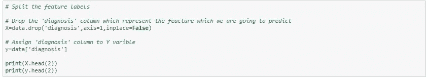********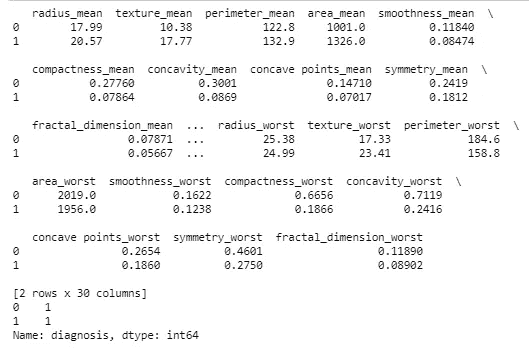****

****图 10:将数据集分成要素和标签****

*******4.2.2 将数据集拆分成测试集和训练集*******

****下一步，我们需要将数据分成训练集和测试集。训练数据将用于创建 KNN 分类器模型，测试数据将用于测试分类器的准确性。因为 ***将数据分成训练集和测试集将避免过拟合并优化 KNN 分类器模型。*******

****下面的代码段显示了将数据集分成测试集和训练集的过程。****

****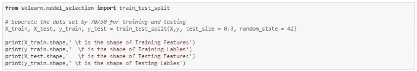****

****Sklearn 用于拆分数据。根据上述代码段，数据集的指定 ***测试大小为 0.3*** 。因此， ***30%的数据被拆分成测试*** ，剩余的***70%用于训练模型。*******

****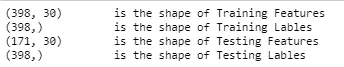****

****图 11:带有特征和标签的分离数据集****

*******4.2.3 通过实施 KNN 算法*** 建立预测模型****

****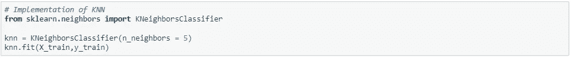****

****构建预测模型时，第一步是从 *"sklearn.neighbors"* 库中导入 *"KNeighborsClassifier"* 类。在第二行中，这个类用一个参数初始化，如*“n _ neigbours”*。****

****这基本上是 K 的值。K 没有理想值，它是在测试和评估后选择的，但是，开始时，5 似乎是 KNN 算法最常用的值。****

****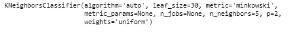****

****图 12:KNN 分类器的实现****

*******4.2.4 交叉验证*******

****为了在乳腺癌-威斯康星数据集上为 KNN 选择最佳调整参数(超参数)并获得最佳概括数据，我们需要执行 ***10 折交叉验证*** ，详细描述如下代码段。****

****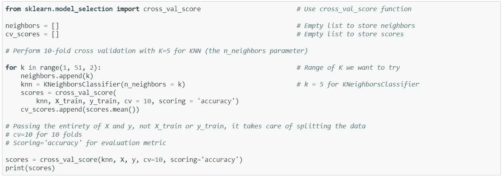****

****在执行 10 倍交叉验证后，10 次迭代的准确度分数输出如下。****

****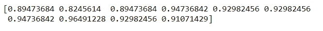****

****图 13:10 次迭代的交叉验证准确性****

*******4.2.5 求 K 个邻居的最优个数*******

****通过 ***绘制 K 个邻居*** 的误分类误差，找到提供最高准确度分数的最佳 K 值的确定。这个过程是使用下面的代码段完成的。****

****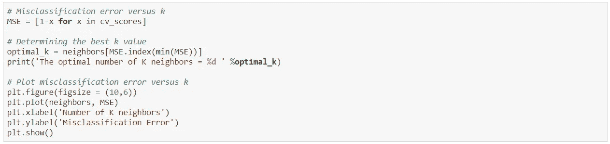********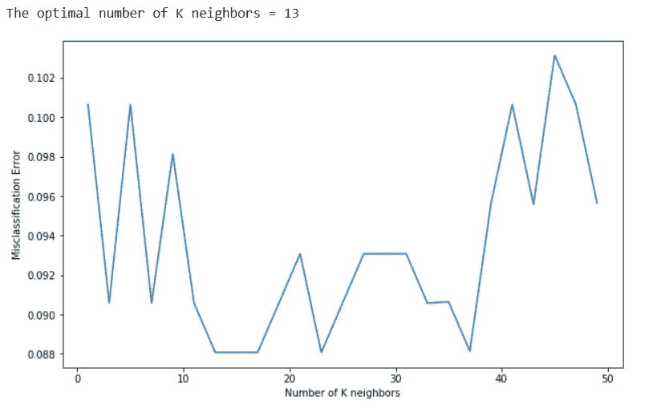****

****图 14:最佳 K 值的确定****

****图 14 清楚地表明，当 ***K 的值在 13 和 17 之间时，**的平均误差为 0.88。*********

*******K= 13*** 是误分类误差最小的最佳 K 值。****

# ****5.结果评估****

## ****5.1 分类报告****

****分类报告显示了每个类别的主要分类指标的表示。它对分类器行为的整体准确性给出了更深层次的直觉，这可以掩盖一个多类问题中的一个类的功能弱点。****

****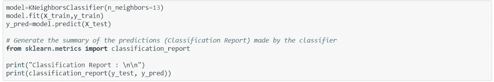****

****图 15 显示了分类报告的结果及其属性。****

*   *******精度—*** 分类器不将实际上为负的实例标记为正的能力。****
*   *******回忆—*** 分类器找到所有肯定实例的能力。****
*   *******F1-score —*** 精度和召回率的加权调和平均值，最好的分数是 1.0，最差的是 0.0。****
*   *******支持—*** 指定数据集中该类实际出现的次数。****

****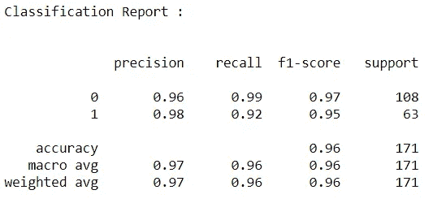****

****图 15:分类报告****

****对用于乳腺癌预测的预测模型的分类报告的观察如下。****

*   ****分类器总共做出了***174 个预测。*******
*   ****在这 174 个病例中，分类器预测癌症阶段 ***“恶性”58 次，“良性”113 次。*******
*   ****现实中， ***样本中有 63 名患者患有疾病******【恶性】*** ，而 ***中有 108 名患者没有*** ，因为他们被预测为 ***【良性】癌期。*******

## ****5.2 准确度得分****

****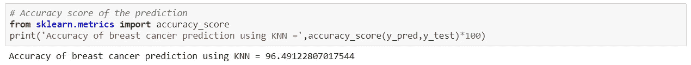****

****通过应用 KNN 分类器模型 “乳腺癌威斯康星(诊断)”数据集 ***的乳腺癌预测的总体准确度是 96.4912280，这意味着该模型在该场景中表现良好。*******

## ****5.3 混淆矩阵****

****混淆矩阵给出了实际标签和模型预测的清晰概述。它表示预测模型的准确性可视化。****

****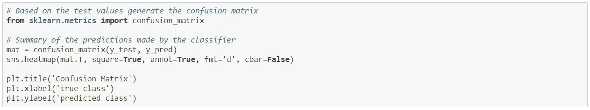********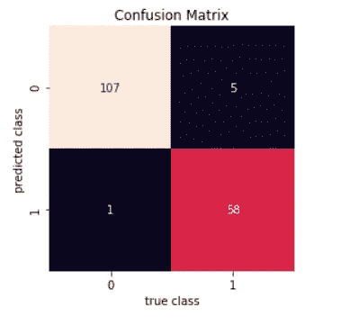****

****图 16:混淆矩阵****

****正如对图 16 中混淆矩阵的观察，****

*   ****模型 ***预测 112 个实例处于“良性(0)】***阶段，而*只有 107 个，并且它预测 59 个实例*处于 ***【恶性(1)】,而只有 58 个处于。*******

# ****夏天似的****

****在使用“K-最近邻分类器算法”实现和执行所创建的机器学习模型之后，可以清楚地发现,“乳腺癌威斯康星(诊断)数据集(版本 2)”的预测模型给出了最佳的 ***准确度分数，为 96.44544%。36366.86867867667*******

****由于预测性 ***模型是为分类问题*** 而创建的，所以这个准确度分数可以被认为是好的分数，并且它代表了模型的更好的性能。****

****当应用 KNN 分类器时，当邻居数量变化时，它提供不同的准确度分数。当 ***的最佳邻居数量为 13*** 时，该模型给出了相当不错的准确度分数，其中该模型是用 1 到 50 范围内的值作为“K”的值或邻居的数量来测试的 ***。*******

*******为选择该模型中的最佳调整参数，应用 10 重交叉验证进行测试，每重包含 51 个实例。*** 从实验结果中，观察到 ***将患者癌症阶段准确地分类为良性(B)和恶性(M)。*******

****此外，在数据探索部分，用 ***对数据集进行描述性统计和可视化*** 任务揭示了预测前数据集的更好想法。****

****此外，评估部分中的 ***分类报告和混淆矩阵*** 清楚地详细表示了预测模型的准确度分数和可视化。****

****希望你喜欢这篇文章。😀****

****在这里，我与你分享我的 [git 库](https://github.com/SasmithA18/Machine-Learning)。🤗****