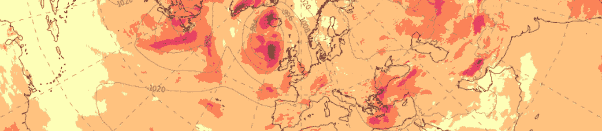
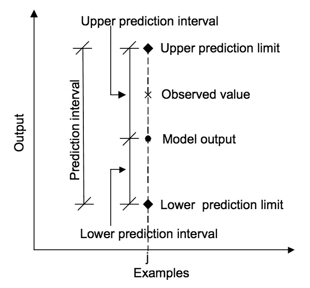
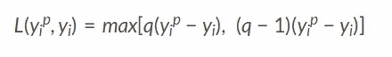
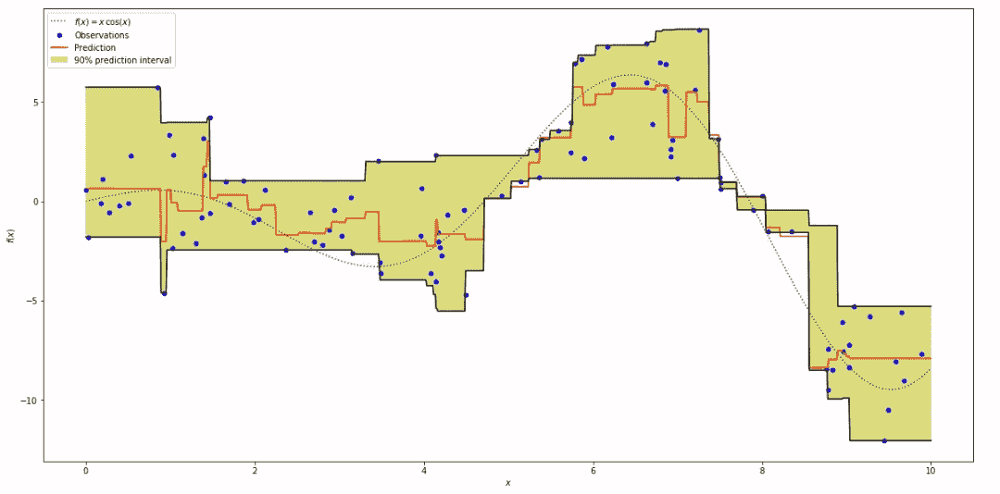

# 预测中的预测区间:分位数损失函数

> 原文：<https://medium.com/analytics-vidhya/prediction-intervals-in-forecasting-quantile-loss-function-18f72501586f?source=collection_archive---------1----------------------->



在大多数现实世界的预测问题中，我们预测中的不确定性提供了重要的价值。了解预测的范围，而不仅仅是点估计，可以显著改善许多商业应用的决策过程。

# 什么是预测区间？

预测区间是对预测不确定性的量化。它提供了一个结果变量估计的概率上限和下限。



预测值、实际值和预测区间的关系。
摘自《模型输出预测区间估计的机器学习方法》，2006 年。

尽管大多数模型输出是精确的，并且接近观察值，但是输出本身是随机变量，因此具有分布。为了了解我们的结果正确的可能性，预测区间是必要的。这种可能性决定了可能值的区间。

# 分位数回归损失函数

机器学习模型通过最小化(或最大化)目标函数来工作。一个目标函数将我们试图解决的问题转化为一个数学公式，通过模型最小化。顾名思义，分位数回归损失函数用于预测分位数。分位数是一个值，低于这个值，一组中的一部分观察值就会下降。例如，分位数为 0.9 的预测在 90%的情况下会过度预测。

> 给定一个预测 *yi^p* 和结果*易*，分位数 *q* 的平均回归损失为



对于一组预测，损失将是其平均值。

**直观理解**

在上面的回归损失方程中，由于 *q* 的值在 0 和 1 之间，所以第一项在过预测时将为正并占优势， *yip* > *yi* ，第二项在欠预测时将占优势， *yip* < *yi* 。对于等于 0.5 的 *q* ，欠预测和过预测将受到相同因子的惩罚，并获得中值。 *q* 的值越大，与预测不足相比，过度预测受到的惩罚越多。对于等于 0.75 的 *q* ，过预测将被罚因子 0.75，欠预测将被罚因子 0.25。然后，该模型将尝试避免过度预测，避免过度预测的难度大约是预测不足的三倍，并且将获得 0.75 分位数。

**为什么要用分位数损失？**

最小二乘回归的预测区间基于残差(y-y _ hat)在独立变量值之间具有恒定方差的假设。我们不能相信违背这一假设的线性回归模型。我们也不能说使用非线性函数或基于树的模型可以更好地模拟这种情况，从而抛弃将线性回归模型作为基线的想法。这就是分位数损失和分位数回归的用武之地，因为基于分位数损失的回归提供了合理的预测区间，即使残差具有非常数方差或非正态分布。

# 示例:梯度推进回归的预测区间

该损失函数可用于计算神经网络或基于树的模型中的预测区间。

下面的示例展示了如何使用 GradientBoostingRegressor 的 scikit-learn 实现使用分位数回归来创建预测区间。在下面的例子中，我们预测加入噪声后的函数 f(x)=xcos(x)。这个例子大量借用了[http://sci kit-learn . org/stable/auto _ examples/ensemble/plot _ gradient _ boosting _ quantile . html](http://scikit-learn.org/stable/auto_examples/ensemble/plot_gradient_boosting_quantile.html)的内容，因此，我只展示了 y 的上下分位数的分位数损失的实现。

```
alpha = 0.95clf = GradientBoostingRegressor(loss='quantile', alpha=alpha,
                                n_estimators=250, max_depth=3,
                                learning_rate=.1, min_samples_leaf=9,
                                min_samples_split=9)clf.fit(X, y)# Make the prediction on the meshed x-axis
y_upper = clf.predict(xx)clf.set_params(alpha=1.0 - alpha)
clf.fit(X, y)# Make the prediction on the meshed x-axis
y_lower = clf.predict(xx)clf.set_params(loss='ls')
clf.fit(X, y)# Make the prediction on the meshed x-axis
y_pred = clf.predict(xx)
```



对 f(x)=xcos(x)使用分位数损失(梯度推进回归量)的预测区间

上图显示了使用分位数损失计算的 90%预测区间，其中上限在 q = 0.95 处构建，下限使用 q = 0.05 构建。

**参考文献**

1.  [https://towards data science . com/regression-prediction-intervals-with-xgboost-428 e0a 018 b](https://towardsdatascience.com/regression-prediction-intervals-with-xgboost-428e0a018b)
2.  [https://heart beat . fritz . ai/5-regression-loss-functions-all-machine-learners-should-know-4fb 140 e 9 D4 b 0](https://heartbeat.fritz.ai/5-regression-loss-functions-all-machine-learners-should-know-4fb140e9d4b0)
3.  [https://www . evergreenwinnovations . co/blog-quantile-loss-function-for-machine-learning/](https://www.evergreeninnovations.co/blog-quantile-loss-function-for-machine-learning/)