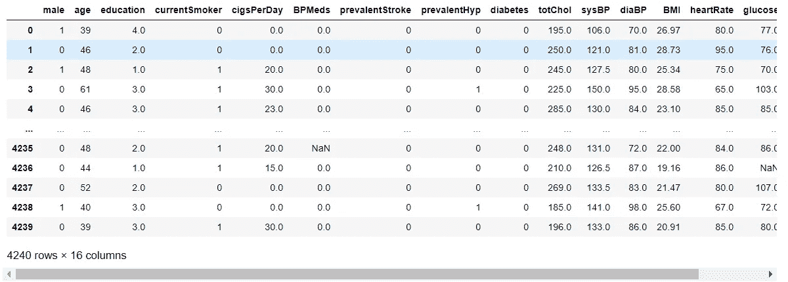
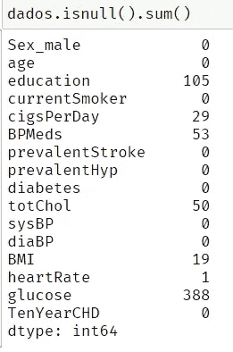
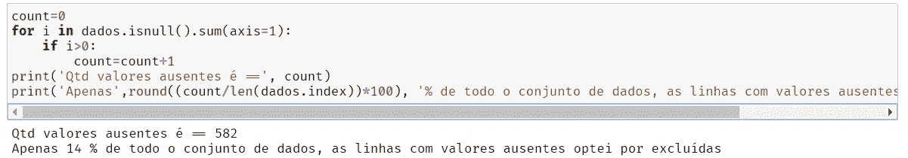
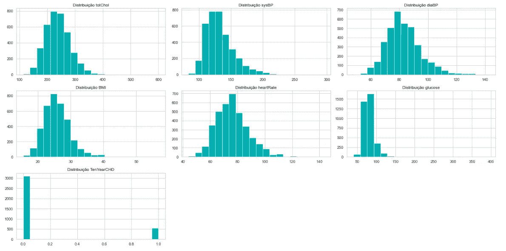
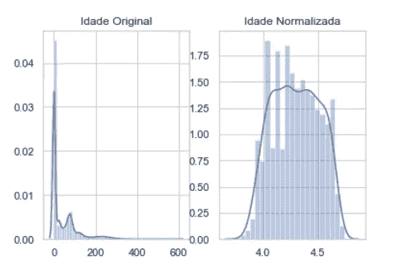
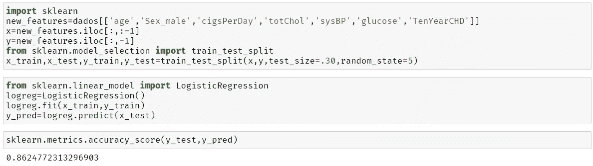
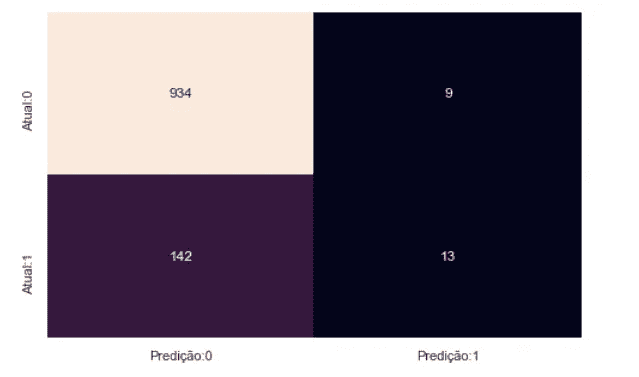

# 基于 Logistic 回归的心脏病预测模型。

> 原文：<https://medium.com/analytics-vidhya/prediction-model-of-heart-disease-with-logistic-regression-62a461e5474?source=collection_archive---------26----------------------->


来源:[https://cdn . the-scientist . com/assets/article no/64743/aImg/28424/cardiac-trial-thumb-l . png](https://cdn.the-scientist.com/assets/articleNo/64743/aImg/28424/cardiac-trial-thumb-l.png)

**1。简介**

世卫组织(世界卫生组织)估计全世界有 1200 万人死于心脏病。根据巴西心脏病学会(SBC)的 Cardiometer 平台，在巴西，2019 年有超过 28.9 万人死于心血管疾病。

**1.1 问题**

随着被称为新冠肺炎的疫情的到来，医院出现了人满为患的现象，感染新冠肺炎和其他疾病的人已经大量存在于医院中，在因新冠肺炎而住院的人中包括风险群体，他们是:糖尿病患者、高血压患者和心脏病患者。

**2。解决方案**

鉴于上述情况，我决定开发一个具有机器学习的模型，以便对患者未来心血管疾病的 10 年风险进行分类预测。通过使用逻辑回归。

逻辑回归是数学/统计模型中广泛使用的回归分析模型，通常用于从一组预测因子或自变量中预测分类因变量的结果。在逻辑回归中，因变量总是二元的。逻辑回归主要用于预测，也用于计算成功的概率。

**2.1 数据准备**

样本中使用的数据集可在 Kaggle 网站上公开获得，是马萨诸塞州弗雷明汉市居民的一项研究。

为了便于使用和重用，我把它放在了 github 的一个存储库中。
[https://github . com/Carlos py 98/datasets-tests/blob/master/Framingham . CSV](https://github.com/carlospy98/datasets-tests/blob/master/framingham.csv)

**2.2 数据集**

因变量和自变量的选择。

因变量:十年 CHD

自变量:年龄，性别 _ 男性，每日吸烟量，总胆固醇，血糖。

下面是列数和示例数据字典。

```
 Sex_male: male or female; Age:age of the patient; education: level of education; currentSmoker: whether or not the patient is a current smoker; cigsPerDay: the number of cigarettes the person smoked on average    in one day; BPMeds:whether or not the patient was on blood pressure medication; prevalentStroke: whether or not the patient had previously had a stroke; prevalentHyp: whether or not the patient was hypertensive; diabetes: whether or not the patient had diabetes; totChol: total cholesterol level; sysBP: systolic blood pressure; diaBP: diastolic blood pressure; BMI: Body Mass Index; heartRate: heart rate; glucose: glucose level; TenYearCHD: Predict variable, 1 means “Yes”, “0” means “No”.
```



**2.3 数据清理**

首先，我检查样本中是否有空数据。



然后，我检查了样本中空数据的百分比，由于**只有 14%** ，我决定删除空数据。



**2.4 Eda & &数据归一化**

我绘制了这些值，以确定缺少标准化的数据具有标准化的行为。



使用 scipy boxcox lib，我对年龄进行了归一化，得到了高斯分布。



**3。创建模型**

当使用逻辑回归模型时，我获得了 86%的准确率



**3.1 混淆矩阵**

在机器学习领域，特别是统计分类问题中，混淆矩阵，也称为误差矩阵。混淆矩阵是一个表格，通常用于描述一个分类模型(或“分类器”)对一组真实值已知的测试数据的性能。它允许算法性能的可视化。
它可以很容易地识别不同类别之间的混淆，例如一个类别通常会被误标为另一个类别。大多数性能指标都是从混淆矩阵中计算出来的。

来源:[https://www . geeks forgeeks . org/confusion-matrix-machine-learning/](https://www.geeksforgeeks.org/confusion-matrix-machine-learning/)

混淆矩阵的结果:



**4。结论**

男性似乎比女性更容易患心脏病。年龄的增长、每天吸烟的数量和收缩压也表明患心脏病的几率增加。

在因变量和自变量的选择过程之后选择的属性显示出低于 5%的值，因此在心脏病的预测中具有重要作用。

该模型的预测精度为 0.86。该模型更具体而非敏感。

一般模型可以用更多的数据来改进。

**5。技术**

技术和库:Python3，pandas，scipy，seaborn，sklearn，numpy。

祝大家阅读愉快，谢谢大家。😊

**6。联系人**

**领英**:[https://www.linkedin.com/in/carlos-barbosa-046a9716b/](https://www.linkedin.com/in/carlos-barbosa-046a9716b/)

**Github**:https://github.com/carlospy98

carlosdspy@gmail.com**电子邮件**

**Instagram** : @carlosb.py