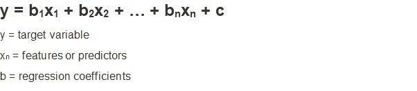

# 基于机器学习的联合循环电厂输出功率预测

> 原文：<https://medium.com/analytics-vidhya/prediction-of-the-output-power-of-a-combined-cycle-power-plant-using-machine-learning-a2ca01848eea?source=collection_archive---------4----------------------->

多元回归的简单介绍


杰森·黑眼在 [Unsplash](https://unsplash.com?utm_source=medium&utm_medium=referral) 上的照片

# 背景

单循环燃气轮机发电厂使用天然气和压缩空气发电。空气从周围环境中抽出，压缩，并送入燃气轮机的燃烧室。在这里，天然气被注入，与压缩空气混合并被点燃。燃烧产生的高压热气流流过涡轮，使其旋转(速度极快)。因此，这带动了与涡轮机相连的发电机旋转，从而产生电能。

对于单循环燃气轮机，大部分能量作为热废气被浪费掉，最多只能达到 35%的能量转换效率。联合循环发电厂利用这种低效率，通过使用热回收蒸汽发生器(HRSG)捕获废热，以产生更多的电力。

联合循环发电厂是同时使用燃气轮机和蒸汽轮机发电的发电厂。燃气轮机产生的废热被用于产生蒸汽，该蒸汽被供给蒸汽轮机以产生更多的电力。这增加了同样数量的燃料产生的功率(高达 50%以上),以及将工厂的效率提高到约 60%。

联合循环发电厂(CCPP)的输出功率取决于几个参数，即大气压力、排汽压力、环境温度和相对湿度。能够预测满负荷电功率输出对于发电厂的高效和经济运行是重要的。在本文中，我们将使用机器学习来开发一个预测模型，以预测 CCPP 的满载输出功率。


联合循环发电厂(来自 Planete 能源公司，总计)

# 目标

1.  开发一个预测模型来预测满载功率输出。
2.  评估模型的性能

**提示** : *既然目标是基于一些参数来预测输出功率，这就是一个* ***回归问题。*** *回归旨在建立预测因子(帮助我们做出预测的变量)和目标(我们想要预测的值)之间的关系。*

# 资料组

对于本文，我们将使用 Pinar Tufekci 提供的数据集，该数据集可在 UCI 机器学习知识库中获得。该数据集是在六年的时间内收集的，由电厂满负荷运行时收集的 9568 个数据点组成。

[https://archive . ics . UCI . edu/ml/datasets/Combined+Cycle+Power+Plant？ref=datanews.io](https://archive.ics.uci.edu/ml/datasets/Combined+Cycle+Power+Plant?ref=datanews.io)

# 多次回归

多元回归是简单线性回归的延伸。它是一种使用多个预测因子或独立变量来预测一个目标变量或结果的建模方法。

多元回归的一般形式



# 我们的工作流程

1.  探索性数据分析
2.  开发模型
3.  评估模型
4.  选择最佳型号

# 1.探索性数据分析

首先，我们将在导入我们需要的所有 python 库之后加载数据。

> 导入熊猫为 pd，numpy 为 np，matplotlib.pyplot 为 PLT
> data = PD . read _ CSV(' CCPP . CSV ')
> 
> df = pd。数据帧(数据)

接下来，我们研究这些数据来感受一下。

> df.info()

```
<class 'pandas.core.frame.DataFrame'>
RangeIndex: 9568 entries, 0 to 9567
Data columns (total 5 columns):
AT    9568 non-null float64
V     9568 non-null float64
AP    9568 non-null float64
RH    9568 non-null float64
PE    9568 non-null float64
dtypes: float64(5)
memory usage: 373.9 K
```

我们可以看到，这个数据集包含 5 个数值变量(float64)。所有变量都没有缺失值(9568 非空)，数据类型( *dtypes* )是一个浮点数。这当然是个好消息，因为我们有一个干净的数据集。

接下来，我们看看数据集的分布

> df.describe()


显示平均值、最小值、最大值和标准值的统计细节

数据集由 4 个小时平均变量或特征以及输出功率(PE)目标变量组成

*   环境温度(AT)在 1.81℃和 37.11℃之间，
*   环境压力(AP)在 992.89-1033.30 毫巴范围内，
*   相对湿度(RH)在 25.56%至 100.16%的范围内
*   排气真空(V)在 25.36–81.56 厘米汞柱的范围内
*   每小时净电能输出(PE)420.26–495.76 兆瓦

现在，我们已经对数据集有所了解，我们需要确定哪些特征将有助于我们预测输出功率。因为回归的目标是从特征中创建一个数学模型来预测目标变量(PE)，所以我们需要确保我们选择的特征与目标有很强的相关性(高预测能力)。相关矩阵将有助于做到这一点。

**相关矩阵**是一种结构化方法，用于对预测值或输入变量(对输出*影响最大的输入变量)的重要性进行排序。*为此，我们使用 Seaborn 绘制了相关矩阵的热图。

> 将 seaborn 导入为 SNS
> PLT . fig(figsize =(7，5))
> sns.heatmap(df.corr()，annot = True)


相关矩阵的热图

**提示**:C*or 关系在-1 到 1 的范围内测量。-1 表示完全负相关，1 表示完全正相关。0 表示完全没有相关性。*

从相关矩阵中，我们可以看到 at 和 V 与目标变量(PE)具有很强的负相关性，因为它们的相关系数分别为-0.95 和-0.87。AP 和 RH 与 PE 呈弱正相关，相关系数分别为 0.52 和 0.39。

我们可以将数据集的二元分布可视化(它显示了每个特征如何相互关联以及如何与 PE 关联)

> SNS . set(style = " ticks ")
> SNS . pair plot(df，diag_kind = 'hist ')


数据集的二元分布

当可视化时，我们可以容易地看到在 at 和 V 上看到的与 PE 相关的独特模式(负相关)。

**注意:**你会注意到 at 和 V 彼此高度相关。这通常不是一件好事，因为我们的特性应该是相互独立的。这个问题叫做 ***多重共线性。*** *解决这个问题的一种方法是选择与我们的目标变量(PE)更密切相关的特征。在这种情况下，将为(-0.95)。在某些情况下，我们可以选择忍受这个问题，并像那样使用我们的功能。*

# 2.开发模型

我们在这里要做的是使用不同的机器学习算法和不同的特征组合来开发几个回归模型。我决定对这个数据集使用线性回归、决策树回归和随机森林回归算法。

## **功能选择**

机器学习项目成功的一个关键部分是提出一组好的特征或预测器来进行训练。特征选择包括在现有特征中选择最有用的特征进行训练

首先，让我们创建 4 种不同的特征组合，并用 3 种回归算法训练我们的模型

模型 1:我们仅选择处的**作为预测器(因为它与目标变量(PE)具有最强的相关性)**

> df_1 = df['AT']

模型 2:我们选择处的**和 **V** 作为预测器**

> df_2 = df[['AT '，' V']]

模型 3:我们选择处的**、 **V** 和 **RH** 作为预测器**

> df_3 = df[['AT '，' V '，' RH']]

模型 4:我们选择处的**、 **V** 、 **AP** 和 **RH** 作为预测器**

> df_4 = df[['AT '，' V '，' AP '，' RH']]
> 
> **备选项** : df_4 = df.drop(['PE']，axis =1)

**我们的目标变量(PE)是 y**

> y = df['PE']

现在我们已经完成了特征选择，是时候训练我们的 ML 模型了

## **训练模型**

在我们实际训练我们的机器学习模型之前，我们需要首先将我们的数据分成训练和测试集。训练集将用于创建特征和目标变量之间关系的数学模型。测试集将用于验证模型。为此，我们将使用 sci-kit 学习库并导入 *train_test_split* 模块。

我们将把数据集分成 80%的训练集和 20%的测试集(*使用帕累托法则*)。

> 从 sklearn.model_selection 导入 train_test_split
> X_train，X_test，y_train，y _ test = train _ test _ split(**df _ 1**，y，test_size = 0.2，random_state = 0)

通过用相应的特征数组替换 ***df_1*** ，将对所有其他模型的数据集重复该步骤。比如带 **df_4** 的 4 型。

最后，我们到了激动人心的部分，我们实现了一个回归算法，并开发了我们的预测模型。为此，我们将使用 OLS 回归、决策树回归和随机森林回归。首先，我们从 sci-kit 学习库中导入 LinearRegression 并训练模型。

## 对于线性回归

> 从 sklearn.linear_model 导入线性回归
> regressor = linear regression()
> regressor . fit(X _ train，y_train)

既然我们已经在我们的训练集上训练了我们的模型，我们准备在我们的测试集上进行预测(我们的模型以前从未见过这个集)

> y _ pred = regressor . predict(X _ test)

决策树回归和随机森林回归的代码实现如下所示:

## 对于决策树回归

> 从 sklearn.tree 导入决策树回归器
> dt _ regressor = DecisionTreeRegressor()
> dt _ regressor . fit(X _ train，y_train)

为了预测

> y _ pred = dt _ regressor . predict(X _ test)

## 对于随机森林回归

> 从 sklearn.ensemble 导入 RandomForestRegressor
> RF _ regressor = RandomForestRegressor()
> RF _ regressor . fit(X _ train，y_train)

为了预测

> y _ pred = RF _ regressor . predict(X _ test)

*随机森林是一种集成算法，它在数据集的各种子样本上拟合许多决策树。通过平均每个决策树的预测来进行预测。这提高了预测精度并控制了过度拟合。*

太棒了。现在，我们已经创建了一个预测模型，并使用它进行预测。是时候评估我们的模型表现如何了

# 3.性能赋值

每当开发机器学习模型时，评估其性能以确保它产生有用的输出而不是过度拟合是很重要的。对于回归问题，有 **3 个关键性能指标**用于评估你的模型表现如何。有

1.  **均方根误差(RMSE):** 测量模型在预测观察结果时的平均误差。

***提示:****RMSE 分数越低越好*

> 从 sklearn.metrics 导入均方误差
> mse =均方误差(y_test，y _ pred)
> RMSE = NP . sqrt(MSE)
> RMSE

**2。r 平方**:它表示目标变量中有多少变化可以用训练模型时使用的一组特征来解释。

***提示:****R 平方分数越高越好*

> 从 sklearn.metrics 导入 R2 _ score
> r _ squared = R2 _ score(y _ test，y_pred)
> r_squared

**3。平均绝对误差**:测量预测值与实际值的差距。

**提示:**MAE 值越低越好

> 从 sklearn.metrics 导入 mean _ absolute _ error
> Mae = mean _ absolute _ error(y _ test，y_pred)
> mae


显示学习算法评估指标的表格

现在我们已经评估了所有模型，我们可以看到模型 4(所有特征)的随机森林回归算法为我们提供了最佳性能。R 平方为 0.9644(这意味着目标变量 PE 的 96.44%的变化可以由模型解释)。

同样，它产生的最低 RMSE 为 3.1891。

从我们的结果可以得出结论，应该选择随机森林回归模型 4

# 尾注

在本文的开头，我们根据所提供的数据集开发了一个满负载输出功率(PE)的预测模型。我们研究了数据集，以找出我们是否有缺失值或其他问题，然后在 3 种不同的机器学习回归算法上进行 4 个特征子集选择。我们能够发现，对随机森林回归算法使用一组完整的参数或特征会产生最佳结果。我们得到了 0 的 R 平方。9644 和 RMSE 的 3.1891。

希望这对你有用。万事如意！