# Ames 住房数据的预测数据模型

> 原文：<https://medium.com/analytics-vidhya/predictive-data-model-on-ames-housing-data-c45a84f6c4ac?source=collection_archive---------12----------------------->

**简介**

了解客户需求和预测客户的购买意向是任何企业成功的核心。请购房者描述他们梦想中的房子，他们可能不会从地下室天花板的高度或靠近东西向铁路开始。但这个项目数据集证明，影响价格谈判的因素远不止卧室数量或白色栅栏。对于多元化的房地产市场，随着房地产价格的指数增长，研究直接或间接影响客户决定购买房屋的因素并预测市场趋势变得至关重要。一般来说，对于任何购买，潜在客户都会根据物有所值来做出决定。**这里我需要预测** **美国艾姆斯市的房价。**此外，这个问题陈述使我能够研究高级回归技术及其在 r 等机器学习语言中的实现。理解理论并将其付诸实践对我们来说是一个挑战。

**数据集**

我有两个不同的数据集，即训练和测试。两者都包含许多描述房子特征的变量。训练数据集包含 1460 个观察值，其中提供了房屋的销售价格。根据这些数据，将建立一个预测模型。测试数据集包含 1459 个要预测销售价格的观察值。

总共有 80 个变量集中在遗产的许多物理属性的质量和数量上。大多数变量正是典型的购房者想要了解的潜在房产的信息类型(例如，它是什么时候建造的？场地有多大？住宅的居住面积是多少平方英尺？地下室完工了吗？有几个浴室？).

数据集包含 23 个名义变量和 23 个顺序变量。标称值包括天气条件和建筑材料等变量。对于名义变量和序数变量，水平在 2 到 28 的范围内。总共 14 个离散变量包括厨房、洗手间和卧室的数量。这也包括车库容量和建造或改造日期；20 个连续变量描述了每次观察的面积大小。地段大小和总居住平方英尺是标准的家庭上市可在线。根据质量和类型，地下室、门廊和主要居住区的面积测量进一步划分为相应的类别。

**2。** **建立模型所涉及的步骤**

> 加载数据序列和测试数据集
> 
> 检查是否有缺失值。用数值数据的平均值和分类数据的模式替换缺失值。
> 
> 检查目标变量是否有异常值
> 
> 建立回归模型——目标变量与独立变量
> 
> 在已建模型上预测测试数据集

## **数据可视化**

对于每次数据分析，都需要进行初始数据清理。否则，数据集中的异常值会产生错误的预测模型，这会严重影响模型的准确性。最初，我决定通过可视化来分析我们的数据。我比较了几个重要数量变量的响应变量(销售价格)，如“车库居住面积”、“地块面积”等。绘制了散点图，很少立即观察到异常值。

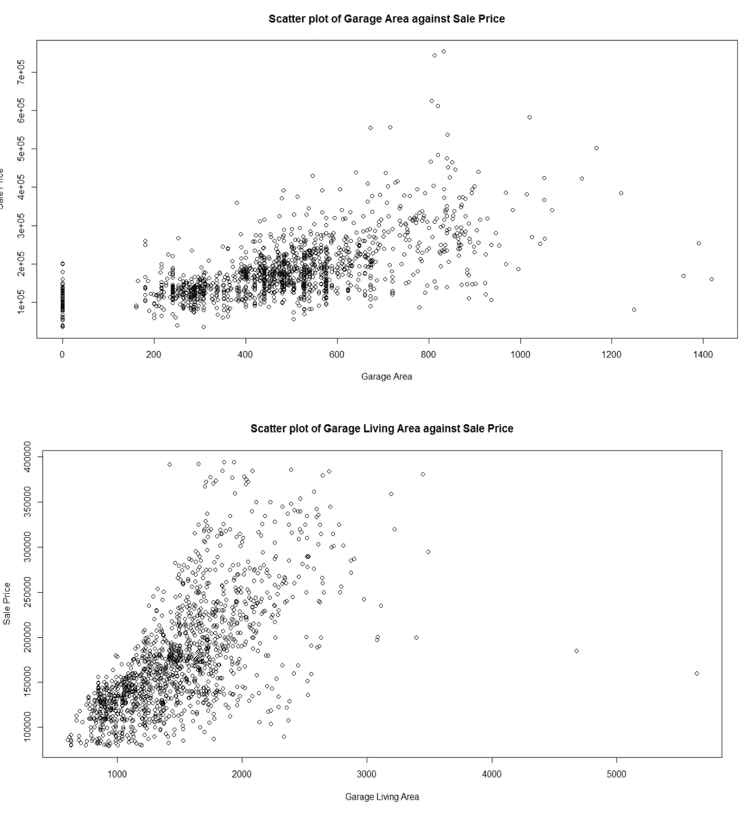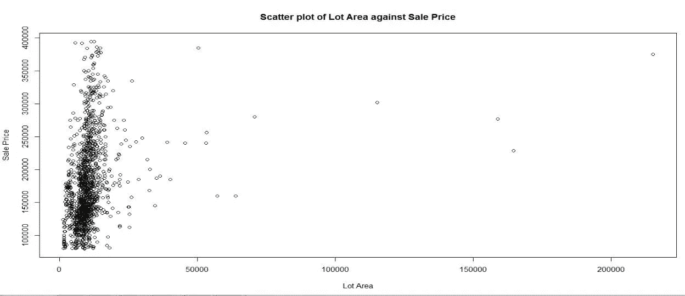

此外，盒状图有助于我们想象房价的变化范围。大多数销售价格低于 50 万美元。所有高于 50 万美元(总计=10)的价值点都被排除在预测模型之外。因此，异常值通过初始筛选被去除。为了确认相同的异常值，在下一步中进行了正态性检查。

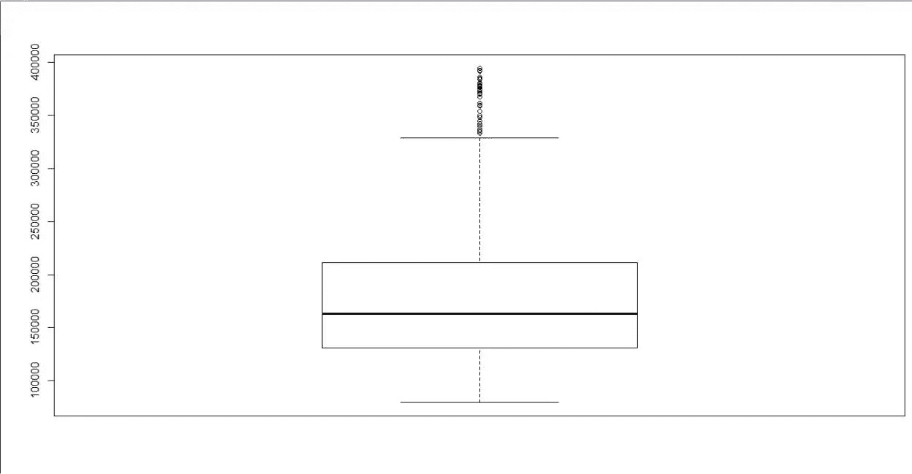

**常态检查**

所有的统计方法都依赖于数据正态分布的初始假设。因此，在应用任何统计方法之前，应该确认数据是否正态分布。绘制直方图以确定数据的正态趋势。直方图是倾斜的，因为异常值出现在较高的价格范围。销售价格超过 50 万美元的数据点被排除在分析之外。

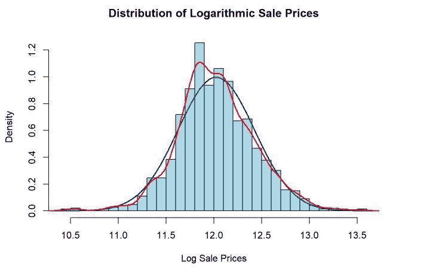

**去除异常值**

离群值被定义为远离大多数其他观察值的观察值。由于测量误差，通常会出现异常值。因此，数据分析中最重要的任务之一是识别和剔除异常值，因为它会降低我们的统计结果。我已经删除了与目标变量有关的异常值，即销售价格，下面是摘要。

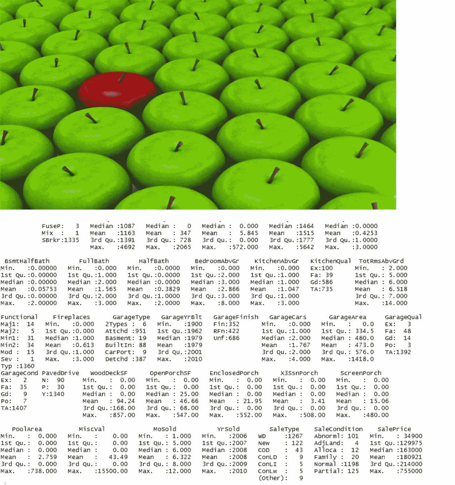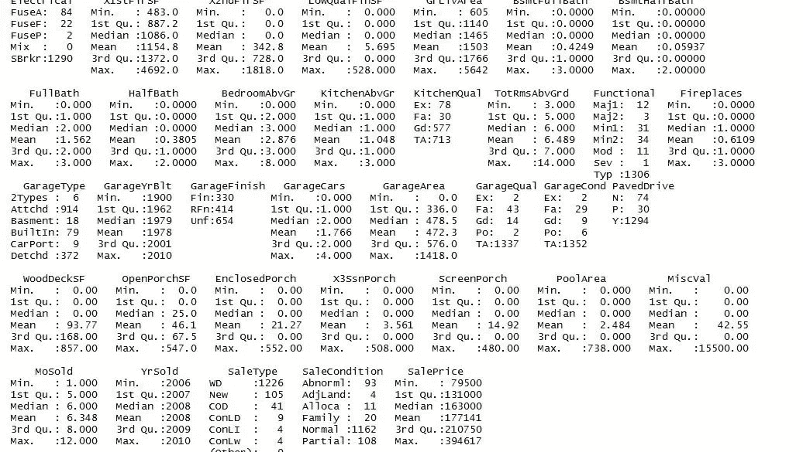

**测试数据集上的数据清理**

按照在训练数据集上完成的类似步骤，将获得没有缺失值的干净数据集。这个测试数据集将准备好预测销售价格。

**RMSE**

**均方根**偏差(RMSD)或**均方根误差** ( **RMSE** )(有时也称为均方根误差)是一种常用的衡量模型或估计器预测值(样本和总体值)与实际观察值之间差异的方法。我用 rmse 预测了最佳模型。

**4。** **建立回归模型**

我决定通过生成一个线性模型来开始我们的清洗后分析和模型开发过程。线性模型是第一个被选择来检查的模型，因为它们最容易拟合，也最直观地解释。我决定创建的第一个模型是一个普通的最小二乘(OLS)模型，包含数据集中的所有预测值。模型的结果可以在下面的回归输出中看到。

**线性回归模型**

该模型的 rmse 值为 0.04751894

我做了另一个线性模型，但这次我保持了模型的两个方向。这是代码的摘要。

该模型的 rmse 值为 0.04937933

在运行了两个线性模型之后，我运行了一个 SVM 模型(支持向量机)

**支持向量机(SVM)**

支持向量是靠近超平面的那些点。支持向量到超平面的距离应该是最大但最小的。SVM 不受离群值的影响，SVM 的变换称为核变换

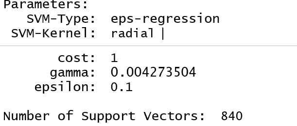

该模型的 rmse 值为 0.04863575

在一个正常的 SVM 模型之后，我决定运行十倍交叉验证或 k 倍交叉验证模型。这里，它将数据分成 10 个部分，重复 10 次，取精确度的平均值。tune()函数执行交叉验证，成本函数在构建模型时非常关键，成本函数应该更少。

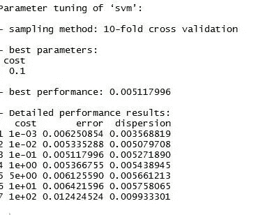

该模型的 rmse 值为 0.06503909

**装袋和随机森林**

Bagging，也称为 bootstrap aggregation，是一种相对简单的方法，通过从训练数据集中抽取多个随机样本(带有替换)，并使用这些样本中的每个样本为测试集构建单独的模型和单独的预测，来提高预测统计模型的能力。然后对这些预测进行平均，以创建更准确的最终预测值。

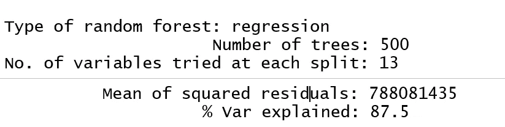

该模型的 rmse 值为 0.06338549

装袋模型之后，我运行了一个随机模型。

为了消除 bagging 模型的偏见，我选择运行一个随机森林模型。在随机森林中，变量不断变化随机森林中的每一棵树都生长到可能的最大程度，并且没有修剪。随机森林可以很容易地处理大数据，甚至可以识别最重要的变量，因此被认为是降维方法之一。

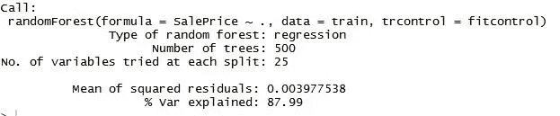

该模型的 rmse 值为 0.0255915

**KNN**

k 最近邻是一种简单的算法，它存储所有可用的案例，并通过其 k 个邻居的多数投票对新案例进行分类。该算法将未标记的数据点分成定义明确的组。选择最近邻的数量对模型的效率起着重要的作用。

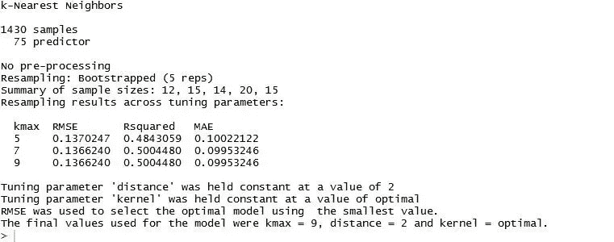

该模型的 rmse 值为 0.05964994

**5。** **结论**

在清理了数据并处理了缺失值之后，我构建了一个模型，在这个模型中，我根据测试数据预测了销售价格值。每个模型的预测都不一样。

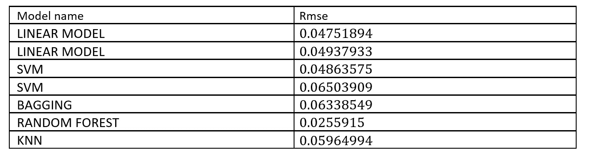

可以看出，随机森林是最稳健的模型。随机森林模型的 rmse 值为 0.0255915。我用这个模型预测了测试数据的销售价格。

[https://github.com/MalihaG/Ames-Housing-Data](https://github.com/MalihaG/Ames-Housing-Data)