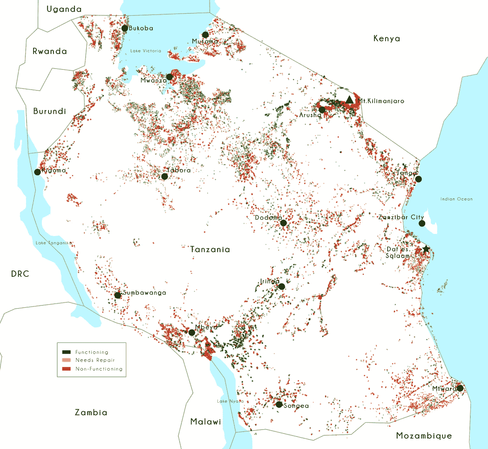
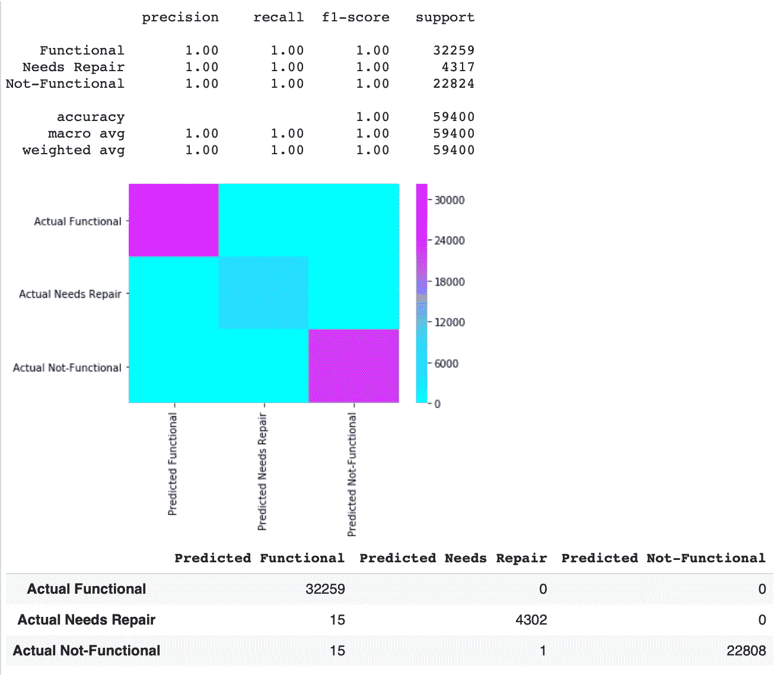
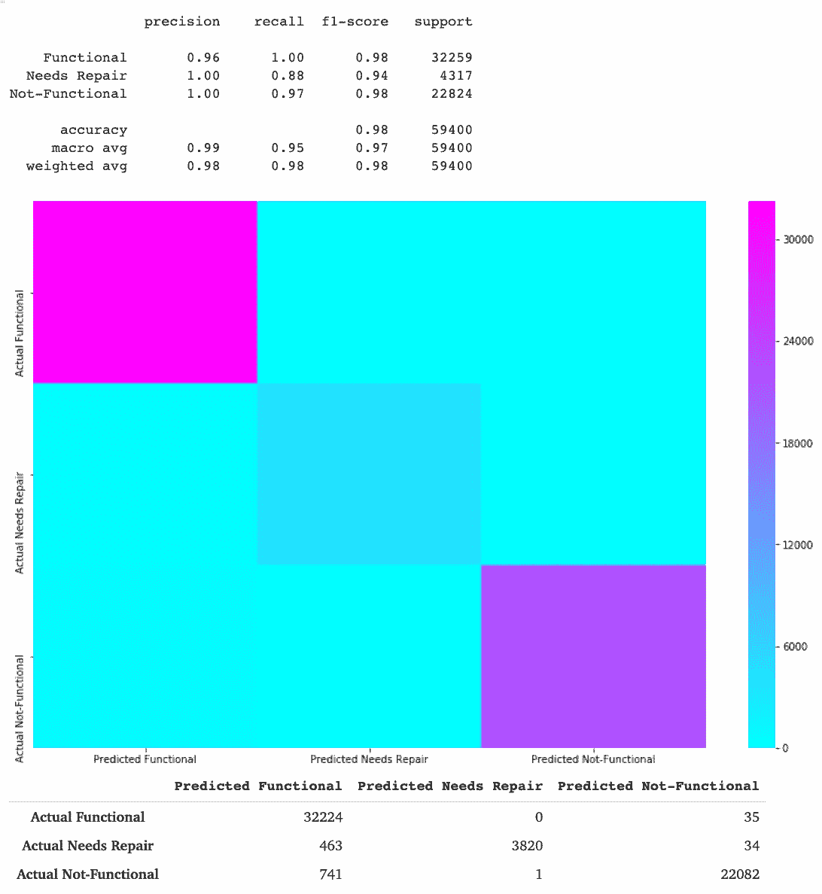

# 坦桑尼亚水泵的预测建模

> 原文：<https://medium.com/analytics-vidhya/predictive-modeling-for-tanzanian-water-pumps-701bcc7760b2?source=collection_archive---------3----------------------->


坦桑尼亚是塞伦盖蒂平原的故乡。[图片信用](https://www.harpersbazaar.com/culture/travel-dining/a17259/how-to-plan-your-first-safari/)

## Kaggle 竞赛演练

这篇文章将从文本和视觉上阐述我的预测建模过程，从最初的探索到超参数调整。我们将探索一个充斥着缺失记录和重复信息的数据集，然后尝试建立一个准确的模型来预测一个给定的水泵是在运行、需要维修还是不起作用。

## 阶段 1:导入数据并熟悉

大多数 Kaggle 比赛的数据都可以在比赛信息中以. csv 文件的形式找到。Pandas 提供了一种简单的方法来导入一个. csv 文件作为 Pandas DataFrame 对象； [pd.read_csv()](https://pandas.pydata.org/pandas-docs/stable/reference/api/pandas.read_csv.html) 。

我通常发现，在一头扎进清理、争论和特征工程之前，检查数据集的个体质量是有帮助的。并非每个数据集都是相同的，不同的数据需要不同的攻击计划。Pandas 为我们提供了`.info()`，它打印了数据帧的形状(59，400 个实例和 43 个特性)、特性名称、特性类型、每个特性的非空值计数以及数据帧的内存使用情况(19.9 MB)；它是一匹真正的老黄牛。

```
df.info()
____________________________________________________________________<class 'pandas.core.frame.DataFrame'> 
Int64Index: 59400 entries, 0 to 59399
Data columns (total 43 columns):key_0                    59400 non-null int64 
id_x                     59400 non-null int64 
amount_tsh               59400 non-null float64 
date_recorded            59400 non-null object 
funder                   55765 non-null object 
gps_height               59400 non-null int64 
installer                55745 non-null object 
longitude                59400 non-null float64 
latitude                 59400 non-null float64 
wpt_name                 59400 non-null object 
num_private              59400 non-null int64 
basin                    59400 non-null object 
subvillage               59029 non-null object 
region                   59400 non-null object 
region_code              59400 non-null int64 
district_code            59400 non-null int64 
lga                      59400 non-null object 
ward                     59400 non-null object 
population               59400 non-null int64 
public_meeting           56066 non-null object 
recorded_by              59400 non-null object 
scheme_management        55523 non-null object 
scheme_name              31234 non-null object 
permit                   56344 non-null object 
construction_year        59400 non-null int64 
extraction_type          59400 non-null object 
extraction_type_group    59400 non-null object 
extraction_type_class    59400 non-null object 
management               59400 non-null object 
management_group         59400 non-null object 
payment                  59400 non-null object 
payment_type             59400 non-null object 
water_quality            59400 non-null object 
quality_group            59400 non-null object 
quantity                 59400 non-null object 
quantity_group           59400 non-null object 
source                   59400 non-null object 
source_type              59400 non-null object 
source_class             59400 non-null object 
waterpoint_type          59400 non-null object 
waterpoint_type_group    59400 non-null object 
id_y                     59400 non-null int64 
status_group             59400 non-null object dtypes: float64(3), int64(9), object(31) 
memory usage: 19.9+ MB
```

**标签**

有三种可能的值:

*   功能性:供水点可以使用，不需要维修
*   功能需要修复:供水点可以运行，但需要修复
*   不起作用:水点不起作用

**特性**

您的目标是为数据集中的每个记录预测水点的运行条件。

*   amount_tsh:总静压头(水点可用水量)
*   date_recorded:输入行的日期
*   出资人:谁出资的油井
*   gps_height:井的高度
*   安装者:安装油井的组织
*   经度:GPS 坐标
*   纬度:GPS 坐标
*   wpt_name:水点的名称(如果有)
*   num_private:是否私人使用
*   盆地:地理流域
*   子村:地理位置
*   区域:地理位置
*   region_code:地理位置(编码)
*   地区代码:地理位置(编码)
*   lga:地理位置
*   病房:地理位置
*   人口:井周围的人口
*   public_meeting:真/假
*   recorded_by:进入该行数据的组
*   方案 _ 管理:谁在操作水点
*   scheme_name:谁在操作水点
*   允许:如果水点是允许的
*   建造年份:供水点建造的年份
*   extraction _ type:water point 使用的提取类型
*   extraction _ type _ group:water point 使用的提取类型
*   extraction _ type _ class:water point 使用的提取类型
*   管理:如何管理水点
*   管理组:如何管理水点
*   付款:水的价格
*   付款类型:水的价格
*   水质:水的质量
*   quality_group:水的质量
*   数量:水的数量
*   数量 _ 组:水的数量
*   来源:水的来源
*   source_type:水的来源
*   source_class:水的来源
*   水点类型:水点的种类
*   水点类型组:水点的类型

## 阶段 2:清理、争论和工程特性

第一次攻击数据集时，找到一个好的起点并不是一件小事，因为通常有多个明显的地方可以开始清理、特征工程和探索性分析。我将在这里为读者提供一些安慰的话:选择一个开始的地方，相信你的直觉，开始编码。如果你碰壁了，不要害怕撤退，重组，并攻击其他地方。它——而且——你会没事的。我们将从用 [df.replace()](https://pandas.pydata.org/pandas-docs/stable/reference/api/pandas.DataFrame.replace.html) 清理 construction_year 特性开始。

```
features['construction_year'].replace({0:1993})
# 1993 is an arbitrarily chosen year
```

**特色工程**

利用这种清洁的建造年份特征，我们可以设计泵的年龄和每年供应的平均 pop 特征。

```
features['age'] = features['date_recorded'] - features['construction_year']features['pop/year'] = features['population'] / features['age']
```

我们可以通过创建一个特征来表示井口服务的每个人可以获得的理论水量，从而进一步发展我们的特征工程。

```
features['water/person'] = features['amount_tsh'] / features['population']
```

**编码**

编码有助于量化分类数据或定性数据。有一个不断扩展的[编码方法库](https://contrib.scikit-learn.org/categorical-encoding/)专注于不同类型的数据。我们将对低基数特性使用一种热编码，对高基数特性使用顺序编码。我们还在数据上使用空值[输入](https://scikit-learn.org/stable/modules/generated/sklearn.impute.SimpleImputer.html)和[标准缩放](https://scikit-learn.org/stable/modules/generated/sklearn.preprocessing.RobustScaler.html)，以便在将数据输入到模型之前对其进行清理。

**探索性可视化**

探索数据的一个聪明方法是创建可视化。这是一个非常自由的过程，而且每个数据集都是不同的，所以没有一个放之四海而皆准的策略。由于这部分代码非常密集，我将只展示可视化，但是，如果你对代码感兴趣，在这篇文章的结尾有一个到 colab 笔记本的链接。

由于我们数据集中的水泵是固定设备，这有助于可视化它们的地理位置。



一个泵的经纬度和它的状态之间似乎没有明确的关系。然而，有许多非常不同的泵群看起来具有相同的状态。

## 阶段 3:构建基线模型和过度拟合模型

我们将建立一个基线模型来设定我们预测能力的下限。我特别喜欢使用多数类预测作为基线，因为这很容易理解。

```
X_matrix, y_vector = df.drop(columns='status_group'), df['status_group']majority_class = y_vector.mode()y_vector.value_counts(normalize=True)____________________________________________________________________functional                 0.543081 
non functional             0.384242 
functional needs repair    0.072677 
Name: status_group, dtype: float64
```

由于 54%的实例处于功能状态，我们预计我们的多数类预测的准确度约为 54%。

```
from sklearn.metrics import accuracy_scoremajority_prediction = [majority_class] * len(y_vector)accuracy_score(y_vector, majority_prediction)____________________________________________________________________0.543080808080808
```

太棒了，我们现在对未来的预测有了底线。

让我们创建一个模型，使我们的数据过度拟合，以确保我们能够做出有价值的预测。对于这个任务，我通常选择一个[决策树](https://scikit-learn.org/stable/modules/generated/sklearn.tree.DecisionTreeClassifier.html)。

```
from sklearn.tree import DecisionTreeClassifierdecision_tree = DecisionTreeClassifier(max_depth=50)decision_tree.fit(X_matrix, y_vector)____________________________________________________________________DecisionTreeClassifier
(class_weight=None, criterion='gini',     max_depth=50,max_features=None, max_leaf_nodes=None,                        min_impurity_decrease=0.0, min_impurity_split=None,                        min_samples_leaf=1, min_samples_split=2,                        min_weight_fraction_leaf=0.0, presort=False,                        random_state=None, splitter='best')
```

通过使用混淆矩阵，我们可以看到我们的过度拟合模型的表现。

```
from sklearn.metrics import classification_report, confusion_matrix
import seaborn as snsdef con_matrix_analysis(model):
  x = model.predict(X_matrix)

  print(classification_report(y_vector, x,
        target_names=['Functional', 'Needs Repair', 'Not-Functional'])) con_matrix = pd.DataFrame(confusion_matrix(y_vector, x), 
             columns=['Predicted Functional', 'Predicted Needs  Repair', 'Predicted Not-Functional'], 
             index=['Actual Functional', 'Actual Needs Repair', 'Actual Not-Functional'])

  sns.heatmap(data=con_matrix, cmap='cool')
  plt.show();
  return con_matrixcon_matrix_analysis(decision_tree)
```



## 阶段 4:建立一个精确的模型并调整它的超参数

我们将为我们的最终模型使用一个[随机森林分类器](https://scikit-learn.org/stable/modules/generated/sklearn.ensemble.RandomForestClassifier.html)。随机森林就像它听起来的那样，是一个决策树的森林。我们还将使用[随机搜索交叉验证](https://scikit-learn.org/stable/modules/generated/sklearn.model_selection.RandomizedSearchCV.html)从各种超参数设置中选择最佳模型。

基于我们的交叉验证，具有最准确结果的随机森林分类器是具有 92 个估计器和最大深度 26 的模型。当我们将选择的模型传递给我们的混淆矩阵分析函数时，我们得到了下面的结果。



## 阶段 5:预测和导出

我们流程的最后一个阶段是使用我们的模型来预测 X_test 数据帧中包含的泵的状态，将该数据帧转换为. csv 文件，并从我们的环境中导出该文件。Pandas 再次伸出援手，用 [pd.to_csv()](https://pandas.pydata.org/pandas-docs/stable/reference/api/pandas.DataFrame.to_csv.html) 将数据帧转换成。csv 文件。

```
prediction = model.predict(X_test)submission['status_group'] = predictionsubmission.to_csv('submission_1.csv', index=False)from google.colab import files
files.download('submission_1.csv')
```

我希望我已经为读者提供了一个易于理解且内容丰富的关于 Kaggle 竞争、机器学习和数据科学任务的介绍。对于那些感兴趣的人，我在这个项目中使用的 Colab 笔记本链接如下。

在 T [witter](https://twitter.com/matt42kirby) 、 [GitHub](https://github.com/mkirby1995) 、 [LinkedIn](https://www.linkedin.com/in/mathew-kirby-082062ba/) 上关注我

这是我在这篇文章中使用的 Colab 笔记本的链接。


[形象信用](https://www.serengeti.com/)