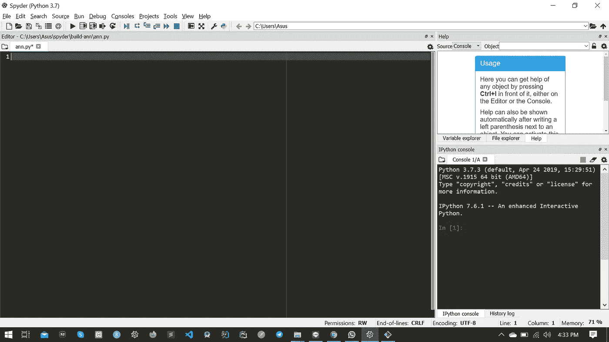
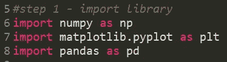
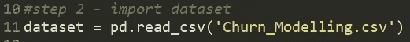
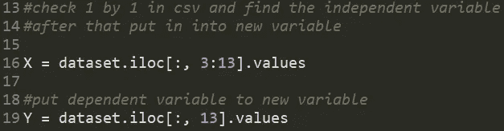
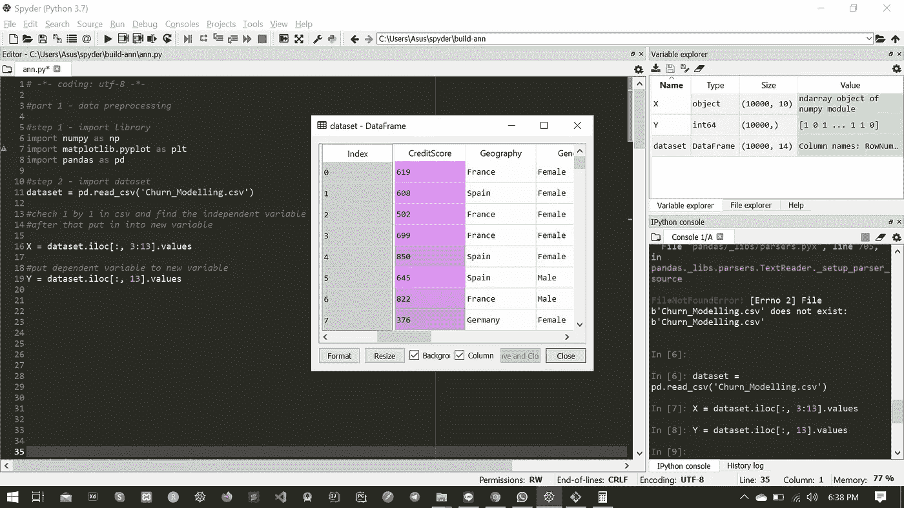

# 使用人工神经网络和 Python 进行预测建模第 1 部分

> 原文：<https://medium.com/analytics-vidhya/predictive-modelling-using-ann-with-python-ab701f3199dc?source=collection_archive---------10----------------------->

## **基里尔·叶列缅科**利用人工神经网络进行预测建模

大家好:)今天我将重写一个教程，用我从 Udemy 课程 [***深度学习 A-Z:动手人工神经网络***](https://www.udemy.com/share/101WmQBEUdeV5bTHg=/) 中学到的 ANN(人工神经网络)建立简单的预测模型。

在这里，我使用 anaconda navigator 和 spyder 编写代码，在我们开始编码之前，我们需要安装我们将使用的库

首先安装 theano，tensorflow 和 keras。对于 Mac 用户:

```
*pip install theano
pip install tensorflow
pip install keras
conda update — all*
```

对于 Windows 和 Linux 用户:
*在 Spyder 中，进入工具，打开 Anaconda 提示符。然后输入以下命令:* ***1。用 Anaconda 和 Python 3.5 创建一个新环境(基于 you 're python 版本):***`*conda create -n tensorflow python=3.5 anaconda*`***2 .激活环境:***`*activate tensorflow*`***3 .之后你就可以安装 Theano、TensorFlow 和 Keras:*** *conda 安装 theano
conda 安装 mingw libpython
pip 安装 tensorflow
pip 安装 keras* ***4。更新软件包:*** *康达更新—全部* ***5。运行 Spyder:*** *Spyder*

完成安装所有库后，你可以在我的 github [这里](https://github.com/bayysp/PredictiveModelANN) :D 下载数据集

我建议你不要像那样复制和粘贴代码，如果你想获得知识，自己写代码；)

下一步是打开 spyder IDE 并创建一个名为 *ann.py* 的新文件，您将看到如下视图:



在这里，我们使用 keras 库，所以你需要导入这个库，在你的脚本上写这个代码



我们应该做的重要事情是预处理数据以去除一些有噪声的数据，如果我们将有噪声的数据放到我们的模型中，这会给我们的模型带来一些问题
导入数据集



我们的数据集有 13 列，或者我们可以称之为特征，在机器学习模型中，我们只需要使用 ***自变量。***



代码行 16 和 19 用于将列索引 3(信用评分)-13(退出)*(从 0 开始)*中的数据复制到新变量(X 和 Y)

在你执行了上面所有的代码后，你会看到在变量浏览器中有一个 3 变量的激活，如下所示



这就是今天使用人工神经网络构建预测模型教程的第一部分:)只需等待几天，我将发布下一个教程；) .

别忘了鼓掌。

您可以在下面的 URL 中找到第 2 部分和第 3 部分:

[第二部](/@bayysp/predictive-modelling-using-ann-with-python-part-2-734291d3f241)
第三部

下面是这个 URL 中的代码:

[github.com/bayysp/PredictiveModelANN](http://github.com/bayysp/PredictiveModelANN)