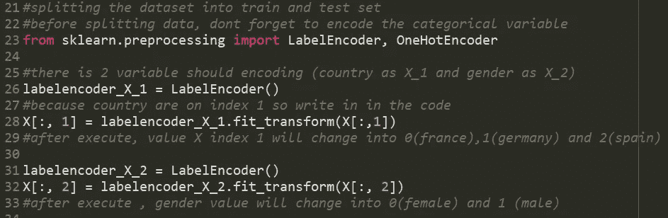
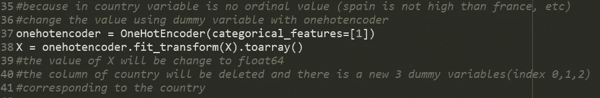
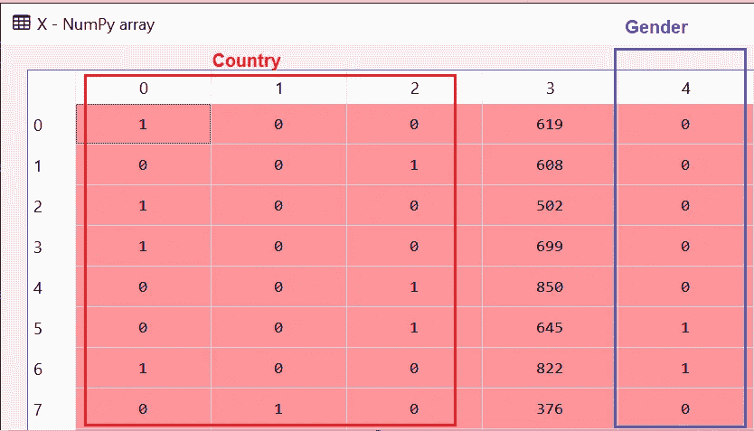
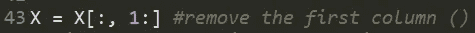
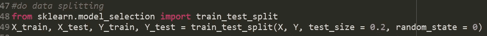
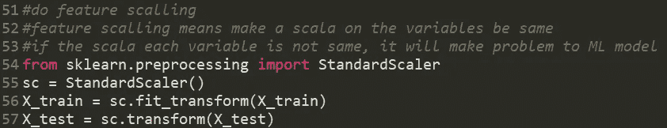
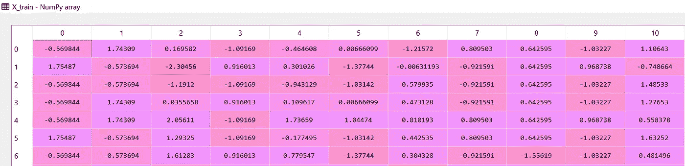

# 使用人工神经网络和 Python 进行预测建模第 2 部分

> 原文：<https://medium.com/analytics-vidhya/predictive-modelling-using-ann-with-python-part-2-734291d3f241?source=collection_archive---------13----------------------->

## **基里尔·叶列缅科利用人工神经网络进行预测建模**

大家好:)跟我回来，就像我昨天说的，我将继续我们的预测机器学习的第二部分，它是由基里尔·叶列缅科在 Udemy 呵呵呵:D 上发布的。

在第 1 部分中，我们已经安装了构建 ANN 所需的库，它们是 theano、tensorflow 和 keras，并且我们已经为项目导入了数据集。

现在我们需要建立下一步，下一步是我们应该对分类值进行编码，编码的意义是什么？正如我们所知，在数据集中，我们有 2 列有 ***标称值*** ，这是国家和性别，我们有 3 种国家值(法、西、德)和 2 种性别值，我们需要将其转换为数字，以便我们可以处理它。

要转换该值，请在脚本中编写以下代码:

随着它的国家和性别列的值发生了变化，但在转换它后有一个新的问题，因为我们知道 2 大于 1，1 大于 0，实际上国家不是一个序数，所以我们需要做下一步，

下一步是我们需要用一个热编码器改变虚拟变量的值，

但是我们还没有完成，因为我们已经对 country 列进行了编码，这将删除索引 1 中的列，并重新生成 3 列的第一个索引，就像这样:

该变量由*哑变量陷阱*(列索引 0–2)*，*调用。如果我们的数据集中有一个哑变量陷阱，我们需要删除其中的一个，因为哑变量陷阱的公式是:*sum _ of _ Dummy _ var = sum _ of _ category-1*

下一步是将我们的数据集分为训练集和测试集，这里我们将把它分为 80%的训练集和 20%的测试集，

最后一步是我们需要扩展我们的数据，为什么我们需要扩展我们的数据？我们有许多独立变量，但每个值的范围很大，例如:CreditScore = 619 和 EstimatedSalary = 101349，如果我们将其中两个相乘，结果将是:62，735，031，那么高，这将是我们的 ML 模型的一个问题，因此我们需要使用 StandardScaler 缩放所有变量:

在那之后，我们的变量值有这样的变化，

现在它们都有相同的规模，所以这是预测建模的第二部分教程，我们可以称这部分为“预处理数据”

感谢你们所有人阅读了这个简单的教程，下一个教程我们将建立我们的人工神经网络架构，只需等待几天，谢谢:)

您可以在下面的 URL 中找到第 1 部分和第 3 部分:

[第 1 部分](/@bayysp/predictive-modelling-using-ann-with-python-ab701f3199dc)
[第 3 部分](/@bayysp/predictive-modelling-using-ann-with-python-part-3-a0cbdefbec2)

下面是这个 URL 中的代码:

[github.com/bayysp/PredictiveModelANN](http://github.com/bayysp/PredictiveModelANN)