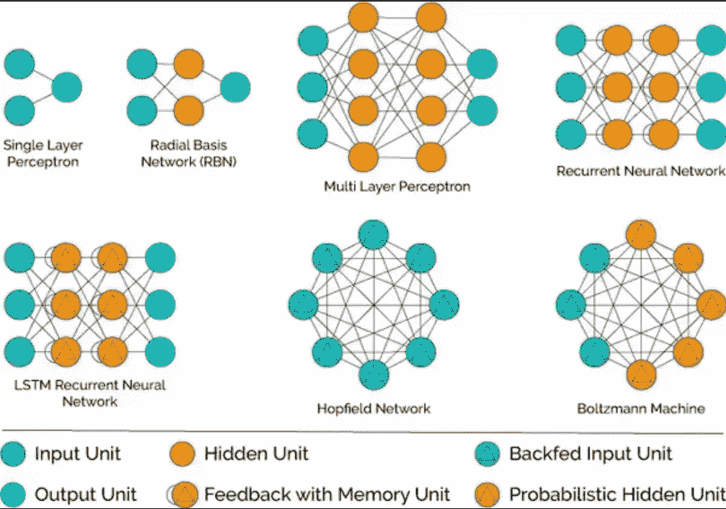
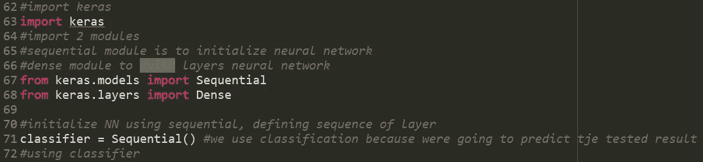
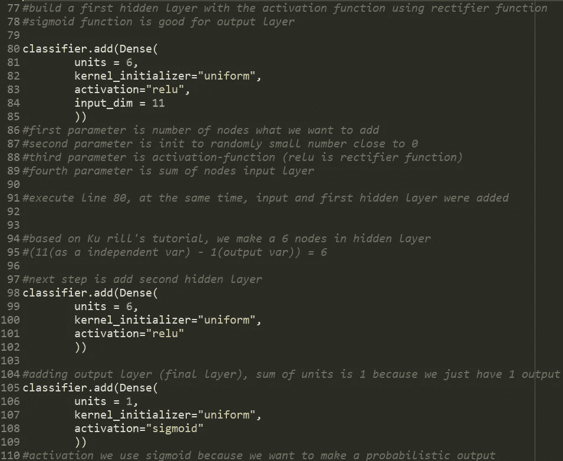
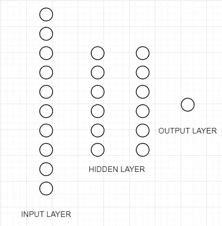
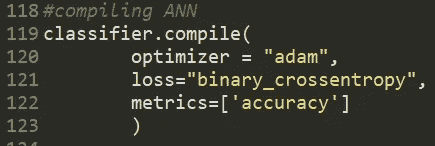
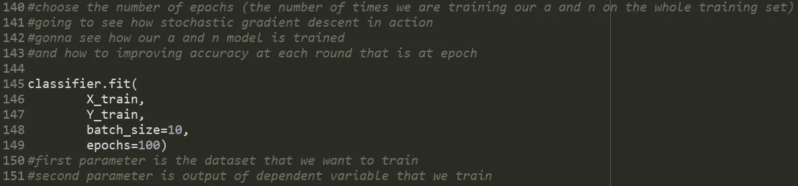
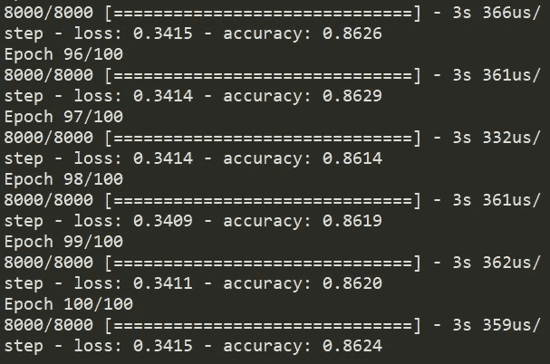
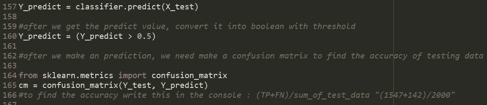
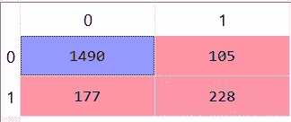

# 使用人工神经网络和 Python 进行预测建模第 3 部分

> 原文：<https://medium.com/analytics-vidhya/predictive-modelling-using-ann-with-python-part-3-a0cbdefbec2?source=collection_archive---------8----------------------->

## ***预测建模使用安·基里尔·叶列缅科***

大家好:)又回来了，我已经很久没有写我们的人工神经网络预测模型的第三部分了，呵呵呵。

因此，今天我将继续我们的 ML 旅程的下一部分，在第一和第二部分中，我们进行数据预处理，在这一部分中，我们需要建立我们的神经网络架构，有许多种神经网络架构，您可以在此图中看到:

从简单的*(单层感知器)*到高级架构，我们可以使用的架构种类太多了，但在本教程中，我们将使用输入层有 11 个节点的 ANN，2 个隐藏层有 6 个节点，输出层有单个节点*(因为我们只需要 1 个值，它是预测值)*

要创建一个架构，第一步是我们需要导入库

然后用这段代码构建架构

通过这些步骤，我们已经完成了构建我们人工神经网络体系结构，它看起来像这样

在我们建立了人工神经网络体系结构之后的下一步，我们需要编译神经网络模型，编写以下代码

第一个参数(optimizer = adam)是随机梯度下降的类型，它对于找到最佳权重非常有效。

第二个参数是损失函数，损失函数是误差平方和
如果我们有二进制结果，对数损失函数称为 binary_crossentropy，如果大于 2，则称为 categorical _ crossentropy。

第三个参数是指标(我们选择用来评估模型的标准)，为了提高模型性能，我们使用了准确性标准。

最后一步是我们需要训练之前准备的所有数据，在您的 IDE 上编写此代码。

稍等片刻:)，我们得到训练过程的准确率为 0.8624 = 86.24%

在所有的过程完成后，我们可以找到 Y_predict 的结果，并找到我们的 ML 与混淆度量的真正准确性。

我们会得到这样的结果

为了找到我们的 ML 模型的真实精度，我们使用公式 *(TP+FN)/sum_of_test_data，(* 1490+228)/2000 = 0.859，因此我们得到的真实精度是 85.9%

所以大家:)这就是我们今天使用人工神经网络进行预测建模的全部教程，非常感谢你阅读了我的全部文章，如果我的代码或其他代码中有错误，我很抱歉，下一期教程再见，:D

请参见以下 URL 中的第 1 部分和第 2 部分:

[第一部分](/@bayysp/predictive-modelling-using-ann-with-python-ab701f3199dc)
[第二部分](/@bayysp/predictive-modelling-using-ann-with-python-part-2-734291d3f241)

下面是这个 URL 中的代码:

[github.com/bayysp/PredictiveModelANN](http://github.com/bayysp/PredictiveModelANN)