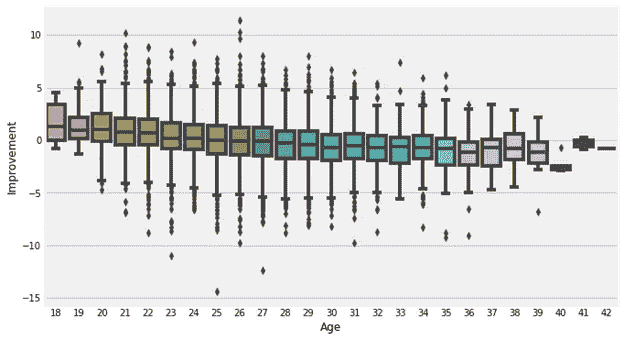
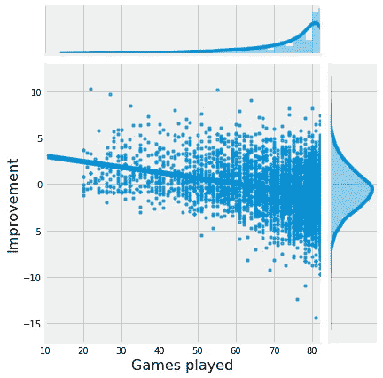
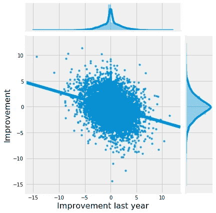
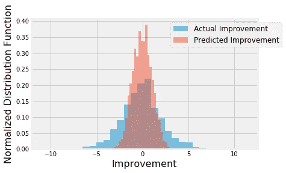
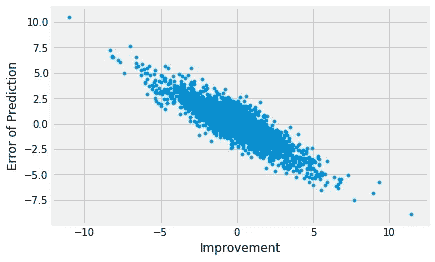
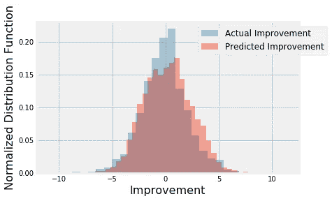
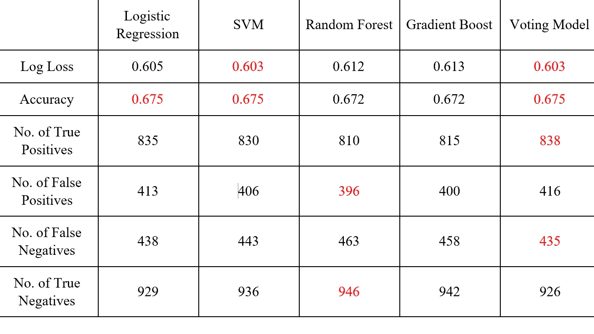

# 预测模型

> 原文：<https://medium.com/analytics-vidhya/predictive-models-8a64725e45c1?source=collection_archive---------14----------------------->

## 从问题陈述到解决方法，导致结果和结论。

上面一个篮球运动员的图像会让你想到一个篮球运动员和 ML 中的预测模型有什么关系。但这正是我们在这个故事中要关注的，我将谈论篮球运动员的进步，并使用 ML 来制作预测模型。虽然这不是我做过的项目之一，但这是如此伟大的事情，我不能停止与你们分享。所以让我们开始吧。

如上所述，这个故事不仅讨论了问题陈述，还讨论了解决方法，这将最终导致一些结果和结论。问题陈述如下:

# 根据球员的年龄、位置、上个赛季的表现等数据，球员在下一个赛季会提高多少。

在我的[之前的故事](/@mamomakxnx/weather-predicting-models-using-ml-algorithms-65925247a22b)中，我已经讨论过从 kaggle 获取数据集，然后我们如何将它转换成数据帧，提取所需的信息(数据清洗)和东西，这是我们今天不打算谈论的。我们将直接跳转到数据清理后的步骤，即[探索性数据分析](https://en.wikipedia.org/wiki/Exploratory_data_analysis)。很多时候，我们在数据集中没有目标变量，而是从给定的参数或它们的组合中推导出来。这就是我们在这里做的。我们关注球员的进步，因此我们计算连续两年间“赢得份额”的差异作为目标变量。

1.  进步与年龄的关系:年轻球员比年长球员进步更快更有效。这一论点得到了下图的支持，该图使用方框图显示了不同年龄球员的进步。

**球员年龄的提高**

2.**提高与比赛时间/持续时间之间的关系:**在曲棍球、足球、篮球等剧烈运动中，通常观察到比赛时间也会影响运动员的技能提高程度。通常上场时间短的球员会有显著的进步，所以进步与短时间有效的参与成正比。

3.**进步与比赛场次的关系:**如果一个球员的比赛场次少了，那么可能是因为他在休息，也可能是受伤了正在恢复。而那些已经筋疲力尽的人可能会面临疲劳或可能有几处受伤，这将对他们在即将到来的赛季中的表现产生不利影响。下面的散点图将显示相同的声明。

4.**进步与去年进步的关系:**有时一名球员会随着时间的推移而提高自己的水平，尽管情况并非总是如此。有时候，一个玩家围绕着一个固定的边界旋转，这就是下图所示的剧情。

# **预测建模**

有两种类型的预测模型，即回归和分类。回归模型用于获得连续值，在这种情况下可能更具预测性，因为它有助于我们估计改善的程度，而分类模型提供改善是否可能的信息(分类)。因此，我们可以对数据集使用线性模型(线性回归、岭回归和 Lasso 回归)、支持向量机(SVM)、随机森林和梯度增强模型，同时将均方根误差(RMSE)作为调整和评估指标。如下所示，预测值的范围比实际值窄得多。

结果，如图所示，随着实际值偏离零越来越远，预测误差越来越大。

对于这个解决方案，我们在模型训练和评估中用更高的权重来对待进步/下降大的玩家，因为他们更罕见。使用这种方法，我们发现预测目标值与实际目标值具有相似的范围和分布，如下所示。

**不同车型的性能**

各种型号的性能汇总如下所示。

# **结论和结果**

为了得出结论和解决方案，我们使用了一些使它相当复杂的因素，但这就是实时模型的样子。制作预测模型不仅仅是唯一的工作，更重要的是评估不同模型的性能并检查它们的效率，这有助于我们为特定情况选择最有效的模型。

真的为我在媒体上的第二个故事感到兴奋。

欢迎在下面评论。