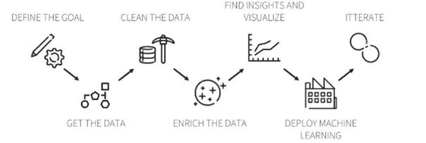
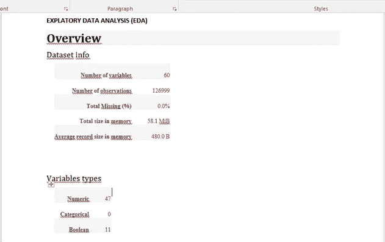
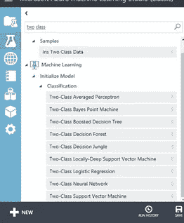
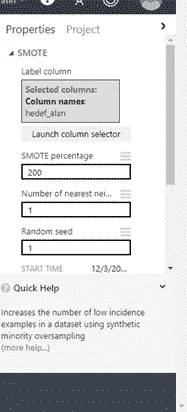
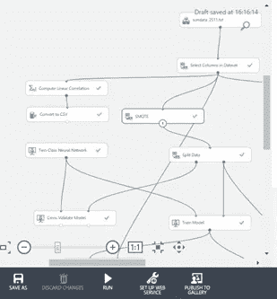
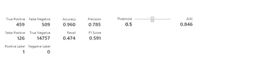

# 使用 Azure ML Studio 的预测性回购模型方法

> 原文：<https://medium.com/analytics-vidhya/predictive-repurchase-model-approach-with-azure-ml-studio-2d63cc067e22?source=collection_archive---------19----------------------->

照片:Unsplash.com

我将尝试解释一种方法，如何评估客户购买消费品或汽车等的意向。在 Azure ML Studio 中。

首先，我们应该检查我们的数据质量，并决定我们将在预测模型中使用的时间间隔。我们可以使用过去 5 年的销售和客户数据来完成数据收集任务。我们可以根据所有客户的交易、发票金额、活动响应以及他们的 RFM(近期、频率、货币)数据点收集他们 4 年的数据。然后，我们可以将去年再次购买的客户标记为我们的目标客户。

建模过程—[https://www.dataiku.com/stories/models/](https://www.dataiku.com/stories/models/)

有一些重要的数据点你应该计算和设计。例如，每种发票类型的发票金额、品牌所有权、每种类型的商品数量以及您可以在建模中使用的客户接触点数据。呼叫中心呼叫 NPS 得分和失去的销售机会计数也是建模的重要输入。客户的数字足迹也是提高模型准确性的非常重要的数据点。我还为每个客户添加了每个产品类型的产品计数。我更喜欢收集数字格式的必要数据。这就是为什么我们应该将一些数据点格式化为数字格式，例如，我将商业帐户设置为“1 ”,将个人帐户设置为“2 ”,以便在模型中使用。能够从不同的系统收集数据并为这种工作创建客户的整体视图是很重要的。

我认为另一个重要而棘手的部分是了解你公司所在行业的商业和市场动态。您应该知道哪些数据会对您的建模成功产生影响。此外，你应该从销售、营销甚至财务部门获得足够的信息，以了解什么驱动着忠诚的客户，什么驱动着持久的客户关系。它将减轻你解释你的洞察力和你的模型结果的工作。

收集数据后，我做了一些数据测试，以确保数据是正确的。之后我用 Python 进行了 EDA(探索性数据分析)部分。我在 EDA 部分使用了**熊猫简介报告**包，我发现它非常有用。安装数据后，您可以编写 pp.profilereport (df ),您将获得有关数据的所有详细信息，如一般数据集信息、变量类型、每个数据点的警告，以及每个变量的详细信息，如最小值、最大值、平均值、不同计数、缺失数据和零百分比。

Python EDA

这也给出了 Spearman 和 Pearson 指标中数据点之间的相关性。我们可以看到与我们的目标点最相关的数据点，这是显示客户去年再次购买的标志字段。我在这里标记了 20 个最相关的数据点，以便在建模阶段尝试。

我将数据上传到 Azure ML Studio 来执行建模阶段。它易于使用，是一个创建预测模型的拖放工具。因此，我们收集了数据，执行了 EDA，现在我们更好地了解了我们的数据。由于我们将目标数据字段创建为一个标志(1 或 0)，我们的建模问题现在是一个两类问题，我将使用 Azure ML Studio 中的所有两类算法来获得最佳结果。

Azure ML 工作室

上传数据后，我意识到我的目标数据太少，无法创建一个好的模型。我的意思是回购客户对我们的模式来说太少了。这就是我使用过采样方法的原因。在 ML Studio 中它被称为 SMOTE。您可以在此功能中指定增加目标字段的百分比。

重击

Azure ML 工作室

之后，我们准备设置模型并比较结果。我尝试了所有的两类算法来寻找最准确的结果，如 SVM，神经网络，决策树，提升决策树等…

SVM 结果

上面你可以看到一个 SVM 模型的示例结果分数。对于我们的问题，检查 F1 的分数很重要。准确度一般保持在 0.95–0.98 水平。在我们的问题中，这是正常的，因为我们的目标数据字段中有许多零。我正在比较结果页面上的 F1 分数。在两类神经网络算法中，我们得到了最好的结果。我们得到了 0.73 的 F1 分数。

*在一个***的统计* [*的二元分类*](https://en.wikipedia.org/wiki/Binary_classification)******F-score****或****F-measure****是衡量一个测验的准确性。它考虑测试的* [*精度*](https://en.wikipedia.org/wiki/Precision_(information_retrieval)) *p 和* [*召回*](https://en.wikipedia.org/wiki/Recall_(information_retrieval)) *r 来计算分数:p 是正确阳性结果的数量除以分类器返回的所有阳性结果的数量，r 是正确阳性结果的数量除以所有相关样本(所有本应被识别为阳性的样本)的数量。F1 分数是***的**调和平均值* *，其中 F1 分数在 1 处达到最佳值(完美的精度和召回)，在 0 处达到最差值。* ***(维基)********

**因此，我们可以获得 CSV 形式的客户分数，并为这些客户计划特殊行动/活动。通过这项工作，您可以提高营销活动的销售线索和发票转化率。如果您正在构建一个实时分析结构，那么您可以在您的业务系统中将您的模型与 Web 服务结合使用。**