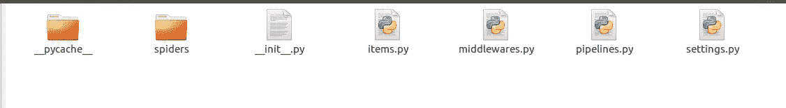

# 通过搜索网络准备僧伽罗语语料库

> 原文：<https://medium.com/analytics-vidhya/prepare-a-corpus-in-sinhala-language-by-crawling-the-web-28f34a0a3713?source=collection_archive---------11----------------------->


如果你想建立一个信息检索系统，你需要做的第一件事就是收集一组文档(语料库)。在收集一套文件的过程中，你要面对几个问题。

1.  确定文档的单元，例如:整个电子邮件线程/仅该线程的第一封电子邮件/带或不带附件的电子邮件等
2.  语言—例如:英语/僧伽罗语/泰米尔语/日语等
3.  格式—例如:PDF/HTML/JSON 等

然而，通过克服这个挑战，假设我们想要收集一组 JSON 格式的僧伽罗语歌曲。我发现这个网站[http://lyricslk.com/](http://lyricslk.com/)包含大约 800 首僧伽罗语歌词。让我们抓取这个网站来提取我们需要的信息。

*注意:以下步骤可以应用于任何其他有网站地图的网站，语言无关紧要。*

我们将使用名为 [Scrapy](https://docs.scrapy.org/en/latest/) 的工具来抓取网页。这是一个用 python 编写的框架应用程序，用于抓取网站并提取结构化数据，这些数据可用于各种有用的应用程序。

1.  [**安装刺儿头**](https://docs.scrapy.org/en/latest/intro/install.html#installing-scrapy)

作为先决条件，您需要安装 python2.7 或更高版本的 pip/anaconda 软件包管理器

要使用 conda 安装 Scrapy:

`conda install -c conda-forge scrapy`

使用 pip 安装 Scrapy:

`pip install Scrapy`

**2。创建一个新的 Scrapy 项目**

导航到您想要创建项目的位置，打开终端并发出

`scrapy startproject lyrics`

这里“歌词”是项目名称。

这个命令创建一个新的名为“歌词”的 Scrapy 项目，它包含一个名为“歌词”的文件夹和一个名为“scrapy.cfg”的文件。



内部歌词文件夹中的文件夹和文件

**3。写一个蜘蛛抓取网页并提取数据**

Scrapy 的蜘蛛类定义了一个站点或一组站点将如何被抓取。一些通用的蜘蛛是 CrawlSpider、XMLFeedSpider、CSVSpider 和 SitemapSpider。你可以从[这里](https://docs.scrapy.org/en/latest/topics/spiders.html)阅读更多细节。

在这篇文章中，我使用了一个 [SitemapSpider](https://docs.scrapy.org/en/latest/topics/spiders.html#sitemapspider) 。SitemapSpider 允许我们通过使用 sitemap.xml 发现 URL 来爬行站点。

点击此链接，访问 lyricslk.com 网站的 sitemap.xml。【http://lyricslk.com/sitemap.xml 

导航到 lyrics/lyrics/spider，用以下内容创建一个文件“lyrics_spider.py”。

歌词 _spider.py

`sitemap_rules = [(‘^(?!.*artist).*$’, ‘parse’)]`

这个 sitemap_rule 描述了，任何包含单词“artist”的 URL 都被忽略。考虑所有其他 URL。

`response.xpath`用于从各个站点提取所需信息。由于与从 sitemap 中提取的 URL 相关的所有页面都是一致的，我们可以使用一组常量 xpaths 来提取信息，如**歌曲**、**歌手**和**标题**。

**4。** **运行创建好的蜘蛛**

导航到项目的顶级目录并运行:

`scrapy crawl lyrics -o output.json`

这里“歌词”是蜘蛛类使用的名称。

```
class LyricsSpider(SitemapSpider):
      name = “lyrics”
```

提取的数据将被写入“output.json”文件。

```
[
{"song": " \u0d9a\u0db3\u0dd4\u0dc5\u0dd4 \u0d9a\u0dd2\u0dbb\u0dd2 \u0db4\u0ddc\u0dc0\u0dcf \u0dad\u0dd4\u0dbb\u0dd4\u0dbd\u0dda \u0dc3\u0dd9\u0db1\u0dd9\u0dc4\u0dc3\u0dd2\u0db1\u0dca \u0dc4\u0daf\u0dcf \u0d9a\u0db3\u0dd4\u0dc5\u0dd4 \u0dc0\u0dd2\u0dbd \u0daf\u0dd2\u0d9c\u0dda \u0db1\u0ddc\u0db4\u0dd9\u0db1\u0dd3 \u0d9c\u0dd2\u0dba\u0dcf\u0daf\u0ddd \u0d85\u0db8\u0dca\u0db8\u0dcf  \u0dc3\u0dad\u0dca \u0db4\u0dd2\u0dba\u0dd4\u0db8\u0dca \u0dc0\u0dd2\u0dbd\u0dda \u0dc0\u0dd2\u0dbd \u0db8\u0dd0\u0daf \u0dba\u0dc5\u0dd2 \u0db4\u0dd2\u0db4\u0dd3 \u0daf\u0dd2\u0dbd\u0dda \u0daf\u0dd4\u0da7\u0dd4 \u0dc3\u0db3 \u0daf\u0dbb\u0dd4\u0dc0\u0db1\u0dca \u0dc0\u0dd9\u0dad \u0db8\u0dc0\u0d9a\u0d9c\u0dda \u0dc3\u0dd9\u0db1\u0dda \u0db8\u0dd2\u0dc4\u0dd2\u0d9a\u0dad \u0dc0\u0dd4\u0dc0 \u0dc4\u0dac\u0dcf \u0dc0\u0dd0\u0da7\u0dda  \u0db1\u0dd2\u0dc0\u0db1\u0dca \u0db8\u0db1\u0dca \u0db4\u0dd9\u0dad\u0dda \u0d94\u0db6  \u0d9c\u0dd2\u0dba \u0db8\u0db1\u0dca \u0dbd\u0d9a\u0dd4\u0dab\u0dd4 \u0db4\u0dd9\u0db1\u0dda \u0dc0\u0da9\u0dd2\u0db1\u0dcf \u0daf\u0dcf \u0db1\u0dd2\u0dc0\u0db1\u0dca \u0db4\u0dd4\u0dad\u0dd4 \u0dc3\u0dd9\u0db1\u0dda \u0dc0\u0da9\u0dcf \u0db8\u0dcf \u0daf\u0dd9\u0dc3 \u0db6\u0dbd\u0db1\u0dd4 \u0db8\u0da7 \u0daf\u0dd0\u0db1\u0dda ", "title": "\u0d9a\u0db3\u0dd4\u0dc5\u0dd4 \u0d9a\u0dd2\u0dbb\u0dd2 \u0db4\u0ddc\u0dc0\u0dcf", "singer": "\u0d85\u0db8\u0dbb\u0daf\u0dda\u0dc0 W.D."},
{"song": " \u0d89\u0dbb \u0dc4\u0db3 \u0db4\u0dcf\u0dba\u0db1 \u0dbd\u0ddd\u0d9a\u0dda \u0d86\u0dbd\u0ddd\u0d9a\u0dba \u0d85\u0dad\u0dbb\u0dda \u0dc3\u0dd0\u0db4 \u0daf\u0dd4\u0d9a \u0dc3\u0db8\u0db6\u0dbb \u0dc0\u0dda \u0db8\u0dda \u0da2\u0dd3\u0dc0\u0db1 \u0d9a\u0dad\u0dbb\u0dda // \u0dc3\u0dd0\u0db4 \u0daf\u0dd4\u0d9a \u0dc3\u0db8\u0db6\u0dbb \u0dc0\u0dda  \u0d8b\u0d9a\u0dd4\u0dbd\u0dda \u0dc5\u0db8\u0dd0\u0daf\u0dda \u0dc3\u0db8\u0db6\u0dbb \u0d8b\u0dc3\u0dd4\u0dbd\u0db1 \u0d9c\u0dd0\u0db8\u0dd2 \u0dbd\u0dd2\u0dba \u0dba\u0db1 \u0d9c\u0db8\u0db1\u0dda \u0db8\u0dd4\u0daf\u0dd4 \u0db6\u0db3 \u0db1\u0dd0\u0dc5\u0dc0\u0dd9\u0db1 \u0dc3\u0dda \u0d9a\u0db3\u0dd4\u0dc0\u0dd0\u0da7\u0dd2 \u0d9c\u0d82\u0d9c\u0dcf \u0dc3\u0dcf\u0d9c\u0dbb \u0d91\u0d9a\u0dc3\u0dda \u0db4\u0ddc\u0dc5\u0ddc\u0dc0\u0da7 \u0dc3\u0db8\u0db6\u0dbb \u0dc0\u0dda \u0db8\u0dda \u0da2\u0dd3\u0dc0\u0db1 \u0d9a\u0dad\u0dbb\u0dda // \u0dc3\u0dd0\u0db4 \u0daf\u0dd4\u0d9a \u0dc3\u0db8\u0db6\u0dbb \u0dc0\u0dda  \u0dc0\u0dd0\u0da9\u0dd2\u0dc0\u0db1 \u0d86\u0dc1\u0dcf \u0db8\u0dd0\u0dac\u0dbd\u0db1 \u0dc0\u0dda\u0d9c\u0dda \u0da2\u0dd3\u0dc0\u0db1 \u0db8\u0d9f \u0d9a\u0dd0\u0dc5\u0db8\u0dda \u0d92\u0d9a\u0db8 \u0dbb\u0dc3\u0db8\u0dd4\u0dc3\u0dd4 \u0dc0\u0dda \u0db8\u0dc4 \u0dc0\u0db1 \u0dc0\u0daf\u0dd4\u0dbd\u0dda \u0dc0\u0db1 \u0dc0\u0dd2\u0dbd\u0dca \u0db8\u0dad\u0dd4\u0dc0\u0dda \u0db4\u0dd2\u0dba\u0dd4\u0db8\u0dca \u0db4\u0dd2\u0db4\u0dd3 \u0db1\u0dd0\u0da7\u0dc0\u0dda \u0db8\u0dda \u0da2\u0dd3\u0dc0\u0db1 \u0d9a\u0dad\u0dbb\u0dda // \u0dc3\u0dd0\u0db4 \u0daf\u0dd4\u0d9a \u0dc3\u0db8\u0db6\u0dbb \u0dc0\u0dda", "title": "\u0d89\u0dbb \u0dc4\u0db3 \u0db4\u0dcf\u0dba\u0db1 \u0dbd\u0ddd\u0d9a\u0dda", "singer": "\u0d85\u0db8\u0dbb\u0daf\u0dda\u0dc0 W.D."}, ....
```

现在您可以在 output.json 文件中看到类似的内容。

**5。将 unicode 转换成僧伽罗文字符**

导航到“output.json”文件所在的文件夹。

编写一个 python 脚本，将 unicodes 转换为僧伽罗语字符，并将输出写入一个单独的文件。

通过在终端上运行`python -m unicode_converter`命令来执行脚本。

现在您有了“song_lyrics.json”文件，其内容类似于下面的内容。

```
[{"song": " කඳුළු කිරි පොවා තුරුලේ සෙනෙහසින් හදා කඳුළු විල දිගේ නොපෙනී ගියාදෝ අම්මා  සත් පියුම් විලේ විල මැද යළි පිපී දිලේ දුටු සඳ දරුවන් වෙත මවකගේ සෙනේ මිහිකත වුව හඬා වැටේ  නිවන් මන් පෙතේ ඔබ  ගිය මන් ලකුණු පෙනේ වඩිනා දා නිවන් පුතු සෙනේ වඩා මා දෙස බලනු මට දැනේ ", "singer": "අමරදේව W.D.", "title": "කඳුළු කිරි පොවා"}, {"song": " ඉර හඳ පායන ලෝකේ ආලෝකය අතරේ සැප දුක සමබර වේ මේ ජීවන කතරේ // සැප දුක සමබර වේ  උකුලේ ළමැදේ සමබර උසුලන ගැමි ලිය යන ගමනේ මුදු බඳ නැළවෙන සේ කඳුවැටි ගංගා සාගර එකසේ පොළොවට සමබර වේ මේ ජීවන කතරේ // සැප දුක සමබර වේ  වැඩිවන ආශා මැඬලන වේගේ ජීවන මඟ කැළමේ ඒකම රසමුසු වේ මහ වන වදුලේ වන විල් මතුවේ පියුම් පිපී නැටවේ මේ ජීවන කතරේ // සැප දුක සමබර වේ", "singer": "අමරදේව W.D.", "title": "ඉර හඳ පායන ලෝකේ"}, ....
```

凉爽的😎。现在您有了一个丰富的语料库来构建您的信息检索系统。