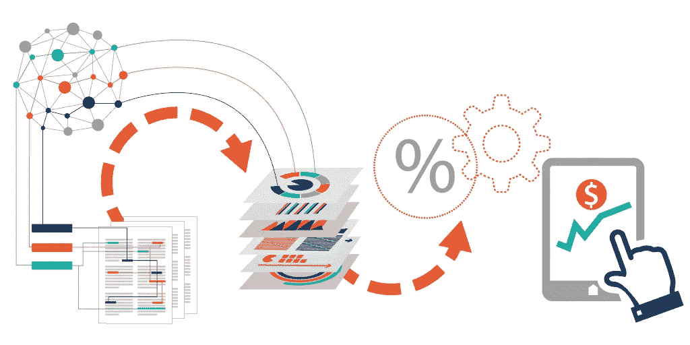
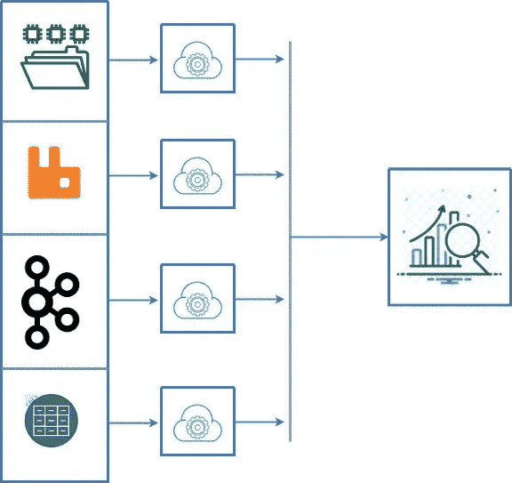
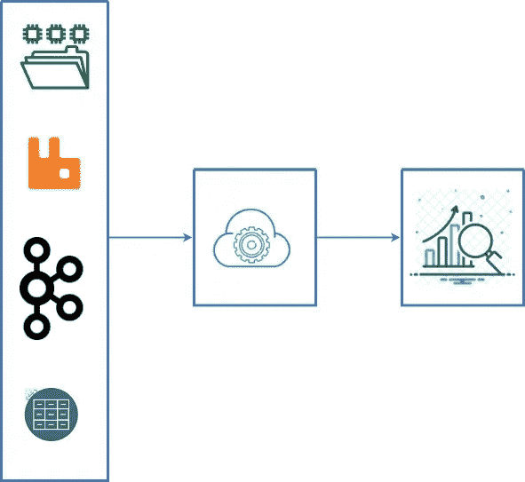
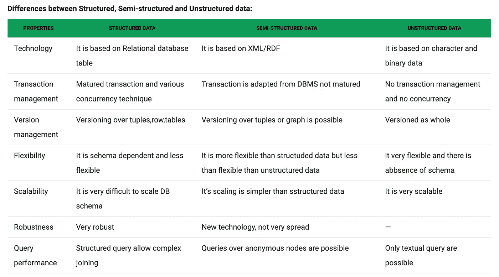

# 准备数据…在分析之前！

> 原文：<https://medium.com/analytics-vidhya/prepare-the-data-before-analyzing-it-e48f5374127a?source=collection_archive---------28----------------------->

这篇文章诞生于给出在能够分析数据之前如何准备数据的指导方针的想法。这并不是一个很常见的做法。相信我，很多时候，你们很多人在使用数据之前甚至没有问过自己如何组织数据的问题，因为这被认为是无用的和浪费时间的，但是相信我，这样做会给你带来很多好处。例如，在项目过程中，最初无法预见的对新指标、新分析等的请求可能会在任务过程中出现。你会如何处理这种情况？如果你不首先创建一个干净和通用的数据集，如果你没有一个最佳的数据流，这几乎是不可能的。考虑到每种数据都是不同的，将非结构化数据转换为结构化数据没有固定的步骤或程序可循，但有一些实现这一目标的最佳方法。在本章中，我们不会讨论如何收集、使用或处理数据，相反，我们将更多地关注使非结构化数据可分析的最佳实践。具体来说，我们将分析以下几点:

1.  单一入口点
2.  清理数据
3.  分析数据
4.  聚合和报告

# 1.单一入口点

有时数据集已经可供分析，可能来自 NoSQL 数据库、数据源甚至文件(csv/excel ),但通常情况下，您会有不同的入口点，既有实时的，也有来自不同来源的。RabbitMQ、Kafka、files 等等都可以用来收集数据，但重要的是，在分析之前，你需要找到一种方法，让所有这些输入都集中在一个点上(不管你使用的是工具、数据库还是文件)。让我们继续看一些例子:

错误(图 1)

在这个例子中(图 1 ),我们的分析部分没有一个单一的入口点，这就不能保证我们的数据会按照预期到达。更重要的是，这些块不是由我们管理的，而是其他组件的微服务。您负担不起(有时是无用的)构建一个包装器来标准化每个输入源的数据。

右侧(图 2)

相反，在第二个例子(图 2)中，我们只有一个入口点；在我们的数据分析工具之前，我们有一个最终的包装。这个包装器应该是我们内部开发的一部分，我们必须控制它。

*请注意，第一个例子(图 1)并不是完全错误的，事实上，我们不同的源可以有自己的包装器，但最后一个不能缺少。在这种情况下，我们应该在分析数据之前放置最后一个包装器来聚集数据。所有这些包装器都是创建特定的和期望的模型所需要的。*

# 2.清理数据

一切都准备好了，我们有了所有需要的数据，现在做什么呢？现在，数据清理阶段必须开始了。请注意，这应该是我们清理数据的唯一阶段！强烈建议不要在接下来的步骤中修改数据集。特别是，在这一阶段，我们应该:

1.  清理无用的数据
2.  确保所有数据类型都是正确的
3.  尽可能正常化
4.  创建所需的计算和导数
5.  从非结构化到已知元素

## **清理无用数据**

这个阶段可以分为两个步骤:

1.  检查重复和错误
2.  删除所有不必要的数据

在第一步中，我们需要确保没有错误或者在最坏的情况下没有重复的数据。找到重复是非常重要的，因为它们可能会在我们的分析过程中给我们假阳性的结果(这取决于数据的类型，想象一下分析日志，在这种情况下，我们不应该删除重复)。在第二步中，我们需要丢弃所有的数据，这些数据对于未来的分析来说是不需要的，也是不需要的。这是一项非常负责任的工作，因为可能会有一些发展需要我们以前丢弃的数据。在第一时间了解我们应该丢弃什么样的数据并不容易，所以在做出决定之前一定要有一个总体的概述并仔细检查。但是这是必须要做的，考虑到这个阶段将为我们节省大量的磁盘空间(数据库、文件等)，将减少进一步的混乱，并将使我们免于在没有益处的数据上浪费时间。

## **确保所有的数据类型都是正确的**

意味着我们需要检查是否所有将要使用的数据都是可用的格式。请记住，统计方法只能用于特定的数据类型，因此，我们必须确保日期是日期，数字是数字，地理空间点是地理数据格式等等。让我们考虑一个包含日期的列，如你所知，格式化的日期更容易被处理，几乎所有你将使用的工具/库都有对日期类型字段的操作。我们必须确保类型有它们自己的正确类型的另一个原因是与我们的数据库(或文件)密切相关的。想象一下，我们想把数据集保存到数据库中，在一些数据库中，每种数据类型都针对存储空间进行了优化，字符串应该是字符串，字符应该是字符，等等。如果类型正确，甚至在 excel 上的分析也会更简单。此外，数据类型告诉我们如何可视化数据，因此，不要忽视这一阶段。

## **尽可能正常化，**永远！( [ref](https://towardsdatascience.com/intro-to-descriptive-statistics-252e9c464ac9) )

> 标准化是一种经常作为数据准备的一部分应用的技术。规范化的目标是将数据集中数值列的值更改为一个通用的比例，而不会扭曲值范围的差异。

正如本声明中所解释的，标准化并不总是可能的，但如果可能的话，它将帮助我们更好地理解数据。如果你想了解更多关于标准化的内容，我发现这篇文章非常详尽。

## **创建所需的计算和衍生产品**

在最后但并非最不重要的阶段，我们应该“创建”分析所需的数据。最好已经准备好所有计算的字段，不要在运行中计算它们。让我们考虑一个包含时间戳格式的日期(因此是数字格式)的列，在分析过程中不能转换为日期。另一个例子可能是需要对两列或更多列执行操作(想象一个简单的平均、减法或加法)，或者更简单的，将出生日期转换成年龄。一旦你执行了这些操作，你就可以一直使用它们，否则，你每次都必须执行这些计算，这不是很方便。所以记住，计算，添加，删除编辑在这个阶段，而不是以后！

## 从非结构化到已知元素

这是非结构化->半结构化->结构化数据转换最终完成的阶段，事实上，在这个阶段结束时，我们应该准备好可处理的结构化数据。我们将数据存储在哪里并不重要:关系数据库、nosql 数据库、文件都是有效的选择，这完全取决于您手中的数据类型。总之，为了清晰地展示数据处理过程(从开始到结束)，这张图片解释了数据从到达到存储的各个阶段之间的差异( [ref](https://www.geeksforgeeks.org/difference-between-structured-semi-structured-and-unstructured-data/) ):

# 3.分析数据

最后，我们到了分析部分，这是数据分析师大放异彩的部分。工具在这里起着核心作用，因为幸运的是，今天，业界提供了各种现成的工具，允许我们以非常详细的方式进行分析。许多工具与最常用的数据库集成在一起，其他的则没有，但每个人都在做自己的工作。仅提及一些备受信赖的 excel 的替代产品:

*   Power BI(由微软提供)
*   Qlik 感觉
*   （舞台上由人扮的）静态画面

…或者不太专业，但仍然很棒(和/或免费)的分析工具:

*   基巴纳
*   格拉马纳
*   Knowi
*   Python(像 matplotlib、plotly、seaborn 这样的库)
*   Rstudio

如果我们正在寻找更专业、更详细的图表、更美观和/或更漂亮的仪表板，那么第一组工具和第二组工具的区别是巨大的。此外，创建报告的可能性(我们将在第 4 章中讨论报告)。相反，有时我们只需要内部业务分析(允许我们了解一些行为的进展)，或者简单地说，日志分析。这就是第二组作为选择更合理的地方。就数据的分析而言，没有太多要说的，选择做什么类型的分析，比较什么数据等等，都是由数据分析师来决定的。因此，如果你首先不知道你的数据，你就不能谈论分析。考虑到这篇文章并不关注数据分析本身，我不想深入讨论这个问题，但是，如果你想了解更多关于数据分析的知识，可以在这里阅读一下数据分析的类型。

# 4.聚合和报告

我们讨论了结构化数据以及在过程结束时保存数据集的重要性。但是，假设您的数据每天都在增长，您无法存储所有数据，否则迟早会遇到存储、硬件等各种问题。在这种情况下，最好通过执行分类操作(例如，每年、部门或元素)将数据划分为更小的数据集。请始终记住，除了将数据存储在“*抽屉*中之外，对数据进行分类和拆分将有利于将来参考。很少会再次需要整个数据集，因此，对更窄的数据集进行分析将花费更少的时间和资源。另一个因素是报告，它们是商业世界中的一个关键元素。有各种各样的类型，从最详细的到最简单的，从最重要的(考虑到许多报告也有法律价值)到最不重要的等等…但重要的是尽可能将所有这些报告分成类别、日期和客户。报告是另一种分析方法，例如，处理过去的报告可以揭示损失、改进或仅仅是变化。在结束之前，我想提醒你，报告和分析是两个不同的概念。

***报告:*** *将数据组织成信息摘要的过程，以监控企业不同领域的表现。*

***分析:*** *探索数据和报告的过程，以提取有意义的见解，这些见解可用于更好地理解和改进业务绩效。*

# 结论

如果您在数据世界中，尤其是为数据分析师(不总是数据工程师)提供数据的人，了解要遵循的正确步骤是一大优势。我试图触及并解释从非结构化数据到结构化和可分析数据的整个过程的关键点。比起分析本身，我更关注架构和为将来的分析准备数据。为了让你稍微泄气，我告诉你，你永远不会有一个死板的方案可以遵循，不幸或幸运(这取决于你)，我们必须从一个任务适应到另一个任务，每次都是如此。我再说一遍，你需要知道的是基本概念。

跟我来:

GitHub @ github.com/pbuzulan

领英@【linkedin.com/in/petru-buzulan 

> 感谢阅读！