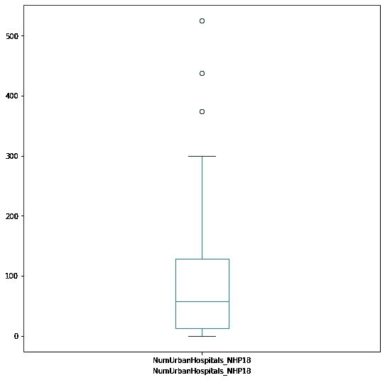

# 印度准备好抗击新冠肺炎等疾病

> 原文：<https://medium.com/analytics-vidhya/preparedness-of-india-to-fight-covid-19-like-diseases-9e07aea4fd78?source=collection_archive---------28----------------------->

“新冠肺炎没有破坏任何制度，它只是暴露了这个被破坏的制度”

在这个疫情之前，我们谈到了去火星、木星和月球对人类的生物存在进行研究。今天，我们无法处理少量的病毒。尽管我们在科学领域进步太快了，但我们是否已经把科学从大自然母亲身边带走了？这是一个值得深思的想法。

 [## 冠状病毒病(新冠肺炎)爆发的流行病学和发病机理

### 冠状病毒疾病(新冠肺炎)代表着全球公共卫生关注，世卫组织宣布进入公共卫生紧急状态。*的…

www.sciencedirect.com](https://www.sciencedirect.com/science/article/pii/S0896841120300469) 

根据 2020 年 5 月发表的文章，**冠状病毒疾病(新冠肺炎)爆发的流行病学和发病机理，**发表在爱思唯尔出版社出版物《自动免疫杂志》上。

冠状病毒疾病(新冠肺炎)代表着全球公共卫生关注，世卫组织宣布进入公共卫生紧急状态。系统发育分析显示，新冠肺炎可能是一种人畜共患病毒。人畜共患病毒是一种在动物和人类之间传播的病毒。需要特别注意保护或减少易感人群中的传播。新冠肺炎出现腹泻等肠道症状，而低比例 MERS-CoV 或 SARS-CoV 患者出现腹泻。迫切需要鉴定用于治疗新冠肺炎感染的新型化疗药物。制药公司在研究领域的处境非常艰难，因为识别新冠肺炎病毒的 DNA 菌株变得越来越困难。迄今为止，这种病毒已经出现了 100 多种变异，理解这种变异变得越来越困难。

本文的目的是分析印度各邦对新冠肺炎疫情的准备情况。

图:1。全印度医院和病床数量的皮尔逊相关性

PHC 的数量=初级保健中心的数量，社区保健中心的数量=社区保健中心的数量，SDH 的数量=分区医院的数量，DH 的数量=分区医院的数量，公共保健中心的数量。健康因素。=公共卫生设施总数，酒吧数量。床位=公共床位数，农村医院数。印度每个邦的数据都被记录下来并制成表格。我们进行了皮尔逊相关分析，看看印度各地医院床位和设施的漏洞在哪里。从图 1 中我们可以看到，分区医院和地区医院之间的比率非常低(r =0.19)，这是我们无法遏制疾病在印度蔓延的原因之一。另一个原因是，分区医院的数量与农村医院的数量之比准确地说是 0.22，这也是一个主要问题，因为治疗病人的压力正落在城市医院身上。为了克服或至少与疫情达成协议，我们必须增加分区医院、地区医院和乡村医院。如果我们谈论病床，印度目前在这些方面管理得很好，但如果它想有效地管理，那么它应该增加分区、区和农村的医院，不仅要与新冠肺炎斗争，还要改善印度各邦的医疗设施。

图:2。全印度初级保健中心数量的箱线图

图 2 显示了印度各地的初级卫生保健中心。达曼和第乌的初级保健中心(PHC)数量最少(n=4)。北方邦的 PHC 人数最多(n = 3277)。第 25 百分位的 PHC 出现在曼尼普尔邦(n=87)，第 50 百分位的 PHC 出现在喜马偕尔邦(n = 516)，第 75 百分位的 PHC 出现在西孟加拉邦(n =1374)。如果我们比较上述各邦截至 2020 年 6 月 26 日的新冠肺炎死亡病例，没有关于达曼和迪乌的信息，北方邦迄今约有 611 例死亡。曼尼普尔没有死亡病例，喜马偕尔邦有 9 例，西孟加拉邦迄今有 606 例因新冠肺炎死亡。

图:3。全印度社区卫生中心数量的箱线图

图 3 代表了印度各地的社区卫生中心。最少数量的社区卫生中心位于锡金邦的达曼和迪乌、查蒂斯格尔、达德拉和纳加尔哈维里(n=2)。马哈拉施特拉邦的社区卫生中心数量最多(n = 430)，但有两个邦的社区卫生中心数量远远高于其他邦，它们是拉贾斯坦邦(n=579)和北阿坎德邦(n=671)。如果我们比较上述各邦截至 2020 年 6 月 26 日的新冠肺炎死亡病例，截至目前，查提斯加尔邦有 12 例死亡，达达尔和纳加尔·哈维里没有，锡金没有，马哈拉施特拉邦有 6931 例，拉贾斯坦邦有 379 例，北阿坎德邦有 36 例死亡。

图:4。印度各地区级医院数量的箱线图

图 4 显示了印度各地的分区医院。安达曼和尼科巴群岛、阿鲁纳恰尔邦、达曼和第乌、查谟和克什米尔、梅加拉亚邦和北方邦的分区医院数量最少(n=0)。马哈拉施特拉邦的 SDH 数量最多(n = 101)，但有两个邦的 SDH 数量远远高于其他邦，它们是卡纳塔克邦(n=147)和泰米尔纳德邦(n=310)。

图:5。全印度地区医院数量的箱线图

图 5 显示了全印度的地区医院。Dadar、Nagar Haveli 和 Lakshwadeep 的区医院数量最少(n=1)。西孟加拉邦的 SDH 数量最多(n = 55)，但有一个邦的 DH 数量远远高于其他邦，那就是北方邦(n=174)。

图:6。全印度公共卫生设施的方框图

图 6 显示了全印度的公共卫生设施。最少数量的公共卫生设施(PHF)位于达曼、迪乌和拉克什瓦迪普(n=8)。北方邦的 PHF 人数最多(n = 4122)。

图:7。全印度公共病床数量箱线图

图 7 显示了全印度公共病床的数量。Lakshwadeep 的公共病床数量最少(n=20)。公共病床数量最多的是泰米尔纳德邦(n = 72616)。

图:8。全印度农村医院数量的箱线图

图 8 显示了全印度农村医院的数量。昌迪加尔和德里的农村医院数量最少(n=0)。奥里萨邦的农村医院数量最多(n = 1655)，但与其他邦相比，有两个邦的农村医院数量更多，它们是卡纳塔克邦(n=2471)和北方邦(n=4442)。

图:9。全印度农村病床数量箱线图

图 9 显示了全印度农村病床的数量。昌迪加尔和德里的农村病床数量最少(n=0)。拉贾斯坦邦的农村病床数量最多(n =21088)，但与其他邦相比，有两个邦的农村病床数量更多，它们是北方邦(n=39104)和泰米尔纳德邦(n= 40179)。

图 10。全印度城市医院数量的箱线图

图 10 显示了全印度城市医院的数量。达曼、迪乌和拉克什瓦迪普的城市医院数量最少(n=0)。喀拉拉邦的城市医院数量最多(n =299)，但与其他邦相比，有三个邦的城市医院数量较多，它们是卡纳塔克邦(n=374)、马哈拉施特拉邦(n=422)和泰米尔纳德邦(n= 525)。

图:11。全印度城市病床数量的箱线图

图 11 显示了全印度城市病床的数量。达曼、迪乌和拉克什瓦迪普的城市病床数量最少(n=0)。马哈拉施特拉邦的城市病床数量最多(n =39048)，但与其他邦相比，有两个邦的城市病床数量更多，它们是卡纳塔克邦(n=49093)和西孟加拉邦(n= 58882)。

然后，我们将各州分为 5 个部分。第一部分称为北印度，我们将其命名为“目标 0”。第二部分称为东印度，我们将其命名为“目标 1”。第三部分称为南印度，我们将其命名为“目标 2”。第四部分称为西印度，我们将其命名为“目标 3”。第五也是最后一部分是印度的其余部分，我们将其命名为“目标 4”。所有的划分都是根据地理位置进行的。

图:12。初级卫生中心与社区卫生中心对比图

图 12 显示了全印度初级卫生保健中心(PHC)与社区卫生保健中心(CHC)的对比图。从图中我们可以看到，印度北部在 PHC 到 CHC 做得很好。北方邦拥有最多的 PHC (n= 3277)和 CHC (n=671)。

图:13。区级医院与区级医院对比图

图 13 显示了印度各地区级医院(SDH)与区级医院(DH)的对比图。从图中我们可以看到，印度南部在 SDH 方面做得不错，印度西部在 DH 方面做得不错。

图:14。公共卫生设施总数与公共床位数的对比图

图 14 显示了全印度公共卫生设施总数与公共病床数量的对比图。从图中我们可以看出，印度北部在公共卫生设施总量方面做得很好，印度南部在公共病床数量方面做得很好。印度西部在这两方面都做得很好，公共卫生设施和公共病床数量平衡的邦是马哈拉施特拉邦。

图:15。农村医院数量与农村床位数量对比图

图 15 显示了全印度农村医院数量与农村病床数量的对比图。从图中我们可以看到，印度北部在这两方面都做得不错，邦是北方邦。

图:16。城市医院数量与城市床位数量对比图

图 16 显示了全印度城市医院数量与城市病床数量的对比图。我们从图中可以看到，印度南部在城市医院数量上做得不错，印度东部在城市病床数量上做得也不错。卡纳塔克邦平衡了两者。

数据取自这个网站:[https://pib.gov.in/PressReleasePage.aspx?PRID=1539877](https://pib.gov.in/PressReleasePage.aspx?PRID=1539877)

 [## 该国的医院

### 卫生和家庭福利部国内医院与其他国家相比的医院数量…

pib.gov.in](https://pib.gov.in/PressReleasePage.aspx?PRID=1539877) 

# 感谢

感谢印度卫生部、T2 家庭福利部将这些数据公之于众。

# 灵感

寻找基于数据的建议来阻止/延缓病毒的传播