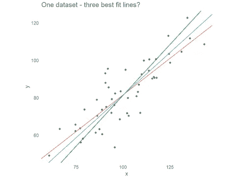
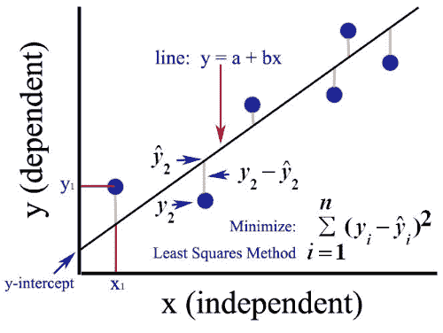
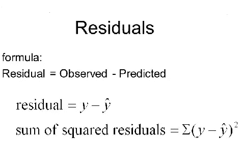
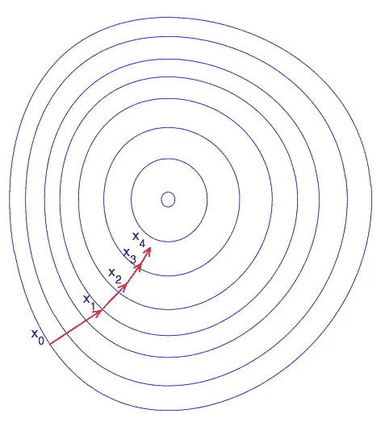
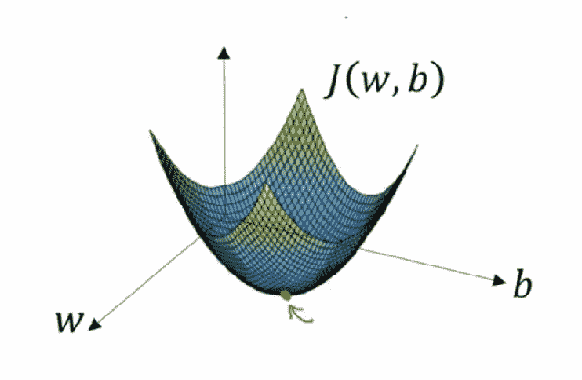
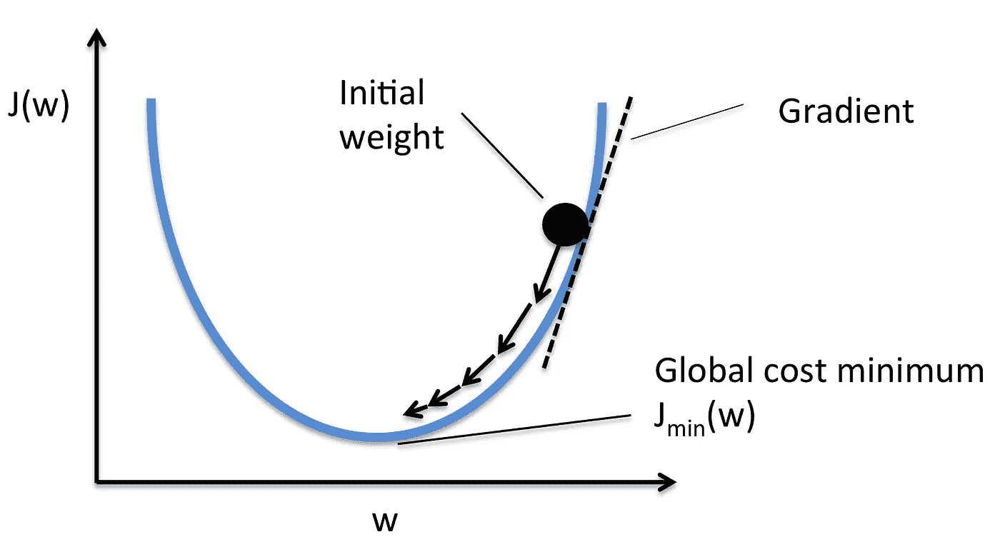
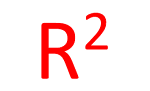
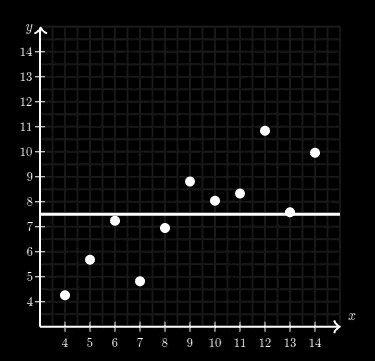
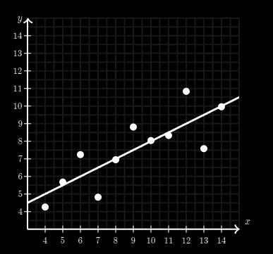
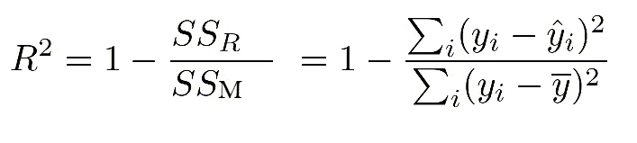

# 准备机器学习的面试？这里，是一个完整的线性回归面试问题指南。

> 原文：<https://medium.com/analytics-vidhya/preparing-for-interview-on-machine-learning-3145caeea06b?source=collection_archive---------1----------------------->

嘿！你准备好面试了吗？还是不自信！！！！别急，过一遍线性回归上常见的面试问题。让你知道，在常用的机器学习算法上测试数据科学有志者是一种常见的做法。这些最常用的传统算法是线性回归、逻辑回归、决策树、随机森林等。数据科学家应该对这些算法有深入的了解。它是许多不同的 ML 算法的基础，所以如果你在面试中错误地给出了这些答案，面试可能就结束了。

考虑到像您这样年轻的数据科学有志之士，我已经涵盖了面试中询问的所有重要概念，以加强您在至少一种传统算法方面的知识。

# 所以，我们从线性回归开始吧！

***面试官:*什么是线性回归？**

***您的回答:*** 线性回归是一种寻找与给定数据最佳直线拟合的方法，即寻找自变量与因变量之间的最佳线性关系。
用专业术语来说，线性回归是一种机器学习算法，可以在自变量和因变量之间找到任何给定数据的最佳线性拟合关系。这主要是通过残差平方和的方法来完成的。

***面试官:线性回归模型有哪些假设？***

***你的答案:*** 线性回归分析中的重要假设有:

1.  因变量(响应变量)和独立变量(预测变量)之间应该存在线性和加法关系。线性关系表明，由于 X 的一个单位变化而引起的响应 Y 的变化是恒定的，与 X 的值无关。加法关系表明，X 对 Y 的影响与其他变量无关。
2.  剩余(误差)项之间应该没有相关性。
3.  独立变量不应相关。
4.  误差项必须具有恒定的方差。这种现象被称为同质性。
5.  误差项必须呈正态分布。

面试官:如果这些假设被违反了会怎样？

***你的答案:*** 为了理解违反这些假设的后果，我们必须深入这些假设。

**线性和可加性:**如果我们将线性模型拟合到非线性和非可加性数据集，回归算法将无法从数学上捕捉趋势，从而导致模型效率低下。此外，这将导致对未知数据集的错误预测。

**自相关:**当残差不是相互独立时，就会出现自相关。换句话说，当 y(x+1)的值不独立于 y(x)的值时。误差项中相关性的存在大大降低了模型的准确性。这通常发生在下一个时刻依赖于前一个时刻的时间序列模型中。如果误差项相关，估计的标准误差往往会低估真实的标准误差。如果发生这种情况，会导致置信区间和预测区间变窄。

> 置信区间是这样定义的值的范围，使得参数值有一个特定的概率位于其中。
> 
> 当给定自变量的特定值时，预测区间是可能包含单个新观察值的因变量的值的范围。更窄的预测间隔意味着具有相同设置的未来观测的预测值将位于更窄的范围内。

**多重共线性:**当发现自变量中度相关或高度相关时，就会出现这种现象。在具有相关变量的模型中，找出预测变量与响应变量的真实关系是一项艰巨的任务。换句话说，很难找出哪个变量实际上有助于预测响应变量。

此外，随着相关预测因子的出现，标准误差有增加的趋势。而且，标准误差越大，置信区间越宽，导致斜率参数的估计精度越低。

**异方差:**误差项中非恒定方差的存在导致异方差。一般来说，异常值出现时会产生非常数方差。看起来这些值得到了太多的权重，从而不成比例地影响了模型的性能。当这种现象发生时，置信区间往往会过宽或过窄。

**误差项的正态分布:**如果误差项是非正态分布，置信区间可能变得过宽或过窄。非正态分布的存在表明，有一些不寻常的数据点，必须仔细研究，以建立一个更好的模型。

***面试官:如何在线性回归模型中找到最佳拟合线*？**

为了找到模型的最佳拟合线，我们必须使相对于所有点的距离最小。我们必须找到最接近所有点的那条线。在统计学中，这个垂直距离称为残差。

残差等于观察值和预测值之差。对于线以上的数据点，残差为正，对于线以下的数据点，残差为负。因此，如果要找出所有残差的总和，那么由于负误差，距离将会减少，结果距离的值将小于实际值。因此，为了消除负号，我们必须对每个残差求平方，并找出它的和。

这个距离称为残差平方和(SSE ),该方法称为最小二乘法，因为我们需要找到 SSE 最小的线性回归线的 m 和 b 的值。

***面试官:*为什么我们用平方误差而不是用模数？**

的确，人们可以选择使用绝对误差，而不是平方误差。事实上，当根据我们的模型进行预测时，绝对误差通常更接近我们想要的。但是，我们想惩罚那些造成最大误差的预测值。此外，更深入地看，平方误差处处可微，而绝对误差则不可微(其导数在 0 处未定义)。这使得平方误差更适合于数学优化技术。为了优化平方误差，我们可以设置其导数等于 0，然后求解。优化绝对误差通常需要更复杂的技术。实际上我们找到了均方根误差，所以 RMSE 的单位和因变量相等。

***面试官:*用什么技巧找到最符合模型的线性回归线的斜率和截距？**

***你的答案:*** 主要有两种方法:

1.  普通最小二乘法(统计领域)
2.  梯度下降(微积分系列)

***面试官:简单解释一下普通最小二乘回归。***

***你的答案:*** *普通最小二乘(OLS)回归*是一种估计一个或多个自变量与因变量之间关系的统计分析方法。该方法通过最小化配置为直线的因变量的观察值和预测值之间的差的平方和来估计关系。OLS 回归用于双变量模型，即只有一个自变量( *X* )预测因变量( *Y* )的模型。然而，OLS 回归的逻辑也可以用于有两个或更多自变量的多变量模型。

***面试官:**OLS 有哪些局限性？***

***你的答案:*** OLS 计算量太大。它在处理小数据时表现良好。对于较大的数据，梯度下降是首选。

***面试官:*** **能简单解释一下梯度下降吗？**

梯度下降是一种优化算法，用于训练机器学习模型。它基于一个凸函数，并反复调整其参数，以最小化给定函数到其局部最小值。

我们可以把梯度看作函数的斜率。梯度越高，斜率越陡，模型可以学习得越快。但是如果斜率为零，模型就停止学习。在数学术语中，梯度是相对于其输入的偏导数。

> 让我们想象一下，一个被蒙住眼睛的人想用最少的步子爬到山顶。他可能会在最陡的方向迈很大的步子开始爬山，只要他没有接近山顶，他就能做到。当他越来越接近顶端时，他的步子会越来越小，以避免超过顶端。这个过程可以用梯度进行数学描述。
> 
> 想象下面的图片从上往下展示了我们的山，红色的箭头是我们登山者的脚步。在这种情况下，可以把梯度想象成一个向量，它包含了被蒙住眼睛的人所能走的最陡的一步的方向，以及这一步应该走多长时间。

> 注意，从 X0 到 X1 的梯度比从 X3 到 X4 的梯度长得多。这是因为决定向量长度的山的陡度/斜率较小。这完美地代表了山的例子，因为山越往上爬就越不陡。因此，对于爬山者来说，坡度的减小伴随着坡度的减小和步长的减小。
> 
> 与其爬山，不如把梯度下降想象成徒步走到谷底。这是一个更好的类比，因为它是最小化给定函数的最小化算法。

假设我们有一个机器学习问题，并希望用梯度下降来训练我们的算法，以最小化我们的成本函数 *J* ( *w* ， *b* )，并通过调整其参数( *w* 和 *b* )来达到其局部最小值。我们可以假设横轴表示参数( *w* 和 *b* )，而纵轴表示成本函数 *J* ( *w* 、 *b* )。

我们知道我们想要找到对应于成本函数最小值的 *w* 和 *b* 的值(在上图中用红色箭头标出)。为了找到正确的值，我们用一些随机数初始化 *w* 和 *b* 。然后，梯度下降从该点开始(在我们的图示顶部附近的某个地方)，并且在最陡的下行方向上(即，从图示的顶部到底部)一步接一步地前进，直到到达成本函数尽可能小的点。

***面试官:*解释学习率的意义。**

***你的答案:*** 学习率决定了梯度下降向局部最小值方向迈多大的步，它计算出我们向最优权重移动的快慢。

为了使梯度下降达到局部最小值，我们必须将学习速率设置为一个适当的值，这个值不能太低也不能太高。这很重要，因为如果它采取的步骤太大，它可能不会达到局部最小值，因为它在梯度下降的凸函数之间来回跳动。如果我们将学习率设置为一个非常小的值，梯度下降将最终达到局部最小值，但这可能需要一段时间。

***面试官:*如何评价回归模型？**

***你的答案:*** 有五个指标用于评估回归模型:

1.  平均绝对误差
2.  均方误差
3.  均方根误差(RMSE)
4.  r 平方(决定系数)
5.  调整后的 R 平方

***面试官:*对于有大量异常值的数据，你更喜欢使用哪种评估技术？**

***您的回答:*** 平均绝对误差(MAE)更适合用于含有太多异常值的数据，因为 MAE 对异常值非常稳健，而 MSE 和 RMSE 对异常值非常敏感，并通过对残差求平方来惩罚异常值。

***面试官:*R 平方背后的直觉是什么？**

***你的答案:*** 我们用线性回归来预测给定 x 的某个值的 y .但是假设我们要预测一个 y 值而没有对应的 x 值，

如果不对 x 变量使用回归，我们最合理的估计是简单地预测 y 值的平均值。

然而，这条线不会很好地拟合数据(正如我们在上图中看到的)。测量直线拟合度的一种方法是计算残差平方和，这让我们对给定模型的预测误差有一个总体的了解。

现在，如果我们用回归法预测相同的数据，我们会看到最小二乘回归线似乎与数据吻合得很好(如下图所示)。

我们会发现，使用最小二乘回归，残差平方和已大大减少。

所以使用最小二乘回归消除了大量的预测误差。R-squared 告诉我们，当我们对 x 变量使用最小二乘回归时，y 变量中的预测误差消除了百分之多少。

因此，R 也被称为**决定系数。**许多正式的定义说 R 告诉我们，x 变量的回归解释了 y 变量的可变性的百分之几。R 的值从 0 到 1 不等。

***面试官:*R 可以是负数吗？**

***你的答案:*** 可以，R 可以是负数。R 的公式由下式给出:

在哪里，

Var 均值=均值线的方差

Var R =回归线的方差

因为方差等于误差平方和。所以，R 可以写成:

如果平均线(SSM)的误差平方和大于回归线(SSR)，R 平方将为负。

***面试官:*R 平方有哪些瑕疵？**

***你的答案:*** 有两大缺陷:

**问题 1:** R 随着模型中每增加一个预测因子而增加。由于 R 总是增加而从不减少，随着我们在模型中加入更多的项，它可能看起来更适合。这可能完全是误导。

**问题 2:** 同样，如果我们的模型有太多的项和太多的高阶多项式，我们可能会遇到过度拟合数据的问题。当我们过度拟合数据时，一个误导性的高 R 值会导致误导性的预测。

***面试官:*什么是调整后的 R？**

***你的答案:*** 调整后的 R 平方用于确定自变量和因变量之间的相关性有多可靠。在添加高度相关的变量时，调整后的 R 平方将增加，而对于与因变量不相关的变量，调整后的 R 平方将减少。

公式是:

其中:

*   n 是数据样本中的点数。
*   k 是独立回归变量的数量，即输入列的数量。

调整后的 R 将始终小于或等于 R。

***结论:*** 这是从线性回归可以问出的几个基本问题。请注意，我已经详细解释了几个问题，以便让你清楚概念，更好地理解。回答面试官的问题时要具体。只回答你被问到的问题。自信一点，回答的潇洒一点。祝你好运！

*如果你觉得这很有帮助，别忘了点击*👏图标*。这将有助于其他像你一样的年轻有志之士看到这个故事。谢谢大家！*😊

参考资料:

1.  [https://builtin.com/data-science/gradient-descent](https://builtin.com/data-science/gradient-descent)
2.  [https://www . khanacademy . org/math/AP-statistics/bivariate-data-AP/assessing-fit-least-squares-regression/a/r-squared-intuition](https://www.khanacademy.org/math/ap-statistics/bivariate-data-ap/assessing-fit-least-squares-regression/a/r-squared-intuition)