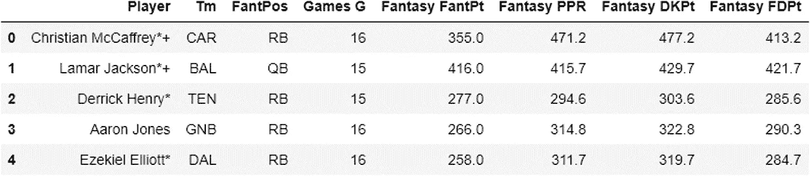
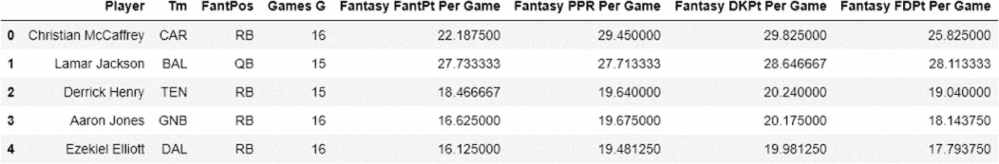
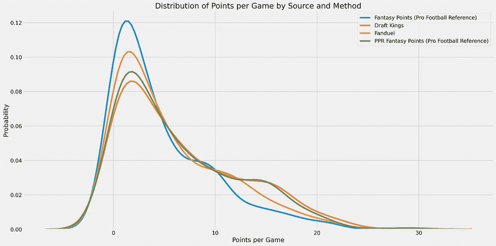
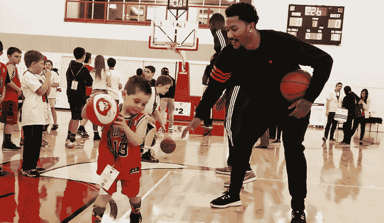
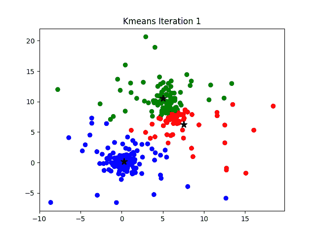
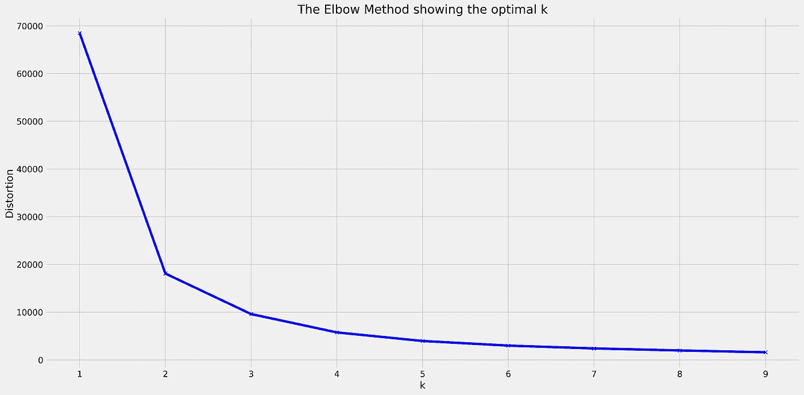
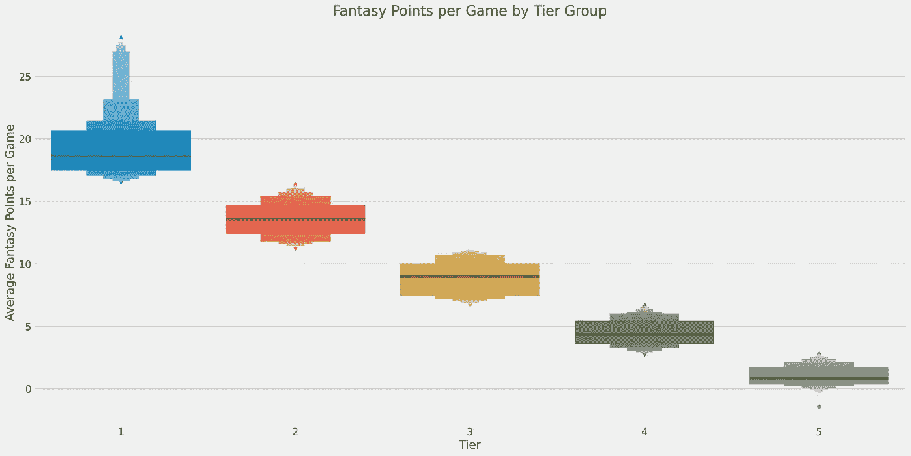
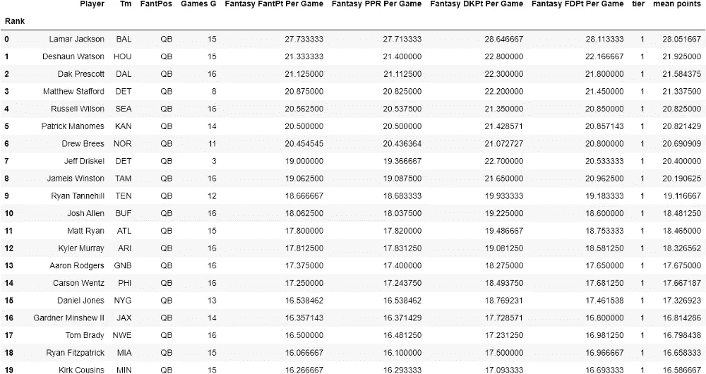

# 梦幻足球选秀准备

> 原文：<https://medium.com/analytics-vidhya/preparing-for-the-2020-nfl-draft-with-k-means-ef4ed4faecf7?source=collection_archive---------10----------------------->

## 为 2020 年梦幻足球赛季做准备的数据科学方法。


准备好伙计们！

## 一点背景知识。

作为一名数据科学的学生和大多数足球爱好者，我抓住机会测试我新发现的优化我的梦幻足球名单的数据科学能力。我可以依靠虚拟足球职业选手的预测和推荐，但这有什么意思呢？有这么多的来源来获得球员的预测和排名，那么为什么不使用多个来源来改善我的名册呢？

这篇文章旨在展示我用来为我的梦幻足球队构建精选四分卫、紧逼端、外接球手和跑卫的方法。我想强调，这绝不是最好的方法，也不是唯一的方法，但这是一种方法。

## 数据。

这个项目使用的数据涵盖了整个 2019 年 NFL 常规赛。我们的数据集来自[职业足球参考](https://www.pro-football-reference.com/fantasy/index.htm)，包括以下栏目:

*   **玩家**:玩家的名字。
*   **Tm** :玩家队伍的三个字母缩写。
*   **FantPos** :球员在场上的位置。
*   **比赛 G**:2019 赛季比赛场次。
*   **Fantasy FantPt**:Pro Football Reference 官方评分方式，全赛季总得分。
*   **梦幻 PPR** :官方评分方法的略微修改版本，包括额外的得分机会，整个赛季的总得分。
*   **梦幻 DKPt** :选秀国王官方评分方式，全赛季总得分。
*   **幻想 FDPt** : Fanduel 官方评分方式，全赛季总得分。



数据一瞥。

## 数据清理。

为了正确处理我们的数据，我们必须清理和研究它。换句话说，必须对数据进行格式化，以考虑缺失值、异常值和异常文本。

例如，球员的名字应该被规范化，去掉星号和加号。虽然对这种情况来说这不是必须的，但现在清洁它将使我们更容易进行未来的浓缩。我们将把下面的函数应用到我们的球员姓名栏来编辑文本。

```
import re # Python Regular Expression moduledef str_fixer(text: str):
    """uses predetermined regex pattern to normalize text"""
    result = re.sub(r"[*+]", "", text)
    return resultdf["Player"] = df["Player"].apply(str_fixer) # applying the function
```



我们现在对每个球员都有正常的名字，更好了。

在这个特定数据集中遇到的另一个问题是存在缺失值。知道数据记录的是梦幻足球的分数，就假设缺少分数的球员可能没有得到任何分数。我们可以使用 pandas 方法`fillna()`用 0 替换指定列中缺失的值。

```
df[["Fantasy FantPt", "Fantasy PPR", "Fantasy DKPt", "Fantasy FDPt"]] = df[["Fantasy FantPt", "Fantasy PPR", "Fantasy DKPt", "Fantasy FDPt"]].fillna(0) # filling missing fantasy values with 0
```

在考虑了分数列的缺失值之后，下一个要考虑的项目是玩家的位置。数据集中有少数球员的场上位置有缺失值。这些玩家倾向于在幻想点数的排名中垫底，所以决定把这些玩家一起去掉(抱歉，格雷格·多奇)。

```
df = df[df["FantPos"].isna() == False] # removing all instances of position-less players
```

## 一点功能操作。

特征操纵，或特征工程，是操纵数据以使其更好地为您和机器学习模型服务的过程。在这一步，拥有领域知识对于提高所述模型的性能是至关重要的。

众所周知，NFL 球员可以有‘热门’的比赛。虽然这对于有这样球员的人来说很棒，但这些比赛不是每个周日都有。为了尝试和减轻这种情况，我们将改变我们的分数栏。

使用“玩的游戏”列，我们将创建新的列，以估计每场游戏的幻想得分。一种方法是借助一个“for”循环。

“for”循环允许您在重复的过程中运行代码。我们可以告诉 Python 去做，而不是手工输入每个新列。下面的代码获取每个分数列，将其除以特定玩家玩的游戏数，并为每场游戏值创建一个新列。

```
for col in df.columns[4:]: # iterating on names of the score columns
    df[f"{col} Per Game"] = df[col] / df["Games G"]
```

现在，我们有了新的栏目，为我们提供了每个玩家在每场游戏中获得的幻想点数的估计值。我们已经准备好开始研究一些具有这些新特性的模式。

## 可视化。

让我们来看看我们的评分服务是如何给出他们的评分的。



我们的消息来源似乎不一致。

这里首先要注意的是上面这个情节的非对称性。注意这四个峰值是如何在 2-3 点范围内的？这张图告诉我们，我们数据集中的很多玩家都属于这一类。这是有道理的，因为我们的高分球员并不是大多数。

从该图表中可以得出的主要结论是，该分析中包含的四个来源在如何评分上存在分歧，或者他们有不同的评分方法。

但这对一般的梦幻足球爱好者来说意味着什么呢？这意味着根据你参考的资源，选择合适的玩家会变得非常混乱和昂贵。

但是还有一种方法，我们可以利用数据科学的力量！与其只看这些资源中的一个或手动搜索互联网，为什么不根据各种分数对玩家进行分组呢？

## 建模

这里的目标是根据不同的分数对玩家进行分组。听起来像是一个等待解决的经典集群问题。

聚类分析或聚类建模是一种将相似的对象聚集到不同组中的方法。

例如，假设我们有一个 NBA 球员样本和一个小学生样本。我们可以做的一件事是记录学生和 NBA 球员的身高。众所周知，NBA 球员比一年级学生高得多(不要引用我的话)，这使得身高成为划分学生与 NBA 球员的绝佳指标。



是的，我得说这是有区别的。

然而，在我们的例子中，我们知道有两个群体，学生和 NBA 球员。我们需要使用一种无监督的方法来确定我们的 NFL 球员数据中存在多少个组或层。为此，我们将使用 K-means 算法。

为了更好地理解 K-means 算法的作用，我将参考迈克尔·j·嘉宝德博士的一篇文章。

*   我们定义了聚类的数量(通常表示为‘k’)，它指的是质心的数量(质心代表给定聚类或组的中心)。
*   通过减少类内平方和，将数据点分配给类。
*   重复该过程，直到聚类被最小化。



K-means 如何工作的可视化表示。注意，星星代表质心。

回到我们的学生与 NBA 球员的例子，我们知道这里有两个组。我们将 K-means 算法赋值为 2(又名:两个组)。由于 8 岁和 20 多岁的职业运动员之间巨大的体型差距，我们的两个质心会落在每个组的平均值附近。不过为了安全起见，该算法会测量每个人与质心之间的距离，以调整到最佳位置(本质上)。

那我们该怎么做？我们应该创建多少个集群？

在现实世界中，我们并不总是知道我们的数据中可能存在多少个聚类。

我们可以确定最佳组数的一种方法是使用[“肘法”](https://www.geeksforgeeks.org/elbow-method-for-optimal-value-of-k-in-kmeans/)“肘方法”比较不同质心配置的组内平方和。

基本上，它帮助我们确定应该创建多少个集群。

我们可以通过测试一系列不同的集群选项并绘制它们来再次使用“for”循环。

```
# importing the model from sklearn
from sklearn.cluster import KMeans# setting X as a new dataframe containing the scores columns
X = df[["Fantasy FantPt Per Game", "Fantasy PPR Per Game", "Fantasy DKPt Per Game", "Fantasy FDPt Per Game"]]distortions = []# testing clusters from 1-9
K = range(1,10)
for k in K:
    kmeanModel = KMeans(n_clusters=k) 
    kmeanModel.fit(X)
    distortions.append(kmeanModel.inertia_)# creating elbow plot
plt.figure(figsize=(16,8))
plt.plot(K, distortions, 'bx-')
plt.xlabel('k')
plt.ylabel('Distortion')
plt.title('The Elbow Method showing the optimal k')
```



看起来很像胳膊肘。

注意 y 轴是如何表示“扭曲”的吗？失真是“距质心的距离(或聚类平均值)”的另一种说法

正如我们在上面看到的，这个图看起来很像一个肘。我们可以用它来决定我们应该在模型中包含多少个质心(x 轴上的 k)。5 看起来相当合适，因为随着 k 的增加，减少失真并没有真正的好处。

现在我们已经有了我们想要的集群数量，我们的模型也合适了，我们可以开始看我应该在草稿中挑选谁了！为了帮助解决这个问题，我们将在数据中添加一列，提供每个玩家所属的组或集群。

```
kmeans = KMeans(n_clusters=5, random_state=1) # using 5 clusters
kmeans.fit(X) # fitting model to data
tiers = kmeans.labels_ # obtaining group labelsdf["tier"] = tiers # setting tier column as group labels
```



第一层看起来很不错。注意到这些盒子看起来像楼梯吗？明确区分。

上面的方框图向我们展示了所有四个来源所获得的幻想点数的平均值。正如你所看到的，一级玩家(我们想要的)每场比赛的得分大概在 16-30 分之间。

有了清晰的层次轮廓，我们可以开始查看球员选秀。让我们来看看属于第一梯队的四分卫。

```
df.query('FantPos == "QB" and tier == 1')
```



这些四分卫相当不错。此表按各来源的平均分排序。

作为一名足球迷，我可以告诉你，像拉马尔·杰克逊、拉塞尔·威尔逊和亚伦·罗杰斯这样的球员非常擅长他们所做的事情，这告诉我，我们的算法做了它应该做的事情:将球员分配到分层的表演组。

表格的结果显示了一个有趣的发现。

注意到上表中的第七项了吗？杰夫·德里斯克尔是底特律里昂队的替补四分卫，在首发四分卫马修·斯塔福德受伤时，他打了三场比赛。通常情况下，四分卫像德里斯科尔会被忽略，但在我们的模型中，我们看到当他得到一些时间时，他并不太寒酸。这可能是赛季后期有用的信息，以防我的主要 QB 受伤，或者所有好的 QB 都被拿走(考虑到备用 QB 在那周比赛)。

## 最后的想法

在我们的一级团队中找到 Jeff Driskel 是我想要进行此分析的原因。替补四分卫通常不被考虑，但现在我们知道如果斯塔福德受伤(希望不是)，我们将有一个相当稳固的季中选秀权。鉴于他在 NFL 的角色，他几乎可以保证整个赛季都可以上场。

这种模式的另一个好处是，它将减少起草时间的压力。由于 K-means 算法成功地将高性能球员分类，我将更好地准备建立我的花名册。如果有人马上带走拉马尔·杰克逊，我不必恐慌，因为他这个级别的球员在整个 2019 赛季的表现非常相似，这意味着我仍然会得到一名伟大的球员。

非常感谢你看了我的第一篇中帖。请留下任何反馈，以便我可以成为更好的数据科学家和幻想足球运动员。

## 参考

*   [https://towards data science . com/understanding-k-means-clustering-in-machine-learning-6a6e 67336 aa 1](https://towardsdatascience.com/understanding-k-means-clustering-in-machine-learning-6a6e67336aa1)
*   [https://www . data novia . com/en/lessons/determining-the-optimal-number-of-clusters-3-must-know-methods/](https://www.datanovia.com/en/lessons/determining-the-optimal-number-of-clusters-3-must-know-methods/)
*   https://www.pro-football-reference.com/fantasy/index.htm
*   [https://medium . com/dunder-data/jupyter-to-medium-initial-post-ECD 140d 339 f 0](/dunder-data/jupyter-to-medium-initial-post-ecd140d339f0)