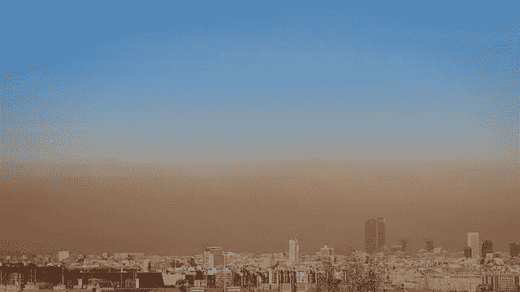
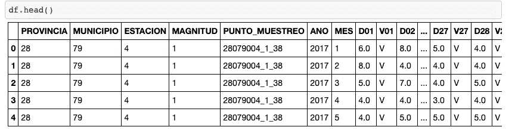
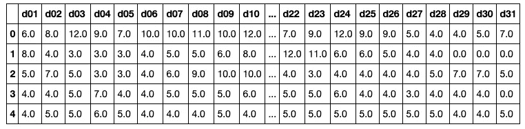
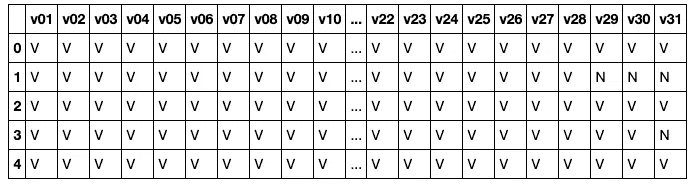
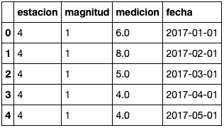
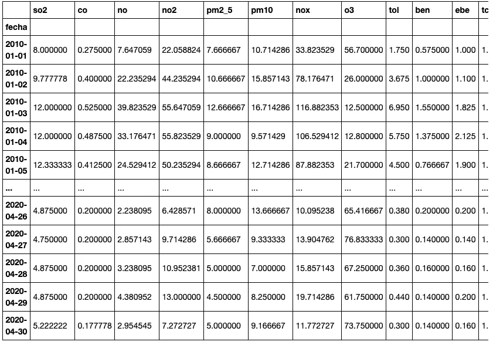

# 准备用于分析的马德里空气质量数据

> 原文：<https://medium.com/analytics-vidhya/preparing-madrid-air-quality-data-for-analysis-8820389a78ad?source=collection_archive---------15----------------------->

被污染覆盖的马德里的可怕景象

## 对分析马德里空气质量数据感兴趣的人的一些预处理步骤

疼痛是受新冠肺炎袭击最严重的国家之一。自 3 月份危机爆发以来，西班牙政府已经采取了多项措施来遏制疫情，将该国置于特殊的封锁状态。采取了强有力的社会距离措施，如教育机构停课、交通限制和停止任何非关键经济活动。经济瘫痪和对行动自由权的限制导致交通、工业活动和发电量急剧减少，因此 [**导致空气污染浓度**](https://www.eea.europa.eu/highlights/air-pollution-goes-down-as) **出现历史性下降。**

我最近在西班牙网站 Agenda Pública 上发表了一篇 [**文章**](http://agendapublica.elpais.com/la-calidad-del-aire-en-madrid-en-tiempos-del-coronavirus/) ，分析了 COVID19 危机期间马德里的空气质量数据。然而，**本文的目的只是分享我用来准备分析数据的 python 代码，**因为我相信它可以被回收，希望能为那些可能对使用马德里空气质量数据进行工作感兴趣的研究人员节省一些时间。

像往常一样，完整的项目可以在我的 GitHub [**资源库**](https://github.com/jcanalesluna/air_quality_madrid_covid19) **中找到。**

## 准备用于分析的数据

马德里空气质量数据可在 [**城市马德里的开放数据门户**](https://datos.madrid.es/sites/v/index.jsp?vgnextoid=f3c0f7d512273410VgnVCM2000000c205a0aRCRD&vgnextchannel=374512b9ace9f310VgnVCM100000171f5a0aRCRD) **获得。遍布全市的 24 个远程监测站监测着空气污染。在** 中可以找到关于站点和被测气体和粒子的信息 [**。出于分析的目的，我使用了涵盖 2010 年至 2020 年期间(直到 4 月)的每日数据。**](https://datos.madrid.es/FWProjects/egob/Catalogo/MedioAmbiente/Aire/Ficheros/Interprete_ficheros_%20calidad_%20del_%20aire_global.pdf)

幸运的是，数据文件结构良好，并且有一个通用的格式。一旦我们下载了 CSV，我们可以使用 **glob 将它们合并到一个数据帧中。**[**glob**](https://docs.python.org/3/library/glob.html)模块查找与指定模式匹配的所有路径名在我们的例子中，我将所有文件保存在同一个路径中，并使用模式“datosxxxx . CSV”*，*是数据被监控的年份 XXXX。下面的代码将读取路径中与模式匹配的所有文件，使用 pandas read.csv 函数读取它们并将它们连接起来。

现在我们有了数据框架，是时候看看它的外观了。

本质上，数据框架包含由城市中的 24 个监测站(ESTACION)收集的不同污染物的每日测量值(MAGNITUD)。一列表示年份(ANO)，另一列表示月份(MES)，还有一列表示一个月中的每一天(D01-D31)。每个日列都有一个相关的列(V01-V31)，表示测量是否有效(“V”表示测量有效，“N”表示测量无效)。关于变量的完整信息可以在 **这里找到 [**。**](https://github.com/jcanalesluna/air_quality_madrid_covid19/blob/master/README.md)**

由于我们的数据帧有无效的数据点，最好将它们设置为空值。为了只保留有效的测量值，我将使用函数[**【combine _ first】**](https://pandas.pydata.org/pandas-docs/stable/reference/api/pandas.DataFrame.combine_first.html)**，****通过用其他数据帧的非空值填充一个数据帧中的空值来组合两个数据帧对象。**

**为了创建两个 dataframe，我们可以使用正则表达式来标识匹配特定模式的列名(为了方便起见，我们将列名转换为小写)。我们希望确定每日测量值和每日测量值的有效性:**

**该代码将返回以下内容:**

********

**现在，我们只需在右侧数据框中为空值设置“V ”,并使用函数 combine_first 用左侧数据框中的测量值填充空值。一旦创建了 now 数据帧，剩余的“N”可以被设置为空。最后，我们可以添加剩余的列。**

**接下来，我们希望通过用日期替换单独一列中的日、年和日来简化数据框架。这将允许我们以后利用日期时间格式的力量。**

**在这一步之后，我们的数据框架看起来更有吸引力:**

****

**然而，仍有一些改进的余地。在许多情况下，我们可能对获得每个站点的空气质量数据不感兴趣，而是以一种汇总的方式。因此，我们可以使用函数 **groupby** 来获得每种污染物的日平均排放量。**

**最后，我们可以使用函数 **pivot** 根据‘magnitude’中的列值生成新的列。新列将代表不同污染物的测量值。识别每种污染物的数字代码可以在 **这里找到 [**。**](https://datos.madrid.es/FWProjects/egob/Catalogo/MedioAmbiente/Aire/Ficheros/Interprete_ficheros_%20calidad_%20del_%20aire_global.pdf)****

**最后，我们可以将日期索引转换成 DateTime 格式。生成的数据帧将如下所示:**

****

**希望这些简单的预处理步骤能对任何有兴趣分析马德里空气质量数据的人有所帮助。**