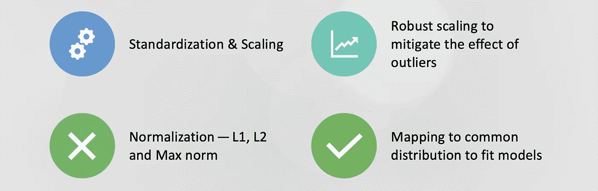
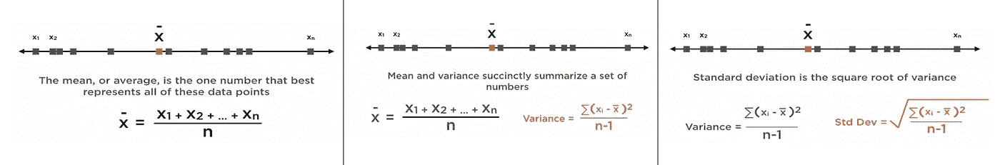
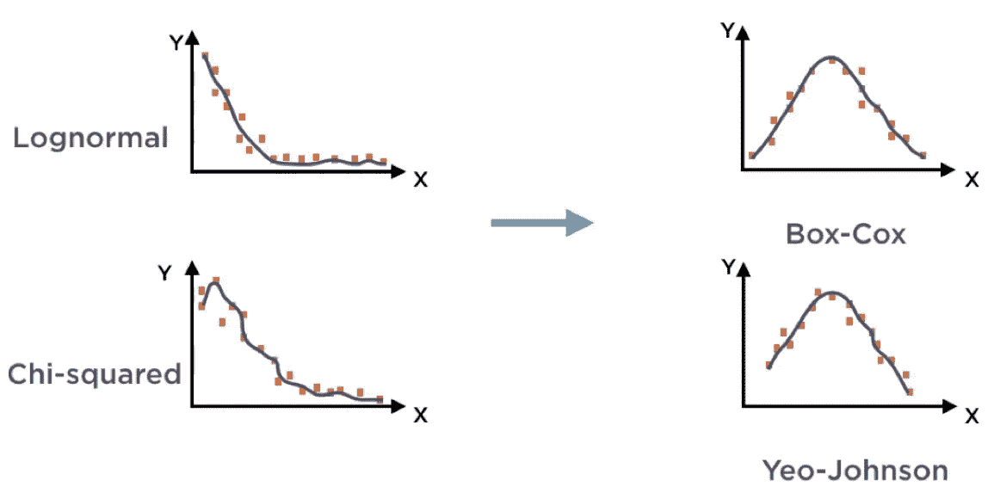
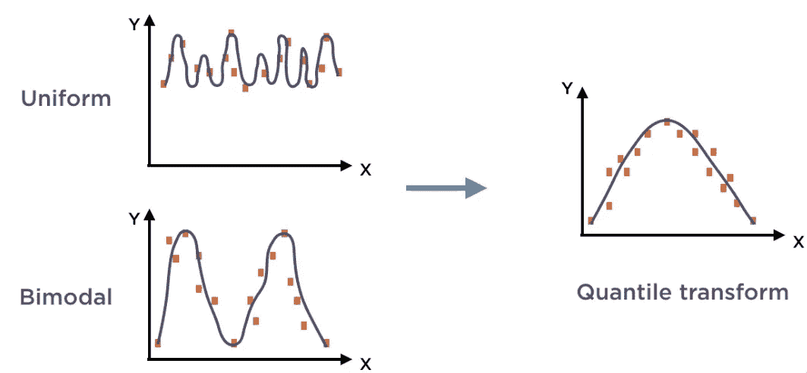

# 为机器学习准备数字数据

> 原文：<https://medium.com/analytics-vidhya/preparing-numeric-data-for-machine-learning-58886dab41a4?source=collection_archive---------14----------------------->

## 为建模准备数据的指南

众所周知，机器学习算法通常不能很好地处理具有不同平均值和不同离散度的**不同尺度**的数字数据，这就是为什么我们需要应用所谓的特征缩放来缩放特征，以便它们具有可比性。

## ***数字特征***

> 可以代表任何种类的信息
> 
> 每个特征/变量的范围是不同的。
> 
> 特征平均和分散也是不同的。
> 
> 比较不同的特征是困难的。

## 标准化和扩展

***特征缩放可分为两大类:***

*   **缩放**:数值被 ***移动和重新缩放*** ，因此所有特征具有相同的比例，即在相同的最小值和最大值内。通常数据被缩放到 0 到 1 的范围内，许多人称之为**规范化**。
*   **标准化**:将数据集中在平均值周围，并将每个值除以方差，这样所有的特征都具有 0 平均值(平均值是集中趋势的度量)和单位方差(方差是离差的度量)。

## 归一化— L1、L2 和最大范数

将输入向量单独缩放到单位范数(单位幅度)的过程，通常是为了简化余弦相似性计算。

不同的规范有:

**L1** :矢量分量的绝对值之和。

**L2** :矢量星等的传统定义。

**Max** :向量元素的最大绝对值。

## 映射到通用分布以适应模型

当数据以某种方式分布时，大多数机器学习算法都工作得很好，如果原始数据不遵循这种分布，那么我们需要转换它。

***不同的转化手法:***

1.  **电力变压器**:

将任意分布中的要素映射为尽可能接近高斯分布/正态分布。当 ML 算法需要零均值、单位方差正态分布特征时，它最有用。

***两种功率变换分别是*** :

*   ***Box-Cox 变换*** :要求严格的正输入数据。
*   ***Yeo-Johnson 变换:*** 支持正负数据。

2.**分位数转换器:**

使用分位数信息变换要素以遵循均匀分布或正态分布。这种转换在本质上往往是非线性的，可能会扭曲数据中存在的相关性和线性关系。

## *结论*

规范化是按行的操作，而缩放是按列的操作，转换是对所有数据点进行的。

本文涵盖的主题有:

*   标准化和扩展
*   稳健扩展以减轻异常值的影响
*   归一化— L1、L2 和最大范数
*   映射到通用分布以适应模型

## 资源

*数据集和全部代码在这里***。**

*感谢您的阅读！！*