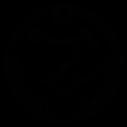
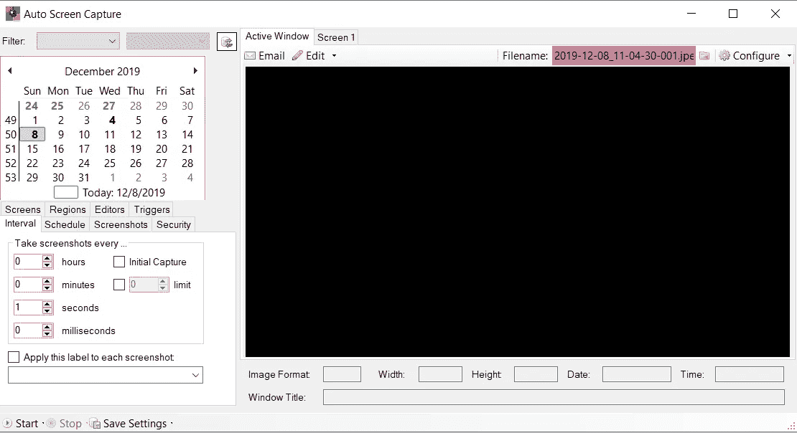
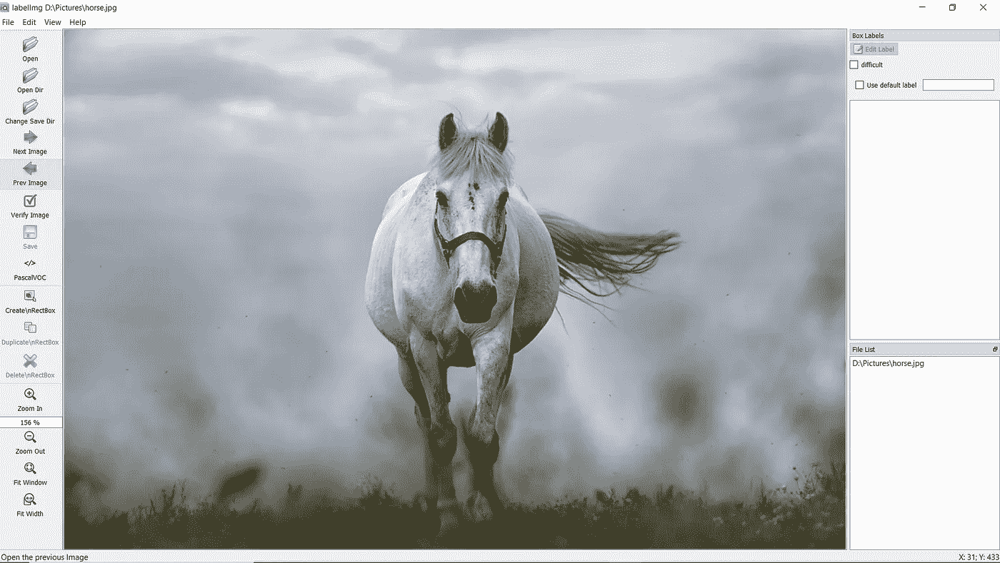
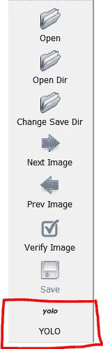
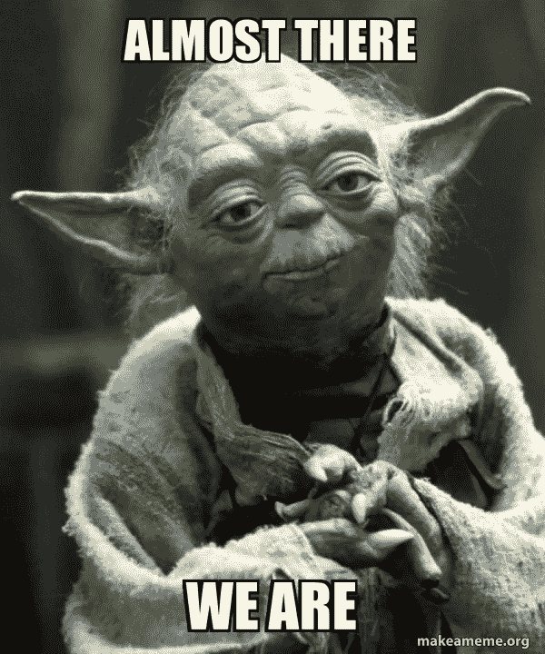

# 准备在 Windows 上训练自定义暗网模型

> 原文：<https://medium.com/analytics-vidhya/preparing-to-train-a-custom-darknet-model-on-windows-dea2f33f8177?source=collection_archive---------8----------------------->

继我之前的[文章](/analytics-vidhya/installing-darknet-on-windows-462d84840e5a)之后，我将讨论如何开始准备一个定制数据集来训练 Windows 上的暗网模型。如果你还没有安装 Darknet，我强烈建议你按照我上面的教程来做。假设您现在已经对 Darknet 有所了解，我将直接进入其中。

如果您想简单地确认您的文件是否位于正确的文件夹中，那么我建议导航到下面的**“文件路径指南”**部分。



暗网的标志

# 定制培训配置

第一步是找到位于 cfg 文件夹中的 **yolov3.cfg** 文件，并创建该文件的副本。将重复文件重命名为 **yolo-obj.cfg** 。

之后，打开 yolo-obj.cfg 文件进行编辑。按照此[链接](https://github.com/AlexeyAB/darknet#how-to-train-to-detect-your-custom-objects)所示的顺序对该文件进行必要的更改。

为了澄清，不要更改文件中的所有过滤器。只改变标签**卷积**层中的滤波器。

此外，对卷积层中的滤波器使用公式(class+5)* 3。

对于下一步，导航到 **build/darknet/x64/data** 文件夹，并复制一份 **coco.data** 文件。另外，复制一份 **coco.names** 文件。

将这些副本移动到主 darknet 目录下的 data 文件夹中，并分别重命名为 **obj.data** 和 **obj.names** 。在 **obj.names** 中，简单地写下您将在模型中使用的类的名称。每个类名应该在单独的一行上。

之后，确保编辑 obj.data 文件，如下所示。

```
classes= *Set this number*
train  = data/train.txt
valid  = data/test.txt
names = data/obj.names
backup = backup/
```

在开始标记图像之前，您仍然需要下载预训练的权重进行训练。点击此[链接](https://pjreddie.com/media/files/darknet53.conv.74)以获得预训练的卷积权重，并将它们移动到主 darknet 目录。

接下来，您需要创建一个名为 obj 的文件夹，并将其放在 data 文件夹中。在这个 obj 文件夹中，您将放置所有图像及其注释文件。

# 为训练数据录制视频

如果你计划录制视频样本来生成训练模型的图像，我强烈推荐一个叫做[自动截屏](https://sourceforge.net/projects/autoscreen/)的工具。这个工具可以让你长时间的截图你的桌面/窗口。

所以我推荐的是录下你的视频，设置自动截屏工具每秒截图，启动截屏，播放视频，剩下的就让工具处理吧！视频完成后，一定要打开截图的文件夹，将它们移到安全的地方。



自动屏幕捕获窗口

# 用标签标记图像

要执行对象检测，您的模型将学习在图像、视频或实时提要中“定位”对象。定位是围绕图像中检测到的对象绘制边界框的过程。为了让模型本地化对象，需要在训练数据中绘制边界框。

有许多不同的方法可以做到这一点，但是我推荐的工具叫做[](https://github.com/tzutalin/labelImg)****。**如果您目前使用的是 Windows 电脑，请点击此[链接](https://github.com/tzutalin/labelImg#windows)获取安装说明。**

**安装完成后，您将需要定义您的类，因为我们将使用注释来训练 YOLO 模型。**

**您需要打开**label img-master/data/predefined _ classes . txt**文件，并将每个类名写在单独的一行上。**

**接下来，打开 Anaconda 提示符或命令提示符，并导航到 **labelImg-master 文件夹**。之后，您应该键入以下命令:**

```
python labelImg.py [LOCATION OF YOUR TRAINING IMAGES]
```

**例如，如果我的训练图像位于我的 D:驱动器上名为 Pictures 的文件夹中，那么我的命令将如下所示:**

```
python labelImg.py D:\Pictures
```

**将打开如下所示的窗口，第一张图像位于文件夹中。**

****

**标签窗口**

**默认情况下，注释类型为 PascalVOC，如左侧菜单所示。要切换到 YOLO，你只需点击 PascalVOC。验证左侧菜单如下图所示。**

****

**YOLO 注释**

**之后，你只需点击位于上图所示 YOLO 按钮正下方的**“Create \ nRectBox”**按钮，在对象周围画一个边界框。一旦你完成了物体周围的边界框的绘制，程序会要求你给这个框指定一个类。您只需选择课程并点击**“确定”**。**

**确保单击“保存”或按 Ctrl + S 保存边界框注释。我强烈建议使用与训练图像相同的名称保存注释文件。验证文件是否为 txt 格式，因为 PascalVOC 只以 XML 格式保存注释。**

**之后，您可以点击**“下一张图像”**按钮继续注释文件夹中的所有图像。 ***提示:*** *如果后续图片与前一张图片的类别类型相同，则在后续图片上使用 CTRL + D。这将使用已经指定的类复制边界框。***

# **最终确定步骤**

**如果您已经创建了注释并将图像放在 darknet-master/data/obj 文件夹中，那么您就可以开始下一步了！如果没有，那么我强烈建议将这些文件复制到这个位置。**

**训练前的最后一步是提取所有图像文件名，并将它们添加到名为 train.txt 的文件中。该 train.txt 必须放在 darknet-master 的 data 文件夹中。**

**为了节省您完成这项繁琐工作的时间，我编写了一个 python 脚本，您可以使用。你所需要做的就是用 darknet-master 的位置设置 **customPath** 变量。代码的要点可以在这里访问[。](https://gist.github.com/Vimal-Raghubir/2e59486fa951a8fe2bafa1b3e0f77008)**

**一旦你完成了上面的所有步骤，你就应该为训练做好准备了！**

# **文件路径指南**

**为了确认，请参见下面的文件路径指南:**

```
darknet-master/data/obj.data
darknet-master/data/obj.names
darknet-master/data/train.txt
darknet-master/data/obj/          //All images + annotations in here
darknet-master/cfg/yolo-obj.cfg
darknet-master/darknet53.conv.74
darknet-master/backup             //Make sure to create this folder
```

# **结论**

**你现在可以开始训练了！稍后我很可能会发表一篇关于如何训练暗网模型、调整它、提高地图分数等等的博文。目前，如果您有任何问题，请务必留下评论！发展愉快，我希望在我的下一篇博文中见到你！**

****