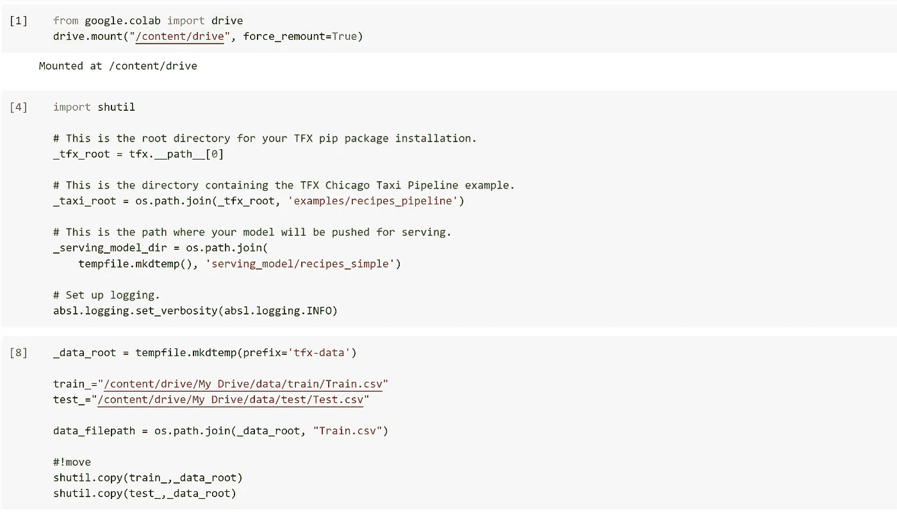
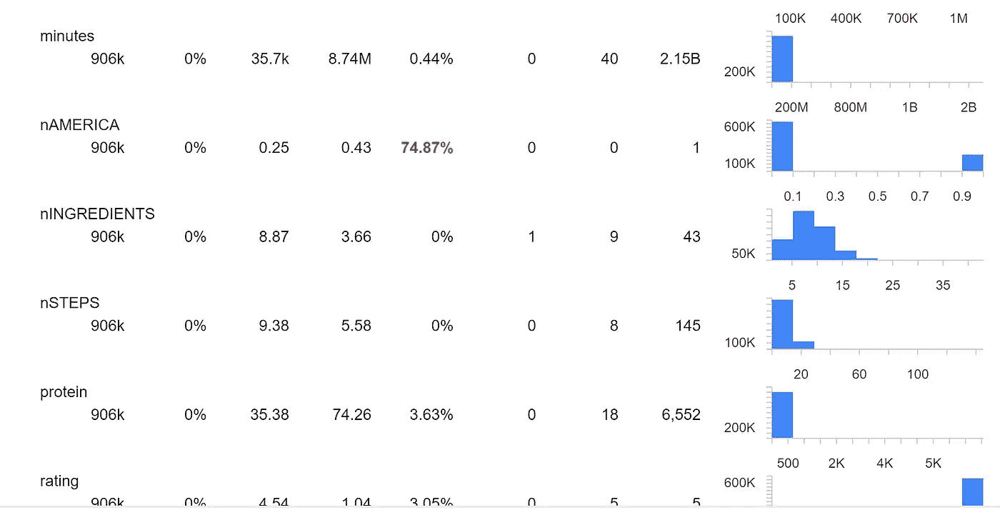

# 用张量流变换(TFX)预处理美食推荐系统的数据—第 1 部分

> 原文：<https://medium.com/analytics-vidhya/preprocessing-data-for-a-great-food-recommendation-system-with-tensorflow-transform-tfx-part-1-3ded62184222?source=collection_archive---------12----------------------->

## 展示我关于 Tensorflow 扩展用例的新项目，其中包含来自食品领域的“大数据”和完整的代码审查。下一部分将是关于 Tensorflow 排名的使用。


我今天应该吃什么？这是我的项目所基于的问题。但首先让我自我介绍:
我是一名年轻的医学领域的计算机科学学生，但最近我有了用 AI 简化和减少我的一些生活选择的想法。这就是我偶然发现 Tensorflow Transform (TFT)社区的原因，因为做出好的生活决策需要大量的数据和数据处理——相信我；)

**数据**

[我从 kaggle](https://www.kaggle.com/shuyangli94/food-com-recipes-and-user-interactions?select=RAW_interactions.csv) 那里得到了我的数据。考虑到我希望从用户那里得到的输入，我用 pandas 执行了一些简单的预处理任务。这就是我所做的:

1.  首先，我组合了两个数据框架(RAW_recipes 和 RAW_interaction)
2.  我用相同的用户 id 对用户和他们的食物评级进行了分组。
3.  我增加了很多新栏目(数据多总是好的！)使用编辑器(任何具有搜索和替换选项的编辑器都可以工作)。例如，我添加了 pH 值平均值、糖分平均值和鲜味平均值，这是我从食谱中特定成分的流行程度得到的。
4.  我创建了一个新的 dataframe，其中存储了相应的特定于用户的值(对于上下文，我将在第 2 部分中使用)。把它放在一边，你以后会需要它的。

**项目的开始:**

首先我安装依赖项，有很多。

然后，我设置了我想要使用的目录，并直接从 Google Drive 下载了我的数据集(这是推荐的方式，因为每次上传数据集都会花费很长时间。如果你的 Google Drive 没有足够的空间，那么你还可以压缩和！解压数据)。

我只粘贴了一个截图的部分是我从 awesome TFT 团队的[官方示例 colab](https://colab.research.google.com/github/tensorflow/tfx/blob/master/docs/tutorials/transform/census.ipynb) (colab 让你免费在云中执行代码(日期:06.11.2020))获得的部分。所以一定要先看看这个教程。



正如我极力推荐的 TFX 的文档中所展示的，我使用了 example_gen_pb2。Input.Split，因为我之前已经用 pandas 拆分了数据。所以这基本上是一个自定义输入。

```
context = InteractiveContext()examples = external_input(_data_root)input = example_gen_pb2.Input(splits=[
example_gen_pb2.Input.Split(name='train', pattern='Train.csv'),
example_gen_pb2.Input.Split(name='eval', pattern='Test.csv')
])example_gen = CsvExampleGen(input=examples, input_config=input)context.run(example_gen)
```

这是一个张量流的例子在 TFRecord 中的样子。它的格式不太好，但是你应该能够对一个例子有基本的了解。

> features { key:"卡路里"值{ float _ list { value:198.8000030517578 } } } feature { key:" carbs "值{ float _ list { value:12.0 } } } feature { key:" contrib id "值{ int64_list { value:000000 } } } feature { key:" date "值{ bytes _ list { value:" 2002–06–02 " } } } feature { key:" ea Erica "值{ int 64 _ list feature { key:" fat " value { float _ list { value:5.0 } } } feature { key:" id " value { int 64 _ list { value:27547 } } } feature { key:" index " value { int 64 _ list { value:00000 } } } feature { key:" ingredients " value { bytes _ list { value:"[\ '长粒白米饭\ '、\'orzo 意大利面\ '、\ '黄油\ '、\ '蒜粉\ '、\ '姜黄\ '、\ '干洋葱片\ ' \'romano cheese\']" } } }功能{ key: "minutes "值{ int64_list { value: 30 } } }功能{ key: "nAMERICA "值{ int64_list { value: 0 } } }功能{ key: "nINGREDIENTS "值{ int64_list { value: 10 } } }功能{ key: "nSTEPS "值{ int64_list { value: 9 } } }功能{ key: "name "值{ bytes _ list { value:" golden rice orzo " } } 功能{ key:"蛋白质"值{ float_list { value: 9.0 } } }功能{ key: "rating "值{ int64_list { value: 5 } } }功能{ key: "recipe_id "值{ int64_list { value: 27547 } } }功能{ key: "sAMERICA "值{ int64_list { value: 0 } } }功能{ key: "saturatedfat "值{ float_list { value: 9.0 } } }功能{ key:"钠"值{ float_list { value: 1.0 feature { key:" submitted " value { bytes _ list { value:" 2002–05–07 " } } } feature { key:" sugar " value { float _ list { value:6.0 } } } feature { key:" tags " value { bytes _ list { value:"[\ ' 30 分钟或更少\ '，\ '制作时间\ '，\ '过程\ '，\ '主料\ '，\ '准备\ '，\ '场合\ '，\ '健康\ '，\ '配菜\ '，\ ' \'to-go\']" } } }功能{ key:" user _ id " value { int 64 _ list { value:0000 } } }功能{ key:" vegeterian " value { int 64 _ list { value:0 } } }功能{ key:" wa merica " value { int 64 _ list { value:0 } } }

所以，现在有点*数据分析和探索*。

首先，您可以执行这段代码来进一步理解和统计您的数据。它还向您展示了数据类型，这对以后会很有用。

```
statistics_gen = StatisticsGen(
examples=example_gen.outputs['examples'])context.run(statistics_gen)%%skip_for_exportcontext.show(statistics_gen.outputs['statistics'])
```

您可以看到空值的百分比，它被标记为红色，但是在我的示例中没有问题，因为它是一个热编码列。还有一些统计数据，我不会深入探讨。



统计结果摘要

其次，您需要获得一个模式。我就不占用你的时间，直接进入下一步了。

```
schema_gen = SchemaGen(statistics=statistics_gen.outputs['statistics'],
infer_feature_shape=False)context.run(schema_gen)
```

**转换数据** 
有趣的部分来了，你可以在数据的整个过程中以你想要的方式预处理数据。我是否已经说过这是 Apache Beam 兼容的，并且您可以在实际工作的管道中实现它？

分类特征保持不变，桶特征有序地放入 10 个桶中的一个。词汇特征，主要是成分，被组织成 1500 个学习桶中的一个(这需要很长时间)。密集浮动要素根据其流行程度和统计数据进行排序。对我来说，一种新颖的方法是用计算出的散列字符串来组织日期特征(例如 2002–05–07 ),这种方法很适合这种自然标准化的数据！

现在这将转换数据并给出一个 TFRecord(如果您想使用 Apache Beam，还有一些其他函数):

```
transform = Transform(examples=example_gen.outputs['examples'],
schema=schema_gen.outputs['schema'],
module_file=os.path.abspath(_food_transform_module_file),
instance_name="food")context.run(transform)
```

如果您现在想用 TfRecord-Dataset(我在第一部分中描述过)中附加的特定于用户的数据(名为 context)将它(这些是示例或查询)转换成 **ELWC** 格式，那么您可以这样做:

## 它工作长度可变，因此您不会受限于固定大小的查询。

只需创建一个额外的 csv，按照您处理数据的 user_id 的顺序，例如，如果您有 100 个具有相同 user _ id 的查询，其中每次都存在一个上下文，那么您可以使用 tf.unique_with_counts(data)并获得张量[100，…].

然后还有一个 dataset2，一个 TfRecordDataset，它包含了所有的上下文信息。

现在我们已经走到了尽头。我们已经创建了一个 ELWC-TFRecord，我们将在第 2 部分中使用它来对食物进行排序。

感谢您的阅读，如果您愿意，我将不胜感激👏🏽。