# 预测网上购物者购买意向的数据预处理

> 原文：<https://medium.com/analytics-vidhya/preprocessing-data-for-predicting-online-shoppers-purchasing-intention-ml-ba78186b7e85?source=collection_archive---------1----------------------->

## 基于机器学习的收入预测数据预处理。

在 [Unsplash](https://unsplash.com?utm_source=medium&utm_medium=referral) 上[茹皮森](https://unsplash.com/@rupixen?utm_source=medium&utm_medium=referral)拍摄的照片

一旦用户登录在线购物网站，知道这个人是否会购买具有巨大的经济价值。目前的许多研究都集中在这些购物网站的实时收入预测上。在本文中，我们将开始为这样一个网站建立一个收入预测器。我们将在这里详细说明数据预处理部分，您可以继续阅读本系列的[第二篇文章](/@isurudissanayake/ospi-mul-randomforests-156acdb73fd9)，了解关于预测器模型的更多详细信息。

该数据集可以在 kaggle- [网上购物者意向](https://www.kaggle.com/roshansharma/online-shoppers-intention)上找到，还有对这些特征的详细描述。

> 数据集由属于 12，330 个会话的特征向量组成。数据集的形成使得每个会话在一年的时间内属于不同的用户，以避免任何倾向于特定的活动、特殊的日子、用户简档或时期。

## 什么是预处理，为什么要做预处理？

每个真实世界的数据集都包含不完整和不一致的数据点。他们还可能在某些行为或趋势上有所欠缺，并且很可能包含许多错误。将这些数据转换成预测器可以理解的格式，称为预处理。每个数据科学家都将大部分时间花在预处理操作上。

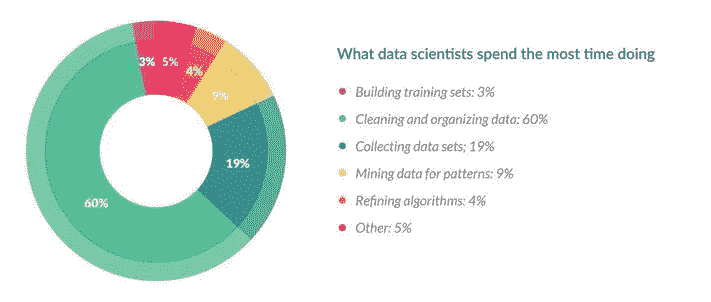

学分-谷歌

## 导入库和数据集。

预处理的第一步是导入库。我们使用 [pandas](https://pandas.pydata.org/) 来导入、导出和维护数据帧，使用 [numpy](https://numpy.org/) 对数据集进行矩阵操作。 [Sklearn](https://scikit-learn.org/stable/) 用于数据分析和制作机器学习模型，如本文其余部分所述。Matplotlib 用于在各种分析过程中绘制和可视化数据。

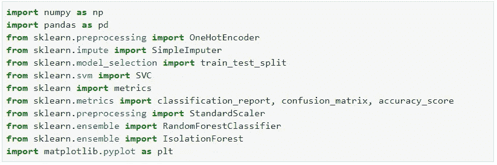

然后导入数据集，并将其分为 X(输入要素)和 y(标注)。

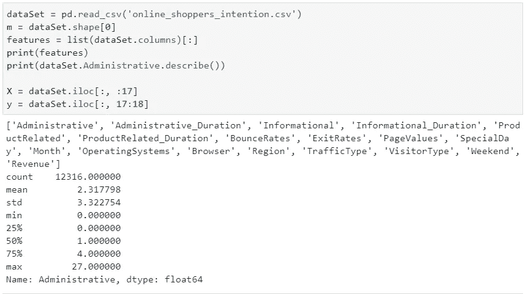

## 处理缺失的数据点

数据集中可能存在随机缺失的数据点，如果处理不当，可能会在以后引发错误，或者导致不准确的推断。首先，我们找出是否有任何丢失的值。每个特征名称旁边的值显示了每列中缺失数据点的数量。

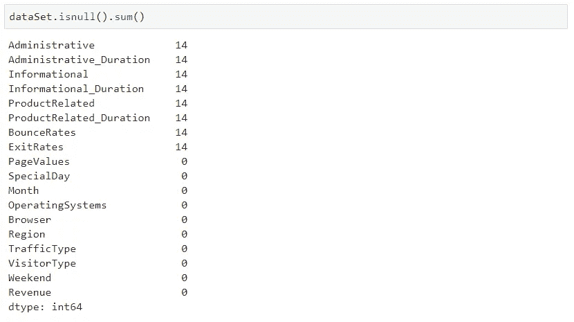

有两种方法可以处理丢失的值。删除缺少数据点的整行，或者用平均值、中值、众数或相应列中最常出现的值来填充缺少的值。由于只有 12330 个数据点可供我们使用，我们使用 sklearn 的 SimpleImputer 函数用平均值(对于数字数据和最常见的分类数据)替换缺失值。

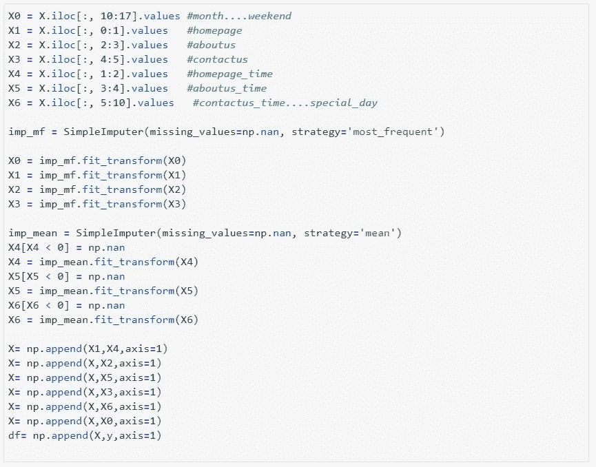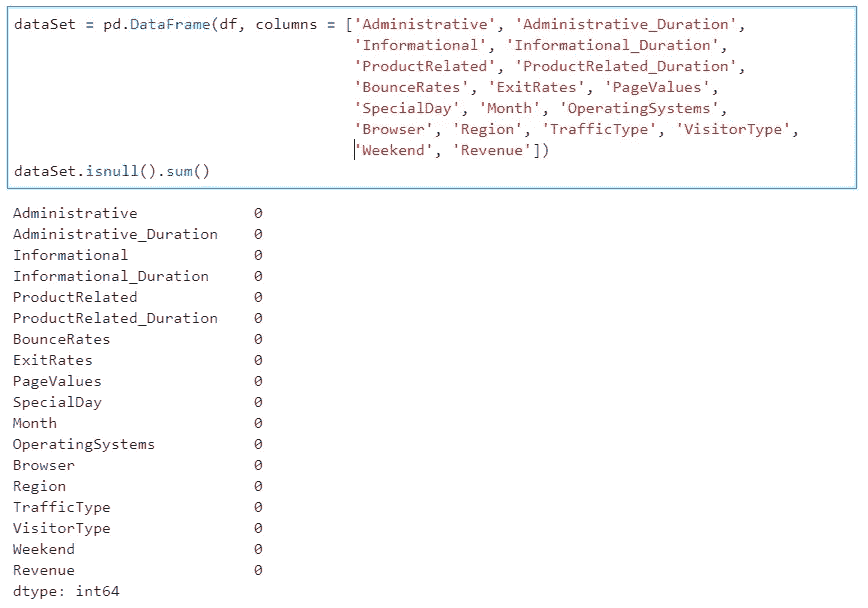

估算数据集-无缺失值

## 处理分类数据

数据集由 10 个数值属性和 8 个类别属性组成。

> 在统计学中，分类变量是一种变量，它可以取有限的、通常是固定数量的可能值中的一个，根据某些定性属性将每个个体或其他观察单位分配到特定的组或名义类别。

由于基于机器学习的预测器中的所有操作都是数学上的，很明显我们不能给出诸如月份的输入；“一月”、“二月”等。处理这些类型数据的最简单的方法是[标签编码](/@contactsunny/label-encoder-vs-one-hot-encoder-in-machine-learning-3fc273365621)，其中特定属性中的每个类别都由一个唯一的数字编码；一月=0，二月=1 等等。(查看我们的完整代码[这里](https://github.com/Isuru-Dissanayake/OSPI-kaggle))

虽然该方法产生可接受的结果，但是预测器模型也可能偏向于已经用数值较高的值编码的一些类别。(如；十二月=11，一月=0)。为了避免这种影响，我们对数据集使用了 [Onehot 编码](/@contactsunny/label-encoder-vs-one-hot-encoder-in-machine-learning-3fc273365621)。编码后，最初的 18 个输入特征增加到 58 个。

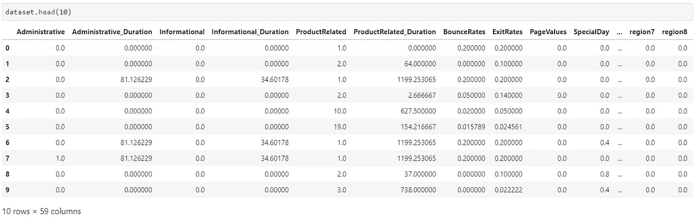

分类数据一次性编码后的数据集的一部分

## 选择最佳功能

由于我们有 58 个输入要素，我们需要选择对收入影响最大的要素，并删除那些对收入影响不大的要素。这一步对于加快训练速度和避免模型不必要的复杂化非常重要。有许多工具可以研究每个特性对收入的影响。我们使用了 sklearn.ensemble 的 [selectkbest](https://scikit-learn.org/stable/modules/generated/sklearn.feature_selection.SelectKBest.html) 来找出得分最高的特征。

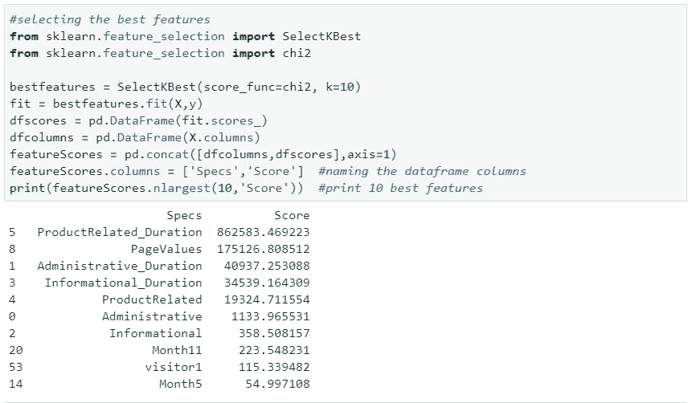

我们用于特征选择的另一个函数是 Sklearn 的[extractreesclassifier](https://scikit-learn.org/stable/modules/generated/sklearn.ensemble.ExtraTreesClassifier.html)。

> 该类实现了一个元估计器，它在数据集的各个子样本上拟合多个随机决策树(也称为额外树),并使用平均来提高预测精度和控制过度拟合。

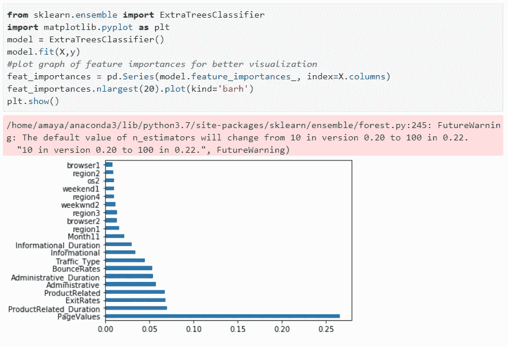

为了可视化输入特性之间以及输入特性和收入之间的相关程度，我们使用了 pandas 的 [corr](https://pandas.pydata.org/pandas-docs/stable/reference/api/pandas.DataFrame.corr.html) 函数。

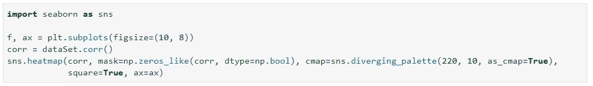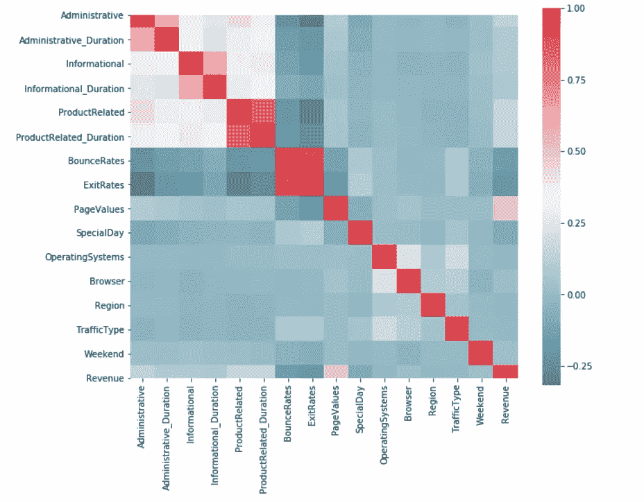

根据以上分析，我们从 58 个特性中选择了 12 个最佳特性。它们是“管理”、“管理 _ 持续时间”、“信息”、“信息 _ 持续时间”、“产品相关”、“产品相关 _ 持续时间”、“反弹率”、“出口”、“页面值”、“月份 11”、“流量 _ 类型”和“访问者 1”(月份 11 和访问者 1 是一个热编码的结果，对应于月份 11 月和访问者类型，返回的访问者)

## 极端值

> 在统计学中，一个**异常值**是一个**数据**点，它与其他观察值有很大不同。**异常值**可能是由于测量中的可变性，也可能表明实验误差；后者有时被排除在**数据集**之外。

在实现预测模型之前，我们需要调查数据集中的任何异常值。我们将数据绘制成散点图，我们发现了一些有趣的东西。

> 大部分数据点(客户)都处于异常值，也就是说，具有非常大的产品相关持续时间或信息相关持续时间，实际上是从网站上购买了一些东西。

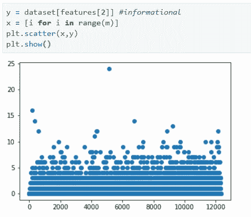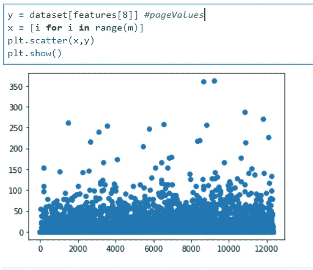

因此，我们没有裁剪或删除异常数据点，而是为每个客户计算一个异常分数，并将该分数作为一个新特征引入预测模型。

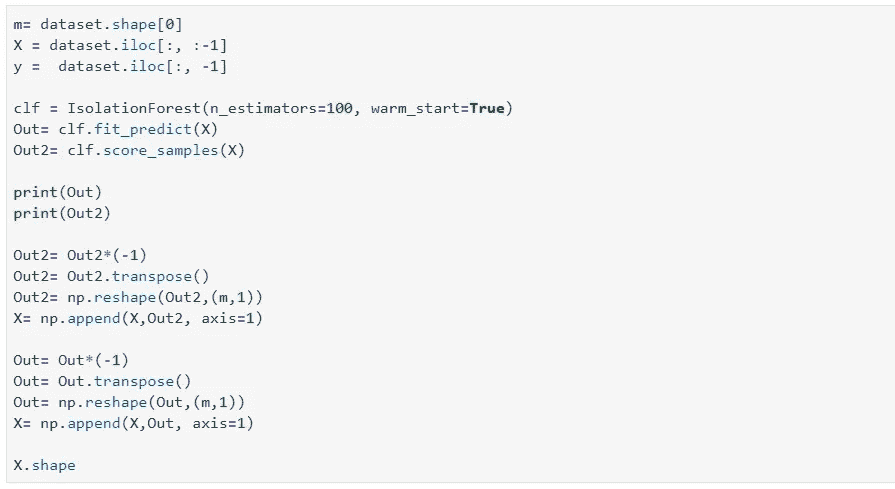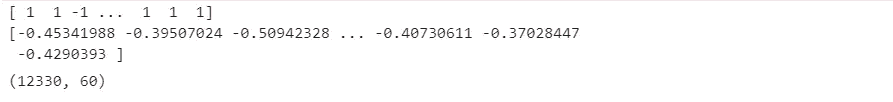

根据异常分数添加了两个新功能

## 训练、验证和测试集

我们分离了 1850 个数据点作为测试数据集。然后，我们使用 sklearn 的 train-test-split 功能随机分离一部分数据集作为 val 集，并继续进行预测模型。我们修改预测模型，直到我们获得满意的精度，同时使用 val 集来验证结果。然后，我们在测试数据集上使用相同的模型。

最终预测准确率在 94%左右。你可以在本系列的第二篇文章中的这里阅读关于模型[的所有内容，或者在我们的 Github 仓库中的](/@isurudissanayake/ospi-mul-randomforests-156acdb73fd9)[代码](https://github.com/Isuru-Dissanayake/OSPI-kaggle)这里查看。

干杯！