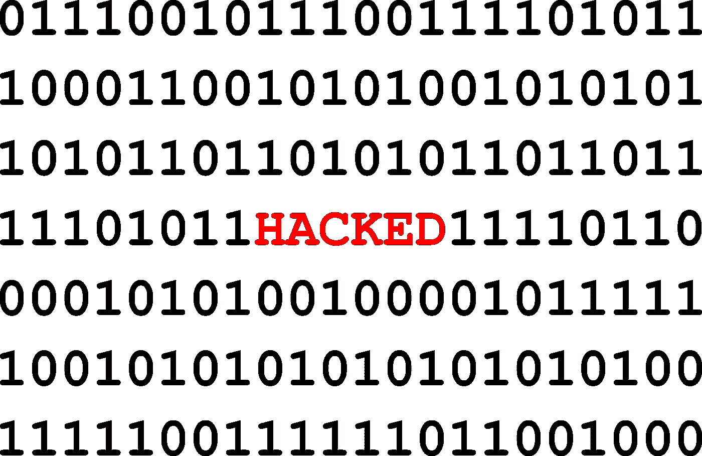
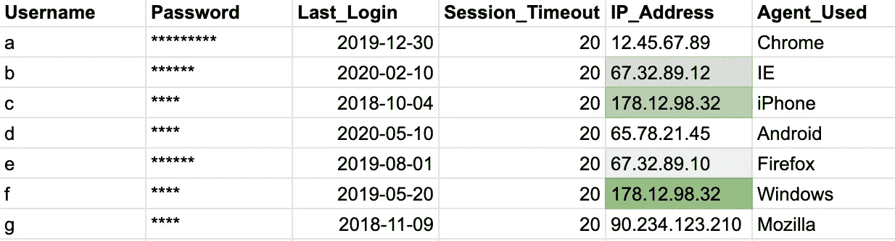

# 防止您的客户数据遭到黑客攻击

> 原文：<https://medium.com/analytics-vidhya/prevent-your-customer-data-from-getting-hacked-340ab01fc237?source=collection_archive---------16----------------------->

图片来源:Pixabay — [格尔德·奥特曼](https://pixabay.com/users/geralt-9301/?utm_source=link-attribution&utm_medium=referral&utm_campaign=image&utm_content=2170633)

本文将尝试帮助您设计和开发一个简单的用户登录日志系统，这将有助于在发生违规事件时进行取证调查，并允许您在第一时间阻止任何被黑客攻击的企图。

我可以担保这个设置，因为它是在一个处理近 3000 个用户的生产系统中设计和部署的，并且运行了 2 年多，没有一个帐户受到损害。我们还能够通知一些客户他们系统上潜在的恶意活动，对此他们向我们表示感谢。

我们还设法确定了特定范围的 IP 地址，其中一些被用于暴力攻击——将它们列入黑名单以防止未来的尝试。

您可以创建一项服务，并将其发布到云上供人们使用，或者将其插入到您现有的用户登录流程中，并帮助防止滥用您的 it 环境，这一概念将保持不变。

*网络应用、移动应用的大多数架构漏洞都是在终端消费者用户登录级别被利用的，因为人们很少更改密码和重复使用密码。*虽然业界正在尝试完全绕过密码机制，但我们仍然生活在一个充斥着大量传统系统的时代，基于密码的身份认证在几年内不会有任何发展。管理员/根用户访问是在有人设法破坏了最终用户级别的登录过程，并对可以看到的内容进行了“自由运行”之后出现的。

在用户登录过程中必须有一个服务器端组件，在这一端，您还应该捕获名为“remote_addr”的服务器会话变量，它是任何包的一部分，如 python 或经典 asp 中的 requests、flask。它是一个直接调用。

用户密码决不能按原样存储—始终对其进行哈希处理，如果可能的话，与用户名一起存储

**存储值=哈希{哈希(用户名)+哈希(密码)}**

例如:

哈希(用户名)=**fg%^&**

哈希(密码)= **12#456**

存储值=哈希(**fg%^&**+**12 # 456**)

因此，你的存储值将(假设)看起来像**89kl 43 f**——甚至很难被破解。

这将防止反向哈希查找(因为有一些服务可以为预定义的常用密码提供存储的哈希查找)

对于散列使用任何超过 256 位。如果需要的话，将散列重新散列到第 n 层——只要确保不要破坏您的云账单即可，因为每个散列都是数学密集型操作。

让我们看一个简单的用户登录/会话信息存储的例子

如果我们存储每次登录尝试的远程 IP 地址，我们将能够识别某些模式，例如:用户“b，e & c，f”有一些可疑的活动。这可以帮助您启动下一阶段的调查，可以是…

1.  是否有任何其他用户也试图使用合法的登录过程访问系统，但通过密切相关的 IP 地址范围？
2.  开发一个所有登录发生的可视化地图，如果你是一个在悉尼运营的地理上特定的服务(如本地电子商务，本地贷款处理),如果有一个来自不同大陆的用户登录尝试发生，它应该值得调查或呼叫最终用户
3.  是否有任何用户试图在预定义的时间从不同的 IP 地址访问系统？(*大红旗*)
4.  对于一组特定用户的每次登录尝试，user_agent(最后一列)是否有很大的不同？(*你可能被某种武器化的人工智能盯上了)*
5.  用户在 100 天后突然登录了吗？
6.  你能把任何特定范围的具有潜在入侵性的 IP 地址列入黑名单吗？
7.  通过一定的分析，您还可以使用这种类型的日志记录来识别正在您面向客户的门户/引擎上执行的分布式拒绝服务(DDoS)攻击(*基于物联网的 DDoS 现在是一种租用服务*)
8.  是否有用户正在从结构上改变 user_agent，并测试哪些 user _ agent 被允许，哪些不被允许？当有人从更大的范围缩小选择范围后想要部署漏洞时，这非常有用
9.  一旦有了足够的数据，就部署一个守护进程或定期批处理来发出警报
10.  最终创建 IP 地址的白名单、橙名单和黑名单，结合 hosts 文件，不仅可以识别攻击，还可以先发制人

除非您存储了所有可能的可用信息，否则网络取证将很难在发生违规时提供帮助。一旦准备好要调查的正确字段集，您就可以运行任意数量的排列和组合，并使用任何可用的图表工具或数据分析包找出异常值。

现在，这让我想到了下一点，如果您正在存储所有数据，那么数据毒性、数据保留、用户隐私怎么办？我们总是在 VPN 上(是的，VPN 也可能被黑客攻击)？—我将在接下来的几篇文章中尝试解决这些问题。

如果您有任何进一步的问题，我很乐意帮助您！